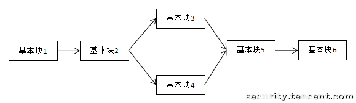
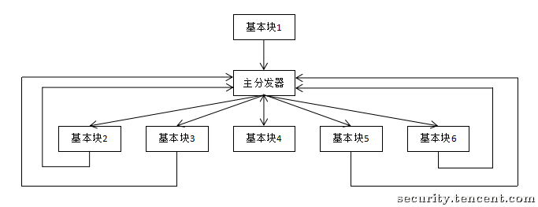

# 控制流平坦化

## 簡介

控制流平坦化（control flow flattening）是作用於控制流圖的代碼混淆技術，其基本思想是重新組織函數的控制流圖中的基本塊關係，通過插入一個“主分發器”來控制基本塊的執行流程，例如下圖是正常的執行流程：

經過控制流平坦化處理之後便變成了這個樣子，由一個“主分發器”負責控制程序執行流：

通過控制流平坦化，基本塊間的前後關係將被混淆，從而加大了程序逆向分析的難度。更多關於控制流平坦化的實現細節可以參考[這篇論文](http://ac.inf.elte.hu/Vol_030_2009/003.pdf).

## 利用符號執行去除控制流平坦化

> 待施工。

## Reference

[騰訊安全應急響應中心 - 利用符號執行去除控制流平坦化](https://security.tencent.com/index.php/blog/msg/112)

[OBFUSCATING C++ PROGRAMS VIA CONTROL FLOW FLATTENING](http://ac.inf.elte.hu/Vol_030_2009/003.pdf)