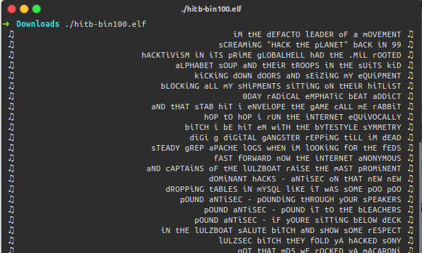
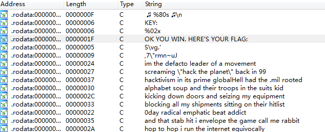
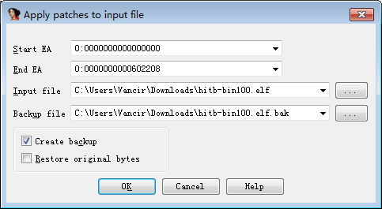
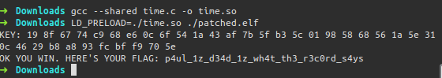

# LD_PRELOAD

## 原理

正常情況下, Linux 動態加載器`ld-linux`(見man手冊ld-linux(8))會搜尋並裝載程序所需的共享鏈接庫文件, 而`LD_PRELOAD`是一個可選的環境變量, 包含一個或多個指向共享鏈接庫文件的路徑. 加載器會先於C語言運行庫之前載入`LD_PRELOAD`指定的共享鏈接庫，也就是所謂的預裝載(`preload`)。

預裝載意味着會它的函數會比其他庫文件中的同名函數先於調用, 也就使得庫函數可以被阻截或替換掉. 多個共享鏈接庫文件的路徑可以用`冒號`或`空格`進行區分. 顯然不會受到`LD_PRELOAD`影響的也就只有那些靜態鏈接的程序了.

當然爲避免用於惡意攻擊, 在`ruid != euid`的情況下加載器是不會使用`LD_PRELOAD`進行預裝載的.

更多閱讀: [https://blog.fpmurphy.com/2012/09/all-about-ld_preload.html#ixzz569cbyze4](https://blog.fpmurphy.com/2012/09/all-about-ld_preload.html#ixzz569cbyze4)

## 例題

下面以2014年`Hack In The Box Amsterdam: Bin 100`爲例. 題目下載鏈接: [hitb_bin100.elf](https://github.com/ctf-wiki/ctf-challenges/blob/master/reverse/linux-re/2014_hitb/hitb_bin100.elf)

這是一個64位的ELF文件. 運行結果如下圖所示:



程序似乎在一直打印着一些句子. 並且沒有停止下來的跡象. 我們就用IDA打開來看一下. 首先按下`Shift+F12`查找字符串.



顯然, 除開一直在打印的句子外, 我們發現了一些有趣的字符串:

```
.rodata:0000000000400A53 00000006 C KEY:
.rodata:0000000000400A5F 0000001F C OK YOU WIN. HERE'S YOUR FLAG:
```

我們根據`OK YOU WIN. HERE'S YOUR FLAG: `的交叉引用來到關鍵代碼處(我刪去了一些不必要的代碼).

```  c
int __cdecl main(int argc, const char **argv, const char **envp)
{
  qmemcpy(v23, &unk_400A7E, sizeof(v23));
  v3 = v22;
  for ( i = 9LL; i; --i )
  {
    *(_DWORD *)v3 = 0;
    v3 += 4;
  }
  v20 = 0x31337;
  v21 = time(0LL);
  do
  {
    v11 = 0LL;
    do
    {
      v5 = 0LL;
      v6 = time(0LL);
      srand(233811181 - v21 + v6); // 初始化隨機數種子
      v7 = v22[v11];
      v22[v11] = rand() ^ v7;   // 僞隨機數
      v8 = (&funny)[8 * v11];
      while ( v5 < strlen(v8) )
      {
        v9 = v8[v5];
        if ( (_BYTE)v9 == 105 )
        {
          v24[(signed int)v5] = 105;
        }
        else
        {
          if ( (_DWORD)v5 && v8[v5 - 1] != 32 )
            v10 = __ctype_toupper_loc();    // 大寫
          else
            v10 = __ctype_tolower_loc();    // 小寫
          v24[(signed int)v5] = (*v10)[v9];
        }
        ++v5;
      }
      v24[(signed int)v5] = 0;
      ++v11;
      __printf_chk(1LL, " 鈾%80s 鈾玕n", v24); // 亂碼的其實是一個音符
      sleep(1u);
    }
    while ( v11 != 36 );
    --v20;
  }
  while ( v20 );
  v13 = v22;    // key存儲在v22數組內
  __printf_chk(1LL, "KEY: ", v12);
  do
  {
    v14 = (unsigned __int8)*v13++;
    __printf_chk(1LL, "%02x ", v14); // 輸出key
  }
  while ( v13 != v23 );
  v15 = 0LL;
  putchar(10);
  __printf_chk(1LL, "OK YOU WIN. HERE'S YOUR FLAG: ", v16);
  do
  {
    v17 = v23[v15] ^ v22[v15];  // 跟key的值有異或
    ++v15;
    putchar(v17);   // 輸出flag
  }
  while ( v15 != 36 );
  putchar(10);      // 輸出換行
  result = 0;
  return result;
}
```

整個的代碼流程主要就是在不斷地循環輸出`funny`裏的句子, 滿足循環條件後輸出`key`, 並用`key`進行異或得到`flag`的值.

但我們可以發現, 整個循環的次數相對來說是比較少的. 所以我們可以採用一些方法, 讓循環進行得更快一些. 比如說我手動patch一下, 不讓程序輸出字符串(實際上`printf`的耗時是相當多的), 其次就是使用`LD_PRELOAD`使得程序的`sleep()`失效. 可以很明顯地節省時間.

手動patch的過程比較簡單. 我們可以找到代碼位置, 然後用一些十六進制編輯器進行修改. 當然我們也可以使用`IDA`來進行patch工作.

``` asm
.text:00000000004007B7                 call    ___printf_chk
.text:00000000004007BC                 xor     eax, eax
```

將光標點在`call    ___printf_chk`上, 然後選擇菜單`Edit->Patch Program->Assemble`(當然你可以使用其他patch方式. 效果都一樣).  然後將其修改爲`nop(0x90)`, 如下圖所示


將`4007B7`到`4007BD`之間的彙編代碼全部修改爲`nop`即可. 然後選擇菜單`Edit->Patch Program->Apply patches to input file`. 當然最好做一個備份(即勾選`Create a backup`), 然後點擊OK即可(我重命名爲了`patched.elf`, 下載鏈接: [patched.elf](https://github.com/ctf-wiki/ctf-challenges/blob/master/reverse/linux-re/2014_hitb/patched.elf)).



現在進入`LD_PRELOAD`部分. 這裏我們簡單編寫一下c代碼, 下載鏈接: [time.c](https://github.com/ctf-wiki/ctf-challenges/blob/master/reverse/linux-re/2014_hitb/time.c)

``` c
static int t = 0x31337;

void sleep(int sec) {
	t += sec;
}

int time() {
	return t;
}
```

然後使用命令`gcc --shared time.c -o time.so`生成動態鏈接文件. 當然也給出了下載鏈接: [time.so](https://github.com/ctf-wiki/ctf-challenges/blob/master/reverse/linux-re/2014_hitb/time.so)

然後打開linux終端, 運行命令: `LD_PRELOAD=./time.so ./patched.elf`



過一會, 你就能聽到CPU瘋狂運轉的聲音, 然後很快就出來了flag.
