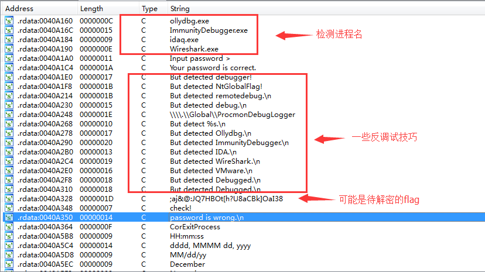
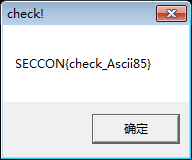

# 反調試技術例題

我們現在來分析一道2016年SecCon的`anti-debugging`題, 題目下載鏈接: [bin.exe](https://github.com/ctf-wiki/ctf-challenges/blob/master/reverse/anti-debug/2016_seccon/anti_debugging_100/bin.exe)

這是一個32位的PE文件, 是一個控制檯程序, 我們直接運行, 會要求輸入`password`. 當你輸入一個錯誤的`password`時則會提示你`password is wrong`.


我們用IDA打開來看下, 最快速的方式就是直接查看字符串, 根據`password is wrong`找到關鍵代碼. IDA顯示的結果如下圖:



顯然, 字符串表明程序中可能有各種檢測, 比如檢測進程名`ollydbg.exe`, `ImmunityDebugger.exe`, `idaq.exe`和`Wireshark.exe`. 然後也有其他的檢測. 我們也看到了字符串`password is wrong`和`You password is correct`的字樣. 同時還發現了一個很有可能就是待解密的flag的字符串. 那麼我們就先根據`password is wrong`的交叉引用來到關鍵函數處.

如下所示: 程序果然使用了大量的反調試技巧.

``` c
int __cdecl main(int argc, const char **argv, const char **envp)
{
  v23 = 0;
  memset(&v24, 0, 0x3Fu);
  v22 = 1;
  printf("Input password >");
  v3 = (FILE *)sub_40223D();
  fgets(&v23, 64, v3);
  strcpy(v21, "I have a pen.");
  v22 = strncmp(&v23, v21, 0xDu); // 1. 直接比較明文字符串與輸入字符串
  if ( !v22 )
  {
    puts("Your password is correct.");
    if ( IsDebuggerPresent() == 1 )     // 2. API: IsDebuggerPresent()
    {
      puts("But detected debugger!");
      exit(1);
    }
    if ( sub_401120() == 0x70 )         // 3. 檢測PEB的0x68偏移處是否爲0x70. 檢測NtGlobalFlag()
    {
      puts("But detected NtGlobalFlag!");
      exit(1);
    }

    /*  BOOL WINAPI CheckRemoteDebuggerPresent(
     *    _In_    HANDLE hProcess,
     *    _Inout_ PBOOL  pbDebuggerPresent
     *  );
     */
    v4 = GetCurrentProcess();
    CheckRemoteDebuggerPresent(v4, &pbDebuggerPresent);
    if ( pbDebuggerPresent )            // 4. API: CheckRemoteDebuggerPresent()
    {
      printf("But detected remotedebug.\n");
      exit(1);
    }
    v13 = GetTickCount();
    for ( i = 0; i == 100; ++i )
      Sleep(1u);
    v16 = 1000;
    if ( GetTickCount() - v13 > 1000 )  // 5. 檢測時間差
    {
      printf("But detected debug.\n");
      exit(1);
    }
    lpFileName = "\\\\.\\Global\\ProcmonDebugLogger";
    if ( CreateFileA("\\\\.\\Global\\ProcmonDebugLogger", 0x80000000, 7u, 0, 3u, 0x80u, 0) != (HANDLE)-1 )
    {
      printf("But detect %s.\n", &lpFileName);      // 6. 檢測ProcessMonitor
      exit(1);
    }
    v11 = sub_401130();     // 7. API: CreateToolhelp32Snapshot()檢測進程
    if ( v11 == 1 )
    {
      printf("But detected Ollydbg.\n");
      exit(1);
    }
    if ( v11 == 2 )
    {
      printf("But detected ImmunityDebugger.\n");
      exit(1);
    }
    if ( v11 == 3 )
    {
      printf("But detected IDA.\n");
      exit(1);
    }
    if ( v11 == 4 )
    {
      printf("But detected WireShark.\n");
      exit(1);
    }
    if ( sub_401240() == 1 )    // 8. 通過vmware的I/O端口進行檢測
    {
      printf("But detected VMware.\n");
      exit(1);
    }
    v17 = 1;
    v20 = 1;
    v12 = 0;
    v19 = 1 / 0;
    ms_exc.registration.TryLevel = -2;  // 9. SEH
    printf("But detected Debugged.\n");
    exit(1);
  }
  printf("password is wrong.\n");
  return 0;
}
```

我在代碼裏寫了註釋, 列出了其中所使用的9個保護技術部分. 我們來逐一分析一下吧.

## 比較明文字符串

``` c
printf("Input password >");
v3 = (FILE *)sub_40223D();
fgets(&v23, 64, v3);
strcpy(v21, "I have a pen.");
v22 = strncmp(&v23, v21, 0xDu); // 1. 直接比較明文字符串與輸入字符串
if ( !v22 )  {
    ......
}
```

這裏就是輸出`Input password >`. 然後用`fgets()`獲取用戶輸入的字符串, 將`I have a pen.`複製到`v21`的緩衝區中, 然後用`strncmp`比對用戶輸入與`I have a pen.`的內容, 並將比較結果返回給`v22`. 以下會根據`v22`, 也就是根據輸入的`password`是否正確, 而進行跳轉.

## IsDebuggerPresent()

``` c
puts("Your password is correct.");
if ( IsDebuggerPresent() == 1 )     // 2. API: IsDebuggerPresent()
{
    puts("But detected debugger!");
    exit(1);
}
```

顯然, 輸入的`password`正確, 就會輸出提示`Your password is correct.`. ??? 不覺得奇怪嗎. 難道`I have a pen.`就是我們的flag了嗎? 不不不當然不是. 這其實是一個陷阱, 既然你知道了`I have a pen.`那麼就肯定有通過某種逆向手段在對程序進行分析. 所以接下來的部分就開始進行一些反調試或其他的檢測手段(實際中也可以出現這樣的陷阱).

一開始的是`IsDebuggerPresent()`, 根據返回結果判斷是否存在調試.如果不太清楚的話, 可以返回去看 [IsDebuggerPresent()](./isdebuggerpresent.md) 篇

## NtGlobalFlag

接下來是檢測`NtGlobalFlag`這個字段的標誌位. 通過檢測PEB的字段值是否爲`0x70`來檢測調試器, 如果不太清楚的話, 可以返回去看 [NtGlobalFlag](./ntglobalflag.md) 篇

``` c
if ( sub_401120() == 0x70 )         // 3. 檢測PEB的0x68偏移處是否爲0x70. 檢測NtGlobalFlag()
{
    puts("But detected NtGlobalFlag!");
    exit(1);
}
```

那我們來簡單看一下`sub_401120()`好了

``` c
int sub_401120()
{
  return *(_DWORD *)(__readfsdword(48) + 0x68) & 0x70;
}
```

`0x68`是PEB的`NtGlobalFlag`字段對應偏移值. `0x70`是`FLG_HEAP_ENABLE_TAIL_CHECK (0x10)`, `FLG_HEAP_ENABLE_FREE_CHECK (0x20)` 和`FLG_HEAP_VALIDATE_PARAMETERS (0x40)`這三個標誌

## CheckRemoteDebuggerPresent


``` c++
/*  BOOL WINAPI CheckRemoteDebuggerPresent(
 *    _In_    HANDLE hProcess,
 *    _Inout_ PBOOL  pbDebuggerPresent
 *  );
 */
v4 = GetCurrentProcess();
CheckRemoteDebuggerPresent(v4, &pbDebuggerPresent);
if ( pbDebuggerPresent )            // 4. API: CheckRemoteDebuggerPresent()
{
    printf("But detected remotedebug.\n");
    exit(1);
}
```
這裏我順便在註釋裏列出了`CheckRemoteDebuggerPresent()`這個API的函數原型. 如果檢測到調試器的存在, 會將`pbDebuggerPresent`設置爲一個非零值. 根據其值檢測調試器([CheckRemoteDebuggerPresent()](./checkremotedebuggerpresent.md) 篇)


## 時間差檢測

``` c
v13 = GetTickCount();
for ( i = 0; i == 100; ++i )    // 睡眠
    Sleep(1u);
v16 = 1000;
if ( GetTickCount() - v13 > 1000 )  // 5. 檢測時間差
{
    printf("But detected debug.\n");
    exit(1);
}
```

`GetTickCount`會返回啓動到現在的毫秒數, 循環裏光是`sleep(1)`就進行了100次, 也就是100毫秒. 兩次得到的時間作差如果大於1000毫秒, 時差明顯大於所耗的時間, 也就間接檢測到了調試.


## ProcessMonitor

``` c
lpFileName = "\\\\.\\Global\\ProcmonDebugLogger";
if ( CreateFileA("\\\\.\\Global\\ProcmonDebugLogger", 0x80000000, 7u, 0, 3u, 0x80u, 0) != (HANDLE)-1 )
{
    printf("But detect %s.\n", &lpFileName);      // 6. 檢測ProcessMonitor
    exit(1);
}
```

這裏通過檢測設備文件`\\\\.\\Global\\ProcmonDebugLogger`來檢測`ProcessMonitor`

## 檢測進程名

這裏通過執行`sub_401130()`函數來檢測進程, 並根據檢測到的不同進程, 返回相應的值.

``` c
v11 = sub_401130();     // 7. API: CreateToolhelp32Snapshot()檢測進程
if ( v11 == 1 )
{
    printf("But detected Ollydbg.\n");
    exit(1);
}
if ( v11 == 2 )
{
    printf("But detected ImmunityDebugger.\n");
    exit(1);
}
if ( v11 == 3 )
{
    printf("But detected IDA.\n");
    exit(1);
}
if ( v11 == 4 )
{
    printf("But detected WireShark.\n");
    exit(1);
}
```

我們就來看一下`sub_401130()`函數

``` c
signed int sub_401130()
{
  PROCESSENTRY32 pe; // [sp+0h] [bp-138h]@1
  HANDLE hSnapshot; // [sp+130h] [bp-8h]@1
  int i; // [sp+134h] [bp-4h]@1

  pe.dwSize = 296;
  memset(&pe.cntUsage, 0, 0x124u);
  hSnapshot = CreateToolhelp32Snapshot(2u, 0);
  for ( i = Process32First(hSnapshot, &pe); i == 1; i = Process32Next(hSnapshot, &pe) )
  {
    if ( !_stricmp(pe.szExeFile, "ollydbg.exe") )
      return 1;
    if ( !_stricmp(pe.szExeFile, "ImmunityDebugger.exe") )
      return 2;
    if ( !_stricmp(pe.szExeFile, "idaq.exe") )
      return 3;
    if ( !_stricmp(pe.szExeFile, "Wireshark.exe") )
      return 4;
  }
  return 0;
}
```

這裏使用了API: `CreateToolhelp32Snapshot`來獲取當前的進程信息. 並在for循環裏依次比對. 如果找到指定的進程名, 就直接返回相應的值. 然後根據返回值跳轉到不同的分支裏.

## 檢測VMware

檢測VMware也是檢測一些特徵. 根據檢測的結果進行判斷.

``` c
if ( sub_401240() == 1 )    // 8. 通過vmware的I/O端口進行檢測
{
    printf("But detected VMware.\n");
    exit(1);
}
```

來看`sub_401240()`函數.

``` c
signed int sub_401240()
{
  unsigned __int32 v0; // eax@1

  v0 = __indword(0x5658u);
  return 1;
}
```

這是VMware的一個"後門"I/O端口, `0x5658 = "VX"`. 如果程序在VMware內運行, 程序使用`In`指令通過`0x5658`端口讀取數據時, `EBX`寄存器的值就會變爲`0x564D5868`(`0x564D5868 == "VMXh"`)

看IDA反編譯出的僞C代碼並不很直觀地體現這點, 我們看彙編代碼就清楚了

``` asm
.text:0040127A                 push    edx
.text:0040127B                 push    ecx
.text:0040127C                 push    ebx
.text:0040127D                 mov     eax, 564D5868h   //  <------
.text:00401282                 mov     ebx, 0
.text:00401287                 mov     ecx, 0Ah
.text:0040128C                 mov     edx, 5658h   //  <------
.text:00401291                 in      eax, dx
.text:00401292                 pop     ebx
.text:00401293                 pop     ecx
.text:00401294                 pop     edx
```

更多閱讀: [E-cards don?t like virtual environments](https://isc.sans.edu/diary/E-cards+don%3Ft+like+virtual+environments/3190)

## SEH

``` c
v17 = 1;
v20 = 1;
v12 = 0;
v19 = 1 / 0;    // 9. SEH
ms_exc.registration.TryLevel = -2;
printf("But detected Debugged.\n");
exit(1);
```

接下來這一段, 很奇怪不是嗎. 這裏`v19 = 1 / 0;`明顯是不合常理的, 會產生一個除零異常. 而後面的`ms_exc.registration.TryLevel = -2;`這是解除異常, `TryLevel=TRYLEVEL_NONE (-2)` . 來看彙編代碼.

```
.text:004015B8                 mov     [ebp+var_88], 1
.text:004015C2                 mov     [ebp+var_7C], 1
.text:004015C9                 mov     [ebp+var_9C], 0
.text:004015D3                 mov     [ebp+ms_exc.registration.TryLevel], 0
.text:004015DA                 mov     eax, [ebp+var_7C]
.text:004015DD                 cdq
.text:004015DE                 idiv    [ebp+var_9C]
.text:004015E4                 mov     [ebp+var_80], eax
.text:004015E7                 mov     [ebp+ms_exc.registration.TryLevel], 0FFFFFFFEh
.text:004015EE                 jmp     short loc_40160A
```

在這裏的`idiv [ebp+var_9C]`觸發異常後就由程序註冊的異常處理函數接管, 而如果沒有在異常處理程序入口設下斷點的話, 程序就容易跑飛.

## 獲取flag

但整個看下了. 怎麼感覺關flag一點事都沒有了呢? 還有沒有記起之前在字符串窗口看到的疑似是那個待解密的flag的字符串? 實際上由於IDA反編譯的限制, 使得反編譯出的僞C代碼並不正確. 比如在最後一段的`printf("But detected Debugged.\n");`這裏, 我們來看具體的彙編代碼.

``` asm
.text:00401627                 call    sub_4012E0
.text:0040162C                 movzx   eax, ax
.text:0040162F                 mov     [ebp+var_A8], eax
.text:00401635                 cmp     [ebp+var_A8], 0      // <------
.text:0040163C                 jz      short loc_401652     // <------
.text:0040163E                 push    offset aButDetectedD_2 ; "But detected Debugged.\n"
.text:00401643                 call    _printf
.text:00401648                 add     esp, 4
.text:0040164B                 push    1               ; int
.text:0040164D                 call    _exit
```

實際上這一段代碼並沒有被IDA反編譯出來. 而`loc_401652`位置則是一串代碼, 亮點在於使用了一個`MessageBoxA`的函數. 而且函數參數之一就是我們的待解密flag. 那麼我們就可以在輸入`I have a pen.`後, 在`if ( !v22 )`跳轉的彙編代碼部分, 將其手動改爲跳轉到flag解密及彈出`messagebox`的部分運行, 讓程序自己幫忙解密並輸出, 就可以了.

操作如下圖所示:


這裏是輸入`I have a pen.`後的跳轉部分, 因爲正常跳轉到的部分, 全是一些檢測調試的內容, 所以我們直接跳到代碼解密的部分. 也就是`00401663`的位置.


在`00401663`以上的`mov-cmp-jnz`也是一個驗證部分, 就不管了, 直接跳到`00401663`這裏的`mov ecx, 7`這裏運行解密代碼, 並順着執行`MessageBoxA()`彈出消息框, 拿到flag


