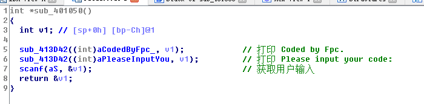
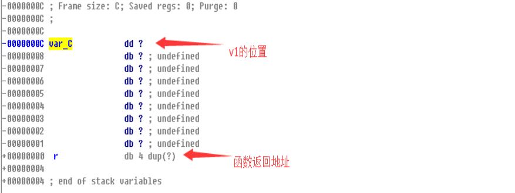
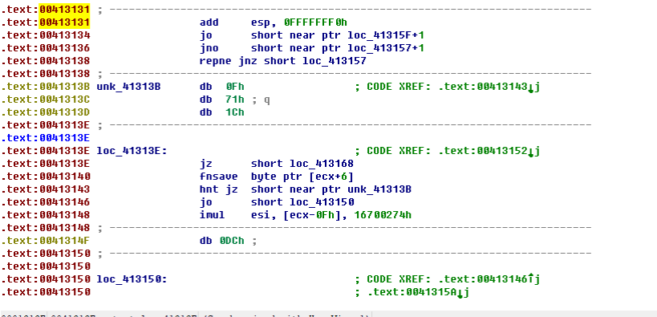
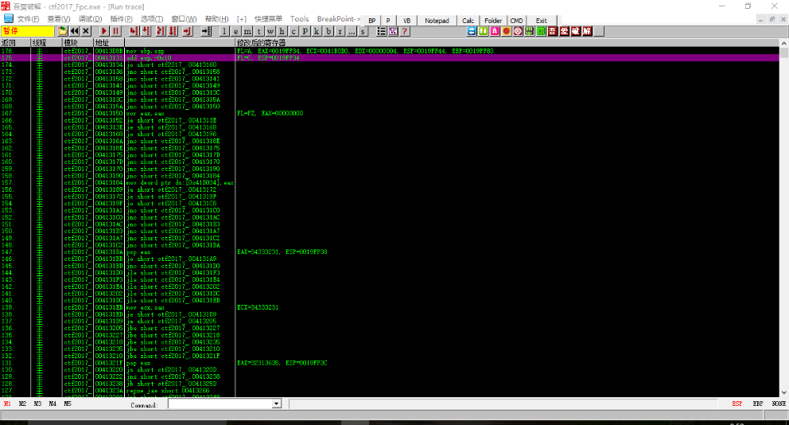

# 花指令

## 原理

花指令是企圖隱藏掉不想被逆向工程的代碼塊(或其它功能)的一種方法, 在真實代碼中插入一些垃圾代碼的同時還保證原有程序的正確執行, 而程序無法很好地反編譯, 難以理解程序內容, 達到混淆視聽的效果.

花指令通常用於加大靜態分析的難度。

## 編寫

最簡單的花指令使用了內聯彙編的方式進行，下面以 VC 添加花指令的方式舉例，gnu 的編譯器也可以採用類似的方式添加花指令，但是使用 AT&T 彙編：

```c
// 正常的函數代碼
int add(int a, int b){
  int c = 0;
  c = a + b;
  return c;
}
// 添加花指令的函數代碼
int add_with_junk(int a, int b){
	int c = 0;
	__asm{
		jz label;
		jnz label;
		_emit 0xe8;    call 指令，後面加4bytes的地址偏移，因此導致反彙編器不能正常識別
label:
	}
	c = a + b;
	return c;
}

```

使用 ida 的反編譯時，添加了花指令的函數不能正常識別，結果如下：

僞代碼：

```asm
// 添加了花指令
.text:00401070 loc_401070:                             ; CODE XREF: sub_401005↑j
.text:00401070                 push    ebp
.text:00401071                 mov     ebp, esp
.text:00401073                 sub     esp, 44h
.text:00401076                 push    ebx
.text:00401077                 push    esi
.text:00401078                 push    edi
.text:00401079                 lea     edi, [ebp-44h]
.text:0040107C                 mov     ecx, 11h
.text:00401081                 mov     eax, 0CCCCCCCCh
.text:00401086                 rep stosd
.text:00401088                 mov     dword ptr [ebp-4], 0
.text:0040108F                 jz      short near ptr loc_401093+1
.text:00401091                 jnz     short near ptr loc_401093+1
.text:00401093
.text:00401093 loc_401093:                             ; CODE XREF: .text:0040108F↑j
.text:00401093                                         ; .text:00401091↑j
.text:00401093                 call    near ptr 3485623h
.text:00401098                 inc     ebp
.text:00401099                 or      al, 89h
.text:0040109B                 inc     ebp
.text:0040109C                 cld
.text:0040109D                 mov     eax, [ebp-4]
.text:004010A0                 pop     edi
.text:004010A1                 pop     esi
.text:004010A2                 pop     ebx
.text:004010A3                 add     esp, 44h
.text:004010A6                 cmp     ebp, esp
.text:004010A8                 call    __chkesp
.text:004010AD                 mov     esp, ebp
.text:004010AF                 pop     ebp
.text:004010B0                 retn
```

在上面這個例子中，把混淆視聽的花指令 patch 成 nop 即可修復，然後正常分析。

值得注意的是，ida 對於棧的判定比較嚴格，因此 push，ret 一類的花指令會干擾反彙編器的正常運行，下面給出一個具體的例子，讀者可以自己編譯復現：

```c++
#include <stdio.h>
// 使用 gcc/g++ 進行編譯
int main(){
	__asm__(".byte 0x55;");          // push rbp   保存棧 
	__asm__(".byte 0xe8,0,0,0,0;");  // call $5;	
	__asm__(".byte 0x5d;");	         // pop rbp -> 獲取rip的值 
	__asm__(".byte 0x48,0x83,0xc5,0x08;"); // add rbp, 8
	__asm__(".byte 0x55;");          // push rbp -> 相當於將call的返回值修改到下面去
	__asm__("ret;");
	__asm__(".byte 0xe8;");          // 這是混淆指令不執行
	__asm__(".byte 0x5d;");          // pop rbp 還原棧		
	printf("whoami \n");
	return 0;
} 
```


## 例題

這裏以`看雪.TSRC 2017CTF秋季賽`第二題作爲講解. 題目下載鏈接: [ctf2017_Fpc.exe](https://github.com/ctf-wiki/ctf-challenges/blob/master/reverse/anti-debug/2017_pediy/ctf2017_Fpc.exe)

程序寫了幾個函數混淆視聽, 將關鍵的驗證邏輯加花指令防止了IDA的靜態分析. 我們用IDA打開Fpc這道題, 程序會先打印一些提示信息, 然後獲取用戶的輸入.



這裏使用了不安全的`scanf`函數, 用戶輸入的緩衝區只有`0xCh`長, 我們雙擊`v1`進入棧幀視圖



因此我們可以通過溢出數據, 覆蓋掉返回地址, 從而轉移到任意地址繼續執行.

這裏我還需要解釋一下, 就是`scanf`之前寫的幾個混淆視聽的函數, 是一些簡單的方程式但實際上是無解的. 程序將真正的驗證邏輯加花混淆, 導致IDA無法很好的進行反編譯. 所以我們這道題的思路就是, 通過溢出轉到真正的驗證代碼處繼續執行.

我們在分析時可以在代碼不遠處發現以下數據塊.


因爲IDA沒能很好的識別數據, 因此我們可以將光標移到數據塊的起始位置, 然後按下`C`鍵(code)將這塊數據反彙編成代碼



值得注意的是, 這段代碼的位置是`0x00413131`, `0x41`是`'A'`的ascii碼，而`0x31`是`'1'`的ascii碼. 由於看雪比賽的限制, 用戶輸入只能是字母和數字, 所以我們也完全可以利用溢出漏洞執行這段代碼

用OD打開, 然後`Ctrl+G`到達`0x413131`處設下斷點, 運行後輸入`12345612345611A`回車, 程序成功地到達`0x00413131`處. 然後`右鍵分析->從模塊中刪除分析`識別出正確代碼


斷在`0x413131`處後, 點擊菜單欄的`"查看"`, 選擇`"RUN跟蹤"`, 然後再點擊`"調試"`, 選擇`"跟蹤步入"`, 程序會記錄這段花指令執行的過程, 如下圖所示:



這段花指令本來很長, 但是使用OD的跟蹤功能後, 花指令的執行流程就非常清楚. 整個過程中進行了大量的跳轉, 我們只要取其中的有效指令拿出來分析即可.

需要注意的是, 在有效指令中, 我們依舊要滿足一些條件跳轉, 這樣程序才能在正確的邏輯上一直執行下去.

比如`0x413420`處的`jnz ctf2017_.00413B03`. 我們就要重新來過, 並在`0x413420`設下斷點


通過修改標誌寄存器來滿足跳轉. 繼續跟蹤步入(之後還有`0041362E  jnz ctf2017_.00413B03`需要滿足). 保證邏輯正確後, 將有效指令取出繼續分析就好了


