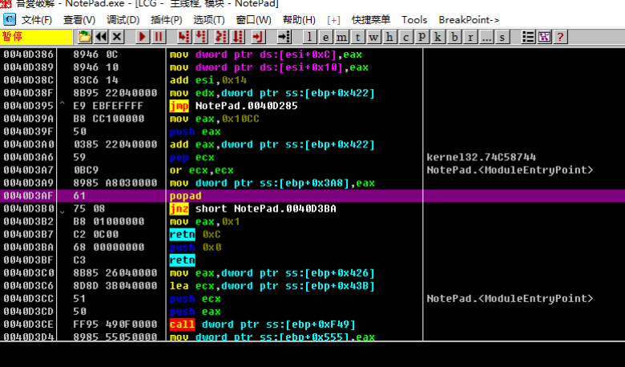

# 一步到達 OEP 法

所謂的一步到達OEP的脫殼方法, 是根據所脫殼的特徵, 尋找其距離OEP最近的一處彙編指令, 然後下int3斷點, 在程序走到OEP的時候dump程序.

如一些壓縮殼往往popad指令距離OEP或者大jmp特別近, 因此使用Ollydbg的搜索功能, 可以搜索殼的特徵彙編代碼, 達到一步斷點到達OEP的效果.

## 要點

1. ctrl+f 查找popad
2. ctrl+l 跳轉到下一個匹配處
3. 找到匹配處, 確認是殼解壓完畢即將跳轉到OEP部分, 則設下斷點運行到該處
4. 只適用於極少數壓縮殼

## 示例

示例程序可以點擊此處下載: [3_direct2oep.zip](https://github.com/ctf-wiki/ctf-challenges/blob/master/reverse/unpack/3_direct2oep.zip)

還是用的原先的notepad.exe來示例, 用`Ollydbg`打開後, 我們按下`ctrl+f`來查找指定的字符串, 像`popad`是典型的一個特徵, 有部分殼它就常用`popad`來恢復狀態, 所以如下圖所示來搜索`popad`.

在本例中, 當搜索到的`popad`不符合我們的要求時, 可以按下`ctrl+l`來搜索下一個匹配處, 大概按下個三四次, 我們找到了跳轉到OEP的位置處.

