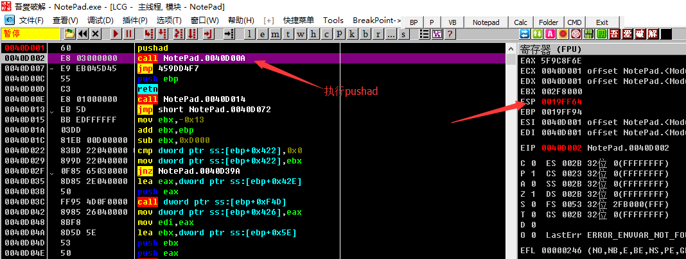
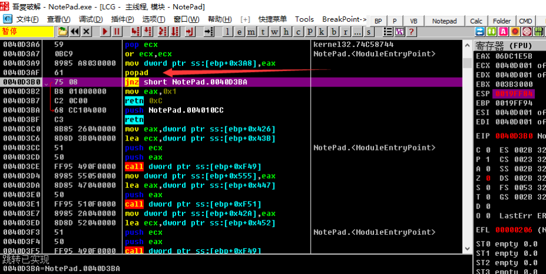

# ESP 定律法

ESP定律法是脫殼的利器, 是應用頻率最高的脫殼方法之一.

## 要點

ESP定律的原理在於利用程序中堆棧平衡來快速找到OEP.

由於在程序自解密或者自解壓過程中, 不少殼會先將當前寄存器狀態壓棧, 如使用`pushad`, 在解壓結束後, 會將之前的寄存器值出棧, 如使用`popad`. 因此在寄存器出棧時, 往往程序代碼被恢復, 此時硬件斷點觸發. 然後在程序當前位置, 只需要少許單步操作, 就很容易到達正確的OEP位置.

1. 程序剛載入開始pushad/pushfd
2. 將全部寄存器壓棧後就設對ESP寄存器設硬件斷點
3. 運行程序, 觸發斷點
4. 刪除硬件斷點開始分析

## 示例

示例程序可以點擊此處下載: [2_esp.zip](https://github.com/ctf-wiki/ctf-challenges/blob/master/reverse/unpack/2_esp.zip)

還是上一篇的示例, 入口一句`pushad`, 我們按下F8執行`pushad`保存寄存器狀態, 我們可以在右邊的寄存器窗口裏發現`ESP`寄存器的值變爲了紅色, 也即值發生了改變.

我們鼠標右擊`ESP`寄存器的值, 也就是圖中的`0019FF64`, 選擇`HW break[ESP]`後, 按下`F9`運行程序, 程序會在觸發斷點時斷下. 如圖來到了`0040D3B0`的位置. 這裏就是上一篇我們單步跟蹤時到達的位置, 剩餘的就不再贅述.

