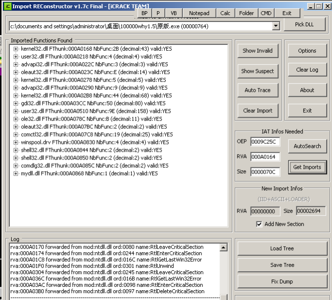

# DUMP 及 IAT 重建

## 原理

在找到程序OEP後, 我們需要將程序dump出來, 並重建`IAT`. `IAT`全名是`Import Address Table`, 表項指向函數實際地址.

## 示例

比如如下, 我們找到了OEP, 到達了程序的真正入口點. 我們這時就需要將程序dump出來. 我們右鍵, 選擇`"用OllyDump脫殼調試進程"`(不過你也可以使用`LoadPE`來dump出來):

彈出一個窗口, 看一下地址是否正確, 主要就是看看`入口點地址`有沒有選對. 然後取消勾選`重建輸入表`.

將dump出的文件命名, 我這裏是命名爲`dump.exe`啦. 我們嘗試來運行一下`dump.exe`, 可以發現程序無法正常運行, 對於一些簡單的殼, 你dump出來發現無法正常運行, 如果你確實找到了正確的OEP並用`IDA`反編譯查看結果良好, 那麼你的第一想法就應該是程序的`IAT`出現了問題. 你就需要重建`IAT`.

我們需要使用`ImportREC`來幫助修復輸入表.

打開`ImportREC`, 選擇一個正在運行的進程`原版.exe`(`原版.exe`是我在OD中正在調試的進程, OD中的`EIP`正處在`OEP`位置, 在用`Ollydump`之後不要關閉這個進程哦.). `ImportREC`修復輸入表入口點需要知道`OEP`, 也就是要在窗口右側中間的`OEP`輸入框中進行輸入

我們所知, 在Ollydbg裏我們知道程序目前在的入口點是`0049C25C`, 而鏡像基址是`00400000`

因此我們這裏需要填寫`OEP`是`0009C25C`

我們修改`ImportREC`中的`OEP`爲`0009C25C`然後點擊`AutoSearch`後, 彈出提示框"發現可能是原IAT地址"

我們點擊`"Get Imports"`按鈕便可以重建`IAT`. 左側會顯示`IAT`中各導入函數的地址以及是否有效. 顯然在圖中可以看到`ImportREC`找到了內存中`IAT`的位置並檢測出各個函數都是有效的.

我們點擊`Fix Dump`, 然後打開先前使用`OllyDump`插件轉儲出來的文件，也就是`dump.exe`文件。

那麼`ImportREC`就會幫助恢復導入表，並生成`dump_.exe`文件. `dump_.exe`可以正常運行
