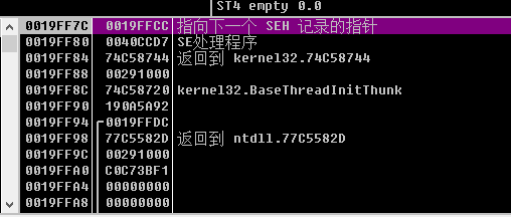
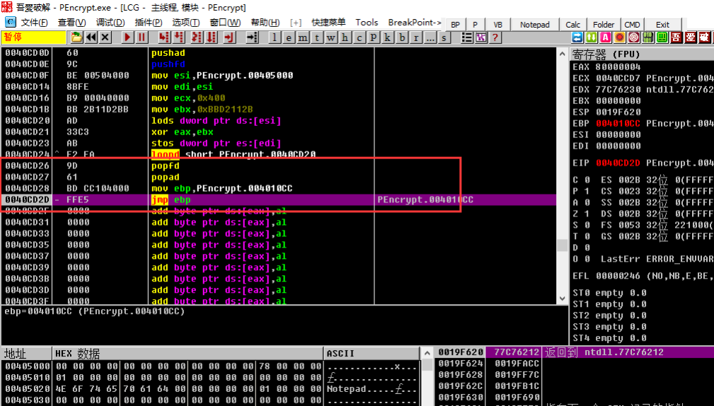
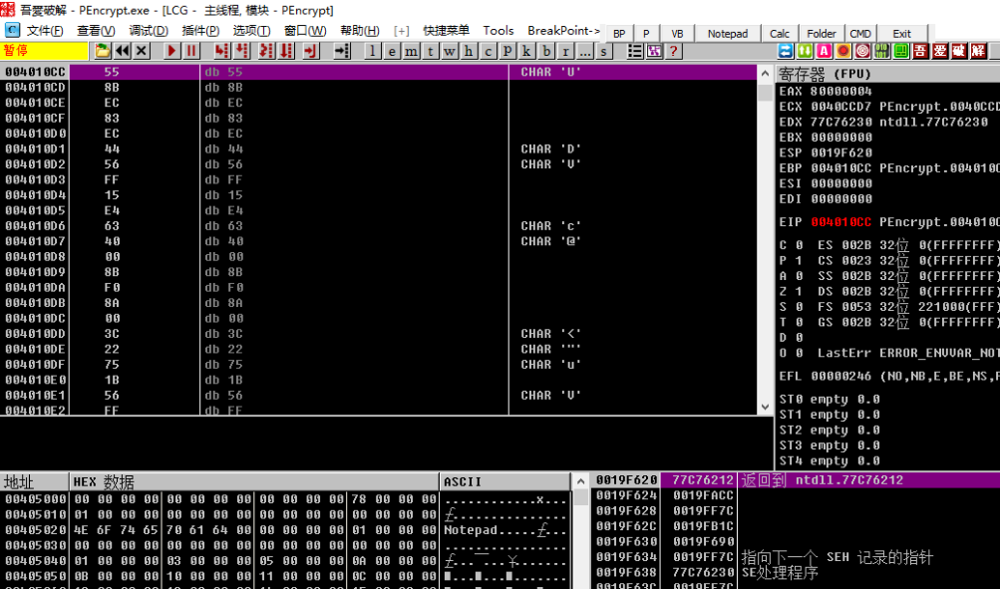

# 最後一次異常法

最後一次異常法的原理是, 程序在自解壓或自解密過程中, 可能會觸發無數次的異常. 如果能定位到最後一次程序異常的位置, 可能就會很接近自動脫殼完成位置. 現在最後一次異常法脫殼可以利用Ollydbg的異常計數器插件, 先記錄異常數目, 然後重新載入, 自動停在最後一次異常處.

## 要點

1. 點擊`選項->調試選項—>異常`, 把裏面的√全部去掉! 按下`CTRL+F2`重載下程序
2. 開始程序就是一個跳轉, 在這裏我們按`SHIFT+F9`, 直到程序運行, 記下從開始按`SHIFT+F9`到程序運行的次數`m`!
3. `CTRL+F2`重載程序, 按`SHIFT+F9`(這次按的次數爲程序運行的次數`m-1`次)
4. 在OD的右下角我們看見有一個"`SE 句柄`", 這時我們按`CTRL+G`, 輸入`SE 句柄`前的地址!
5. 按F2下斷點!然後按`SHIFT+F9`來到斷點處, F8單步跟蹤

## 示例

示例程序可以點擊此處下載: [5_last_exception.zip](https://github.com/ctf-wiki/ctf-challenges/blob/master/reverse/unpack/5_last_exception.zip)

OD載入程序, 在菜單`選項->調試設置->異常標籤頁`中取消勾選所有的忽略異常, 然後重載程序.

我們按下`Shift+F9`, 記錄按了多少次, 程序正常運行. 我們要得到的是倒數第二次按下是按了多少次. 在本例中

* `shift+F9`一次, 到了`0040CCD2`的位置
* `shift+F9`兩次, 程序正常運行

那麼我們重載程序, 只需按下1次(`2-1=1`)`Shift+F9`, 來到`0040CCD2`的位置, 觀察堆棧窗口, 這裏有一個`SE處理程序: 0040CCD7`

我們在CPU窗口(彙編指令), 按`Ctrl+G`, 輸入`0040CCD7`, 然後在此處按下F2. 也就是在`0040CCD7`處設置斷點, 然後按下`Shift+F9`運行, 觸發斷點.

觸發斷點後, 來單步跟蹤. 向下都是一些循環和跳轉, 我們使用F4跳過循環. 最後到達如下位置

顯然在最後的`mov ebp, 0041010CC; jmp ebp`是在跳轉向OEP, 我們跳轉過去如下圖所示:

顯然, 我們幸運地來到了OEP處.
