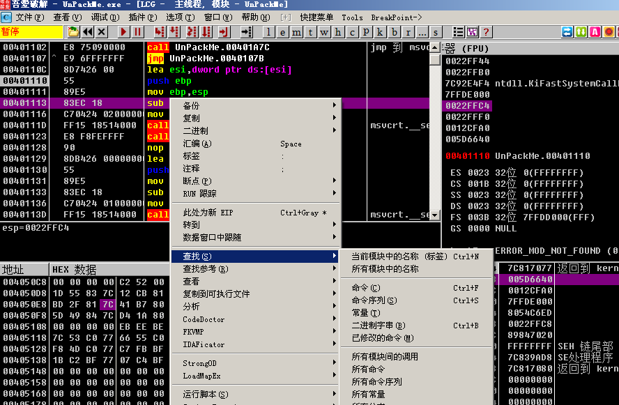
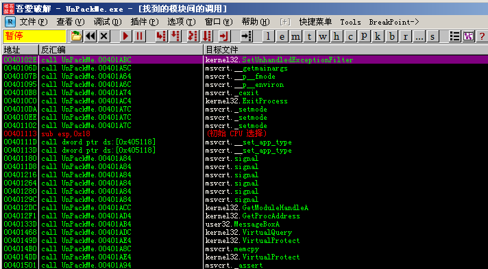
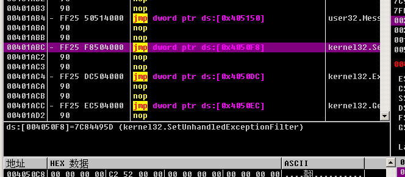
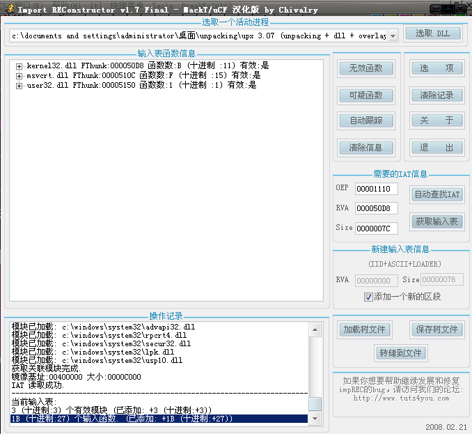
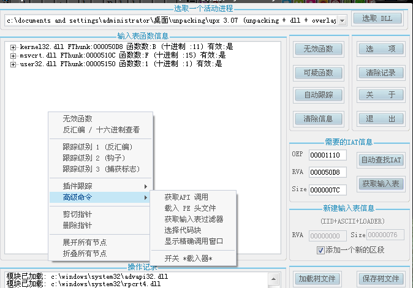

# 手動查找 IAT 並使用 ImportREC 重建

示例程序可以從此鏈接下載: [manually_fix_iat.zip](https://github.com/ctf-wiki/ctf-challenges/blob/master/reverse/unpack/manually_fix_iat.zip)

我們常用的`ImportREC`脫殼是使用的軟件自帶的`IAT auto search`, 但是如果我們要手動查找`IAT`的地址並`dump`出來, 又該怎麼操作呢？

首先使用ESP定律, 可以很快地跳轉到`OEP: 00401110`.

我們右鍵點擊, 選擇`查找->所有模塊間的調用`

顯示出調用的函數列表, 我們雙擊其中的某個函數(注意這裏要雙擊的應該是程序的函數而不是系統函數)

我們來到了函數調用處

右鍵點擊`跟隨`, 進入函數

然後再右鍵點擊`數據窗口中跟隨->內存地址`

這裏因爲顯示是十六進制值, 不方便查看, 我們可以在數據窗口點擊右鍵選擇`長型->地址`, 就可以顯示函數名

注意我們要向上翻到IAT表的起始位置, 可以看到最開始的函數地址是`004050D8`的`kernel.AddAtomA`, 我們向下找到最後一個函數, 也就是`user32.MessageBoxA`函數, 計算一下整個IAT表的大小。在OD的最下方有顯示`塊大小：0x7C`, 所以我們整個IAT塊大小就是`0x7C`

打開`ImportREC`, 選擇我們正在調試的這個程序, 然後分別輸入`OEP：1110, RVA:50D8, SIZE:7C`, 然後點擊`獲取輸入表`

這裏在輸入表窗口中右鍵選擇`高級命令->選擇代碼塊`.

然後會彈出窗口, 選擇完整轉儲, 保存爲`dump.exe`文件

dump完成後, 選擇`轉儲到文件`, 這裏選擇修復我們剛剛dump出的dump.exe, 得到一個`dump\_.exe`. 這時整個脫殼就完成了
