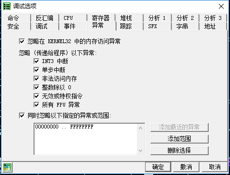

# 內存鏡像法

內存鏡像法是在加殼程序被加載時, 通過OD的`ALT+M`快捷鍵, 進入到程序虛擬內存區段. 然後通過加兩次內存一次性斷點, 到達程序正確OEP的位置.

內存鏡像法的原理在於對於程序資源段和代碼段下斷點, 一般程序自解壓或者自解密時, 會首先訪問資源段獲取所需資源, 然後在自動脫殼完成後, 轉回程序代碼段. 這時候下內存一次性斷點, 程序就會停在OEP處.

## 要點

1. 選擇菜單的`選項->調試選項->異常`
2. 勾選所有的忽略異常
3. 按下`ALT+M`, 打開內存鏡像, 找到程序的第一個`.rsrc`, 按F2下斷點, 然後按`SHIFT+F9`運行到斷點
4. 再按`ALT+M`, 打開內存鏡像, 找到程序的第一個`.rsrc`上面的`.text`(在示例中是`00401000`處), 按F2下斷點. 然後按`SHIFT+F9`（或者是在沒異常情況下按F9）

## 示例

示例程序可以點擊此處下載: [4_memory.zip](https://github.com/ctf-wiki/ctf-challenges/blob/master/reverse/unpack/4_memory.zip)

OD載入程序, 在菜單欄的`選項->調試設置->異常標籤頁`中勾選所有的忽略異常

按下`Alt+M`打開內存鏡像, 找到資源段, 也就是`地址=00407000`, `大小=00005000`的`.rsrc`段, 選中F2下斷

回到CPU窗口, 按下F9運行, 程序斷在了`0040D75F`處

再次按下`Alt+M`打開內存鏡像, 對`.text`代碼段下斷

再繼續運行, 程序斷在了`004010CC`處, 也就是OEP

