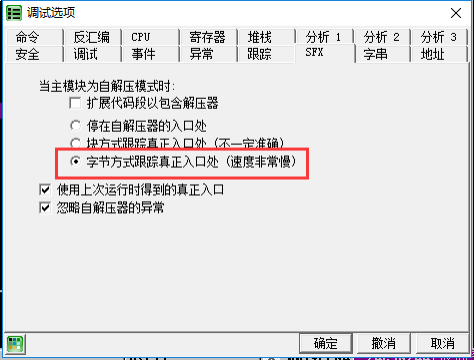

# SFX 法

"SFX"法利用了Ollydbg自帶的OEP尋找功能, 可以選擇直接讓程序停在OD找到的OEP處, 此時殼的解壓過程已經完畢, 可以直接dump程序.

## 要點

1. 設置OD, 忽略所有異常, 也就是說異常選項卡里面都打上勾
2. 切換到SFX選項卡, 選擇"字節模式跟蹤實際入口(速度非常慢)", 確定
3. 重載程序(如果跳出是否"壓縮代碼?"選擇"否", OD直接到達OEP)

## 示例

示例程序可以點擊此處下載: [6_sfx.zip](https://github.com/ctf-wiki/ctf-challenges/blob/master/reverse/unpack/6_sfx.zip)

首先我們在菜單`選項->調試設置->異常標籤頁`中勾選所有忽略異常.

然後切換到`SFX`標籤頁, 點選"字節方式跟蹤真正入口處(速度非常慢)"

重載程序，程序已經停在了代碼入口點, 並且也不需要對OEP進行重新分析.

