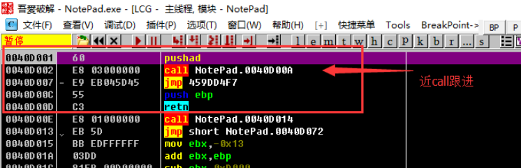
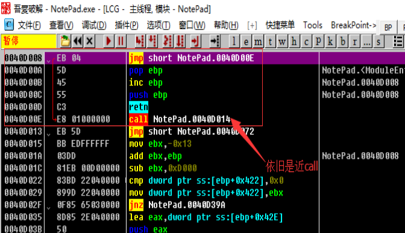

# 單步跟蹤法

單步跟蹤法的原理就是通過Ollydbg的步過(F8), 步入(F7)和運行到(F4)功能, 完整走過程序的自脫殼過程, 跳過一些循環恢復代碼的片段, 並用單步進入確保程序不會略過OEP. 這樣可以在軟件自動脫殼模塊運行完畢後, 到達OEP, 並dump程序.

## 要點

1. 打開程序按F8單步向下, 儘量實現向下的jmp跳轉
2. 會經常遇到大的循環, 這時要多用 F4 來跳過循環
3. 如果函數載入時不遠處就是一個call(近call), 那麼我們儘量不要直接跳過, 而是進入這個call
4. 一般跳轉幅度大的jmp指令, 都極有可能是跳轉到了原程序入口點(OEP)

## 示例

示例程序可以點擊此處下載: [1_trace.zip](https://github.com/ctf-wiki/ctf-challenges/blob/master/reverse/unpack/1_trace.zip)

單步跟蹤法其實就是一步一步儘量從程序入口點往下走, 在單步的過程中注意EIP不要跑偏了, 但是對於一些比較複雜的殼而言, 單步的過程會顯得異常枯燥而且容易把自己繞暈. 所以單步跟蹤也常用於分析一些關鍵代碼部分(跟靜態分析相結合), 而不是完全地從頭分析到尾, 這有違逆向工程的理念.

用Ollydbg打開壓縮包內的Notepad.exe, 停在了下圖位置. 入口點是一個`pushad`保存所有寄存器狀態到棧中, 隨後便是一個`call`調用位於`0040D00A`處的函數. 調用後便無條件跳轉到`459DD4F7`處, 之後的`push ebp`和`retn`顯然沒有任何意義. 像這種入口點附近就是一個`call`的我們稱爲`近call`, 對於近call我們選擇步進, 按下F7(當然你也只能選擇步進, 不然EIP就跑偏程序停止了).



步進後又是一個`call`, 我們繼續步進, 按F7, 跟進後發現沒有近call了, 我們可以看到程序在調`GetModuleHandleA`, `GetProcAddress`等API, 繼續向下分析.



之後會遇到多個跳轉，我們儘量滿足向下的跳轉，對於向上的跳轉不予實現並利用F4跳出循環，直到`0040D3AF`處, 我們看以下的代碼

``` asm
0040D3AF    61              	popad
0040D3B0    75 08           	jnz short NotePad.0040D3BA
0040D3B2    B8 01000000    	    mov eax,0x1
0040D3B7    C2 0C00         	retn 0xC
0040D3BA    68 CC104000     	push NotePad.004010CC
0040D3BF    C3              	retn
```

這裏`popad`可以恢復在程序入口點處保存的寄存器狀態, 然後`jnz`跳轉到`0040D3BA`處, 這裏是利用`push`和`retn`來將`EIP`改變爲`004010CC`, 也就是說在殼解壓完代碼等資源完畢後, 將通過`jnz`跳轉到`push`處, 然後通過`push`和`ret`將`EIP`設置爲程序原來的入口點(OEP)並返回到OEP處, 然後繼續執行原程序的代碼. 我們執行到`retn`返回後, 可以看到如下:


顯然, 我們到了一堆被`Ollydbg`誤認爲是數據的地方繼續執行, 顯然`Ollydbg`分析錯誤了, 我們需要讓`Ollydbg`重新分析, 我們可以右鍵選擇`分析->從模塊中刪除分析`, 或是按下`ctrl+a`, 這時正確地顯示出OEP處的彙編指令.


