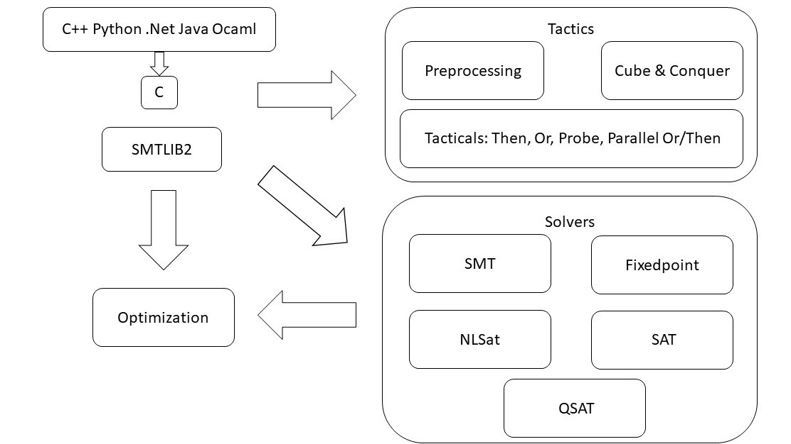

# z3

## 簡介

[Z3 solver](https://github.com/Z3Prover/z3) 是由微軟開發的 **可滿足性模理論求解器**（**Satisfiability Modulo Theory solver**， 即 `SMT solver`），用於檢查邏輯表達式的可滿足性，並可以找到一組約束中的其中一個可行解（無法找出所有的可行解）。



在 CTF 逆向題中，我們有的時候會遇到一些較爲複雜的約束條件，此時可以使用 `z3` 來輔助求解。

## 安裝

Z3 提供了多種語言的接口，方便起見我們使用 Python 版本，我們可以直接通過 pip 進行安裝（注意這裏應當爲 `z3-solver` 而非 `z3`）：

```shell
$ pip3 install z3-solver
```

## 基本用法

> 本節僅介紹 z3 最基本的用法，更多高級用法參見[官方文檔](https://z3prover.github.io/api/html/index.html)

### 變量表示

一階命題邏輯公式由項（變量或常量）與擴展布爾結構組成，在 `z3` 當中我們可以通過如下方式創建變量實例：

- 整型（integer，長度不限）

```python
>>> import z3
>>> x = z3.Int(name = 'x') # x is an integer
```

- 實數類型（real number，長度不限）

```python
>>> y = z3.Real(name = 'y') # y is a real number
```

- 位向量（bit vector，**長度需在創建時指定**）

```python
>>> z = z3.BitVec(name = 'z', bv = 32) # z is a 32-bit vector
```

- 布爾類型（bool）

```python
>>> p = z3.Bool(name = 'p')
```

整型與實數類型變量之間可以互相進行轉換：

```python
>>> z3.ToReal(x)
ToReal(x)
>>> z3.ToInt(y)
ToInt(y)
```

### 常量表示

除了 Python 原有的常量數據類型外，我們也可以使用 `z3` 自帶的常量類型參與運算：

```python
>>> z3.IntVal(val = 114514) # integer
114514
>>> z3.RealVal(val = 1919810) # real number
1919810
>>> z3.BitVecVal(val = 1145141919810, bv = 32) # bit vector，自動截斷
2680619074
>>> z3.BitVecVal(val = 1145141919810, bv = 64) # bit vector
1145141919810
```

### 求解器

在使用 `z3` 進行約束求解之前我們首先需要獲得一個 _求解器_ 類實例，**本質上其實就是一組約束的集合**：

```python
>>> s = z3.Solver()
```

### 添加約束

我們可以通過求解器的 `add()` 方法爲指定求解器添加約束條件，約束條件可以直接通過 `z3` 變量組成的式子進行表示：

```python
>>> s.add(x * 5 == 10)
>>> s.add(y * 1/2 == x)
```

對於布爾類型的式子而言，我們可以使用 `z3` 內置的 `And()`、`Or()`、`Not()`、`Implies()` 等方法進行布爾邏輯運算：

```python
>>> s.add(z3.Implies(p, q))
>>> s.add(r == z3.Not(q))
>>> s.add(z3.Or(z3.Not(p), r))
```

### 約束求解

當我們向求解器中添加約束條件之後，我們可以使用 `check()` 方法檢查約束是否是可滿足的（satisfiable，即 `z3` 是否能夠幫我們找到一組解）：

- `z3.sat`：約束可以被滿足
- `z3.unsat`：約束無法被滿足

```python
>>> s.check()
sat
```

若約束可以被滿足，則我們可以通過 `model()` 方法獲取到一組解：

```python
>>> s.model()
[q = True, p = False, x = 2, y = 4, r = False]
```

對於約束條件比較少的情況，我們也可以無需創建求解器，直接通過 `solve()` 方法進行求解：

```python
>>> z3.solve(z3.Implies(p, q), r == z3.Not(q), z3.Or(z3.Not(p), r))
[q = True, p = False, r = False]
```

## 例題：GWCTF 2019 - xxor

### 逆向分析

首先慣例拖入 IDA 中，`main()` 函數整體邏輯比較簡單，首先會讀入 6 個整型到棧上，接下來對前三個整型調用三次 `sub_400686()` 函數進行處理並將結果存到 `v7` 中，最後調用 `sub_400770()` 進行檢查：

```c
__int64 __fastcall main(int a1, char **a2, char **a3)
{
  int i; // [rsp+8h] [rbp-68h]
  int j; // [rsp+Ch] [rbp-64h]
  __int64 v6[6]; // [rsp+10h] [rbp-60h] BYREF
  __int64 v7[6]; // [rsp+40h] [rbp-30h] BYREF

  v7[5] = __readfsqword(0x28u);
  puts("Let us play a game?");
  puts("you have six chances to input");
  puts("Come on!");
  v6[0] = 0LL;
  v6[1] = 0LL;
  v6[2] = 0LL;
  v6[3] = 0LL;
  v6[4] = 0LL;
  for ( i = 0; i <= 5; ++i )
  {
    printf("%s", "input: ");
    a2 = (char **)((char *)v6 + 4 * i);
    __isoc99_scanf("%d", a2);
  }
  v7[0] = 0LL;
  v7[1] = 0LL;
  v7[2] = 0LL;
  v7[3] = 0LL;
  v7[4] = 0LL;
  for ( j = 0; j <= 2; ++j )
  {
    dword_601078 = v6[j];
    dword_60107C = HIDWORD(v6[j]);
    a2 = (char **)&unk_601060;
    sub_400686(&dword_601078, &unk_601060);
    LODWORD(v7[j]) = dword_601078;
    HIDWORD(v7[j]) = dword_60107C;
  }
  if ( (unsigned int)sub_400770(v7, a2) != 1 )
  {
    puts("NO NO NO~ ");
    exit(0);
  }
  puts("Congratulation!\n");
  puts("You seccess half\n");
  puts("Do not forget to change input to hex and combine~\n");
  puts("ByeBye");
  return 0LL;
}
```

`sub_400686()` 有點類似於魔改的 TEA 加密：

```c
__int64 __fastcall sub_400686(unsigned int *a1, _DWORD *a2)
{
  __int64 result; // rax
  unsigned int v3; // [rsp+1Ch] [rbp-24h]
  unsigned int v4; // [rsp+20h] [rbp-20h]
  int v5; // [rsp+24h] [rbp-1Ch]
  unsigned int i; // [rsp+28h] [rbp-18h]

  v3 = *a1;
  v4 = a1[1];
  v5 = 0;
  for ( i = 0; i <= 0x3F; ++i )
  {
    v5 += 1166789954;
    v3 += (v4 + v5 + 11) ^ ((v4 << 6) + *a2) ^ ((v4 >> 9) + a2[1]) ^ 0x20;
    v4 += (v3 + v5 + 20) ^ ((v3 << 6) + a2[2]) ^ ((v3 >> 9) + a2[3]) ^ 0x10;
  }
  *a1 = v3;
  result = v4;
  a1[1] = v4;
  return result;
}
```

這裏的參數 `a1` 爲我們的輸入，而 `a2` 則爲四個 int32：

```c
.data:0000000000601060 dword_601060    dd 2                    ; DATA XREF: main+FE↑o
.data:0000000000601064                 dd 2
.data:0000000000601068                 dd 3
.data:000000000060106C                 dd 4
```

而 `sub_400770()` 會對處理過後的輸入進行檢查：

```c
__int64 __fastcall sub_400770(_DWORD *a1)
{
  __int64 result; // rax

  if ( a1[2] - a1[3] == 2225223423LL
    && a1[3] + a1[4] == 4201428739LL
    && a1[2] - a1[4] == 1121399208LL
    && *a1 == -548868226
    && a1[5] == -2064448480
    && a1[1] == 550153460 )
  {
    puts("good!");
    result = 1LL;
  }
  else
  {
    puts("Wrong!");
    result = 0LL;
  }
  return result;
}
```

### 求解

我們首先使用 `z3` 來求解 `sub_400686()` 運算後的結果：

```python
import z3

x = [0] * 6
for i in range(6):
    x[i] = z3.Int('x[' + str(i) + ']')

s = z3.Solver()
s.add(x[0] == 0xDF48EF7E)
s.add(x[5] == 0x84F30420)
s.add(x[1] == 0x20CAACF4)
s.add(x[2]-x[3] == 0x84A236FF)
s.add(x[3]+x[4] == 0xFA6CB703)
s.add(x[2]-x[4] == 0x42D731A8)

if s.check() == z3.sat:
    print(s.model())
else:
    raise Exception("NO SOLUTION!")
```

結果如下：

```shell
$ python3 solve.py 
[x[2] = 3774025685,
 x[3] = 1548802262,
 x[4] = 2652626477,
 x[1] = 550153460,
 x[5] = 2230518816,
 x[0] = 3746099070]
```

接下來我們逆着 `sub_400686()` 的邏輯寫出解密程序即可：

```c
#include <stdio.h>
#include <stdint.h>

void decrypt(uint32_t sum, uint32_t *v, uint32_t *k)
{
    uint32_t v0, v1;

    v0 = v[0];
    v1 = v[1];

    for (int i = 0; i < 0x40; i++) {
        v1 -= (v0 + sum + 20) ^ ((v0 << 6) + k[2]) ^ ((v0 >> 9) + k[3]) ^ 0x10;
        v0 -= (v1 + sum + 11) ^ ((v1 << 6) + k[0]) ^ ((v1 >> 9) + k[1]) ^ 0x20;
        sum -= 0x458BCD42;
    }

    v[0] = v0;
    v[1] = v1;
}

int main(int argc, char **argv, char **envp)
{
    uint32_t data[] = {
        3746099070, 550153460, 3774025685, 1548802262, 2652626477, 2230518816
    };
    uint32_t sum = 0;
    uint32_t k[] = {
        2, 2, 3, 4
    };

    for (int i = 0; i < 0x40; i++) {
        sum += 0x458BCD42;
    }

    for (int i = 0; i < 3; i++) {
        decrypt(sum, &data[i * 2], k);
        printf("%4x%4x", data[i * 2], data[i * 2 + 1]);
    }

    puts("");

    return 0;
}
```

結果如下：

```shell
$ ./solve 
666c61677b72655f69735f6772656174217d
```

接下來就是快樂的拿 flag 時間了：

```python
s = '666c61677b72655f69735f6772656174217d'
while len(s) != 0:
    print(chr(int(s[:2], 16)), end = '')
    s = s[2:]
print('')
# flag{re_is_great!}
```