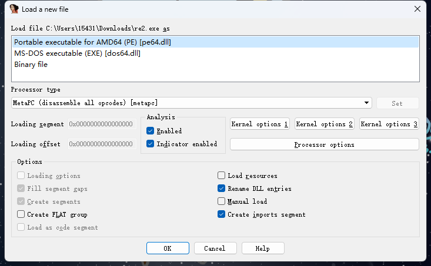
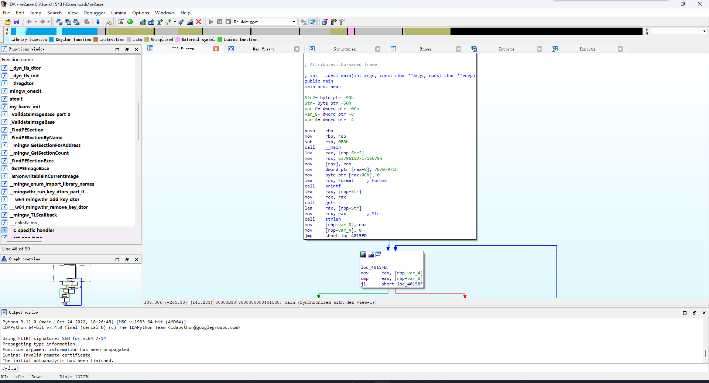
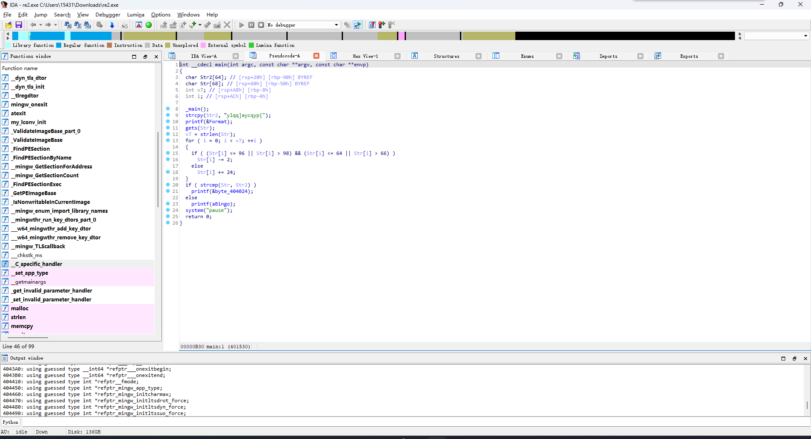
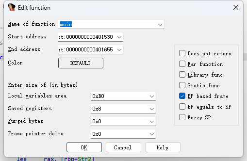
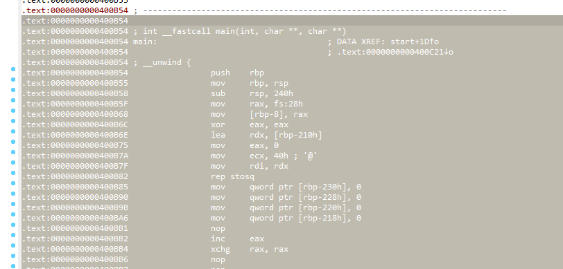
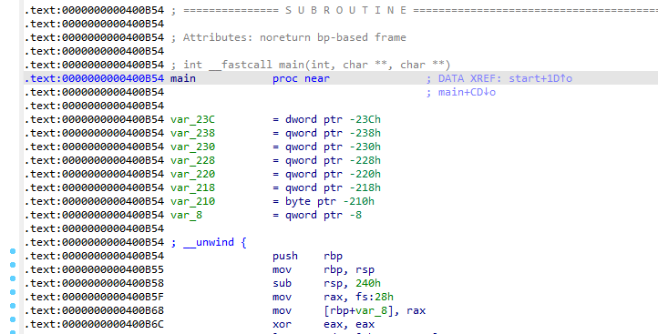
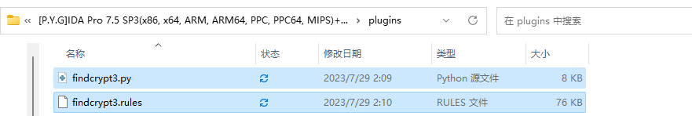
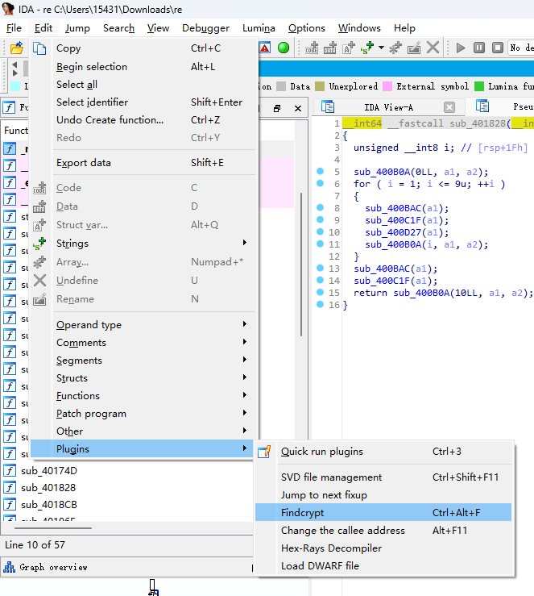

# IDA Pro

## 簡介

IDA Pro（interactive Disassembler Professional）是由 Hex-Rays 公司出品的一款交互式反彙編工具，也是軟件逆向工程當中最流行的一個靜態分析工具。

需要注意的是，IDA Pro 爲付費軟件，軟件本體與不同架構的反編譯引擎單獨進行收費，你可以根據自己的需求在 Hex-rays 的官網自行購買相應的軟件許可證以進行使用。

> 截至 2024 年 4 月， IDA Pro 本體許可證的價格爲 1975 USD，任一指令集架構反編譯功能的許可證價格爲 2765 USD。

此外，Hex-rays 公司還提供基於雲引擎的免費逆向工具 [IDA Free](https://hex-rays.com/ida-free/)，不過目前僅支持 x86 逆向。

## 基本用法

IDA Pro 通常會提供 `ida.exe` 與 `ida64.exe` 兩個可執行程序，分別對應於逆向 `32` 位與 `64` 位程序。當我們需要使用 IDA Pro 分析某一可執行程序二進制文件時，我們需要根據程序指令集長度的不同選擇使用不同的 `ida` 。

最簡單的使用方式是將待逆向的二進制可執行文件直接拖放到 IDA 上，IDA會自動識別文件類型，這一步通常不需要做改動，直接點擊 🆗 即可：




接下來我們就會看到這樣一個界面：



- `Function Windows` ：IDA 所識別出來的函數列表，通過該目錄可以直接跳轉到對應函數
- `IDA-View` ：以彙編形式呈現的由 IDA 進行反編譯所得的單個函數結果，默認是以由基本塊構成的控制流圖的形式進行展示，也可以通過 `空格` 鍵切換到內存佈局中的原始彙編代碼
- `Hex View` ： 二進制文件的原始數據視圖
- `Structures` ：由 IDA 所識別出來的程序中可能存在的結構體信息
- `Enums` ：由 IDA 所識別出來的程序中可能存在的枚舉信息
- `Imports` ： 該二進制文件運行時可能需要從外部導入的符號
- `Exports` ： 該二進制文件可以被導出到外部的符號

## 函數反編譯

除了反彙編以外，IDA 也支持將彙編代碼反編譯爲 C/C++ 形式的源代碼，我們只需要在待反編譯的函數位置按下 `F5` 即可獲得反編譯後的程序代碼：



有的時候 IDA 對於函數範圍的識別可能會有一定錯誤，從而導致反編譯結果出現偏差，此時我們可以在 `IDA-View` 窗口中的函數開頭按下 `alt+p` 重新定義函數範圍，或是先按下 `u` 取消原有定義後再框選函數範圍後重新按下 `p` 進行定義：



有的時候因爲代碼混淆等原因導致 IDA 無法建立函數：


當我們完成對函數識別的修復之後，我們可以在函數開頭按下 `p` 讓 IDA 重新自動識別函數，或是框選屬於該函數的彙編代碼之後再按下 `p` 讓 IDA 重新自動識別函數：





## IDAPython

在 IDA Pro 當中內置了一個 Python 及一個 IDC 模塊，可以幫助我們快速地對二進制文件進行修改等工作。

我們可以通過 `File` → `Script Command` 直接編寫運行 IDAPython 腳本：


在使用之前需要先導入 `ida` 模塊，比較常用的有以下 API：

```python
idc.get_db_byte(addr)       # 返回 addr 處的 1 字節
idc.get_wide_word(addr)     # 返回 addr 處的 2 字節
idc.get_wide_dword(addr)    # 返回 addr 處的 4 字節
idc.get_qword(addr)         # 返回 addr 處的 8 字節
idc.get_bytes(addr, size, use_dbg) # 返回 addr 處的 size 字節
idc.patch_byte(addr, value)  # 將 addr 處的 1 字節修改爲 value（小端序）
idc.patch_word(addr, value)  # 將 addr 處的 2 字節修改爲 value（小端序）
idc.patch_dword(addr, value) # 將 addr 處的 4 字節修改爲 value（小端序）
idc.patch_qword(addr, value) # 將 addr 處的 8 字節修改爲 value（小端序）
```

更多 API 及用法參見[官方文檔](https://hex-rays.com/products/ida/support/idapython_docs/)。

## IDA 插件

IDA 支持插件擴展，通過插件擴展我們可以很方便地擴展及增強 IDA 的功能。

插件的安裝通常比較簡單，以 `FindCrypt` 插件爲例，該插件可以幫我們自動識別程序當中存在的密碼算法。要安裝該插件，首先我們需要在 [Github](https://github.com/polymorf/findcrypt-yara) 上獲取插件源碼，並將其放置到 `IDA安裝路徑/plugins` 文件夾下：



若系統中未安裝 `yara` 模塊則需要進行安裝：

```bash
$ python -m pip install yara-python
```

此時我們便能在 `Edit→Plugin` 中使用該插件：


