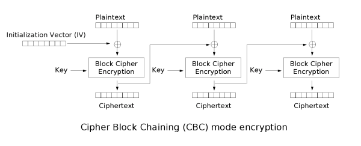
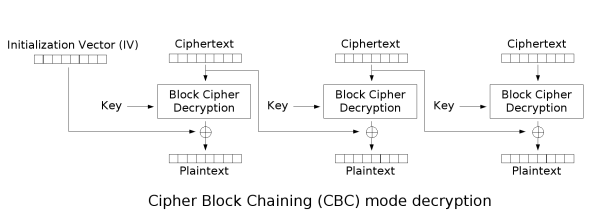

# CBC

CBC 加密模式（全称 Cipher Block Chaining Mode，密码分组链接模式）是一种常用的对称加密工作模式。它将明文分割成固定大小的块，在加密前将每个明文块与前一个密文块进行异或（XOR）操作，从而确保相同的明文块加密后会生成不同的密文，极大提升了数据安全性。

## 加密

CBC 的加密过程如下：

- 首先将明文分成多个固定长度的数据块 $P_1,P_2,...,P_n$ ，准备一份密钥 $K$ 、一份初始化向量 $IV$ ，加密函数设为 $E_k(x)$
- 将第一个明文块 $P_1$ 与 $IV$ 做异或运算，然后使用加密函数进行加密，得到第一个密文块 $C_1=E_k(P_1 \oplus IV)$
- 接下来加密后续分组，对于第 $i$ 个明文块 $P_i$ ，先将其与前一个密文块 $C_{i-1}$ 进行异或，然后再进行加密，得到第 $i$ 个密文块 $C_i=E_k(P_i \oplus C_{i-1})$

我们可以看到每个密文块都会影响下一个块，因此称为 Cipher Block Chaining（链式连接），下图展示了这一过程：



CBC 模式对初始向量（Initialization Vector）有如下要求：

- 唯一性：在同一个密钥下不能使用相同的 IV
- 不可预测性：IV 必须是伪随机的，攻击者必须无法预测下一个 IV 是什么
- 长度要求：IV 的长度必须完全等于底层加密算法的分组大小

需要注意的是，IV 本身并不要求保密，有的密文传输实现甚至会将 IV 显式包含在数据包当中（如 TLS 1.1 的 CBC 密码套件）。

## 解密

类似地，解密的过程实际上便是逆着加密的过程进行，我们将解密函数记为 $D_k(x)$：

- 首先使用 $IV$ 解密第一个块，即 $P_1 = D_k(C_1) \oplus IV$
- 然后依次解密后续块即可，即 $P_i=D_k(C_i) \oplus C_{i-1}$

下图展示了这一过程：



## 优缺点

### 优点

1. 密文块 `C_i` 由当前明文块 `P_i` 与前一密文块 `C_{i-1}`（首块使用 IV）共同决定，因此相同的明文块在不同链状态下通常会得到不同密文块，这隐藏了明文的统计特性。
2. 具有有限的两步错误传播特性，即密文块中的一位变化只会影响当前密文块和下一密文块。
3. 具有自同步特性，即第 k 块起密文正确，则第 k+1 块就能正常解密。

### 缺点

1. 加密不能并行，解密可以并行。

## 应用

CBC 应用十分广泛，曾被广泛用于常见的数据加密（例如 VeraCrypt 的部分配置）和协议加密（例如 IPSec）。

## 攻击

###  字节反转攻击

#### 原理

字节反转攻击的原理十分简单，我们观察**解密过程**可以发现如下特性:

- IV （初始向量）影响第一个明文分组
- 第 n 个密文分组可以影响第 n + 1 个明文分组

假设第$n$个密文分组为$C_n$，解密后的第$n$个明文分组为为$P_n$。

然后$P_{n+1}=C_n~\text{xor}~f(C_{n+1})$。

其中$f$函数为图中的$\text{Block Cipher Decryption}$。

对于某个信息已知的原文和密文，我们可以修改第 $n$ 个密文块 $C_n$ 为 $C_n~\text{xor}~P_{n+1}~\text{xor}~A$ ，然后再对这条密文进行解密，那么解密后的第 $n$ 个明文块将会变成 $A$ 。

#### 例题

```python
from flag import FLAG
from Crypto.Cipher import AES
from Crypto import Random
import base64

BLOCK_SIZE=16
IV = Random.new().read(BLOCK_SIZE)
passphrase = Random.new().read(BLOCK_SIZE)

pad = lambda s: s + (BLOCK_SIZE - len(s) % BLOCK_SIZE) * chr(BLOCK_SIZE - len(s) % BLOCK_SIZE)
unpad = lambda s: s[:-ord(s[len(s) - 1:])]

prefix = "flag="+FLAG+"&userdata="
suffix = "&user=guest"
def menu():
    print "1. encrypt"
    print "2. decrypt"
    return raw_input("> ")

def encrypt():
    data = raw_input("your data: ")
    plain = prefix+data+suffix
    aes = AES.new(passphrase, AES.MODE_CBC, IV)
    print base64.b64encode(aes.encrypt(pad(plain)))


def decrypt():
    data = raw_input("input data: ")
    aes = AES.new(passphrase, AES.MODE_CBC, IV)
    plain = unpad(aes.decrypt(base64.b64decode(data)))
    print 'DEBUG ====> ' + plain
    if plain[-5:]=="admin":
        print plain
    else:
        print "you are not admin"

def main():
    for _ in range(10):
        cmd = menu()
        if cmd=="1":
            encrypt()
        elif cmd=="2":
            decrypt()
        else:
            exit()

if __name__=="__main__":
    main()
```

可见题目希望我们提供一个加密的字符串，如果这个字符串解密后最后的内容为admin。程序将会输出明文。所以题目流程为先随便提供一个明文，然后将密文进行修改，使得解密后的字符串最后的内容为admin,我们可以枚举flag的长度来确定我们需要在什么位置进行修改。

以下是exp.py

```python
from pwn import *
import base64

pad = 16
data = 'a' * pad
for x in range(10, 100):
    r = remote('xxx.xxx.xxx.xxx', 10004)
    #r = process('./chall.sh')
    
    r.sendlineafter('> ', '1')
    r.sendlineafter('your data: ', data)
    cipher = list(base64.b64decode(r.recv()))
    #print 'cipher ===>', ''.join(cipher)
    
    BLOCK_SIZE = 16
    prefix = "flag=" + 'a' * x + "&userdata="
    suffix = "&user=guest"
    plain = prefix + data + suffix
    
    idx = (22 + x + pad) % BLOCK_SIZE + ((22 + x + pad) / BLOCK_SIZE - 1) * BLOCK_SIZE
    cipher[idx + 0] = chr(ord(cipher[idx + 0]) ^ ord('g') ^ ord('a'))
    cipher[idx + 1] = chr(ord(cipher[idx + 1]) ^ ord('u') ^ ord('d'))
    cipher[idx + 2] = chr(ord(cipher[idx + 2]) ^ ord('e') ^ ord('m'))
    cipher[idx + 3] = chr(ord(cipher[idx + 3]) ^ ord('s') ^ ord('i'))
    cipher[idx + 4] = chr(ord(cipher[idx + 4]) ^ ord('t') ^ ord('n'))

    r.sendlineafter('> ', '2')
    r.sendlineafter('input data: ', base64.b64encode(''.join(cipher)))

    msg = r.recvline()
    if 'you are not admin' not in msg:
        print msg
        break
    r.close()  

```
### Padding Oracle Attack
具体参见下面的介绍。
