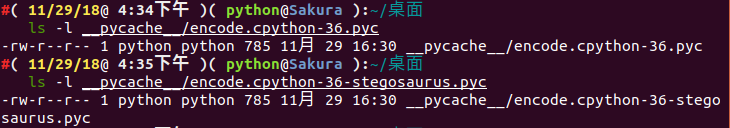
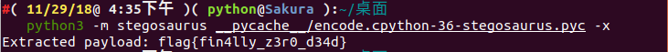
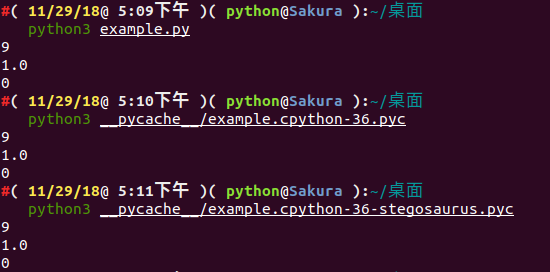

# pyc文件

code object
===

> 在我们导入 python 脚本时在目录下会生成个一个相应的 pyc 文件，是pythoncodeobj的持久化储存形式,加速下一次的装载。


## 文件结构

一个 pyc 文件由两大部分组成：

- 一、Header 部分：存放了 `.pyc` 文件的基本信息，大小为 16 字节。
  - 最开始 4 个字节为 Magic Number，用以标识此 `.pyc` 文件的版本信息。
  - 接下来 4 个字节为 Bit Field，具体作用参见 [PEP 552](https://peps.python.org/pep-0552/)。
  - 接下来 4 个字节为 `.pyc` 文件产生的时间（timestamp）。
  - 最后 4 个字节为 `.pyc` 文件的大小。
- 二、CodeObject 部分：序列化的 PyCodeObject，其结构参见 [include/code.h](https://github.com/python/cpython/blob/master/Include/code.h)，具体的序列化方法参见 [python/marshal](https://github.com/python/cpython/blob/master/Python/marshal.c)。

> 需要注意的是，在较老版本的 Python 当中，在 `.pyc` 文件中并不存在 `Bit Field` 和 `文件大小` 这两个字段，即 Header 大小仅为 8 字节。


> 对 `.pyc` 文件的完整解析可以参照如下资料：
>
> - [Python程序的执行原理](http://python.jobbole.com/84599/)
> - [PYC文件格式分析](http://kdr2.com/tech/python/pyc-format.html)


**关于co_code**

一串二进制流,代表着指令序列,具体定义在[include/opcode.h](https://github.com/python/cpython/blob/fc7df0e664198cb05cafd972f190a18ca422989c/Include/opcode.h)中,也可以参照[python opcodes](http://unpyc.sourceforge.net/Opcodes.html)。

由

- 指令(opcode),分为有参数和无参数两种,以 https://github.com/python/cpython/blob/fc7df0e664198cb05cafd972f190a18ca422989c/Include/opcode.h#L69 划分

- 参数(oparg)

python3.6 以上参数永远占1字节,如果指令不带参数的话则以`0x00`代替,在运行过程中被解释器忽略,也是**Stegosaurus**技术原理;而低于python3.5的版本中指令不带参数的话却没有`0x00`填充


### 例题

**[Hackover CTF 2016 : img-enc](https://github.com/ctfs/write-ups-2016/tree/master/hackover-ctf-2016/forensics/img-enc)**

首先尝试pycdc反编译失败

```python
# Source Generated with Decompyle++
# File: imgenc.pyc (Python 2.7)

import sys
import numpy as np
from scipy.misc import imread, imsave

def doit(input_file, output_file, f):
Unsupported opcode: STOP_CODE
    img = imread(input_file, flatten = True)
    img /= 255
    size = img.shape[0]
# WARNING: Decompyle incomplete
```

注意到是python2.7,也就是说指令序列共占1字节或3字节(有参数无参数)

使用pcads得到

```xml
imgenc.pyc (Python 2.7)
...
                67      STOP_CODE               
                68      STOP_CODE               
                69      BINARY_DIVIDE           
                70      JUMP_IF_TRUE_OR_POP     5
                73      LOAD_CONST              3: 0
                76      LOAD_CONST              3: 0
                79      BINARY_DIVIDE       
```

定位到出错的地方,观察发现 `LOAD_CONST LOAD_CONST BINARY_DIVIDE STORE_FAST opcodes (64 03 00 64 03 00 15 7d 05 00)`被破坏了,根据上下文线索修复后

```xml
00000120  64 04 00 6b 00 00 72 ce  00 64 03 00 64 03 00 15  |d..k..r..d..d...|
00000130  7d 05 00 64 03 00 64 03  00 15 7d 05 00 64 03 00  |}..d..d...}..d..|
00000140  64 03 00 15 7d 05 00 64  03 00 64 03 00 15 7d 05  |d...}..d..d...}.|
00000150  00 64 03 00 64 03 00 15  7d 05 00 64 03 00 64 03  |.d..d...}..d..d.|
00000160  00 15 7d 05 00 64 03 00  64 03 00 15 7d 05 00 64  |..}..d..d...}..d|
00000170  03 00 64 03 00 15 7d 05  00 64 03 00 64 03 00 15  |..d...}..d..d...|
00000180  7d 05 00 64 03 00 64 03  00 15 7d 05 00 64 03 00  |}..d..d...}..d..|
00000190  64 03 00 15 7d 05 00 64  03 00 64 03 00 15 7d 05  |d...}..d..d...}.|
000001a0  00 64 03 00 64 03 00 15  7d 05 00 64 03 00 64 03  |.d..d...}..d..d.|
000001b0  00 15 7d 05 00 64 03 00  64 03 00 15 7d 05 00 6e  |..}..d..d...}..n|
```

接下来根据修复好的python源代码得到flag即可


**延伸**:

- 题目: [0ctf-2017:py](https://github.com/ctfs/write-ups-2017/tree/master/0ctf-quals-2017/reverse/py-137)
- writeup: [记一次手撸CPython bytecode](http://0x48.pw/2017/03/20/0x2f/)


## Tools


### [pycdc](https://github.com/zrax/pycdc)

> 将python字节码转换为可读的python 源代码,包含了反汇编(pycads)和反编译(pycdc)两种工具

### [Stegosaurus](https://github.com/AngelKitty/stegosaurus)

> Stegosaurus 是一款隐写工具，它允许我们在 Python 字节码文件( pyc 或 pyo )中嵌入任意 Payload。由于编码密度较低，因此我们嵌入 Payload 的过程既不会改变源代码的运行行为，也不会改变源文件的文件大小。 Payload 代码会被分散嵌入到字节码之中，所以类似 strings 这样的代码工具无法查找到实际的 Payload。 Python 的 dis 模块会返回源文件的字节码，然后我们就可以使用 Stegosaurus 来嵌入 Payload 了。

原理是在 python 的字节码文件中，利用冗余空间，将完整的 payload 代码分散隐藏到这些零零碎碎的空间中。

具体用法可参看 [ctf-tools](https://ctf-wiki.github.io/ctf-tools/misc/)。

#### 例题

Bugku QAQ

赛题链接如下：

```shell
http://ctf.bugku.com/files/447e4b626f2d2481809b8690613c1613/QAQ
http://ctf.bugku.com/files/5c02892cd05a9dcd1c5a34ef22dd9c5e/cipher.txt
```

首先拿到这道题，用 `010Editor` 乍一眼看过去，我们可以看到一些特征信息：


可以判断这是个跟 `python` 有关的东西，通过查阅相关资料可以判断这是个 `python` 经编译过后的 `pyc` 文件。这里可能很多小伙伴们可能不理解了，什么是 `pyc` 文件呢？为什么会生成 `pyc` 文件？ `pyc` 文件又是何时生成的呢？下面我将一一解答这些问题。

简单来说， `pyc` 文件就是 `Python` 的字节码文件，是个二进制文件。我们都知道 `Python` 是一种全平台的解释性语言，全平台其实就是 `Python` 文件在经过解释器解释之后(或者称为编译)生成的 `pyc` 文件可以在多个平台下运行，这样同样也可以隐藏源代码。其实， `Python` 是完全面向对象的语言， `Python` 文件在经过解释器解释后生成字节码对象 `PyCodeObject` ， `pyc` 文件可以理解为是 `PyCodeObject` 对象的持久化保存方式。而 `pyc` 文件只有在文件被当成模块导入时才会生成。也就是说， `Python` 解释器认为，只有 `import` 进行的模块才需要被重用。 生成 `pyc` 文件的好处显而易见，当我们多次运行程序时，不需要重新对该模块进行重新的解释。主文件一般只需要加载一次，不会被其他模块导入，所以一般主文件不会生成 `pyc` 文件。

我们举个例子来说明这个问题：

为了方便起见，我们事先创建一个test文件夹作为此次实验的测试：

```shell
mkdir test && cd test/
```

假设我们现在有个 `test.py` 文件，文件内容如下：

```python
def print_test():
    print('Hello,Kitty!')

print_test()
```

我们执行以下命令：

```shell
python3 test.py
```

不用说，想必大家都知道打印出的结果是下面这个：

```shell
Hello,Kitty!
```

我们通过下面命令查看下当前文件夹下有哪些文件：

```shell
ls -alh
```


我们可以发现，并没有 `pyc` 文件生成。

‘我们再去创建一个文件为 `import_test.py` 文件，文件内容如下：

> 注： `test.py` 和 `import_test.py` 应当放在同一文件夹下

```python
import test

test.print_test()
```

我们执行以下命令：

```shell
python3 import_test.py
```

结果如下：

```shell
Hello,Kitty!
Hello,Kitty!
```

诶，为啥会打印出两句相同的话呢？我们再往下看，我们通过下面命令查看下当前文件夹下有哪些文件：

```shell
ls -alh
```

结果如下：

```shell
总用量 20K
drwxr-xr-x 3 python python 4.0K 11月  5 20:38 .
drwxrwxr-x 4 python python 4.0K 11月  5 20:25 ..
-rw-r--r-- 1 python python   31 11月  5 20:38 import_test.py
drwxr-xr-x 2 python python 4.0K 11月  5 20:38 __pycache__
-rw-r--r-- 1 python python   58 11月  5 20:28 test.py
```

诶，多了个 `__pycache__` 文件夹，我们进入文件夹下看看有什么？

```shell
cd __pycache__ && ls
```


我们可以看到生成了一个 `test.cpython-36.pyc` 。为什么是这样子呢？

我们可以看到，我们在执行 `python3 import_test.py` 命令的时候，首先开始执行的是 `import test` ，即导入 `test` 模块，而一个模块被导入时， `PVM(Python Virtual Machine)` 会在后台从一系列路径中搜索该模块，其搜索过程如下：

- 在当前目录下搜索该模块
- 在环境变量 `PYTHONPATH` 中指定的路径列表中依次搜索
- 在 `python` 安装路径中搜索

事实上， `PVM` 通过变量 `sys.path` 中包含的路径来搜索，这个变量里面包含的路径列表就是上面提到的这些路径信息。

模块的搜索路径都放在了 `sys.path` 列表中，如果缺省的 `sys.path` 中没有含有自己的模块或包的路径，可以动态的加入 `(sys.path.apend)` 即可。

事实上， `Python` 中所有加载到内存的模块都放在 `sys.modules` 。当 `import` 一个模块时首先会在这个列表中查找是否已经加载了此模块，如果加载了则只是将模块的名字加入到正在调用 `import` 的模块的 `Local` 名字空间中。如果没有加载则从 `sys.path` 目录中按照模块名称查找模块文件，模块文件可以是 `py` 、 `pyc` 、 `pyd` ，找到后将模块载入内存，并加入到 `sys.modules` 中，并将名称导入到当前的 `Local` 名字空间。

可以看出来，**一个模块不会重复载入**。多个不同的模块都可以用 `import` 引入同一个模块到自己的 `Local` 名字空间，其实背后的 `PyModuleObject` 对象只有一个。

在这里，我还要说明一个问题，**`import` 只能导入模块，不能导入模块中的对象(类、函数、变量等)。**例如像上面这个例子，我在 `test.py` 里面定义了一个函数 `print_test()` ，我在另外一个模块文件 `import_test.py`不能直接通过 `import test.print_test` 将 `print_test` 导入到本模块文件中，只能用 `import test` 进行导入。如果我想只导入特定的类、函数、变量，用 `from test import print_test` 即可。 


既然说到了 `import` 导入机制，再提一提嵌套导入和 `Package` 导入。

**`import` 嵌套导入**

嵌套，不难理解，就是一个套着一个。小时候我们都玩过俄罗斯套娃吧，俄罗斯套娃就是一个大娃娃里面套着一个小娃娃，小娃娃里面还有更小的娃娃，而这个嵌套导入也是同一个意思。假如我们现在有一个模块，我们想要导入模块 `A` ，而模块 `A` 中有含有其他模块需要导入，比如模块 `B` ，模块 `B` 中又含有模块 `C` ，一直这样延续下去，这种方式我们称之为 `import` 嵌套导入。

对这种嵌套比较容易理解，我们需要注意的一点就是各个模块的 `Local` 名字空间是独立的，所以上面的例子，本模块 `import A` 完了后，本模块只能访问模块 `A` ，不能访问 `B` 及其它模块。虽然模块 `B` 已经加载到内存了，如果要访问，还必须明确在本模块中导入 `import B` 。

那如果我们有以下嵌套这种情况，我们该怎么处理呢？

比如我们现在有个模块 `A` ：

```python
# A.py
from B import D
class C:
    pass
```

还有个模块 `B` ：

```python
# B.py
from A import C
class D:
    pass
```

我们简单分析一下程序，如果程序运行，应该会去从模块B中调用对象D。

我们尝试执行一下 `python A.py` ：


报 `ImportError` 的错误，似乎是没有加载到对象 `D` ，而我们将 `from B import D` 改成 `import B` ，我们似乎就能执行成功了。


这是怎么回事呢？这其实是跟 `Python` 内部 `import` 的机制是有关的，具体到 `from B import D` ， `Python` 内部会分成以下几个步骤：

- 在 `sys.modules` 中查找符号 `B`
- 如果符号 `B` 存在，则获得符号 `B` 对应的 `module` 对象 `<module B>` 。从 `<module B>` 的 `__dict__` 中获得符号 `D` 对应的对象，如果 `D` 不存在，则抛出异常
- 如果符号 `B` 不存在，则创建一个新的 `module` 对象 `<module B>` ，注意，此时 `module` 对象的 `__dict__` 为空。执行 `B.py` 中的表达式，填充 `<module B>` 的 `__dict__`  。从 `<module B>` 的 `__dict__` 中获得 `D` 对应的对象。如果 `D` 不存在，则抛出异常。

所以，这个例子的执行顺序如下：

1、执行 `A.py` 中的 `from B import D` 

> 注：由于是执行的 `python A.py` ，所以在 `sys.modules` 中并没有 `<module B>` 存在，首先为 `B.py` 创建一个 `module` 对象( `<module B>` )，注意，这时创建的这个 `module` 对象是空的，里边啥也没有，在 `Python` 内部创建了这个 `module` 对象之后，就会解析执行 `B.py` ，其目的是填充 `<module B>` 这个 `dict` 。

2、执行 `B.py` 中的 `from A import C` 

> 注：在执行 `B.py` 的过程中，会碰到这一句，首先检查 `sys.modules` 这个 `module` 缓存中是否已经存在 `<module A>` 了，由于这时缓存还没有缓存 `<module A>` ，所以类似的， `Python` 内部会为 `A.py` 创建一个 `module` 对象( `<module A>` )，然后，同样地，执行 `A.py` 中的语句。

3、再次执行 `A.py` 中的 `from B import D` 

> 注：这时，由于在第 `1` 步时，创建的 `<module B>` 对象已经缓存在了 `sys.modules` 中，所以直接就得到了 `<module B>` ，但是，注意，从整个过程来看，我们知道，这时 `<module B>` 还是一个空的对象，里面啥也没有，所以从这个 `module` 中获得符号 `D` 的操作就会抛出异常。如果这里只是 `import B` ，由于 `B` 这个符号在 `sys.modules` 中已经存在，所以是不会抛出异常的。

我们可以从下图很清楚的看到 `import` 嵌套导入的过程：


**`Package` 导入**

包 `(Package)` 可以看成模块的集合，只要一个文件夹下面有个 `__init__.py` 文件，那么这个文件夹就可以看做是一个包。包下面的文件夹还可以成为包(子包)。更进一步的讲，多个较小的包可以聚合成一个较大的包。通过包这种结构，我们可以很方便的进行类的管理和维护，也方便了用户的使用。比如 `SQLAlchemy` 等都是以包的形式发布给用户的。

包和模块其实是很类似的东西，如果查看包的类型： `import SQLAlchemy type(SQLAlchemy)` ，可以看到其实也是 `<type 'module'>` 。 `import` 包的时候查找的路径也是 `sys.path`。

包导入的过程和模块的基本一致，只是导入包的时候会执行此包目录下的 **`__init__.py`** ，而不是模块里面的语句了。另外，如果只是单纯的导入包，而包的 `__init__.py` 中又没有明确的其他初始化操作，那么此包下面的模块是不会自动导入的。

假设我们有如下文件结构：

```markdown
.
└── PA
    ├── __init__.py
    ├── PB1
    │   ├── __init__.py
    │   └── pb1_m.py
    ├── PB2
    │   ├── __init__.py
    │   └── pb2_m.py
    └── wave.py
```


`wave.py` ， `pb1_m.py` ， `pb2_m.py` 文件中我们均定义了如下函数：

```python
def getName():
	pass
```

`__init__.py` 文件内容均为空。

我们新建一个 `test.py` ，内容如下：

```python
import sys
import PA.wave #1
import PA.PB1 #2
import PA.PB1.pb1_m as m1 #3
import PA.PB2.pb2_m #4
PA.wave.getName() #5
m1.getName() #6
PA.PB2.pb2_m.getName() #7
```

我们运行以后，可以看出是成功执行成功了，我们再看看目录结构：

```markdown
.
├── PA
│   ├── __init__.py
│   ├── __init__.pyc
│   ├── PB1
│   │   ├── __init__.py
│   │   ├── __init__.pyc
│   │   ├── pb1_m.py
│   │   └── pb1_m.pyc
│   ├── PB2
│   │   ├── __init__.py
│   │   ├── __init__.pyc
│   │   ├── pb2_m.py
│   │   └── pb2_m.pyc
│   ├── wave.py
│   └── wave.pyc
└── test.py
```


我们来分析一下这个过程：

- 当执行`#1` 后， `sys.modules` 会同时存在 `PA` 、 `PA.wave` 两个模块，此时可以调用 `PA.wave` 的任何类或函数了。但不能调用 `PA.PB1(2)` 下的任何模块。当前 `Local` 中有了 `PA` 名字。
- 当执行 `#2` 后，只是将 `PA.PB1` 载入内存， `sys.modules` 中会有 `PA` 、 `PA.wave` 、 `PA.PB1` 三个模块，但是 `PA.PB1` 下的任何模块都没有自动载入内存，此时如果直接执行 `PA.PB1.pb1_m.getName()` 则会出错，因为 `PA.PB1` 中并没有 `pb1_m` 。当前 `Local` 中还是只有 `PA` 名字，并没有 `PA.PB1` 名字。
- 当执行 `#3` 后，会将 `PA.PB1` 下的 `pb1_m` 载入内存， `sys.modules` 中会有 `PA` 、 `PA.wave` 、 `PA.PB1` 、 `PA.PB1.pb1_m` 四个模块，此时可以执行 `PA.PB1.pb1_m.getName()` 了。由于使用了 `as` ，当前 `Local` 中除了 `PA` 名字，另外添加了 `m1` 作为 `PA.PB1.pb1_m` 的别名。
- 当执行 `#4` 后，会将 `PA.PB2` 、 `PA.PB2.pb2_m` 载入内存， `sys.modules` 中会有 `PA` 、 `PA.wave` 、 `PA.PB1` 、 `PA.PB1.pb1_m` 、 `PA.PB2` 、 `PA.PB2.pb2_m` 六个模块。当前 `Local` 中还是只有 `PA` 、 `m1` 。
- 下面的 `#5` ，`#6` ， `#7` 都是可以正确运行的。

> 注：需要注意的问题是如果 `PA.PB2.pb2_m` 想导入 `PA.PB1.pb1_m` 、 `PA.wave` 是可以直接成功的。最好是采用明确的导入路径，对于 `../..` 相对导入路径还是不推荐使用。

既然我们已经知道 `pyc` 文件的产生，再回到那道赛题，我们尝试将 `pyc` 文件反编译回 `python` 源码。我们使用在线的开源工具进行尝试：


部分代码没有反编译成功？？？我们可以尝试分析一下，大概意思就是读取 `cipher.txt` 那个文件，将那个文件内容是通过 `base64` 编码的，我们的目的是将文件内容解码，然后又已知 `key` ，通过 `encryt` 函数进行加密的，我们可以尝试将代码补全：

```python
def encryt(key, plain):
    cipher = ''
    for i in range(len(plain)):
        cipher += chr(ord(key[i % len(key)]) ^ ord(plain[i]))

    return cipher


def getPlainText():
    plain = ''
    with open('cipher.txt') as (f):
        while True:
            line = f.readline()
            if line:
                plain += line
            else:
                break

    return plain.decode('base_64')


def main():
    key = 'LordCasser'
    plain = getPlainText()
    cipher = encryt(key, plain)
    with open('xxx.txt', 'w') as (f):
        f.write(cipher)


if __name__ == '__main__':
    main()
```

结果如下：

```markdown
YOU ARE FOOLED
THIS IS NOT THAT YOU WANT
GO ON DUDE
CATCH THAT STEGOSAURUS
```

提示告诉我们用 `STEGOSAURUS` 工具进行隐写的，我们直接将隐藏的payload分离出来即可。

```shell
python3 stegosaurus.py -x QAQ.pyc
```


我们得到了最终的 `flag` 为：**`flag{fin4lly_z3r0_d34d}`**

既然都说到这个份子上了，我们就来分析一下我们是如何通过 `Stegosaurus` 来嵌入 `Payload` 。

我们仍然以上面这个代码为例子，我们设置脚本名称为 `encode.py` 。

第一步，我们使用 `Stegosaurus` 来查看在不改变源文件 `(Carrier)` 大小的情况下，我们的 `Payload` 能携带多少字节的数据：

```
python3 -m stegosaurus encode.py -r
```


现在，我们可以安全地嵌入最多24个字节的 `Payload` 了。如果不想覆盖源文件的话，我们可以使用 `-s` 参数来单独生成一个嵌入了 `Payload` 的 `py` 文件：

```shell
python3 -m stegosaurus encode.py -s --payload "flag{fin4lly_z3r0_d34d}"
```


现在我们可以用 `ls` 命令查看磁盘目录，嵌入了 `Payload` 的文件( `carrier` 文件)和原始的字节码文件两者大小是完全相同的：



> 注：如果没有使用 `-s` 参数，那么原始的字节码文件将会被覆盖。

我们可以通过向 `Stegosaurus` 传递 `-x` 参数来提取出 `Payload` ：

```shell
python3 -m stegosaurus __pycache__/encode.cpython-36-stegosaurus.pyc -x
```



我们构造的 `Payload` 不一定要是一个 `ASCII` 字符串， `shellcode` 也是可以的：


我们重新编写一个 `example.py` 模块，代码如下：

```python
import sys
import os
import math
def add(a,b):
    return int(a)+int(b)
def sum1(result):
    return int(result)*3

def sum2(result):
    return int(result)/3

def sum3(result):
    return int(result)-3

def main():
    a = 1
    b = 2
    result = add(a,b)
    print(sum1(result))
    print(sum2(result))
    print(sum3(result))

if __name__ == "__main__":
    main()
```

我们让它携带 `Payload` 为 `flag_is_here`。

 

我们可以查看嵌入 `Payload` 之前和之后的 `Python` 代码运行情况：



通过 `strings` 查看 `Stegosaurus` 嵌入了 `Payload` 之后的文件输出情况( `payload` 并没有显示出来)：


接下来使用 `Python` 的 `dis` 模块来查看 `Stegosaurus` 嵌入 `Payload` 之前和之后的文件字节码变化情况：

嵌入payload之前：

```shell
#( 11/29/18@ 5:14下午 )( python@Sakura ):~/桌面
   python3 -m dis example.py 
  1           0 LOAD_CONST               0 (0)
              2 LOAD_CONST               1 (None)
              4 IMPORT_NAME              0 (sys)
              6 STORE_NAME               0 (sys)

  2           8 LOAD_CONST               0 (0)
             10 LOAD_CONST               1 (None)
             12 IMPORT_NAME              1 (os)
             14 STORE_NAME               1 (os)

  3          16 LOAD_CONST               0 (0)
             18 LOAD_CONST               1 (None)
             20 IMPORT_NAME              2 (math)
             22 STORE_NAME               2 (math)

  4          24 LOAD_CONST               2 (<code object add at 0x7f90479778a0, file "example.py", line 4>)
             26 LOAD_CONST               3 ('add')
             28 MAKE_FUNCTION            0
             30 STORE_NAME               3 (add)

  6          32 LOAD_CONST               4 (<code object sum1 at 0x7f9047977810, file "example.py", line 6>)
             34 LOAD_CONST               5 ('sum1')
             36 MAKE_FUNCTION            0
             38 STORE_NAME               4 (sum1)

  9          40 LOAD_CONST               6 (<code object sum2 at 0x7f9047977ae0, file "example.py", line 9>)
             42 LOAD_CONST               7 ('sum2')
             44 MAKE_FUNCTION            0
             46 STORE_NAME               5 (sum2)

 12          48 LOAD_CONST               8 (<code object sum3 at 0x7f9047977f60, file "example.py", line 12>)
             50 LOAD_CONST               9 ('sum3')
             52 MAKE_FUNCTION            0
             54 STORE_NAME               6 (sum3)

 15          56 LOAD_CONST              10 (<code object main at 0x7f904798c300, file "example.py", line 15>)
             58 LOAD_CONST              11 ('main')
             60 MAKE_FUNCTION            0
             62 STORE_NAME               7 (main)

 23          64 LOAD_NAME                8 (__name__)
             66 LOAD_CONST              12 ('__main__')
             68 COMPARE_OP               2 (==)
             70 POP_JUMP_IF_FALSE       78

 24          72 LOAD_NAME                7 (main)
             74 CALL_FUNCTION            0
             76 POP_TOP
        >>   78 LOAD_CONST               1 (None)
             80 RETURN_VALUE
```

嵌入 `payload` 之后：

```shell
#( 11/29/18@ 5:31下午 )( python@Sakura ):~/桌面
   python3 -m dis example.py                                 
  1           0 LOAD_CONST               0 (0)
              2 LOAD_CONST               1 (None)
              4 IMPORT_NAME              0 (sys)
              6 STORE_NAME               0 (sys)

  2           8 LOAD_CONST               0 (0)
             10 LOAD_CONST               1 (None)
             12 IMPORT_NAME              1 (os)
             14 STORE_NAME               1 (os)

  3          16 LOAD_CONST               0 (0)
             18 LOAD_CONST               1 (None)
             20 IMPORT_NAME              2 (math)
             22 STORE_NAME               2 (math)

  4          24 LOAD_CONST               2 (<code object add at 0x7f146e7038a0, file "example.py", line 4>)
             26 LOAD_CONST               3 ('add')
             28 MAKE_FUNCTION            0
             30 STORE_NAME               3 (add)

  6          32 LOAD_CONST               4 (<code object sum1 at 0x7f146e703810, file "example.py", line 6>)
             34 LOAD_CONST               5 ('sum1')
             36 MAKE_FUNCTION            0
             38 STORE_NAME               4 (sum1)

  9          40 LOAD_CONST               6 (<code object sum2 at 0x7f146e703ae0, file "example.py", line 9>)
             42 LOAD_CONST               7 ('sum2')
             44 MAKE_FUNCTION            0
             46 STORE_NAME               5 (sum2)

 12          48 LOAD_CONST               8 (<code object sum3 at 0x7f146e703f60, file "example.py", line 12>)
             50 LOAD_CONST               9 ('sum3')
             52 MAKE_FUNCTION            0
             54 STORE_NAME               6 (sum3)

 15          56 LOAD_CONST              10 (<code object main at 0x7f146e718300, file "example.py", line 15>)
             58 LOAD_CONST              11 ('main')
             60 MAKE_FUNCTION            0
             62 STORE_NAME               7 (main)

 23          64 LOAD_NAME                8 (__name__)
             66 LOAD_CONST              12 ('__main__')
             68 COMPARE_OP               2 (==)
             70 POP_JUMP_IF_FALSE       78

 24          72 LOAD_NAME                7 (main)
             74 CALL_FUNCTION            0
             76 POP_TOP
        >>   78 LOAD_CONST               1 (None)
             80 RETURN_VALUE
```

> 注： `Payload` 的发送和接受方法完全取决于用户个人喜好， `Stegosaurus` 只提供了一种向 `Python` 字节码文件嵌入或提取 `Payload` 的方法。但是为了保证嵌入之后的代码文件大小不会发生变化，因此 `Stegosaurus` 所支持嵌入的 `Payload` 字节长度十分有限。因此 ，如果你需要嵌入一个很大的 `Payload` ，那么你可能要将其分散存储于多个字节码文件中了。

为了在不改变源文件大小的情况下向其嵌入 `Payload` ，我们需要识别出字节码中的无效空间( `Dead Zone` )。这里所谓的无效空间指的是那些即使被修改也不会改变原 `Python` 脚本正常行为的那些字节数据。

需要注意的是，我们可以轻而易举地找出 `Python3.6` 代码中的无效空间。 `Python` 的引用解释器 `CPython` 有两种类型的操作码：即无参数的和有参数的。在版本号低于 `3.5` 的 `Python` 版本中，根据操作码是否带参，字节码中的操作指令将需要占用 `1` 个字节或 `3` 个字节。在 `Python3.6` 中就不一样了， `Python3.6` 中所有的指令都占用 `2` 个字节，并会将无参数指令的第二个字节设置为 `0` ，这个字节在其运行过程中将会被解释器忽略。这也就意味着，对于字节码中每一个不带参数的操作指令， `Stegosaurus` 都可以安全地嵌入长度为 `1` 个字节的 `Payload` 代码。

我们可以通过 `Stegosaurus` 的 `-vv` 选项来查看 `Payload` 是如何嵌入到这些无效空间之中的：

```shell
#( 11/29/18@10:35下午 )( python@Sakura ):~/桌面
   python3 -m stegosaurus example.py -s -p "ABCDE" -vv          
2018-11-29 22:36:26,795 - stegosaurus - DEBUG - Validated args
2018-11-29 22:36:26,797 - stegosaurus - INFO - Compiled example.py as __pycache__/example.cpython-36.pyc for use as carrier
2018-11-29 22:36:26,797 - stegosaurus - DEBUG - Read header and bytecode from carrier
2018-11-29 22:36:26,798 - stegosaurus - DEBUG - POP_TOP (0)
2018-11-29 22:36:26,798 - stegosaurus - DEBUG - POP_TOP (0)
2018-11-29 22:36:26,798 - stegosaurus - DEBUG - POP_TOP (0)
2018-11-29 22:36:26,798 - stegosaurus - DEBUG - RETURN_VALUE (0)
2018-11-29 22:36:26,798 - stegosaurus - DEBUG - BINARY_SUBTRACT (0)
2018-11-29 22:36:26,798 - stegosaurus - DEBUG - RETURN_VALUE (0)
2018-11-29 22:36:26,798 - stegosaurus - DEBUG - BINARY_TRUE_DIVIDE (0)
2018-11-29 22:36:26,798 - stegosaurus - DEBUG - RETURN_VALUE (0)
2018-11-29 22:36:26,798 - stegosaurus - DEBUG - BINARY_MULTIPLY (0)
2018-11-29 22:36:26,798 - stegosaurus - DEBUG - RETURN_VALUE (0)
2018-11-29 22:36:26,798 - stegosaurus - DEBUG - BINARY_ADD (0)
2018-11-29 22:36:26,798 - stegosaurus - DEBUG - RETURN_VALUE (0)
2018-11-29 22:36:26,798 - stegosaurus - DEBUG - POP_TOP (0)
2018-11-29 22:36:26,798 - stegosaurus - DEBUG - RETURN_VALUE (0)
2018-11-29 22:36:26,798 - stegosaurus - INFO - Found 14 bytes available for payload
Payload embedded in carrier
2018-11-29 22:36:26,799 - stegosaurus - DEBUG - POP_TOP (65) ----A
2018-11-29 22:36:26,799 - stegosaurus - DEBUG - POP_TOP (66) ----B
2018-11-29 22:36:26,799 - stegosaurus - DEBUG - POP_TOP (67) ----C
2018-11-29 22:36:26,799 - stegosaurus - DEBUG - RETURN_VALUE (68) ----D
2018-11-29 22:36:26,799 - stegosaurus - DEBUG - BINARY_SUBTRACT (69) ----E
2018-11-29 22:36:26,799 - stegosaurus - DEBUG - RETURN_VALUE (0)
2018-11-29 22:36:26,799 - stegosaurus - DEBUG - BINARY_TRUE_DIVIDE (0)
2018-11-29 22:36:26,799 - stegosaurus - DEBUG - RETURN_VALUE (0)
2018-11-29 22:36:26,799 - stegosaurus - DEBUG - BINARY_MULTIPLY (0)
2018-11-29 22:36:26,799 - stegosaurus - DEBUG - RETURN_VALUE (0)
2018-11-29 22:36:26,799 - stegosaurus - DEBUG - BINARY_ADD (0)
2018-11-29 22:36:26,799 - stegosaurus - DEBUG - RETURN_VALUE (0)
2018-11-29 22:36:26,799 - stegosaurus - DEBUG - POP_TOP (0)
2018-11-29 22:36:26,799 - stegosaurus - DEBUG - RETURN_VALUE (0)
2018-11-29 22:36:26,799 - stegosaurus - DEBUG - Creating new carrier file name for side-by-side install
2018-11-29 22:36:26,799 - stegosaurus - INFO - Wrote carrier file as __pycache__/example.cpython-36-stegosaurus.pyc
```

**Challenges:** [WHCTF-2017:Py-Py-Py](https://www.xctf.org.cn/library/details/whctf-writeup/)

### 参考文献

- https://github.com/AngelKitty/stegosaurus
- [一种用于在Python字节码中嵌入Payload的隐写工具 – Stegosaurus](http://www.freebuf.com/sectool/129357.html)

