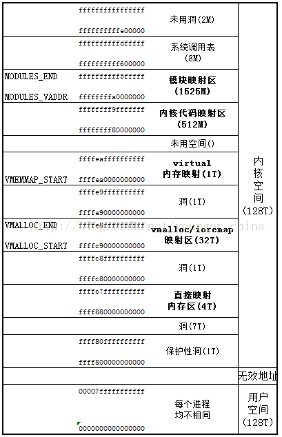

# 基础知识

本节我们介绍 Linux kernel pwn 所需要的基础知识，你可以看作简易的《操作系统导论》课程。

## Operating System Kernel

操作系统内核（Operation System Kernel）本质上也是一种软件，可以看作是普通应用程式与硬件之间的一层中间层，其主要作用便是调度系统资源、控制IO设备、操作网络与文件系统等，并为上层应用提供便捷、抽象的应用接口。


操作系统内核实际上是我们抽象出来的一个概念，本质上与用户进程一般无二，都是位于物理内存中的代码+数据，不同之处在于当CPU执行操作系统内核代码时通常运行在高权限，拥有着完全的硬件访问能力，而 CPU在执行用户态代码时通常运行在低权限环境，只拥有部分/缺失硬件访问能力。

这两种不同权限的运行状态实际上是通过硬件来实现的，因此这里我们开始引入新的一个概念——**分级保护环**。

## hierarchical protection domains

**分级保护域**（hierarchical protection domains）又被称作保护环，简称 Rings ，是一种将计算机不同的资源划分至不同权限的模型。

在一些硬件或者微代码级别上提供不同特权态模式的 CPU 架构上，保护环通常都是硬件强制的。Rings是从最高特权级（通常被叫作0级）到最低特权级（通常对应最大的数字）排列的。

Intel的CPU将权限分为四个等级：Ring0、Ring1、Ring2、Ring3，权限等级依次降低，现代操作系统模型中我们通常只会使用 ring0 和 ring3，对应操作系统内核与用户进程，即 CPU 在执行用户进程代码时处在 ring3 下。


现在我们给【用户态】与【内核态】这两个概念下定义：

- 用户态：CPU 运行在 ring3 + 用户进程运行环境上下文。
- 内核态：CPU 运行在 ring0 + 内核代码运行环境上下文。

## 状态切换

CPU 在不同的特权级间进行切换主要有两个途径：

- 中断与异常（interrupt & exception）：当 CPU 收到一个中断/异常时，会切换到 ring0，并根据中断描述符表索引对应的中断处理代码以执行。
- 特权级相关指令：当 CPU 运行这些指令时会发生运行状态的改变，例如 iret 指令（ring0->ring3）或是 sysenter 指令（ring3->ring0）。

基于这些特权级切换的方式，现代操作系统的开发者包装出了系统调用（syscall），作为由“用户态”切换到“内核态”的入口，从而执行内核代码来完成用户进程所需的一些功能。当用户进程想要请求更高权限的服务时，便需要通过由系统提供的应用接口，使用系统调用以陷入内核态，再由操作系统完成请求。

### user space to kernel space （系统调用）

当发生 `系统调用`，`产生异常`，`外设产生中断` 等事件时，会发生用户态到内核态的切换，进入到内核相对应的处理程序中进行处理。

系统调用是内核与用户通信的直接接口，因此我们主要关注用户空间比较常用的系统调用这一行为，其具体的过程为：

> 注意：当系统调用指令执行后，CPU 便进入内核态，以下操作在内核态完成。

1. 通过 `swapgs` 切换 GS 段寄存器，将 GS 寄存器值和一个特定位置的值进行交换，目的是保存 GS 值，同时将该位置的值作为内核执行时的 GS 值使用。
2. 将当前栈顶（用户空间栈顶）记录在 CPU 独占变量区域里，将 CPU 独占区域里记录的内核栈顶放入 rsp/esp。
3. 通过 push 保存各寄存器值，具体的 [代码](http://elixir.free-electrons.com/linux/v4.12/source/arch/x86/entry/entry_64.S) 如下:

	```asm
	 ENTRY(entry_SYSCALL_64)
	 /* SWAPGS_UNSAFE_STACK是一个宏，x86直接定义为swapgs指令 */
	 SWAPGS_UNSAFE_STACK
	
	 /* 保存栈值，并设置内核栈 */
	 movq %rsp, PER_CPU_VAR(rsp_scratch)
	 movq PER_CPU_VAR(cpu_current_top_of_stack), %rsp
	
	
	/* 通过push保存寄存器值，形成一个pt_regs结构 */
	/* Construct struct pt_regs on stack */
	pushq  $__USER_DS      /* pt_regs->ss */
	pushq  PER_CPU_VAR(rsp_scratch)  /* pt_regs->sp */
	pushq  %r11             /* pt_regs->flags */
	pushq  $__USER_CS      /* pt_regs->cs */
	pushq  %rcx             /* pt_regs->ip */
	pushq  %rax             /* pt_regs->orig_ax */
	pushq  %rdi             /* pt_regs->di */
	pushq  %rsi             /* pt_regs->si */
	pushq  %rdx             /* pt_regs->dx */
	pushq  %rcx tuichu    /* pt_regs->cx */
	pushq  $-ENOSYS        /* pt_regs->ax */
	pushq  %r8              /* pt_regs->r8 */
	pushq  %r9              /* pt_regs->r9 */
	pushq  %r10             /* pt_regs->r10 */
	pushq  %r11             /* pt_regs->r11 */
	sub $(6*8), %rsp      /* pt_regs->bp, bx, r12-15 not saved */
	```

4. 通过汇编指令判断是否为 `x32_abi`。
5. 通过系统调用号，跳到全局变量 `sys_call_table` 相应位置继续执行系统调用。

### kernel space to user space

退出时，流程如下：

1. 通过 `swapgs` 恢复 GS 值。
2. 通过 `sysretq` 或者 `iretq` 恢复到用户控件继续执行。如果使用 `iretq` 还需要给出用户空间的一些信息（CS, eflags/rflags, esp/rsp 等）。

## 虚拟内存空间

在现代操作系统中，计算机的虚拟内存地址空间通常被分为两块——供用户进程使用的用户空间（user space）与供操作系统内核使用的内核空间（kernel space），对于 Linux 而言，通常位于较高虚拟地址的虚拟内存空间被分配给内核使用，而位于较低虚拟地址的虚拟内存空间责备分配给用户进程使用。

32 位下的虚拟内存空间布局如下：


64 位下的虚拟内存空间布局如下：



## 进程权限管理

内核 kernel 调度着一切的系统资源，并为用户应用程式提供运行环境，相应地，应用程式的权限也都是由 kernel 进行管理的。

### 进程描述符（process descriptor）

在内核中使用结构体 `task_struct` 表示一个进程，该结构体定义于内核源码 `include/linux/sched.h` 中，代码比较长就不在这里贴出了。

一个进程描述符的结构应当如下图所示：


### 进程权限凭证（credential）

注意到 `task_struct` 的源码中有如下代码：

```c
/* Process credentials: */

/* Tracer's credentials at attach: */
const struct cred __rcu        *ptracer_cred;

/* Objective and real subjective task credentials (COW): */
const struct cred __rcu        *real_cred;

/* Effective (overridable) subjective task credentials (COW): */
const struct cred __rcu        *cred;
```

结构体 `cred` 用以管理一个进程的权限，该结构体定义于内核源码 `include/linux/cred.h` 中，如下：

```c
/*
 * The security context of a task
 *
 * The parts of the context break down into two categories:
 *
 *  (1) The objective context of a task.  These parts are used when some other
 *	task is attempting to affect this one.
 *
 *  (2) The subjective context.  These details are used when the task is acting
 *	upon another object, be that a file, a task, a key or whatever.
 *
 * Note that some members of this structure belong to both categories - the
 * LSM security pointer for instance.
 *
 * A task has two security pointers.  task->real_cred points to the objective
 * context that defines that task's actual details.  The objective part of this
 * context is used whenever that task is acted upon.
 *
 * task->cred points to the subjective context that defines the details of how
 * that task is going to act upon another object.  This may be overridden
 * temporarily to point to another security context, but normally points to the
 * same context as task->real_cred.
 */
struct cred {
	atomic_long_t	usage;
	kuid_t		uid;		/* real UID of the task */
	kgid_t		gid;		/* real GID of the task */
	kuid_t		suid;		/* saved UID of the task */
	kgid_t		sgid;		/* saved GID of the task */
	kuid_t		euid;		/* effective UID of the task */
	kgid_t		egid;		/* effective GID of the task */
	kuid_t		fsuid;		/* UID for VFS ops */
	kgid_t		fsgid;		/* GID for VFS ops */
	unsigned	securebits;	/* SUID-less security management */
	kernel_cap_t	cap_inheritable; /* caps our children can inherit */
	kernel_cap_t	cap_permitted;	/* caps we're permitted */
	kernel_cap_t	cap_effective;	/* caps we can actually use */
	kernel_cap_t	cap_bset;	/* capability bounding set */
	kernel_cap_t	cap_ambient;	/* Ambient capability set */
#ifdef CONFIG_KEYS
	unsigned char	jit_keyring;	/* default keyring to attach requested
					 * keys to */
	struct key	*session_keyring; /* keyring inherited over fork */
	struct key	*process_keyring; /* keyring private to this process */
	struct key	*thread_keyring; /* keyring private to this thread */
	struct key	*request_key_auth; /* assumed request_key authority */
#endif
#ifdef CONFIG_SECURITY
	void		*security;	/* LSM security */
#endif
	struct user_struct *user;	/* real user ID subscription */
	struct user_namespace *user_ns; /* user_ns the caps and keyrings are relative to. */
	struct ucounts *ucounts;
	struct group_info *group_info;	/* supplementary groups for euid/fsgid */
	/* RCU deletion */
	union {
		int non_rcu;			/* Can we skip RCU deletion? */
		struct rcu_head	rcu;		/* RCU deletion hook */
	};
} __randomize_layout;
```

一个cred结构体中记载了一个进程四种不同的用户ID，在通常情况下这几个ID应当都是相同的：

- 真实用户ID（real UID）：标识一个进程启动时的用户ID
- 保存用户ID（saved UID）：标识一个进程最初的有效用户ID
- 有效用户ID（effective UID）：标识一个进程正在运行时所属的用户ID，一个进程在运行途中是可以改变自己所属用户的，因而权限机制也是通过有效用户ID进行认证的，内核通过 euid 来进行特权判断；为了防止用户一直使用高权限，当任务完成之后，euid 会与 suid 进行交换，恢复进程的有效权限
- 文件系统用户ID（UID for VFS ops）：标识一个进程创建文件时进行标识的用户ID

用户组ID同样分为四个：真实组ID、保存组ID、有效组ID、文件系统组ID，与用户ID是类似的，这里便不再赘叙。

### 进程权限改变

前面我们讲到，一个进程的权限是由位于内核空间的 `cred` 结构体进行管理的，那么我们不难想到：只要改变一个进程的 `cred` 结构体，就能改变其执行权限。

在内核空间有如下两个函数，都位于 `kernel/cred.c` 中：

- `struct cred* prepare_kernel_cred(struct task_struct* daemon)`：该函数用以拷贝一个进程的cred结构体，并返回一个新的cred结构体，需要注意的是daemon参数应为有效的进程描述符地址。
- `int commit_creds(struct cred *new)`：该函数用以将一个新的cred结构体应用到进程。

## Loadable Kernel Modules(LKMs)

Linux Kernel采用的是宏内核架构，一切的系统服务都需要由内核来提供，虽然效率较高，但是缺乏可扩展性与可维护性，同时内核需要装载很多可能用到的服务，但这些服务最终可能未必会用到，还会占据大量内存空间，同时新服务的提供往往意味着要重新编译整个内核。

综合以上考虑，**可装载内核模块**（Loadable Kernel Modules，简称LKMs）出现了，位于内核空间的LKMs可以提供新的系统调用或其他服务，同时LKMs可以像积木一样被装载入内核/从内核中卸载，大大提高了kernel的可拓展性与可维护性。

常见的 LKMs 包括：

- 驱动程序（Device drivers）
	- 设备驱动
	- 文件系统驱动
	- ...
- 内核扩展模块 (modules)

LKMs 的文件格式和用户态的可执行程序相同，Linux 下为 ELF，Windows 下为 exe/dll，mac 下为 MACH-O，因此我们可以用 IDA 等工具来分析内核模块。

模块可以被单独编译，但不能单独运行。它在运行时被链接到内核作为内核的一部分在内核空间运行，这与运行在用户控件的进程不同。

模块通常用来实现一种文件系统、一个驱动程序或者其他内核上层的功能。

> Linux 内核之所以提供模块机制，是因为它本身是一个单内核 (monolithic kernel)。单内核的优点是效率高，因为所有的内容都集合在一起，但缺点是可扩展性和可维护性相对较差，模块机制就是为了弥补这一缺陷。

### 相关指令
- **insmod**: 讲指定模块加载到内核中
- **rmmod**: 从内核中卸载指定模块
- **lsmod**: 列出已经加载的模块
- **modprobe**: 添加或删除模块，modprobe 在加载模块时会查找依赖关系

> 大多数　CTF 中的 kernel vulnerability 也出现在 LKM 中。

## 内核交互

### 系统调用简介

系统调用，指的是用户空间的程序向操作系统内核请求需要更高权限的服务，比如 IO 操作或者进程间通信。系统调用提供用户程序与操作系统间的接口，部分库函数（如 scanf，puts 等 IO 相关的函数实际上是对系统调用的封装（read 和 write））。

> 在 */usr/include/x86_64-linux-gnu/asm/unistd_64.h* 和 */usr/include/x86_64-linux-gnu/asm/unistd_32.h* 分别可以查看 64 位和 32 位的系统调用号。

> 同时推荐一个很好用的网站 [Linux Syscall Reference](https://syscalls.kernelgrok.com)，可以查阅 32 位系统调用对应的寄存器含义以及源码。64位系统调用可以查看 [Linux Syscall64 Reference](https://syscalls64.paolostivanin.com/)

### 系统调用：ioctl

在 `*NIX` 中一切都可以被视为文件，因而一切都可以以访问文件的方式进行操作，为了方便，Linux 定义了系统调用 `ioctl` 供进程与设备之间进行通信。

`ioctl` 是一个专用于设备输入输出操作的一个系统调用，其调用方式如下：

```c
int ioctl(int fd, unsigned long request, ...)
```

其第一个参数为打开设备 (open) 返回的 [文件描述符](http://m4x.fun/post/play-with-file-descriptor-1/)，第二个参数为用户程序对设备的控制命令，再后边的参数则是一些补充参数，与设备有关。

对于一个提供了ioctl通信方式的设备而言，我们可以通过其文件描述符、使用不同的请求码及其他请求参数通过ioctl系统调用完成不同的对设备的I/O操作。

> 使用 ioctl 进行通信的原因：
>
> 操作系统提供了内核访问标准外部设备的系统调用，因为大多数硬件设备只能够在内核空间内直接寻址,但是当访问非标准硬件设备这些系统调用显得不合适,有时候用户模式可能需要直接访问设备。
>
> 比如，一个系统管理员可能要修改网卡的配置。现代操作系统提供了各种各样设备的支持，有一些设备可能没有被内核设计者考虑到，如此一来提供一个这样的系统调用来使用设备就变得不可能了。 
>
> 为了解决这个问题，内核被设计成可扩展的，可以加入一个称为设备驱动的模块，驱动的代码允许在内核空间运行而且可以对设备直接寻址。一个Ioctl接口是一个独立的系统调用，通过它用户空间可以跟设备驱动沟通。对设备驱动的请求是一个以设备和请求号码为参数的Ioctl调用，如此内核就允许用户空间访问设备驱动进而访问设备而不需要了解具体的设备细节，同时也不需要一大堆针对不同设备的系统调用。

## 常见内核态函数

在内核当中我们无法使用用户态的 C 库中的函数，内核自己有着对应的各种函数，其中常用的功能函数如下：

- printf()		->		**printk()**，但需要注意的是 printk() 不一定会把内容显示到终端上，但一定在内核缓冲区里，可以通过 `dmesg` 查看效果
- memcpy()		->		**copy\_from\_user()/copy\_to\_user()**
	- copy\_from\_user() 实现了将用户空间的数据传送到内核空间
	- copy\_to\_user() 实现了将内核空间的数据传送到用户空间
- malloc()		->		**kmalloc()**，内核态的内存分配函数，和 malloc() 相似，但使用的是 `slab/slub 分配器`
- free()		->		**kfree()**，同 kmalloc()

此外，`kernel 管理进程，因此 kernel 也记录了进程的权限`。kernel 中有两个可以方便的改变权限的函数：

- **int commit_creds(struct cred \*new)**
- **struct cred\* prepare_kernel_cred(struct task_struct\* daemon)**

从函数名也可以看出，执行 `commit_creds(prepare_kernel_cred(&init_task))` 即可获得 root 权限，即拷贝 init 进程的 cred 作为当前进程的新的 credentials。

> 更多关于 `prepare_kernel_cred` 的信息可以参考 [源码](https://elixir.bootlin.com/linux/v4.6/source/kernel/cred.c#L594)

执行 `commit_creds(prepare_kernel_cred(&init_task))` 也是最常用的提权手段，这些函数与变量的地址都可以在 `/proc/kallsyms` 中查看（较老的内核版本中是 `/proc/ksyms`），该文件的内容通常需要 root 权限才能正确查看。

```shell
$ sudo cat /proc/kallsyms | grep "T commit_creds"
ffffffffbb11ab20 T commit_creds
$ sudo cat /proc/kallsyms | grep "T prepare_kernel_cred"
ffffffffbb11b080 T prepare_kernel_cred
$ sudo cat /proc/kallsyms | grep "D init_cred"
ffffffffbce58840 D init_cred
```

## Mitigation

与一般的程序相同，Linux Kernel同样有着各种各样的保护机制。

> canary, dep, PIE, RELRO 等保护与用户态原理和作用相同。

### 通用保护机制

#### KASLR

KASLR即```内核空间地址随机化```（kernel address space layout randomize），与用户态程序的ASLR相类似——在内核镜像映射到实际的地址空间时加上一个偏移值（粒度为 256MB），但是内核内部的相对偏移其实还是不变的。

在未开启KASLR保护机制时，内核代码段的基址为 ```0xffffffff81000000``` ，direct mapping area 的基址为 `0xffff888000000000`。

内核内存布局可以参考[这里](https://elixir.bootlin.com/linux/v6.3/source/Documentation/x86/x86_64/mm.rst)。

#### _*FGKASLR_

KASLR 虽然在一定程度上能够缓解攻击，但是若是攻击者通过一些信息泄露漏洞获取到内核中的某个地址，仍能够直接得知内核加载地址偏移从而得知整个内核地址布局，因此有研究者基于 KASLR 实现了 FGKASLR，**以函数粒度重新排布内核代码**。

#### STACK PROTECTOR

类似于用户态程序的 canary，通常又被称作是 stack cookie，用以检测**是否发生内核堆栈溢出**，若是发生内核堆栈溢出则会产生 kernel panic。

内核中的 canary 的值通常取自 gs 段寄存器某个固定偏移处的值。

#### SMAP/SMEP

SMAP即```管理模式访问保护```（Supervisor Mode Access Prevention），SMEP即```管理模式执行保护```（Supervisor Mode Execution Prevention），这两种保护通常是同时开启的，用以阻止**内核空间直接访问/执行用户空间的数据**，完全地将内核空间与用户空间相分隔开，用以防范ret2usr（return-to-user，将内核空间的指令指针重定向至用户空间上构造好的提权代码）攻击。

SMEP保护的绕过有以下两种方式：

- 利用内核线性映射区对物理地址空间的完整映射，找到用户空间对应页框的内核空间地址，利用该内核地址完成对用户空间的访问（即一个内核空间地址与一个用户空间地址映射到了同一个页框上），这种攻击手法称为 ret2dir 。
- Intel下系统根据CR4控制寄存器的第20位标识是否开启SMEP保护（1为开启，0为关闭），若是能够通过kernel ROP改变CR4寄存器的值便能够关闭SMEP保护，完成SMEP-bypass，接下来就能够重新进行 ret2usr，**但对于开启了 KPTI 的内核而言，内核页表的用户地址空间无执行权限，这使得 ret2usr 彻底成为过去式** 。

>  在 ARM 下有一种类似的保护叫 `PXN`。

#### [KPTI](https://www.kernel.org/doc/html/latest/x86/pti.html)

KPTI即 `内核页表隔离`（Kernel page-table isolation），内核空间与用户空间分别使用两组不同的页表集，这对于内核的内存管理产生了根本性的变化。

需要进行说明的是，**在这两张页表上都有着对用户内存空间的完整映射，但在用户页表中只映射了少量的内核代码（例如系统调用入口点、中断处理等），而只有在内核页表中才有着对内核内存空间的完整映射，但两张页表都有着对用户内存空间的完整映射**，如下图所示，左侧是未开启 KPTI 后的页表布局，右侧是开启了 KPTI 后的页表布局。


KPTI 的发明主要是用来修复一个史诗级别的 CPU 硬件漏洞：Meltdown。简单理解就是利用 CPU 流水线设计中（乱序执行与预测执行）的漏洞来获取到用户态无法访问的内核空间的数据，属于侧信道攻击的一种。

**KPTI 同时还令内核页表中属于用户地址空间的部分不再拥有执行权限，这使得 ret2usr 彻底成为过去式**。

### 内核“堆”上保护机制

#### Hardened Usercopy

hardened usercopy 是用以在用户空间与内核空间之间拷贝数据时进行越界检查的一种防护机制，**主要检查拷贝过程中对内核空间中数据的读写是否会越界**：

- 读取的数据长度是否超出源 object 范围。
- 写入的数据长度是否超出目的 object 范围。

这一保护被用于 `copy_to_user()` 与 `copy_from_user()` 等数据交换 API 中，不过这种保护 _不适用于内核空间内的数据拷贝_ ，这也是目前主流的绕过手段。

#### Hardened freelist

类似于 glibc 2.32 版本引入的保护，在开启这种保护之前，slub 中的 free object 的 next 指针直接存放着 next free object 的地址，攻击者可以通过读取 freelist 泄露出内核线性映射区的地址，在开启了该保护之后 free object 的 next 指针存放的是由以下三个值进行异或操作后的值：

- 当前 free object 的地址。
- 下一个 free object 的地址。
- 由 kmem\_cache 指定的一个 random 值。

攻击者至少需要获取到第一与第三个值才能篡改 freelist，这无疑为对 freelist 的直接利用增添不少难度。

> 在更新版本的 Linux kernel 中似乎还引入了一个偏移值，笔者尚未进行考证。

#### Random freelist

这种保护主要发生在 slub allocator 向 buddy system 申请到页框之后的处理过程中，对于未开启这种保护的一张完整的 slub，其上的 object 的连接顺序是线性连续的，但在开启了这种保护之后其上的 object 之间的连接顺序是随机的，这让攻击者无法直接预测下一个分配的 object 的地址。

需要注意的是这种保护发生在**slub allocator 刚从 buddy system 拿到新 slub 的时候，运行时 freelist 的构成仍遵循 LIFO**。


#### CONFIG\_INIT\_ON\_ALLOC\_DEFAULT\_ON

当编译内核时开启了这个选项时，在内核进行“堆内存”分配时（包括 buddy system 和 slab allocator），**会将被分配的内存上的内容进行清零**，从而防止了利用未初始化内存进行数据泄露的情况。

> 据悉性能损耗在 `1%~7%` 之间。

## CTF kernel pwn 相关

传统的 kernel pwn 题目通常会给以下三个文件：

1. boot.sh: 一个用于启动 kernel 的 shell 的脚本，多用 qemu，保护措施与 qemu 不同的启动参数有关
2. bzImage: compressed kernel binary
3. rootfs.cpio: 文件系统映像

这里我们以 CISCN2017 - babydriver 为例：
	
	```bash
	CISCN2017_babydriver [master●] ls
	babydriver.tar
	CISCN2017_babydriver [master●] x babydriver.tar
	boot.sh
	bzImage
	rootfs.cpio
	CISCN2017_babydriver [master●] ls
	babydriver.tar  boot.sh  bzImage  rootfs.cpio
	CISCN2017_babydriver [master●] file bzImage
	bzImage: Linux kernel x86 boot executable bzImage, version 4.4.72 (atum@ubuntu) #1 SMP Thu Jun 15 19:52:50 PDT 2017, RO-rootFS, swap_dev 0x6, Normal VGA
	CISCN2017_babydriver [master●] file rootfs.cpio
	rootfs.cpio: gzip compressed data, last modified: Tue Jul  4 08:39:15 2017, max compression, from Unix, original size 2844672
	CISCN2017_babydriver [master●] file boot.sh
	boot.sh: Bourne-Again shell script, ASCII text executable
	CISCN2017_babydriver [master●] bat boot.sh 
	───────┬─────────────────────────────────────────────────────────────────────────────────
	       │ File: boot.sh
	───────┼─────────────────────────────────────────────────────────────────────────────────
	   1   │ #!/bin/bash
	   2   │ 
	   3   │ qemu-system-x86_64 -initrd rootfs.cpio -kernel bzImage -append 'console=ttyS0 ro
	       │ ot=/dev/ram oops=panic panic=1' -enable-kvm -monitor /dev/null -m 64M --nographi
	       │ c  -smp cores=1,threads=1 -cpu kvm64,+smep
	───────┴─────────────────────────────────────────────────────────────────────────────────
	```

其中主要的 qemu 参数含义如下：
	
- -initrd rootfs.cpio，使用 rootfs.cpio 作为内核启动的文件系统
- -kernel bzImage，使用 bzImage 作为 kernel 映像
- -cpu kvm64,+smep，设置 CPU 的安全选项，这里开启了 smep
- -m 64M，设置虚拟 RAM 为 64M，默认为 128M

其他的 qemu 参数可以通过 --help 查看。

### 在远程题目环境中进行利用

通常情况下我们需要将在本地编写好的 exploit 程序进行静态编译并传输到远程，比较通用的办法便是将 exploit 进行 base64 编码后传输，可参考如下脚本：

```python
from pwn import *
import base64
#context.log_level = "debug"

with open("./exp", "rb") as f:
    exp = base64.b64encode(f.read())

p = remote("127.0.0.1", 11451)
#p = process('./run.sh')
p.sendline()
p.recvuntil("/ $")

count = 0
for i in range(0, len(exp), 0x200):
    p.sendline("echo -n \"" + exp[i:i + 0x200].decode() + "\" >> /tmp/b64_exp")
    count += 1
    log.info("count: " + str(count))

for i in range(count):
    p.recvuntil("/ $")
    
p.sendline("cat /tmp/b64_exp | base64 -d > /tmp/exploit")
p.sendline("chmod +x /tmp/exploit")
p.sendline("/tmp/exploit ")

p.interactive()
```
相比起常规的 pwn 题，kernel pwn 打远程会是一个比较漫长的过程，因为大部分的时间都会花在这个文件传输上。我们可以使用 musl-C、uclibc 等库来大幅降低可执行文件的大小，对于时间比较充足的题目也可以使用纯汇编来编写 exp。

## Reference

[【OS.0x00】Linux Kernel I：Basic Knowledge](https://arttnba3.cn/2021/02/21/OS-0X00-LINUX-KERNEL-PART-I/)

[【PWN.0x00】Linux Kernel Pwn I：Basic Exploit to Kernel Pwn in CTF](https://arttnba3.cn/2021/03/03/PWN-0X00-LINUX-KERNEL-PWN-PART-I/)

[Linux kernel heap feng shui in 2022](https://duasynt.com/blog/linux-kernel-heap-feng-shui-2022)

https://zh.wikipedia.org/wiki/内核

https://zh.wikipedia.org/wiki/分级保护域

https://zh.wikipedia.org/wiki/Ioctl

http://www.freebuf.com/articles/system/54263.html

https://blog.csdn.net/zqixiao_09/article/details/50839042

https://yq.aliyun.com/articles/53679

