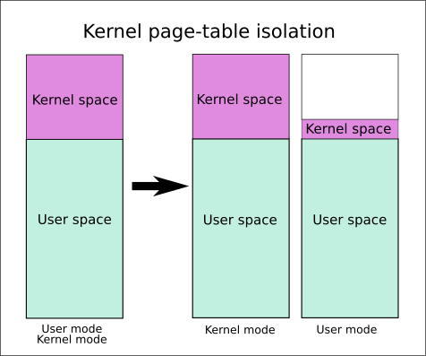

# KPTI - Kernel Page Table Isolation

## 介绍

KPTI 机制最初的主要目的是为了缓解 KASLR 的绕过以及 CPU 侧信道攻击。

在 KPTI 机制中，内核态空间的内存和用户态空间的内存的隔离进一步得到了增强。

- 内核态中的页表包括用户空间内存的页表和内核空间内存的页表。
- 用户态的页表只包括用户空间内存的页表以及必要的内核空间内存的页表，如用于处理系统调用、中断等信息的内存。



在 x86_64 的 PTI 机制中，内核态的用户空间内存映射部分被全部标记为不可执行。也就是说，之前不具有 SMEP 特性的硬件，如果开启了 KPTI 保护，也具有了类似于 SMEP 的特性。此外，SMAP 模拟也可以以类似的方式引入，只是现在还没有引入。因此，在目前开启了 KPTI 保护的内核中，如果没有开启 SMAP 保护，那么内核仍然可以访问用户态空间的内存，只是不能跳转到用户态空间执行 Shellcode。

Linux 4.15 中引入了 KPTI 机制，并且该机制被反向移植到了 Linux 4.14.11，4.9.75，4.4.110。

## 发展历史

TODO。

## 实现

TODO。

## 开启与关闭

如果是使用 qemu 启动的内核，我们可以在 `-append` 选项中添加 `kpti=1` 来开启 KPTI。

如果是使用 qemu 启动的内核，我们可以在 `-append` 选项中添加 `nopti` 来关闭 KPTI。

## 状态查看

我们可以通过以下两种方式来查看 KPTI 机制是否开启。

```shell
/home/pwn # dmesg | grep 'page table'
[    0.000000] Kernel/User page tables isolation: enabled
/home/pwn # cat /proc/cpuinfo | grep pti
fpu_exception   : yes
flags           : ... pti smep smap
```

## Attack KPTI

KPTI 机制和 SMAP 、SMEP不太一样，由于与源码紧密结合，似乎没有办法在运行时刻关闭。

### 修改页表

在开启 KPTI 后，用户态空间的所有数据都被标记了 NX 权限，但是，我们可以考虑修改对应的页表权限，使其拥有可执行权限。当内核没有开启 smep 权限时，我们在修改了页表权限后就可以返回到用户态，并执行用户态的代码。

### SWITCH_TO_USER_CR3_STACK

在开启 KPTI 机制后，用户态进入到内核态时，会进行页表切换；当从内核态恢复到用户态时，也会进行页表切换。那么如果我们可以控制内核执行返回用户态时所执行的切换页表的代码片段，也就可以正常地返回到用户态。

通过分析内核态到用户态切换的代码，我们可以得知，页表的切换主要靠`SWITCH_TO_USER_CR3_STACK` 汇编宏。因此，我们只需要能够调用这部分代码即可。

```assembly
.macro SWITCH_TO_USER_CR3_STACK	scratch_reg:req
	pushq	%rax
	SWITCH_TO_USER_CR3_NOSTACK scratch_reg=\scratch_reg scratch_reg2=%rax
	popq	%rax
.endm
.macro SWITCH_TO_USER_CR3_NOSTACK scratch_reg:req scratch_reg2:req
	ALTERNATIVE "jmp .Lend_\@", "", X86_FEATURE_PTI
	mov	%cr3, \scratch_reg

	ALTERNATIVE "jmp .Lwrcr3_\@", "", X86_FEATURE_PCID

	/*
	 * Test if the ASID needs a flush.
	 */
	movq	\scratch_reg, \scratch_reg2
	andq	$(0x7FF), \scratch_reg		/* mask ASID */
	bt	\scratch_reg, THIS_CPU_user_pcid_flush_mask
	jnc	.Lnoflush_\@

	/* Flush needed, clear the bit */
	btr	\scratch_reg, THIS_CPU_user_pcid_flush_mask
	movq	\scratch_reg2, \scratch_reg
	jmp	.Lwrcr3_pcid_\@

.Lnoflush_\@:
	movq	\scratch_reg2, \scratch_reg
	SET_NOFLUSH_BIT \scratch_reg

.Lwrcr3_pcid_\@:
	/* Flip the ASID to the user version */
	orq	$(PTI_USER_PCID_MASK), \scratch_reg

.Lwrcr3_\@:
	/* Flip the PGD to the user version */
	orq     $(PTI_USER_PGTABLE_MASK), \scratch_reg
	mov	\scratch_reg, %cr3
.Lend_\@:
.endm
```

事实上，我们不仅希望切换页表，还希望能够返回到用户态，因此我们这里也需要复用内核中返回至用户态的代码。内核返回到用户态主要有两种方式：iret 和 sysret。下面详细介绍。

#### iret

```assembly
SYM_INNER_LABEL(swapgs_restore_regs_and_return_to_usermode, SYM_L_GLOBAL)
#ifdef CONFIG_DEBUG_ENTRY
	/* Assert that pt_regs indicates user mode. */
	testb	$3, CS(%rsp)
	jnz	1f
	ud2
1:
#endif
	POP_REGS pop_rdi=0

	/*
	 * The stack is now user RDI, orig_ax, RIP, CS, EFLAGS, RSP, SS.
	 * Save old stack pointer and switch to trampoline stack.
	 */
	movq	%rsp, %rdi
	movq	PER_CPU_VAR(cpu_tss_rw + TSS_sp0), %rsp
	UNWIND_HINT_EMPTY

	/* Copy the IRET frame to the trampoline stack. */
	pushq	6*8(%rdi)	/* SS */
	pushq	5*8(%rdi)	/* RSP */
	pushq	4*8(%rdi)	/* EFLAGS */
	pushq	3*8(%rdi)	/* CS */
	pushq	2*8(%rdi)	/* RIP */

	/* Push user RDI on the trampoline stack. */
	pushq	(%rdi)

	/*
	 * We are on the trampoline stack.  All regs except RDI are live.
	 * We can do future final exit work right here.
	 */
	STACKLEAK_ERASE_NOCLOBBER

	SWITCH_TO_USER_CR3_STACK scratch_reg=%rdi

	/* Restore RDI. */
	popq	%rdi
	SWAPGS
	INTERRUPT_RETURN

```

可以看到，通过伪造如下的栈，然后跳转到 `movq	%rsp, %rdi`，我们就可以同时切换页表和返回至用户态。

```
fake rax
fake rdi
RIP
CS
EFLAGS
RSP
SS
```

#### sysret

在使用 sysret 时，我们首先需要确保 rcx 和 r11 为如下的取值

```
rcx, save the rip of the code to be executed when returning to userspace
r11, save eflags
```

然后构造如下的栈

```
fake rdi
rsp, the stack of the userspace
```

最后跳转至 entry_SYSCALL_64 的如下代码，即可返回到用户态。

```assembly
	SWITCH_TO_USER_CR3_STACK scratch_reg=%rdi

	popq	%rdi
	popq	%rsp
	swapgs
	sysretq
```

### signal handler

我们也可以考虑在用户态注册 signal handler 来执行位于用户态的代码。在这种方式下，我们无需切换页表。

## 参考

- https://github.com/pr0cf5/kernel-exploit-practice/tree/master/bypass-smep#bypassing-smepkpti-via-rop
- https://outflux.net/blog/archives/2018/02/05/security-things-in-linux-v4-15/