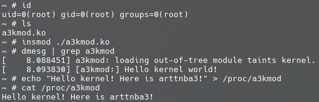

# 编写一个 Loadable Kernel Module

本节我们主要讲述如何开发一个简单的可装载内核模块（Loadable Kernel Module），包括如何与用户态进行交互。

## 基本的内核模块

我们首先写一个基础的内核模块，源码文件结构组织如下：

```shell
$ tree .
.
├── Makefile
└── src
    ├── Kbuild
    └── main.c

2 directories, 3 files
```

main.c 的内容如下，其定义了一个初始化函数`a3kmod_init()` ，该函数会在模块载入时被调用，同时其定义了一个退出函数 `a3kmod_exit()` ，该函数会在模块被卸载时被调用：

```c
/**
 * Copyright (c) 2025 arttnba3 <arttnba@gmail.com>
 * 
 * This work is licensed under the terms of the GNU GPL, version 2 or later.
**/

#include <linux/kernel.h>
#include <linux/module.h>
#include <linux/init.h>

static __init int a3kmod_init(void)
{
    printk(KERN_INFO "[a3kmod:] Hello kernel world!\n");
    return 0;
}

static __exit void a3kmod_exit(void)
{
    printk(KERN_INFO "[a3kmod:] Goodbye kernel world!\n");
}

module_init(a3kmod_init);
module_exit(a3kmod_exit);
MODULE_AUTHOR("arttnba3");
MODULE_LICENSE("GPL v2");
```

### Kbuild 构建系统

[Kbuild](https://docs.kernel.org/kbuild/kbuild.html) 是 Linux kernel 构建系统的一部分，简而言之，当我们在源码目录下编写了 `Kbuild` 文件之后，在编译时 Linux kernel 的编译基础设施便会根据 `Kbuild` 来自动地编译好我们的内核模块，若没有 `Kbuild` 则会选择寻找 `Makefile` 。

下面是一个最基础的 Kbuild 文件的示例，语法上有点类似于 Makefile：

```makefile
# module name
MODULE_NAME ?= a3kmod
obj-m += $(MODULE_NAME).o

# compiler flags
ccflags-y += -I$(src)/include

# entry point
$(MODULE_NAME)-y += main.o
```

各符号说明如下：

- `MODULE_NAME` ：一个简单的自定义变量，我们用来定义我们的模块名。

- `obj-m` ：这个符号用来指定要被编译的内核模块列表，`+=` 意味着添加上我们的内核模块，而 `$(MODULE_NAME).o` 则是我们的内核模块编译的后期产物，这通常由单个或多个目标文件合并而成，最后会被链接为 `$(MODULE_NAME).ko` 文件，也就是我们所熟悉的 LKM ELF；如果要将模块编译进内核 ELF 文件（vmlinux）中，则应当使用 `obj-y`。

- `ccflags-y` ：`ccflags` 意味着编译选项，`-y` 意味着开启的编译选项，这里我们添加了 `-I` 选项以引入我们自己的头文件目录（只是作为示范，本节实际上不涉及复杂代码结构），更多编译选项可以参见 [GCC 的文档](https://gcc.gnu.org/onlinedocs/gcc/Invoking-GCC.html)。

- `$(MODULE_NAME)-y` ：`$(MODULE_NAME).o`所需要的目标文件，`-y` 意味着编译过程需要该文件，这里我们加入了一个 `main.o` ，意味着我们的源码目录下应当有一个 `main.c`。

相应地，由于我们已经在 Kbuild 当中指示了模块的构建行为，我们只需要在源码根目录的 Makefile 当中写入通用性内容，这里我们的 Makefile 写入如下：

```makefile
# SPDX-License-Identifier: GPL-2.0
# Copyright (c) 2025 arttnba3 <arttnba@gmail.com>

A3KMOD_ROOT_DIR=$(shell pwd)
A3KMOD_SRC_DIR=$(A3KMOD_ROOT_DIR)/src
LINUX_KERNEL_SRC=/lib/modules/$(shell uname -r)/build

all:
	@$(MAKE) -C $(LINUX_KERNEL_SRC) M=$(A3KMOD_SRC_DIR) modules

clean:
	@$(MAKE) -C $(LINUX_KERNEL_SRC) M=$(A3KMOD_SRC_DIR) clean

.PHONY: clean

```

简要说明如下（想更详细了解可自行深入学习 Makefile 语法）：

- `A3KMOD_ROOT_DIR` 、 `A3KMOD_SRC_DIR` ：这些变量指定了源码目录为当前目录下的 `src` 文件夹，`$(shell pwd)` 意味着其值为 `pwd` 命令的结果。
- `LINUX_KERNEL_SRC` ：这个变量指定了 Linux 内核源码目录，对于绝大多数 Linux 发行版而言，在安装了相应的软件包（例如 `linux-headers` ）后，在 `/lib/modules/$(shell uname -r)/build` 目录下都会存放着当前所用内核的源码以及编译系统文件，其中 `$(shell uname -r)` 意味着其值为 `uname -r` 的结果。
- `all:` ：名为 `all` 的标签，在执行 `make all` 时会执行该标签下的命令，由于这是 Makefile 中的第一个命令，所以直接执行 `make` 默认会运行该命令。
    - `@$(MAKE)` ：`@$(MAKE)` 指定了使用当前环境中的 `MAKE` 命令（这意味着我们在运行 `make` 命令时可以可以通过指定 `MAKE=` 更改其路径，默认值是 `make` ）。
    - ` -C $(LINUX_KERNEL_SRC)` ：make 指令进入到内核源码目录进行。
    - `modules` ：执行内核源码 Makefile 中的 `modules` 项，意味着进行内核模块编译行为。
    - `M=$(A3KMOD_SRC_DIR)`：指定参数 `M` 的值，对 `modules` 项而言代表要编译的内核模块的源码路径。
- `clean:` ：和 `all` 标签传递的基本一致，不同在于最后执行的行为是 `clean` ，意味着清理编译产物。
- `.PHONY`：“伪目标”，即相比同名文件而言优先找 Makefile 中的标签定义，这里将 `clean` 标签声明为伪目标。

### 编译内核模块

完成这些之后，我们便能开始编译内核模块了，我们只需要运行如下命令：

```shell
$ make -j$(nproc) all
```

如果你使用的是自行下载编译的内核源码，则在编译内核模块之前，你还需要在内核源码目录下先执行该命令：

```shell
$ make -j$(nproc) modules
```

### 内核模块的载入与卸载

我们可以通过 `insmod` 命令直接载入一个内核模块：

```shell
$ sudo insmod a3kmod.ko
```

类似地，我们可以使用 `rmmod` 命令卸载一个内核模块：

```shell
$ sudo rmmod a3kmod
```

## 提供用户态接口

接下来我们为我们的内核模块添加可供用户态应用程序交互的方式，一个比较常见的方式是我们的内核模块在载入后创建一个虚拟文件节点，用户态应用程序打开该节点后通过 `read()` 、 `write()` 、 `ioctl()` 等系统调用进行交互。

本节我们简单介绍如何创建一个可供用户态交互的 procfs （ Process file system ）的文件节点。

### 文件节点交互

我们的文件节点支持通过 `read()` 、 `write()` 、 `ioctl()` 等系统调用进行交互，而这实际上需要我们在内核空间当中定义相应的操作函数。对于 procfs 而言，其支持的操作通过 `struct proc_ops` 这一函数表进行定义：

```c
struct proc_ops {
	unsigned int proc_flags;
	int	(*proc_open)(struct inode *, struct file *);
	ssize_t	(*proc_read)(struct file *, char __user *, size_t, loff_t *);
	ssize_t (*proc_read_iter)(struct kiocb *, struct iov_iter *);
	ssize_t	(*proc_write)(struct file *, const char __user *, size_t, loff_t *);
	/* mandatory unless nonseekable_open() or equivalent is used */
	loff_t	(*proc_lseek)(struct file *, loff_t, int);
	int	(*proc_release)(struct inode *, struct file *);
	__poll_t (*proc_poll)(struct file *, struct poll_table_struct *);
	long	(*proc_ioctl)(struct file *, unsigned int, unsigned long);
#ifdef CONFIG_COMPAT
	long	(*proc_compat_ioctl)(struct file *, unsigned int, unsigned long);
#endif
	int	(*proc_mmap)(struct file *, struct vm_area_struct *);
	unsigned long (*proc_get_unmapped_area)(struct file *, unsigned long, unsigned long, unsigned long, unsigned long);
} __randomize_layout;
```

这里我们简单地为 `proc_read()` 与 `proc_write()` 实现对应的函数原型，其功能为拷贝数据到用户进程以及从用户进程读取数据，并将函数指针放入我们的 `proc_ops` 中：

```c
#include <linux/proc_fs.h>

#define A3KMOD_BUF_SZ 0x1000
static char a3kmod_buf[A3KMOD_BUF_SZ] = { 0 };

static ssize_t a3kmod_proc_read
(struct file *file, char __user *ubuf, size_t size, loff_t *ppos)
{
    ssize_t err;
    size_t end_loc, copied;

    end_loc = size + (*ppos);
    if (end_loc < size || (*ppos) > A3KMOD_BUF_SZ) {
        return -EINVAL;
    }

    if (end_loc > A3KMOD_BUF_SZ) {
        end_loc = A3KMOD_BUF_SZ;
    }

    copied = end_loc - (*ppos);
    if (copied == 0) {
        return 0;   // EOF
    }

    err = copy_to_user(ubuf, &a3kmod_buf[*ppos], copied);
    if (err != 0) {
        return err;
    }

    *ppos = end_loc;

    return copied;
}

static ssize_t a3kmod_proc_write
(struct file *file, const char __user *ubuf, size_t size, loff_t *ppos)
{
    ssize_t err;
    size_t end_loc, copied;

    end_loc = size + (*ppos);
    if (end_loc < size || (*ppos) > A3KMOD_BUF_SZ) {
        return -EINVAL;
    }

    if (end_loc > A3KMOD_BUF_SZ) {
        end_loc = A3KMOD_BUF_SZ;
    }

    copied = end_loc - (*ppos);
    if (copied == 0) {
        return 0;   // EOF
    }

    err = copy_from_user(&a3kmod_buf[*ppos], ubuf, copied);
    if (err != 0) {
        return err;
    }

    *ppos = end_loc;

    return copied;
}

static struct proc_ops a3kmod_proc_ops = {
    .proc_read = a3kmod_proc_read,
    .proc_write = a3kmod_proc_write,
};
```

### 创建文件节点

我们在模块初始化函数中调用 `proc_create()` 创建我们的 procfs 文件节点，各个参数分别指定了节点名、权限、父节点（为 NULL 则挂到 procfs 的根节点）、函数表，并在模块卸载时销毁该节点：

```c
static struct proc_dir_entry *a3kmod_proc_dir_entry;

static __init int a3kmod_init(void)
{
    printk(KERN_INFO "[a3kmod:] Hello kernel world!\n");
    a3kmod_proc_dir_entry = proc_create("a3kmod", 0666, NULL, &a3kmod_proc_ops);
    if (IS_ERR(a3kmod_proc_dir_entry)) {
        return PTR_ERR(a3kmod_proc_dir_entry);
    }

    return 0;
}

static __exit void a3kmod_exit(void)
{
    printk(KERN_INFO "[a3kmod:] Goodbye kernel world!\n");
    proc_remove(a3kmod_proc_dir_entry);
}
```

最后照常编译载入即可，在我们的 QEMU 环境中运行的效果如下图所示：



## Reference

- https://arttnba3.cn/2021/02/21/OS-0X01-LINUX-KERNEL-PART-II/
- https://arttnba3.cn/2025/01/12/DEV-0X01-LKM_WITH_KBUILD_DKMS/
