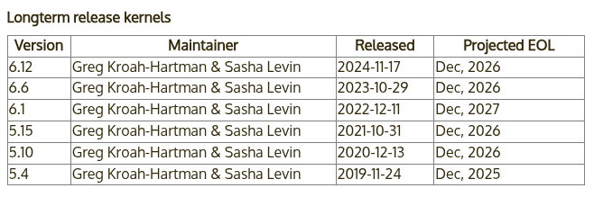

# 内核源码下载与编译

要完成对 Linux 内核的漏洞利用与调试等，我们首先需要搭建一个可用的 Linux 运行环境。本节主要讲述如何获取内核源码并编译生成内核镜像文件（bzImage），我们将在下一节讲述如何利用 bzImage 和 BusyBox 搭起一个简易的运行环境。

## 下载内核源码

[The Linux Kernel Archives](https://www.kernel.org) 为我们提供了原始的主线内核不同版本的源代码，我们可以在该网站上下载自己所需要的版本的内核源码，或是在不同的镜像站中获取，例如[清华大学开源软件镜像站](https://mirrors.tuna.tsinghua.edu.cn/kernel/)便提供了不同版本的内核源码。

根据 [Archive kernel releases](https://www.kernel.org/category/releases.html)，我们可以知道内核主要有以下几种类别：

- Prepatch (RC) ：主线内核的预发布版本，包含了最新的待测试的内核特性，由 Linus Torvalds 维护。
- Mainline：主线内核版本，RC 版本的新特性经过测试后便会合并到主线，每9～10周发一个版本，由 Linus Torvalds 维护。
- Stable：主线内核发布后便会变为 Stable 状态，其仅会被 stable kernel 维护者从主线树后向移植一些漏洞修复，直到下个内核版本释出。Stable kernel 根据需要进行更新，通常是一周一次。
- Longterm：部分内核版本会被选作长期支持版（LTS），相比起 Stable 内核有着更久的支持时长，通常仅会被后向移植重要的漏洞修复，且更新周期较慢（尤其是对于更老的版本）。

这里我们选择最近的 Longterm 版本的内核 `6.12`，其由 `Greg Kroah-Hartman & Sasha Levin` 进行维护，发行日期为 `2024-11-17`，计划将在 `Dec, 2026` 结束支持。

> 这里我们可以注意到内核团队会在同一时间段统一停止对一批 LTS 版本内核的支持，而非每个 LTS 版本都有着相同长度的生命周期。



我们选择下载与编译最新的 LTS 版本 `6.12.16` ，该版本于 `2025-02-21` 发布。为了加速下载进程，我们选择使用清华的镜像站进行下载，并进行解压：

```shell
$ wget https://mirrors.tuna.tsinghua.edu.cn/kernel/v6.x/linux-6.12.16.tar.xz
--2025-02-27 12:39:53--  https://mirrors.tuna.tsinghua.edu.cn/kernel/v6.x/linux-6.12.16.tar.xz
Resolving mirrors.tuna.tsinghua.edu.cn... 2402:f000:1:400::2, 101.6.15.130
Connecting to mirrors.tuna.tsinghua.edu.cn|2402:f000:1:400::2|:443... connected.
HTTP request sent, awaiting response... 200 OK
Length: 147993844 (141M) [application/octet-stream]
Saving to: ‘linux-6.12.16.tar.xz’

linux-6.12.16.tar.xz        100%[=========================================>] 141.14M  3.86MB/s    in 42s     

2025-02-27 12:40:37 (3.33 MB/s) - ‘linux-6.12.16.tar.xz’ saved [147993844/147993844]

$ unxz ./linux-6.12.16.tar.xz
```

## 验证内核签名

为了防止内核被恶意修改，内核团队提供了签名校验，在发布内核时，发布者会对内核进行签名。因此为了校验，我们首先需要导入内核维护者的公钥，这里我们选择导入 Linus Torvalds 和 Greg Kroah-Hartman 的公钥：

```shell
$ gpg2 --locate-keys torvalds@kernel.org gregkh@kernel.org
pub   rsa4096 2011-09-23 [SC]
      647F28654894E3BD457199BE38DBBDC86092693E
uid           [ unknown] Greg Kroah-Hartman <gregkh@kernel.org>
sub   rsa4096 2011-09-23 [E]

pub   rsa2048 2011-09-20 [SC]
      ABAF11C65A2970B130ABE3C479BE3E4300411886
uid           [ unknown] Linus Torvalds <torvalds@kernel.org>
sub   rsa2048 2011-09-20 [E]

```

接下来我们从清华大学镜像站下载内核签名进行校验：

```shell
$ wget https://mirrors.tuna.tsinghua.edu.cn/kernel/v6.x/linux-6.12.16.tar.sign
--2025-02-27 12:44:33--  https://mirrors.tuna.tsinghua.edu.cn/kernel/v6.x/linux-6.12.16.tar.sign
Resolving mirrors.tuna.tsinghua.edu.cn... 2402:f000:1:400::2, 101.6.15.130
Connecting to mirrors.tuna.tsinghua.edu.cn|2402:f000:1:400::2|:443... connected.
HTTP request sent, awaiting response... 200 OK
Length: 991 [application/octet-stream]
Saving to: ‘linux-6.12.16.tar.sign’

linux-6.12.16.tar.sign      100%[=========================================>]     991  --.-KB/s    in 0s      

2025-02-27 12:44:35 (2.36 GB/s) - ‘linux-6.12.16.tar.sign’ saved [991/991]

$ gpg2 --verify linux-6.12.16.tar.sign
gpg: assuming signed data in 'linux-6.12.16.tar'
gpg: Signature made Sat Feb 22 00:02:55 2025 AEDT
gpg:                using RSA key 647F28654894E3BD457199BE38DBBDC86092693E
gpg: Good signature from "Greg Kroah-Hartman <gregkh@kernel.org>" [unknown]
gpg: WARNING: This key is not certified with a trusted signature!
gpg:          There is no indication that the signature belongs to the owner.
Primary key fingerprint: 647F 2865 4894 E3BD 4571  99BE 38DB BDC8 6092 693E
```

注意到这里报了一个 WARNING，因为我们导入的公钥没有可信的签名，无法证明其确实来自于 Linus Torvalds 和 Greg Kroah-Hartman。为了消除这个问题，我们可以选择使用 TOFU 信任对应的密钥：

```shell
$ gpg2 --tofu-policy good 38DBBDC86092693E
gpg: Setting TOFU trust policy for new binding <key: 647F28654894E3BD457199BE38DBBDC86092693E, user id: Greg Kroah-Hartman <gregkh@kernel.org>> to good.
```

接下来我们重新对内核签名进行验证，现在可以发现已经没有报错了，说明这份内核源码是可信的：

```shell
$ gpg2 --trust-model tofu --verify ./linux-6.12.16.tar.sign 
gpg: assuming signed data in './linux-6.12.16.tar'
gpg: Signature made Sat Feb 22 00:02:55 2025 AEDT
gpg:                using RSA key 647F28654894E3BD457199BE38DBBDC86092693E
gpg: Good signature from "Greg Kroah-Hartman <gregkh@kernel.org>" [full]
gpg: gregkh@kernel.org: Verified 1 signatures in the past 0 seconds.  Encrypted
     0 messages.
```

在验证成功后，我们就可以解压缩压缩包得到内核源码：

```shell
$ tar -xf linux-6.12.16.tar
```

## 配置编译选项

在正式进行内核源码编译之前，我们还需要准备一份编译选项，其包含了内核编译相关的配置，通常存放于源码目录下的 `.config` 文件中。不过我们不需要从零开始手动编写，而是可以通过内核的编译配置系统进行动态生成。

通常情况下，我们在内核源码目录下使用如下命令进入图形化的内核配置面板， **这也是最常用的内核配置方法** ，其会读取 `.config` 文件的配置并允许我们在图形化的界面中进行修改，并在该文件不存在时则是会调用 `make defconfig` 先生成一份默认配置：

> 需要注意，图形化配置界面依赖于 ncurses 库，这通常可以从你的发行版仓库安装。

```shell
$ make menuconfig
```

由此我们可以知道以下命令会直接生成上面命令的默认输出结果——`make defconfig` 生成一份默认的内核配置，其会读取 `arch/架构/configs` 目录下的配置文件作为基础配置，其包括一份默认启用的内核功能以及驱动编译配置等，这通常会编译上绝大部分常见的驱动，并根据当前系统环境进行相应的微调（例如与硬件平台相关的一些配置）：

```shell
$ make defconfig
```

相应地，你可以手动地为每个内核编译选项进行配置，下面的这个命令不会读取默认配置，而会逐条询问每一条内核配置是否开启，用户需要在命令行逐条回复 `y` （编译进内核）、`m` （作为内核模块编译，部分配置会提供该选项） 、`n`（不编译），如果你有较多的空闲时间且对内核架构有着较为完整的了解，可以考虑运行这个命令进行配置：

```shell
$ make config
```

此外，你可以使用如下的命令（任选一条）来动态检测当前环境所包含的内核模块（lsmod 命令所显示的内核模块），并在内核编译过程中**仅**编译这些模块，这通常适合嵌入式开发等需要定制化精简与裁剪内核的场景， _但往往不适合通用场景_ ：

```shell
$ make localyesconfig # 将驱动编译到内核当中
$ make localmodconfig # 让驱动以独立内核模块的形式存在
```

相对应的，如下命令（任选一条）会尽可能多地启用可用的内核选项，在生成的配置中包含了尽可能多的内核特性与驱动：

```shell
$ make allyesconfig # 将驱动编译到内核当中
$ make allmodconfig # 让驱动以独立内核模块的形式存在
```

### 调试相关选项

这里我们主要关注调试方面的选项，依次进入到 Kernel hacking -> Compile-time checks and compiler options，然后勾选如下选项 `Compile the kernel with debug info` ，以便于调试。这通常是默认开启的。

如果要使用 kgdb 调试内核，则需要选中 `KGDB: kernel debugger`，并选中 KGDB 下的所有选项。

## 编译内核

接下来我们进行内核镜像的编译，我们通常要获得的是压缩后的内核镜像文件 `bzImage` ，因此我们在源码目录下使用如下命令进行编译：

```shell
$ make bzImage
```

此外，我们可以根据当前机器的配置使用多个线程进行编译，`-j` 参数指定了同时进行编译的内核数量，`(nproc)` 变量则通常代表你所使用的机器所拥有的硬件线程数：

```shell
$ make -j(nproc) bzImage
```

> 此外，你可以通过 `CC=` 来指定所使用的编译器，通过 `LD=` 来指定所使用的链接器，通过 `LLVM=` 来指定所使用的 LLVM 工具链所在目录。

最后，当终端出现如下信息时，说明编译完成：

```
Kernel: arch/x86/boot/bzImage is ready  (#1)
```

我们主要关注于编译产物中的两个文件：

- `vmlinux`：编译生成的 ELF 格式的原始内核镜像文件，通常位于源码根目录下。
- `bzImage`：前者进行压缩后的内核镜像文件，通常位于 `arch/架构/boot/bzImage` （注意对于 x86-64 而言仍是 `x86` 目录）。

这里我们给出常见内核文件格式的介绍：

- **bzImage**：目前主流的 kernel 镜像格式，即 big zImage（即 bz 不是指 bzip2），适用于较大的（大于 512 KB） Kernel。这个镜像会被加载到内存的高地址，高于 1MB。bzImage 是用 gzip 压缩的，文件的开头部分有 gzip 解压缩的代码，所以我们不能用 gunzip 来解压缩。
- **zImage**：比较老的 kernel 镜像格式，适用于较小的（不大于512KB） Kernel。启动时，这个镜像会被加载到内存的低地址，即内存的前 640 KB。zImage 也不能用 gunzip 来解压缩。
- **vmlinuz**：vmlinuz 不仅包含了压缩后的 vmlinux，还包含了 gzip 解压缩的代码。实际上就是 zImage 或者 bzImage 文件。该文件是 bootable 的。 bootable 是指它能够把内核加载到内存中。对于 Linux 系统而言，该文件位于 /boot 目录下。该目录包含了启动系统时所需要的文件。
- **vmlinux**：静态链接的 Linux kernel，以可执行文件的形式存在，尚未经过压缩。该文件往往是在生成 vmlinuz 的过程中产生的。该文件适合于调试。但是该文件不是 bootable 的。
- **vmlinux.bin**：也是静态链接的 Linux kernel，只是以一个可启动的 (bootable) 二进制文件存在。所有的符号信息和重定位信息都被删除了。生成命令为：`objcopy -O binary vmlinux vmlinux.bin`。
- **uImage**：uImage 是 U-boot 专用的镜像文件，它是在 zImage 之前加上了一个长度为 0x40 的 tag 而构成的。这个 tag 说明了这个镜像文件的类型、加载位置、生成时间、大小等信息。

## 参考

- https://en.wikipedia.org/wiki/Linux_kernel_version_history
- https://www.kernel.org/category/releases.html
- https://www.kernel.org/signature.html
- http://www.linfo.org/vmlinuz.html
- https://arttnba3.cn/2021/02/21/OS-0X01-LINUX-KERNEL-PART-II/
- https://www.nullbyte.cat/post/linux-kernel-exploit-development-environment/#environment-setup
- https://unix.stackexchange.com/questions/5518/what-is-the-difference-between-the-following-kernel-makefile-terms-vmlinux-vml
