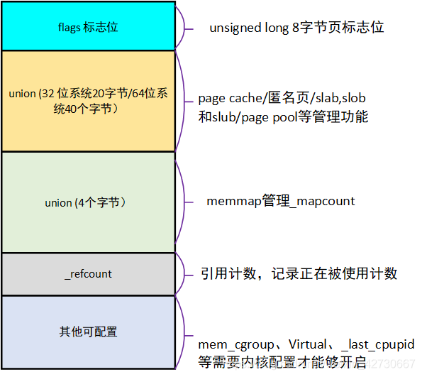
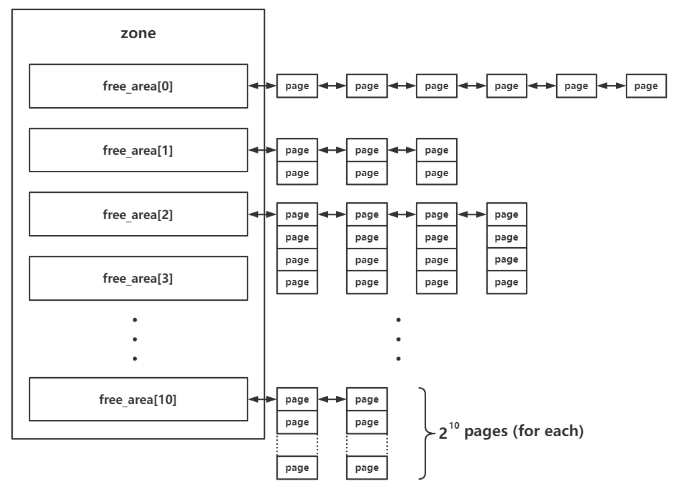
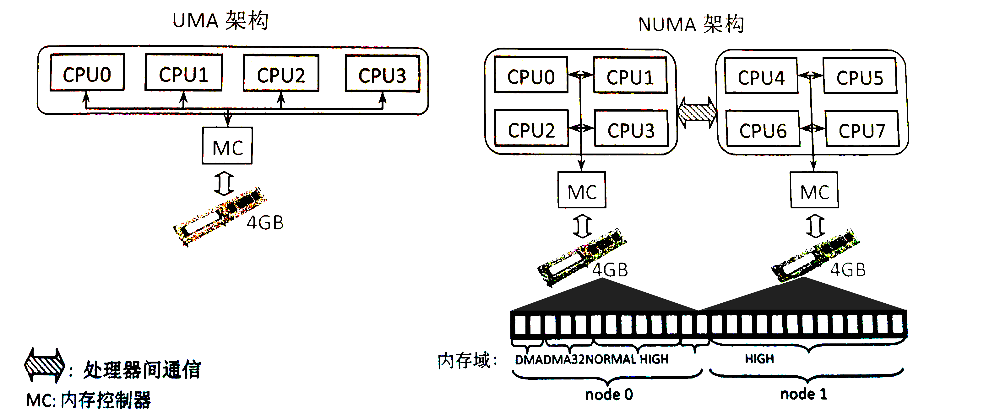

# 内核堆概述

类似于用户态进程中的堆（heap），内核也有着自己的一套动态内存管理机制，为了方便这里我们同样将内核中动态分配的内存称为“堆”。

Linux kernel 将内存分为 `页→区→节点` 三级结构，主要有两个内存管理器—— `buddy system` 与 `slab allocator`，前者负责以内存页为粒度管理所有可用的物理内存，后者则向前者请求内存页并划分为多个较小的对象（object）以进行细粒度的内存管理。

## 页→区→节点三级结构

这是一张十分经典的  _Overview_ ，自顶向下是

- **节点**（node，对应结构体 pgdata\_list）
- **区**（zone，对应结构体 zone，图上展示了三种类型的 zone）
- **页**（page，对应结构体 page）


### 页（page）

Linux kernel 中使用 `page` 结构体来表示一个物理页框，**每个物理页框都有着一个对应的 page 结构体**：



### 区（zone）

在 Linux 下将一个节点内不同用途的内存区域划分为不同的 `区（zone）`，对应结构体 `struct zone`：



### 节点（node）

zone 再向上一层便是**节点**——Linux 将_内存控制器（memory controller）_作为节点划分的依据，对于 UMA 架构而言只有一个节点，而对于 NUMA 架构而言通常有多个节点，对于同一个内存控制器下的 CPU 而言其对应的节点称之为_本地内存_，不同处理器之间通过总线进行进一步的连接。如下图所示，一个 MC 对应一个节点：



## buddy system

buddy system 是 Linux kernel 中的一个较为底层的内存管理系统，**以内存页为粒度管理者所有的物理内存**，其存在于 **区** 这一级别，对当前区所对应拥有的所有物理页框进行管理.

在每个 zone 结构体中都有一个 free\_area 结构体数组，用以存储 buddy system **按照 order 管理的页面**:

```c
struct zone {
    //...
    struct free_area	free_area[MAX_ORDER];
    //...
```

其中的 `MAX_ORDER` 为一个常量，值为 11.

在 buddy system 中按照空闲页面的连续大小进行分阶管理，这里的 order 的实际含义为**连续的空闲页面的大小**，不过单位不是页面数，而是`阶`，即对于每个下标而言，其中所存储的页面大小为：

$$
2^{order}
$$

在 free\_area 中存放的页面通过自身的相应字段连接成双向链表结构，由此我们得到这样一张 _Overview_ ：


  - 分配：
    - 首先会将请求的内存大小向 2 的幂次方张内存页大小对齐，之后从对应的下标取出连续内存页。
    - 若对应下标链表为空，则会从下一个 order 中取出内存页，一分为二，装载到当前下标对应链表中，之后再返还给上层调用，若下一个 order 也为空则会继续向更高的 order 进行该请求过程。
  - 释放：
    - 将对应的连续内存页释放到对应的链表上。
    - 检索是否有可以合并的内存页，若有，则进行合成，放入更高 order 的链表中。

## slab allocator

slab allocator 则是更为细粒度的内存管理器，其通过向 buddy system 请求单张或多张连续内存页后再分割成同等大小的**对象**（object）返还给上层调用者来实现更为细粒度的内存管理。

slab allocator 一共有三种版本：

- slab（最初的版本，机制比较复杂，效率不高）
- slob（用于嵌入式等场景的极为简化版本）
- slub（优化后的版本，**现在的通用版本**）

### 基本结构

 `slub` 版本的 allocator 为现在绝大多数 Linux kernel 所装配的版本，因此本篇文章主要叙述的也是 slub allocator，其基本结构如下图所示：


我们将 slub allocator 每次向 buddy system 请求得来的单张/多张内存页称之为一个 `slub`，其被分割为多个同等大小对象（object），每个 object 作为一个被分配实体，在 slub 的第一张内存页对应的 page 结构体上的 freelist 成员指向该张内存页上的第一个空闲对象，一个 slub 上的所有空闲对象组成一个以 NULL 结尾的单向链表。

  > 一个 object 可以理解为用户态 glibc 中的 chunk，不过 object 并不像 chunk 那样需要有一个 header，因为 page 结构体与物理内存间存在线性对应关系，我们可以直接通过 object 地址找到其对应的 page 结构体。

`kmem_cache` 为一个基本的 allocator 组件，其用于分配某个特定大小（某种特定用途）的对象，所有的 kmem\_cache 构成一个双向链表，并存在两个对应的结构体数组 `kmalloc_caches` 与 `kmalloc_dma_caches`。

一个 `kmem_cache` 主要由两个模块组成：

  - `kmem_cache_cpu`：这是一个**percpu 变量**（即每个核心上都独立保留有一个副本，原理是以 gs 寄存器作为 percpu 段的基址进行寻址），用以表示当前核心正在使用的 slub，因此当前 CPU 在从 kmem\_cache\_cpu 上取 object 时**不需要加锁**，从而极大地提高了性能
  - `kmem_cache_node`：可以理解为当前 `kmem_cache` 的 slub 集散中心，其中存放着两个 slub 链表：
    - partial：该 slub 上存在着一定数量的空闲 object，但并非全部空闲。
    - full：该 slub 上的所有 object 都被分配出去了。

### 分配/释放过程

那么现在我们可以来说明 slub allocator 的分配/释放行为了：

  - 分配：
    - 首先从 `kmem_cache_cpu` 上取对象，若有则直接返回。
    - 若 `kmem_cache_cpu` 上的 slub 已经无空闲对象了，对应 slub 会被从 `kmem_cache_cpu` 上取下，并尝试从 **partial** 链表上取一个 slub 挂载到 `kmem_cache_cpu` 上，然后再取出空闲对象返回。
    - 若 `kmem_cache_node` 的 partial 链表也空了，那就**向 buddy system 请求分配新的内存页**，划分为多个 object 之后再给到 `kmem_cache_cpu`，取空闲对象返回上层调用。
  - 释放：
    - 若被释放 object 属于  `kmem_cache_cpu` 的 slub，直接使用头插法插入当前 CPU slub 的 freelist。
    - 若被释放 object 属于 `kmem_cache_node` 的 partial 链表上的 slub，直接使用头插法插入对应 slub 的 freelist。
    - 若被释放 object 为 full slub，则其会成为对应 slub 的 freelist 头节点，**且该 slub 会被放置到 partial 链表**。

以上便是 slub allocator 的基本原理。

## REFERENCE

[https://arttnba3.cn/2021/11/28/OS-0X02-LINUX-KERNEL-MEMORY-5.11-PART-I/](https://arttnba3.cn/2021/11/28/OS-0X02-LINUX-KERNEL-MEMORY-5.11-PART-I/)

[https://arttnba3.cn/2022/06/30/OS-0X03-LINUX-KERNEL-MEMORY-5.11-PART-II/](https://arttnba3.cn/2022/06/30/OS-0X03-LINUX-KERNEL-MEMORY-5.11-PART-II/)

[https://arttnba3.cn/2023/02/24/OS-0X04-LINUX-KERNEL-MEMORY-6.2-PART-III/](https://arttnba3.cn/2023/02/24/OS-0X04-LINUX-KERNEL-MEMORY-6.2-PART-III/)

[https://blog.csdn.net/lukuen/article/details/6935068](https://blog.csdn.net/lukuen/article/details/6935068)

[https://www.cnblogs.com/LoyenWang/p/11922887.html](https://www.cnblogs.com/LoyenWang/p/11922887.html)