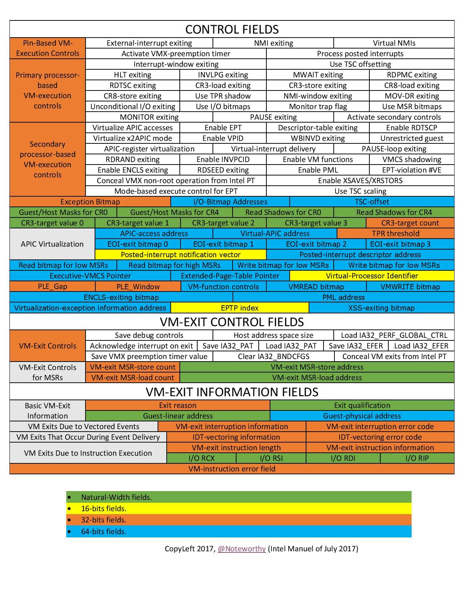
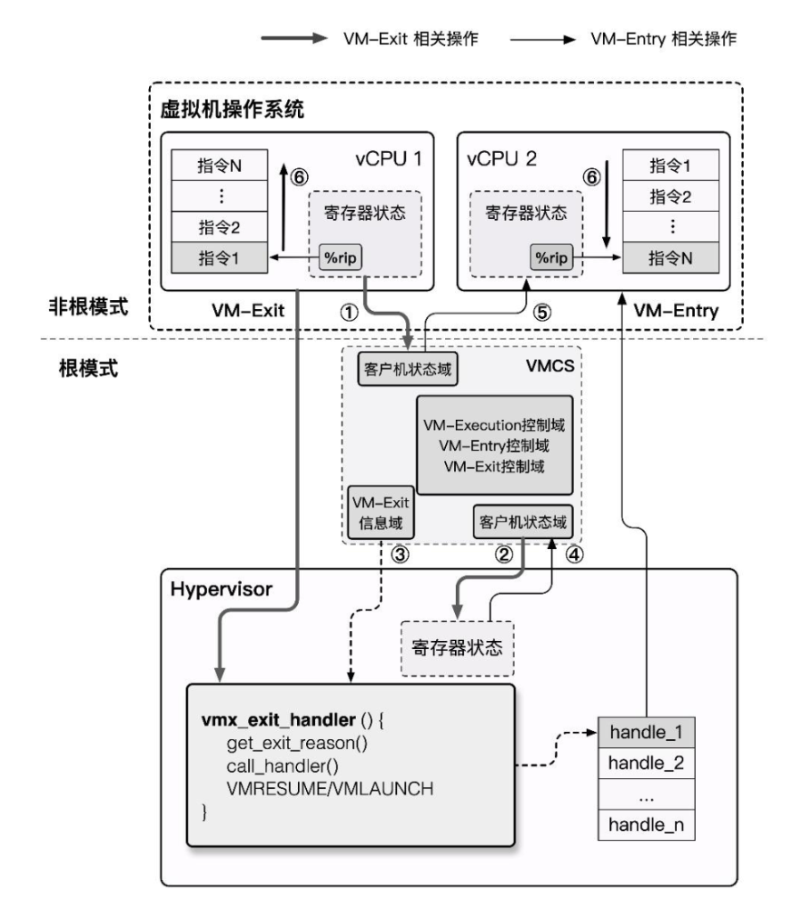

# CPU 虚拟化

CPU 虚拟化是系统虚拟化技术中最核心的部分，因为 CPU 是计算机中最核心的组件，直接控制着整个系统的运行，同时内存访问（内存虚拟化）与 I/O 操作（I/O虚拟化）也都直接依赖于 CPU，因此 CPU 虚拟化是系统虚拟化技术中的核心。

在 Gerald J. Popek 与 Robert P. Goldberg 的合作论文[《Formal Requirements for Virtualizable Third Generation Architectures》](https://dl.acm.org/doi/pdf/10.1145/361011.361073) 中提出了满足虚拟化系统结构的 VMM 的三个充分条件：等价性，资源控制，效率性。为了满足这个条件， CPU 虚拟化使用的经典模型是「Trap & Emulate」，使用**特权级压缩**（Ring Compression）的方式来实现虚拟环境：

- Hypervisor 运行在最高特权级上，Guest VM 运行在低特权级上，Guest VM 在硬件上直接执行非敏感指令，当 Guest VM 执行到敏感指令时，其便会陷入位于最高特权级的 Hypervisor ，此时便能由 Hypervisor 模拟敏感指令的行为。
- 当发生 virtual CPU 调度时，我们将 vCPU 的状态保存，恢复 Hypervisor 状态，Hypervisor 完成其行为后进行下一 virtual CPU 的调度，恢复下一 vCPU 的状态并恢复执行。


## x86 虚拟化遇到的问题

在虚拟化技术的发展初期，在个人计算机领域广泛使用的 x86 架构并没有对虚拟化的经典架构「Trap & Emulate」提供很好的支持，存在着对系统虚拟化的支持缺陷，**系统虚拟化并不能直接而有效的实现**。

Intel 分级保护环将权限分为 ring0~ ring3，其中操作系统内核运行在 ring0 权限而用户进程运行在 ring3 权限。


在系统虚拟化的经典架构「Trap & Emulate」中， Guest OS 全部运行在 ring3，当涉及到一些敏感指令时，VM 触发 General Protection 异常，由 VMM 进行截获并处理，**但不是所有敏感指令都是特权指令，不是所有的敏感指令都有触发异常以让 VMM 介入的机会**， x86 架构中**一共有 17 条非特权敏感指令**：


这些指令**直接违反了 `Popek and Goldberg virtualization requirements` ，从而使得 x86 不是一个可以虚拟化的架构**。

> 例如在 x86 下我们想要用 popf 修改 eflags 的中断开关位（IF）时，若我们在用户态下进行这样的操作，**则会直接被硬件所忽视，而不会引起异常**，这令 VMM 无法介入。

“硬件不够，软件来凑”。因此在硬件还未提供对虚拟化的足够支持之前，Hypervisor 只能从软件层面下功夫，于是出现了两种纯软件虚拟化技术：「模拟执行」（VMWare）与「直接源代码改写」（Xen）。

在软件虚拟化技术已经发展成熟多年之后，x86 架构对虚拟化的支持才姗姗来迟：「硬件辅助虚拟化」（Intel VT）开始出现在人们的视野当中。

## 纯软件实现 CPU 虚拟化

前文我们已经指出 x86 架构存在**非特权敏感指令，直接导致 VMM 无法截获 x86 VM 的敏感行为**，这违反了 `Popek and Goldberg virtualization requirements`，因此在硬件对虚拟化的支持出现之前，虚拟化厂商只好先从软件层面下手。

### 模拟 & 解释执行

**「模拟」**（Emulate）技术的出现其实早于虚拟化，纯软件的模拟本质上就是通过**编写能够呈现出与被模拟对象相同行为的应用程式从而达到运行非同构平台应用程序的效果**。

模拟技术不仅能够应用于程序级别的模拟，还能应用于系统级别的模拟：CPU 运行的本质行为其实就是**从 PC 寄存器所指内存区域中不断取出指令解码执行**，我们不难想到的是，实现一个虚拟机最简单粗暴的方法便是通过**模拟每一条指令对应的行为，从而使得 VM 的行为对 VMM 而言是完全可控的**。

实现模拟技术的原理也是最简单的——我们可以通过**解释执行**的方式来实现模拟技术，即模拟器程序不断地从内存中读取指令，并模拟出每一条指令的效果。从某种程度而言，**每一条指令在执行时都完成了“陷入”**，因此我们可以使用模拟技术解决虚拟化的漏洞，同时还能模拟与物理机不同架构的虚拟机

**Qemu**——`Quick Emulator` 本质上便是一个模拟器，其**完整地模拟了一套包括各种外设在内的计算机系统**。

不过基于解释执行的模拟技术有着一个非常致命的缺点——**性能极差**，因为每一条指令都需要经过 VMM 的解析后再由 VMM 模拟执行，哪怕最简单的一条指令也可能需要分解成多个步骤与多次内存访问，效率极低。

让我们重新审视我们为什么需要在 x86 架构上使用模拟技术来实现虚拟机：非特权敏感指令的存在打破了 `Popek and Goldberg virtualization requirements`，但**非特权敏感指令仅是少数，大部分指令我们仍能直接在物理硬件上运行**，因此基于模拟技术进行改进的虚拟化技术出现了：`扫描 & 修补` 与 `二进制翻译`。

### 扫描 & 修补

虚拟化场景下的虚拟机大都是与物理机有着相同的 ISA，因此我们并没有必要采用纯模拟的技术实现虚拟机，而是可以**让非敏感指令直接在硬件上执行，通过某种方式让非特权敏感指令陷入 VMM**，从而重新实现 Trap & Emulate 模型。

**扫描 & 修补**（Scan & Patch）便是这样的一种技术，其**让非敏感指令直接在硬件上执行**，同时**将系统代码中的敏感指令替换为跳转指令等能陷入 VMM 中的指令**，从而让 VM 在执行敏感指令时能陷入 VMM，使得 VMM 能够模拟执行敏感指令的效果。

基本执行流程如下：

- VMM 在 VM 执行每段代码之前对其进行扫描，解析每一条指令，查找特权与敏感指令
- VMM 动态生成相应指令的补丁代码，并将原敏感指令替换为一个外跳转以陷入 VMM，从而在 VMM 中执行动态生成的补丁代码
- 补丁代码执行结束后，再跳转回 VM 中继续执行下一条代码


在「扫描 & 修补」技术当中大部分的代码都可以直接在物理 CPU 上运行，其性能损失较小，但「扫描 & 修补」同样存在着一定的缺陷：

- 特权指令与敏感指令仍通过模拟执行的方式完成，仍可能造成一定的性能损失

- 代码补丁当中引入了额外的跳转，这破坏了代码的局部性

  > 局部性原理：CPU存取指令/数据的内存单元应当趋向于聚集在一个较小的区域

- VMM 需要维护一份补丁代码对应的原始代码的副本，这造成了额外的开销

### 二进制翻译

为了进一步地提高虚拟化的性能，**「二进制代码翻译」**（Binary Translation）技术应运而生，类似于「扫描 & 修补」技术，二进制代码翻译同样会在运行时动态地修改代码，不过不同的是 BT 技术以**基本块**（只有一个入口和一个出口的代码块）作为翻译的单位：

- Emulator 对读入的二进制代码**翻译**输出为对应 ISA 的一个**不包含特权指令与敏感指令的子集**所构成的代码，使其可以在用户态下安全运行
- Emulator 动态地为当前要运行的基本块开辟一块空间，称之为**翻译缓存**（translation cache），在其中存放着翻译后的代码，每一块 TC 与原代码以某种映射关系（例如哈希表）进行关联


> 我们可以看出二进制代码翻译技术与扫描修补技术的原理大体上是非常类似的，但是二进制代码翻译技术会对所有的代码进行翻译，而扫描与修补技术则只会 patch 掉敏感指令与特权指令；同时扫描&修补技术**不会改变代码的整体结构**，而仅是将敏感与特权指令替换为能触发陷入 VMM 的指令，但是二进制代码翻译技术**会直接改变一个基本块的代码整体结构**（例如翻译前基本块可能长度 40B，翻译后变成100B，内部代码的相对位置也会发生变化）。

翻译方法大致分为以下两种：

- **简单翻译**：可以直接理解为**等效代码模拟**，这种方法实现较为简单，但是会让指令数量大幅膨胀。
- **等值翻译**：翻译的**原代码与结果代码相同**。理论上大多数指令都可以使用等值翻译直接在硬件上执行，但这需要更复杂的动态分析技术。

在相同 ISA 架构上大部分指令都是可以直接进行等值翻译的，除了以下几种：

- PC 相对寻址指令。这类指令的寻址与 PC 相关，但在进行二进制翻译后更改了代码基本块的结构，因此这类指令需要额外插入一些补偿代码来确保寻址的准确，这造成了一定的性能损失。
- 直接控制转换。这类指令包括函数调用与跳转指令，其目标地址需要被替换为生成代码的地址。
- 间接控制转换。这类指令包括间接调用、返回、间接跳转，其目标地址是在运行时动态得到的，因此我们无法在翻译时确定跳转目标。
- 特权指令。对于简单的特权指令可以直接翻译为类似的等值代码（例如 cli 指令可以直接翻译为置 vcpu 的 flags 寄存器的 IF 位为0），但对于稍微复杂一点的指令，则需要进行深度模拟，利用跳转指令陷入 VMM 中，这通常会造成一定的性能开销。

> 例如这是 QEMU 中的一个基本块代码翻译的例子：
>
> 

由于二进制代码翻译技术使用了更为复杂的过程，由此也会引入更多的问题，对于以下情形则需要额外的处理：

- 自修改代码（Self Modifying Code）。这类程序会在运行时修改自身所执行的代码，这需要我们的 Emulator 对新生成的代码进行重翻译。
- 自参考代码（Self Referential Code）。这类程序会在运行中读取自己的代码段中内容，这需要我们额外进行处理，使其读取原代码段中内容而非翻译后的代码。
- 精确异常（Precise Exceptions）。即在翻译代码执行的过程中发生了中断或异常，这需要将运行状态恢复到原代码执行到异常点时的状态，之后再交给 Guest OS 处理。BT 技术暂很难很好地处理这种情况，因为翻译后的代码与原代码已经失去了逐条对应的关系。一个可行的解决方案就是在发生异常时进行回滚，之后重新使用解释执行的方式。
- 实时代码。这类代码对于实时性要求较高，在模拟环境下运行会损失时间精确性，目前暂时无法解决。


## 硬件辅助虚拟化

本节我们以 Intel VT-x 为例介绍硬件辅助虚拟化（hardware-assisted virtualization）技术。

### 概述

Intel VT 技术是 Intel 为 x86 虚拟化所提供的硬件支持，其中用于辅助 CPU 虚拟化的是 `Intel VT-x` 技术，其扩展了传统的 IA32 处理器架构，为 IA32 架构的 CPU 虚拟化提供了硬件支持。

VT-x 技术为 Intel CPU 额外引入了两种运行模式，统称为**VMX 操作模式**（Virtual Machine eXtensions），通过 `vmxon` 指令开启，这两种运行模式**都独立有着自己的分级保护环**：

- `VMX Root Operation`：Hypervisor 所工作的模式，在这个模式下可以访问计算机的所有资源，并对 VM 进行调度。
- `VMX Non-Root Operation`：VM 所工作的模式，在这个模式下仅能访问非敏感资源，对于敏感资源的访问（例如 I/O 操作）会使得 CPU 退出 Non-Root 模式并陷入 Hypervisor 中，由 Hypervisor 处理后再重新进入 Non-Root 模式恢复 VM 的运行。

由此，我们对 Root 模式与 Non-Root 模式间的切换行为进行定义：

- `VM-Entry`：Hypervisor 保存自身状态信息，切换到 VMX Non-Root 模式，载入 VM 状态信息，恢复 VM 执行流。
- `VM-Exit`：VM 运行暂停并保存自身状态信息，切换到 VMX Root 模式，载入 Hypervisor 状态信息，执行相应的处理函数。


由于 Non-Root 模式与 Root 模式都各自有着自己的分级保护环，因此 Host OS 与 Guest OS 都可以**不加修改地在自己对应的模式下直接在硬件上运行**，仅有当 Guest OS 涉及到敏感资源的访问及 Host OS 对 VM 的调度时才会发生切换，这在确保了 VM 高性能的同时满足了 `Trap & Emulate` `模型实现，也解决了 x86 架构的虚拟化漏洞。

### VMCS

`VMCS`（**Virtual-Machine Control Structure**）是用以保存 CPU 虚拟化所需要的相关状态的一块内存，**每个 virtual CPU 对应有一个 VMCS**，同一时刻一个物理 CPU 只能与一个 VMCS 绑定，反之亦然，但在不同的时刻我们可以将 VMCS 绑定到不同的物理 CPU 上，称之为 VMCS 的**迁移**（Migration）。

与 VMCS 的绑定与解绑相关的是以下两条指令：

|     Instruction     |                Description                |
| :-----------------: | :---------------------------------------: |
| VMPTRLD <VMCS 地址> | 将指定的 VMCS 与执行该指令的 CPU 进行绑定 |
|       VMCLEAR       |   将执行该指令的 CPU 与其 VMCS 进行解绑   |

VT-x 中将 VMCS 定义为一个**最大不超过 4KB 的内存块，且应与 4KB 对齐**，其内容格式如下：

```c
struct VMCS {
    /* 版本号，4字节 */
	uint32_t vmcs_revision_identifier:31, shadow_vmcs_indicator:1;
    
    /* 中止标识，4字节
     * 当 VM-Exit 失败时便会产生 VMX 中止，并在此处存放原因
     */
    uint32_t 	vmx_abort_indicator;
    
    /* 数据域 */
    struct VMCSData vmcs_data;
};
```

VMCS 数据域 存放着 VMCS 主要的信息，分为以下六个子域：

- **Guest-state area**：保存 VM 寄存器状态，在 VM-entry 时加载，在 VM-exit 时保存

- **Host-state area**：保存 Hypervisor 寄存器状态，在 VM-exit 时加载

- **VM-execution control fileds**：控制 `Non-Root` 模式下的处理器行为 

- **VM-entry  control fileds**：控制 `VM-Entry` 过程中的某些行为

- **VM-exit  control fileds**：控制 `VM-Exit` 过程中的某些行为

- **VM-exit information fields**：保存 `VM-Exit` 的基本原因及其他详细信息，在一些处理器上该域为只读域




我们可以通过以下两条指令读写 VMCS：

|      Instruction      |           Description            |
| :-------------------: | :------------------------------: |
|     VMREAD <索引>     |     读 VMCS 中“索引”指定的域     |
| VMWRITE <索引> <数据> | 向 VMCS 中“索引”指定的域写入数据 |

> 这里的索引并非偏移值，而是 Intel 为数据域中每个字段都定义了一个独特的索引值，例如 Guest State Area 中 ES 段选择子的索引值便是 `0x00000800`。
>
> 当然，要把所有域的索引都背下来并不现实，最好的办法还是多多查表：）推荐阅读：[Intel SDM](https://www.intel.com/content/www/us/en/developer/articles/technical/intel-sdm.html) 的 [Intel® 64 and IA-32 Architectures Software Developer's Manual Volume 3C: System Programming Guide, Part 3](https://cdrdv2.intel.com/v1/dl/getContent/671506)。

### VMX 操作模式

作为传统的 IA32 架构的扩展，VMX 操作模式在默认下是关闭的，只有当 VMM 需要使用硬件辅助虚拟化功能时才会使用 Intel 提供的两条新指令来开关 VMX 操作模式：

- `VMXON`：开启 VMX 操作模式。
- `VMXOFF`：关闭 VMX 操作模式。

在 Intel SDM 中描述的 VMX 生命周期如下：

- 软件通过 `VMXON` 指令进入 VMX 操作模式。
- VMM 可以通过 `VM entries` 进入 Guest VM（单次只能执行一个 VM），VMM 通过 `VMLAUNCH` （第一次进入 VM）与 `VMRESUME` （从 VMM 中恢复到 VM）指令来使能 `VM entry`，通过 `VM exits` 重获控制权。
- `VM exits` 通过 VMM 指定的入口点移交控制权，VMM 对 VM 的退出原因进行响应后通过 `VM entry` 返回到 VM 中。
- 当 VMM 想要停止自身运行并退出 VMX 操作模式时，其通过 `VMXOFF` 指令来完成。


现在我们来深入 `VM entry` 与 `VM exit` 这两个行为的实现细节中，在其流程中他们分别进行了如下动作：

- **VM entry**：从 Hypervisor 切换到 VM
  - 检查 VMCS 合法性（各字段值是否合法）。
  - 加载 VMCS 的 `Guest-state area` 中的各字段到对应的寄存器。
  - 加载指定的 MSR。
  - 设置 VMCS 的状态为 `launched`。
  - 根据需要通过写 VMCS 的 `VM-entry Interrucption-Information` 向 VM 进行**事件注入**（如异常、异步中断等）。
- **VM exit**：从 VM 切换到 Hypervisor
  - 将 VM 退出的原因与详细信息写入 VMCS 的  `VM-exit information fields`。
  - 将 VM 的寄存器保存至 VMCS 的 `Guest-state area` 。
  - 从 VMCS 的 `Host-state area` 中恢复 Host 寄存器。
  - 加载指定 MSR。



> 这里笔者为大家补充一个概念：**Model Specific Register**，简称 MSR，是 x86 下的一组用来**控制CPU运行、功能开关、调试、跟踪程序执行、监测CPU性能**等方面的寄存器。
>
> > 例如 `syscall` 指令便是通过 MSR 寄存器来获取到内核系统调用的入口点。
>
> 每个 MSR 寄存器都会有一个 id，称之为 `MSR Index`，我们可以通过这个 id 来利用 `RDMSR` 与 `WRMSR` 指令读写指定的 MSR 寄存器。
>
> 我们可以在 Intel SDM 的 Volume 4 中获取到到 MSR 寄存器的详细信息。

## KVM & QEMU-KVM

**Kernel-based Virtual Machine** 是一个自 Linux 2.6.20 后集成在 kernel 中的一个**开源系统虚拟化内核模块**，本质上是一个依赖于硬件辅助虚拟化的位于 kernel 中的 Hypervisor，或者说**KVM 将 Linux kernel 变成了 Hypervisor**，并提供了相应的用户态操作 VM 的接口： `/dev/kvm` ，我们可以通过 ioctl 指令来操作 KVM。

但 KVM 本身仅提供了 CPU 与内存的虚拟化，不能构成一个完整的虚拟化环境，那么我们不难想到的是我们可以复用现有的全虚拟化方案，**将模拟 CPU 与内存的工作交由 KVM 完成**，这样便能直接通过 KVM 来借助硬件辅助虚拟化以提高虚拟机性能。

QEMU 便支持通过 KVM 来创建与运行虚拟机，利用QEMU + KVM 进行虚拟化的方案如下：

- QEMU 通过 ioctl 进入内核态将控制权移交 KVM，KVM 进行 VM 的运行。
- 产生 VM-Exit，KVM 接管，判断原因并决定继续运行还是交由 QEMU 处理。
- 若是后者，恢复到用户态 QEMU 中的处理代码进行相应的处理，之后退出或回到第一步。


这个基本执行框架实际上为 QEMU 源码 `accel/kvm/kvm-all.c` 中的 `kvm_cpu_exec()`：

```c
int kvm_cpu_exec(CPUState *cpu)
{
    //...
    cpu_exec_start(cpu);

    do {
        //...
        /**
         * 开始运行 VM，本质上就是 ioctl(kvm_fd, KVM_RUN)
         * 当产生 VM-Exit 时，首先在 KVM 中完成处理，
         * 若产生 IO，则退出内核态，即恢复到这里，接下来进入到用户态的处理
         */
        run_ret = kvm_vcpu_ioctl(cpu, KVM_RUN, 0);
        
        //...
        if (run_ret < 0) {
            /**
             * 返回值小于 0 说明 VM 运行出了些问题，
             * 这里会简单处理后 break 打破大循环 
             */
        	//...
        }
        
        trace_kvm_run_exit(cpu->cpu_index, run->exit_reason);
        /* 这里就是一个大的 switch，根据退出的原因进行不同的处理，就不放完整代码了 */
        switch (run->exit_reason) {
        case KVM_EXIT_IO:
            DPRINTF("handle_io\n");
            /* Called outside BQL */
            kvm_handle_io(run->io.port, attrs,
                          (uint8_t *)run + run->io.data_offset,
                          run->io.direction,
                          run->io.size,
                          run->io.count);
            ret = 0;
            break;
        case KVM_EXIT_MMIO:
            DPRINTF("handle_mmio\n");
            /* Called outside BQL */
            address_space_rw(&address_space_memory,
                             run->mmio.phys_addr, attrs,
                             run->mmio.data,
                             run->mmio.len,
                             run->mmio.is_write);
            ret = 0;
            break;
        //...
        default:
            DPRINTF("kvm_arch_handle_exit\n");
            ret = kvm_arch_handle_exit(cpu, run);
            break;
        }
    } while (ret == 0);
    
    /* 运行结束，收尾处理 */
    // ...
```

## REFERENCE

《系统虚拟化：原理与实现》——Intel 开源软件技术中心

[【VIRT.0x02】系统虚拟化导论](https://arttnba3.cn/2022/08/29/VURTUALIZATION-0X02-BASIC_KNOWLEDGE/)

[Intel® 64 and IA-32 Architectures Software Developer's Manual Volume 3C: System Programming Guide, Part 3](https://cdrdv2.intel.com/v1/dl/getContent/671506)

[Formal Requirements for Virtualizable Third Generation Architectures](https://dl.acm.org/doi/pdf/10.1145/361011.361073)
