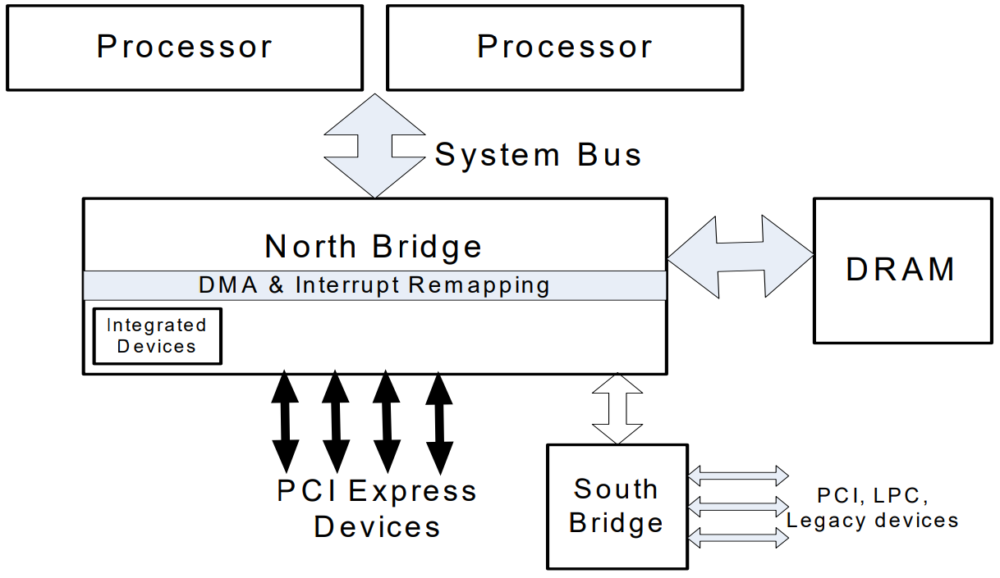

# IO 虚拟化

现实的外设资源往往是有限的，同时我们有的时候并不需要让 VM 直接接触到现实存在的外设资源，有的时候我们还想为 VM 提供一些不存在实体设备的设备，因此 Hypervisor 需要通过 IO 虚拟化的方式来为 VM 提供**虚拟的设备资源**。

从处理器的角度而言，我们与外设之间的交互主要是通过 MMIO 与 Port IO 来完成的，因而针对外设的虚拟化称之为 **I/O 虚拟化**。

I/O 虚拟化需要实现以下三个任务：

- 访问截获：Hypervisor 需要截获 VM 对外设的访问操作。
- 提供设备接口：Hypervisor 需要为 VM 提供虚拟/直通设备的接口。
- 实现设备功能：Hypervisor 需要实现虚拟设备的功能。

## 基本模型

### 平台设备模拟（Platform device emulation）

**平台设备模拟**即由 Hypervisor 负责模拟虚拟设备的功能，不同的虚拟化软件对于模拟设备的实现方式不同。

**基于 hypervisor 的设备模拟**（Hypervisor-based device emulation）是 VMware workstation 系列产品较为常用的一种方式：在 hypervisor 中有着对一般设备的仿真供 guest OS 进行共享，包括虚拟磁盘、虚拟网络适配器与其他的必要元素，这种模型如下图所示：


第二种架构称为**用户空间设备模拟**（User space device emulation），其虚拟设备的模拟在用户空间进行。QEMU 在用户空间中独立进行设备模拟，虚拟设备被其他的 VM 通过 hypervisor 提供的接口进行调用。由于设备的模拟是独立于 hypervisor 的，因此我们可以模拟任何设备，且该模拟设备可以在其他 hypervisor 间进行共享。


### 设备直通（Device passthrough）

上面的这两种模型或多或少都存在着一定的性能开销，如果该设备需要被多个 VM 共享，那这种开销或许是值得的，但如果该设备并不需要共享，那么我们其实可以使用一种更为高效的方法——设备直通（Device passthrough）。

设备直通可以理解为设备独占的设备模拟：直接将设备**隔离**给到指定的 VM 上，以便该设备可以由该 VM 独占使用。**这提供了接近于原生设备的性能**，例如对于一些需要大量 IO 的设备（例如网络设备等），使用设备直通能提供相当完美的性能。


## 软件半虚拟化 - virtio

`virtio` 这个概念来自于一篇非常古老的虚拟化领域的论文：[virtio: towards a de-facto standard for virtual I/O devices](https://ozlabs.org/~rusty/virtio-spec/virtio-paper.pdf)，主要是为了解决设备虚拟化的问题而**提供了一套通用的虚拟化设备模型**，Guest OS 只需要实现一套统一的 virtio 驱动便能以统一的方式访问虚拟化设备，从而避免了各种虚拟化驱动分裂的问题。


### VirtQueue：传输层抽象

`virtqueue` 为 virtio 中用以进行数据传输的关键结构，其本身表示一个**数据队列**：由一方向队列中添加 buffer，另一方从队列中取出 buffer——通过这样的方式实现了 Guest 与 Host 之间基本的数据传输模型。

为了减少模型的复杂性，通常我们使用 virtqueue 的传输都是单向的，因此一个最简单的模型就是我们就可以使用两个 virtqueue 来实现 Guest 与 Host 之间的双向通信：tx queue（发送队列） & rx queue（接收队列）。


对于 virtqueue 的操作，在论文中抽象成一个函数表 `virtqueue_ops`：

```c
struct virtqueue_ops {
    int (*add_buf)(struct virtqueue *vq,
                    struct scatterlist sg[],
                    unsigned int out_num,
                    unsigned int in_num,
                    void *data);
    void (*kick)(struct virtqueue *vq);
    void *(*get_buf)(struct virtqueue *vq,
    unsigned int *len);
    void (*disable_cb)(struct virtqueue *vq);
    bool (*enable_cb)(struct virtqueue *vq);
};
```

-  `add_buf`：向 virtqueue 中添加一个 buffer
-  `kick` ：通知另一方新到达了一个 buffer
-  `get_buf` 从 virtqueue 中获取一个 buffer
-  `disable_cb`：通知另一方关闭 buffer 到达的提示
-  `enable_cb`：通知另一方开启 buffer 到达的提示

### VRing：virtqueue 的基本结构

virtqueue 核心的数据结构便是 `vring`，这是一个**环形缓冲区队列**，其由三部分组成：

- 描述符表（Desc）
- 可用描述符数组（Used）
- 已用描述符数组（Avail）


一个描述符（Descriptor）为如下结构，表示了一块 buffer 的基本属性，需要注意的是一个 Avail/Used 表项通常是多个 descriptor 串联的 buffer——这便是 next 域的作用：

```c
struct vring_desc
{
    __u64 addr;		// Guest Physical Addresses
    __u32 len;		// 长度
    __u16 flags;	// 属性
    __u16 next;		// 下一个描述符的 idx
};
```

**Avail** 数组用来存储当前可用的描述符：

```c
struct vring_avail
{
    __u16 flags;
    __u16 idx;
    __u16 ring[NUM];
};
```

**Used** 数组则用来存储已经被使用的描述符：

```c
struct vring_used_elem
{
    __u32 id;
    __u32 len;
};

struct vring_used
{
    __u16 flags;
    __u16 idx;
    struct vring_used_elem ring[];
};
```

Avail 数组与 Used 数组同样是一个**环形队列**，不过这两个数组分别由通信的两方进行使用：

- 数据**发送方**准备好数据后从 `Avail 队列` 中获取可用的表项，更新描述符表，并在 `Used 队列` 中插入新的表项，通知接收方有数据到达。
- 数据**接收方**从 `Used 队列` 中取出表项，读取描述符表以获取数据，完成处理后将表项插入到 `Avail 队列` 中。

下图为由 Guest 向 Host 发送数据的一个 vring 示例：


### virtio 配置操作抽象

结合 virtqueue，我们现在可以抽象出一个虚拟 PCI 设备的基本操作：

- 获取 feature bits
- 读写配置空间
- 读写 status bits
- 设备重置
- 创建/销毁 virtqueue

我们将其抽象成一张函数表：`virtio_config_ops`。

```c
struct virtio_config_ops
{
        bool (*feature)(struct virtio_device *vdev, unsigned bit);
        void (*get)(struct virtio_device *vdev, unsigned offset,
                    void *buf, unsigned len);
        void (*set)(struct virtio_device *vdev, unsigned offset,
                    const void *buf, unsigned len);
        u8 (*get_status)(struct virtio_device *vdev);
        void (*set_status)(struct virtio_device *vdev, u8 status);
        void (*reset)(struct virtio_device *vdev);
        struct virtqueue *(*find_vq)(struct virtio_device *vdev,
                                     unsigned index,
                                     void (*callback)(struct virtqueue *));
        void (*del_vq)(struct virtqueue *vq);
};
```

- `feature`：获取设备对应的 feature bit。
- `get & set` ：读写设备的配置空间。
- `get_status & set_status`：读写设备的 status bits。
- `reset`：重置设备。
- `find_vq`：获取/创建 virtqueue。
- `del_vq`：销毁 virtqueue。

## IOMMU

 IOMMU 即 **Input/Output Memory Management Unit**，其功能类似于 CPU 中的 MMU，是一个**向设备侧提供地址翻译功能的单元**。


IOMMU 通常被集成于北桥中，其提供面向设备端的两个功能：

- **DMA 重映射**（ **DMA remapping**）：有着 DMA 功能的设备可以使用虚拟地址，通过 IOMMU 转换为物理地址进行直接内存访问。
- **中断重映射**（**Interrupt remapping**）：IOMMU 会拦截设备产生的中断，根据中断重映射表产生新的中断请求发送给 LAPIC。



### DMA 重映射

DMA 重映射即面向设备侧的地址访问重翻译，如下图所示，左侧是 CPU 对内存的虚拟化：MMU 利用进程页表将进程要访问的虚拟地址翻译为物理地址，从而实现在两个进程中访问同一个虚拟地址实际上访问到不同的物理地址——DMA 重映射也是类似的原理，如下图右侧所示，当外设想要进行 DMA 时，IOMMU 会根据“设备页表”进行地址翻译，从而使得两个设备各自感知访问的是同一个地址，但实际上访问到了不同的物理地址。


### IOMMU 与虚拟化

虽然 IOMMU 的引入增加了与外设通信间的开销，但 IOMMU 解决了系统虚拟化技术的一个难点：对于非纯模拟的设备而言，其并不知道 GPA 与 HPA 之间的映射关系，当其按 Guest OS 提供的地址进行 DMA 时**会直接访问到 Host 的内存**。

当引入了 IOMMU 之后，IOMMU 可以根据 Host 侧提供的 GPA 到 HPA 之间的地址转换表，进行**DMA remapping**，这样外设就能正常地访问到 Guest 的物理内存，而不会错误地访问到 Host 对应的物理内存区域。

## REFERENCE

[IBM Archived | Linux virtualization and PCI passthrough](https://developer.ibm.com/tutorials/l-pci-passthrough/)

[【原创】Linux虚拟化KVM-Qemu分析（十）之virtio驱动](https://www.cnblogs.com/LoyenWang/p/14444344.html)

[【原创】Linux虚拟化KVM-Qemu分析（十一）之virtqueue ](https://www.cnblogs.com/LoyenWang/p/14589296.html)

[virtio: towards a de-facto standard for virtual I/O devices](https://ozlabs.org/~rusty/virtio-spec/virtio-paper.pdf)

[知乎 - IOMMU DMA 重映射](https://zhuanlan.zhihu.com/p/349225786)

《系统虚拟化——原理与实现》——Intel 开源软件技术中心

[A Tour Beyond BIOS: Using IOMMU for DMA Protection in UEFI Firmware](https://www.intel.com/content/dam/develop/external/us/en/documents/intel-whitepaper-using-iommu-for-dma-protection-in-uefi.pdf)


