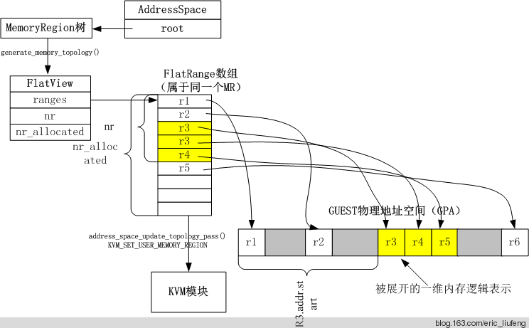
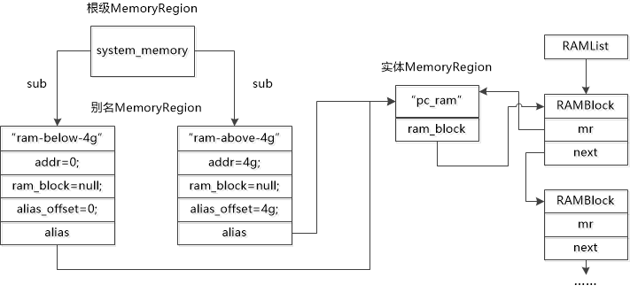

# QEMU 内存管理

本节讲述 QEMU 如何管理某个特定 VM 的内存。

## Guest VM 视角（GPA）

### MemoryRegion：Guest 视角的一块“内存”

在 Qemu 当中使用 `MemoryRegion` 结构体类型来表示一块具体的 Guest 物理内存区域，该结构体定义于 `include/exec/memory.h` 当中：

```c
/** MemoryRegion:
 *
 * 表示一块内存区域的一个结构体.
 */
struct MemoryRegion {
    Object parent_obj;

    /* private: */

    /* The following fields should fit in a cache line */
    bool romd_mode;
    bool ram;
    bool subpage;
    bool readonly; /* For RAM regions */
    bool nonvolatile;
    bool rom_device;
    bool flush_coalesced_mmio;
    bool global_locking;
    uint8_t dirty_log_mask;
    bool is_iommu;
    RAMBlock *ram_block;
    Object *owner;

    const MemoryRegionOps *ops;
    void *opaque;
    MemoryRegion *container;	// 指向父 MemoryRegion
    Int128 size;	// 内存区域大小
    hwaddr addr;	// 在父 MR 中的偏移量
    void (*destructor)(MemoryRegion *mr);
    uint64_t align;
    bool terminates;
    bool ram_device;
    bool enabled;
    bool warning_printed; /* For reservations */
    uint8_t vga_logging_count;
    MemoryRegion *alias;	// 仅在 alias MR 中，指向实际的 MR
    hwaddr alias_offset;
    int32_t priority;
    QTAILQ_HEAD(, MemoryRegion) subregions;
    QTAILQ_ENTRY(MemoryRegion) subregions_link;
    QTAILQ_HEAD(, CoalescedMemoryRange) coalesced;
    const char *name;
    unsigned ioeventfd_nb;
    MemoryRegionIoeventfd *ioeventfds;
};
```

根据[QEMU官方文档](https://www.qemu.org/docs/master/devel/memory.html#types-of-regions)中的描述，虽然众多的内存区域对象都声明为C结构体类型MemoryRegion，但是根据功能特性和应用场景的差异，这些内存区域在具体使用中可以分为八种类型的 MemoryRegion，这八种类型的内存区域基本满足了Guest常见的内存访问需求。这八种类型包括：

- RAM MemoryRegion：通过 `memory_region_init_ram()` 初始化。代表一块具体的Host内存，这块内存区域被分配给Guest使用
- ROM MemoryRegion：通过 `memory_region_init_rom()` 初始化。原理与RAM MR类似，但仅用于读取（相当于直接访问主机内存区域），并且禁止写操作。
- MMIO MemoryRegion：通过 `memory_region_init_io()` 初始化。一段客户虚拟机内存，每次读或写最终都会调用QEMU代码中所注册的回调函数，用于模拟MMIO读写流程。
- ROM device MemoryRegion：通过 `memory_region_init_rom_device()` 初始化。读操作的工作原理类似于RAM MR的直接访问内存区域，写操作则类似于MMIO MR的调用回调函数。
- IOMMU MemoryRegion：通过 `memory_region_init_iommu()` 初始化。顾名思义，该MR类型仅用于IOMMU建模，而不用于简单的设备。访问该类MR中的地址时将进行地址转换，并将其转发到其他目标内存区域。
- container MemoryRegion：通过 `memory_region_init()` 初始化。其并不实际指向一块内存区域，而只是包含其他MR，每个MR的偏移量不同。container MR用于将多个MR组合为一个单元以进行表示与管理。例如，PCI BAR可能由一个RAM MR和一个MMIO MR组成。
- alias MemoryRegion：通过 `memory_region_init_alias()` 初始化。其作为另一个 MemoryRegion 实体的别名而存在，不指向一块实际内存。
- reservation MemoryRegion：通过向 `memory_region_init_io()` 传递一个为`NULL`的回调参数来初始化。其主要用于调试，其占用的I/O空间不应该由QEMU本身处理。典型的用途是跟踪在启用KVM时由主机内核处理的地址空间部分。

container MR 与其他 MR 间构成树形结构，其中container为根节点而实体为子节点，形式如下：

```
                            struct MemoryRegion
                            +------------------------+                                         
                            |name                    |                                         
                            |  (const char *)        |                                         
                            +------------------------+                                         
                            |addr                    |                                         
                            |  (hwaddr)              |                                         
                            |size                    |                                         
                            |  (Int128)              |                                         
                            +------------------------+                                         
                            |subregions              |                                         
                            |    QTAILQ_HEAD()       |                                         
                            +------------------------+                                         
                                       |
                                       |
               ----+-------------------+---------------------+----
                   |                                         |
                   |                                         |
                   |                                         |

     struct MemoryRegion                            struct MemoryRegion
     +------------------------+                     +------------------------+
     |name                    |                     |name                    |
     |  (const char *)        |                     |  (const char *)        |
     +------------------------+                     +------------------------+
     |addr                    |                     |addr                    |
     |  (hwaddr)              |                     |  (hwaddr)              |
     |size                    |                     |size                    |
     |  (Int128)              |                     |  (Int128)              |
     +------------------------+                     +------------------------+
     |subregions              |                     |subregions              |
     |    QTAILQ_HEAD()       |                     |    QTAILQ_HEAD()       |
     +------------------------+                     +------------------------+
```

相应地，基于 OOP 的思想，MemoryRegion 的成员函数被封装在函数表 `MemoryRegionOps` 当中：

```c
/*
 * Memory region callbacks
 */
struct MemoryRegionOps {
    /* 从内存区域上读. @addr 与 @mr 有关; @size 单位为字节. */
    uint64_t (*read)(void *opaque,
                     hwaddr addr,
                     unsigned size);
    /* 往内存区域上写. @addr 与 @mr 有关; @size 单位为字节. */
    void (*write)(void *opaque,
                  hwaddr addr,
                  uint64_t data,
                  unsigned size);

    MemTxResult (*read_with_attrs)(void *opaque,
                                   hwaddr addr,
                                   uint64_t *data,
                                   unsigned size,
                                   MemTxAttrs attrs);
    MemTxResult (*write_with_attrs)(void *opaque,
                                    hwaddr addr,
                                    uint64_t data,
                                    unsigned size,
                                    MemTxAttrs attrs);

    enum device_endian endianness;
    /* Guest可见约束: */
    struct {
        /* 若非 0，则指定了超出机器检查范围的访问大小界限
         */
        unsigned min_access_size;
        unsigned max_access_size;
        /* If true, unaligned accesses are supported.  Otherwise unaligned
         * accesses throw machine checks.
         */
         bool unaligned;
        /*
         * 若存在且 #false, 则该事务不会被设备所接受
         * (并导致机器的相关行为，例如机器检查异常).
         */
        bool (*accepts)(void *opaque, hwaddr addr,
                        unsigned size, bool is_write,
                        MemTxAttrs attrs);
    } valid;
    /* 内部应用约束: */
    struct {
        /* 若非 0，则决定了最小的实现的 size .
         * 更小的 size 将被向上回绕，且将返回部分结果.
         */
        unsigned min_access_size;
        /* 若非 0，则决定了最大的实现的 size . 
         * 更大的 size 将被作为一系列的更小的 size 的访问而完成.
         */
        unsigned max_access_size;
        /* 若为 true, 支持非对齐的访问.  
         * 否则所有的访问都将被转换为（可能多种）对齐的访问.
         */
        bool unaligned;
    } impl;
};
```

当我们的 Guest 要读写虚拟机上的内存时，在 Qemu 内部实际上会调用 `address_space_rw()`，对于一般的 RAM 内存而言则直接对 MR 对应的内存进行操作，对于 MMIO 而言则最终调用到对应的 `MR->ops->read()` 或 `MR->ops->write()`。

同样的，为了统一接口，在 Qemu 当中 **PMIO 的实现同样是通过 MemoryRegion 来完成的**，我们可以把一组端口理解为 QEMU 视角的一块 Guest 内存。

> 几乎所有的 CTF QEMU Pwn 题都是自定义一个设备并定义相应的 MMIO/PMIO 操作。

### FlatView：MR 树对应的 Guest 视角物理地址空间

QEMU通过树状结构的MemoryRegion管理Guest的物理地址空间，支持动态调整（如热插拔设备）。但这种嵌套、重叠的复杂结构不适合直接与KVM等内核模块交互。因此QEMU使用 `FlatView` 用来表示**一棵 MemoryRegion 树所表示的线性的 Guest 地址空间**，其将树状结构“展平”为列表，每个条目记录连续内存区域的起始地址（GPA）、大小、属性（如RAM/MMIO），消除嵌套关系，简化内核处理。例如，KVM需要明确的物理内存布局来配置EPT（Extended Page Table），`FlatView` 提供可直接映射的平坦内存描述，避免内核解析复杂树结构。`FlatView`使用一个 `FlatRange` 结构体指针数组来存储不同 `MemoryRegion` 对应的地址信息，每个 `FlatRange` 表示单个 `MemoryRegion` 的 **Guest 视角的一块线性的物理地址空间**以及是否只读等特性信息， `FlatRange` 之间所表示的地址范围不会重叠。

```c
/* Range of memory in the global map.  Addresses are absolute. */
struct FlatRange {
    MemoryRegion *mr;
    hwaddr offset_in_region;
    AddrRange addr;
    uint8_t dirty_log_mask;
    bool romd_mode;
    bool readonly;
    bool nonvolatile;
};

//...

/* Flattened global view of current active memory hierarchy.  Kept in sorted
 * order.
 */
struct FlatView {
    struct rcu_head rcu;
    unsigned ref;
    FlatRange *ranges;
    unsigned nr;
    unsigned nr_allocated;
    struct AddressSpaceDispatch *dispatch;
    MemoryRegion *root;
};
```

### AddressSpace：不同类型的 Guest 地址空间

`AddressSpace` 结构体用以表示 **Guest 视角不同类型的地址空间**，在 x86 下其实就只有两种：`address_space_memory` 与 `address_space_io`。

单个 `AddressSpace` 结构体与一棵 MemoryRegion 树的根节点相关联，并使用一个 `FlatView` 结构体建立该树的平坦化内存空间。

```c
/**
 * struct AddressSpace: describes a mapping of addresses to #MemoryRegion objects
 */
struct AddressSpace {
    /* private: */
    struct rcu_head rcu;
    char *name;
    MemoryRegion *root;

    /* Accessed via RCU.  */
    struct FlatView *current_map;

    int ioeventfd_nb;
    struct MemoryRegionIoeventfd *ioeventfds;
    QTAILQ_HEAD(, MemoryListener) listeners;
    QTAILQ_ENTRY(AddressSpace) address_spaces_link;
};
```

最终我们可以得到如下总览图：



## host VMM 视角（HVA）

### RAMBlock：MR 对应的 Host 虚拟内存

`RAMBlock` 结构体用来表示**单个实体 MemoryRegion 所占用的 Host 虚拟内存信息**，多个 `RAMBlock` 结构体之间构成单向链表。

比较重要的成员如下：

- `mr`：该 RAMBlock 对应的 MemoryRegion（即 HVA → GPA）
- `host`：GVA 对应的 HVA，通常由 QEMU 通过 `mmap()` 获得（如果未使用 KVM）

```c
struct RAMBlock {
    struct rcu_head rcu;
    struct MemoryRegion *mr;
    uint8_t *host;
    uint8_t *colo_cache; /* For colo, VM's ram cache */
    ram_addr_t offset;
    ram_addr_t used_length;
    ram_addr_t max_length;
    void (*resized)(const char*, uint64_t length, void *host);
    uint32_t flags;
    /* Protected by iothread lock.  */
    char idstr[256];
    /* RCU-enabled, writes protected by the ramlist lock */
    QLIST_ENTRY(RAMBlock) next;
    QLIST_HEAD(, RAMBlockNotifier) ramblock_notifiers;
    int fd;
    size_t page_size;
    /* dirty bitmap used during migration */
    unsigned long *bmap;
    /* bitmap of already received pages in postcopy */
    unsigned long *receivedmap;

    /*
     * bitmap to track already cleared dirty bitmap.  When the bit is
     * set, it means the corresponding memory chunk needs a log-clear.
     * Set this up to non-NULL to enable the capability to postpone
     * and split clearing of dirty bitmap on the remote node (e.g.,
     * KVM).  The bitmap will be set only when doing global sync.
     *
     * It is only used during src side of ram migration, and it is
     * protected by the global ram_state.bitmap_mutex.
     *
     * NOTE: this bitmap is different comparing to the other bitmaps
     * in that one bit can represent multiple guest pages (which is
     * decided by the `clear_bmap_shift' variable below).  On
     * destination side, this should always be NULL, and the variable
     * `clear_bmap_shift' is meaningless.
     */
    unsigned long *clear_bmap;
    uint8_t clear_bmap_shift;

    /*
     * RAM block length that corresponds to the used_length on the migration
     * source (after RAM block sizes were synchronized). Especially, after
     * starting to run the guest, used_length and postcopy_length can differ.
     * Used to register/unregister uffd handlers and as the size of the received
     * bitmap. Receiving any page beyond this length will bail out, as it
     * could not have been valid on the source.
     */
    ram_addr_t postcopy_length;
};
```

对应关系如下图所示：



## REFERENCE

[QEMU官方文档](https://www.qemu.org/docs/master/devel/memory.html#types-of-regions)

[understanding qemu - MemoryRegion](https://richardweiyang-2.gitbook.io/understanding_qemu/00-as/02-memoryregion)

[QEMU内存分析（一）：内存虚拟化关键结构体](https://www.cnblogs.com/edver/p/14470706.html)

[QEMU的内存模拟](https://66ring.github.io/2021/04/13/universe/qemu/qemu_softmmu/)

[QEMU的内存模型](https://richardweiyang-2.gitbook.io/kernel-exploring/00-kvm/01-memory_virtualization/01_1-qemu_memory_model)

[【VIRT.0x00】Qemu - I：Qemu 简易食用指南](https://arttnba3.cn/2022/07/15/VIRTUALIZATION-0X00-QEMU-PART-I/)
