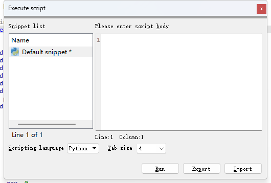

# IDA Pro

## 简介

IDA Pro（interactive Disassembler Professional）是由 Hex-Rays 公司出品的一款交互式反汇编工具，也是软件逆向工程当中最流行的一个静态分析工具。

需要注意的是，IDA Pro 为付费软件，软件本体与不同架构的反编译引擎单独进行收费，你可以根据自己的需求在 Hex-rays 的官网自行购买相应的软件许可证以进行使用。

> 截至 2024 年 4 月， IDA Pro 本体许可证的价格为 1975 USD，任一指令集架构反编译功能的许可证价格为 2765 USD。

此外，Hex-rays 公司还提供基于云引擎的免费逆向工具 [IDA Free](https://hex-rays.com/ida-free/)，不过目前仅支持 x86 逆向。

## 基本用法

IDA Pro 通常会提供 `ida.exe` 与 `ida64.exe` 两个可执行程序，分别对应于逆向 `32` 位与 `64` 位程序。当我们需要使用 IDA Pro 分析某一可执行程序二进制文件时，我们需要根据程序指令集长度的不同选择使用不同的 `ida` 。

最简单的使用方式是将待逆向的二进制可执行文件直接拖放到 IDA 上，IDA会自动识别文件类型，这一步通常不需要做改动，直接点击 🆗 即可：


接下来我们就会看到这样一个界面：


- `Function Windows` ：IDA 所识别出来的函数列表，通过该目录可以直接跳转到对应函数
- `IDA-View` ：以汇编形式呈现的由 IDA 进行反编译所得的单个函数结果，默认是以由基本块构成的控制流图的形式进行展示，也可以通过 `空格` 键切换到内存布局中的原始汇编代码
- `Hex View` ： 二进制文件的原始数据视图
- `Structures` ：由 IDA 所识别出来的程序中可能存在的结构体信息
- `Enums` ：由 IDA 所识别出来的程序中可能存在的枚举信息
- `Imports` ： 该二进制文件运行时可能需要从外部导入的符号
- `Exports` ： 该二进制文件可以被导出到外部的符号

## 函数反编译

除了反汇编以外，IDA 也支持将汇编代码反编译为 C/C++ 形式的源代码，我们只需要在待反编译的函数位置按下 `F5` 即可获得反编译后的程序代码：


有的时候 IDA 对于函数范围的识别可能会有一定错误，从而导致反编译结果出现偏差，此时我们可以在 `IDA-View` 窗口中的函数开头按下 `alt+p` 重新定义函数范围，或是先按下 `u` 取消原有定义后再框选函数范围后重新按下 `p` 进行定义：


有的时候因为代码混淆等原因导致 IDA 无法建立函数：


当我们完成对函数识别的修复之后，我们可以在函数开头按下 `p` 让 IDA 重新自动识别函数，或是框选属于该函数的汇编代码之后再按下 `p` 让 IDA 重新自动识别函数：


## IDAPython

在 IDA Pro 当中内置了一个 Python 及一个 IDC 模块，可以帮助我们快速地对二进制文件进行修改等工作。

我们可以通过 `File` → `Script Command` 直接编写运行 IDAPython 脚本：



在使用之前需要先导入 `ida` 模块，比较常用的有以下 API：

```python
idc.get_db_byte(addr)       # 返回 addr 处的 1 字节
idc.get_wide_word(addr)     # 返回 addr 处的 2 字节
idc.get_wide_dword(addr)    # 返回 addr 处的 4 字节
idc.get_qword(addr)         # 返回 addr 处的 8 字节
idc.get_bytes(addr, size, use_dbg) # 返回 addr 处的 size 字节
idc.patch_byte(addr, value)  # 将 addr 处的 1 字节修改为 value（小端序）
idc.patch_word(addr, value)  # 将 addr 处的 2 字节修改为 value（小端序）
idc.patch_dword(addr, value) # 将 addr 处的 4 字节修改为 value（小端序）
idc.patch_qword(addr, value) # 将 addr 处的 8 字节修改为 value（小端序）
```

更多 API 及用法参见[官方文档](https://hex-rays.com/products/ida/support/idapython_docs/)。

## IDA 插件

IDA 支持插件扩展，通过插件扩展我们可以很方便地扩展及增强 IDA 的功能。

插件的安装通常比较简单，以 `FindCrypt` 插件为例，该插件可以帮我们自动识别程序当中存在的密码算法。要安装该插件，首先我们需要在 [Github](https://github.com/polymorf/findcrypt-yara) 上获取插件源码，并将其放置到 `IDA安装路径/plugins` 文件夹下：


若系统中未安装 `yara` 模块则需要进行安装：

```bash
$ python -m pip install yara-python
```

此时我们便能在 `Edit→Plugin` 中使用该插件：


