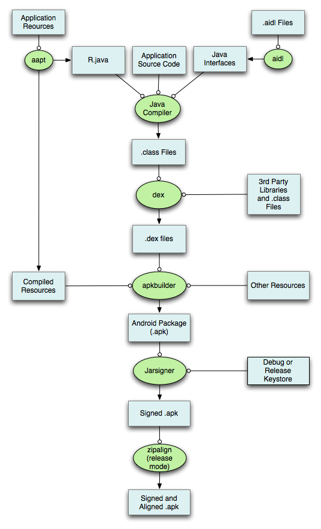

# Android Development Fundamentals

Before doing Android security, we should understand the basic process of Android development as much as possible.

## Basic knowledge

Read the following books in order to learn about Android basic development knowledge from the shallower

- The first line of code, after reading the first seven chapters
- JNI/NDK development, there is currently no suitable guide available.
- The authoritative guide to Android programming (optional)
- Android Advanced Advanced (optional)

In the process of learning, I feel that I need to focus on the following knowledge in Android development.

- Android system architecture
- Basic source file architecture
- Basic development methods and code writing conventions to understand the meaning of common code.
- Understand the file format of some configuration resources such as xml.

** Be sure to set up a basic Android development environment! ! ! ! ! **

- java

- ddms

- ndk
- sdk, install several versions of sdk, 5.0-8.0

## Apk Packaging Process

After writing the App-related code, our final step is to package all the resource files used in the App. The packaging process is as shown in the following figure ( <u>http://androidsrc.net/android-app-build-overview/</u> ). :

The specific operation is as follows

1. Use aapt ( The Android Asset Packing Tool ) to package the resource files to generate R.java files.
2. If the service provided by AIDL (Android Interface Definition Language) is used in the project, you need to use the AIDL tool to parse the AIDL interface file to generate the corresponding Java code.
3. Compile the R.java and AIDL files into a .class file using javac.
4. Use the dx tool to convert class and third-party libraries to dex files.
5. Use apkbuilder to package the first compiled resource, the .dex file generated in step 4, and some other resources into the APK file.
6. This section mainly signs the APK. There are two cases. If we want to publish the app, we will use the RealeaseKeystore signature. Otherwise, if we just want to debug the app, we will use the debug.keystore signature.
7. Before releasing the official version, we need to change the starting offset of the resource file in the APK package from the file to an integer multiple of 4 bytes, so that the speed will be faster when the App is run later.

## Apk file structure

The APK file is also a ZIP file. Therefore, we can decompress it using the tool that unpacks the zip. The structure of a typical APK file is shown below. Among them, the introduction of each part is as follows

- AndroidManifest.xml

- This file is mainly used to declare basic information such as the name, components, permissions of the application.

- class.dex

- This file is the executable file for the dalvik virtual machine and contains the executable code of the application.
- resource.arsc

- This file is mainly a binary resource compiled by the application and a mapping relationship between the resource location and the resource id, such as a string.
- assets

- This folder is typically used for the original resource files that contain the application, such as fonts and music files. This information can be obtained through the API while the program is running.
- lib/

- The lib directory is mainly used to store local library files used by the JNI (Java Native Interface) mechanism, and the corresponding subdirectories are created according to the supported architecture.
- res /
- This directory mainly contains resources referenced by Android apps, and will be stored according to resource types, such as images, animations, menus, etc. There is also a value folder that contains various attribute resources.
- colors.xml--&gt;color resources
- dimens.xml---&gt;size resources
- strings---&gt;string resources
- styles.xml--&gt;style resources
- META-INF /
- Similar to JAR files, the APK file also contains the META-INF directory, which is used to store files such as code signatures, so that it can be used to ensure that APK files are not modified at will.