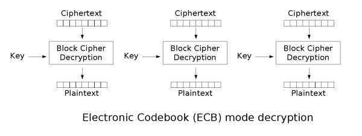

# ECB


The ECB mode is called the electronic codebook mode.


## Encryption


## decryption





## Advantages and disadvantages


### Advantages


1. Simple to implement.
2. Encryption of different plaintext packets can be calculated in parallel, which is fast.


### Disadvantages


1. The same plaintext block will be encrypted into the same ciphertext block, and the statistical rules of the plaintext grouping will not be hidden. As shown below


In order to solve the problem that the unified plaintext generates the same ciphertext, other encryption modes are proposed.


## typical application


1. Encryption protection for random numbers.
2. Encryption for single-packet plaintext.


## 2016 ABCTF aes-mess-75


The title is described below


```

We encrypted a flag with AES-ECB encryption using a secret key, and got the hash: e220eb994c8fc16388dbd60a969d4953f042fc0bce25dbef573cf522636a1ba3fafa1a7c21ff824a5824c5dc4a376e75 However, we lost our plaintext flag and also lost our key and we can't seem to decrypt the hash back :(. Luckily we encrypted a bunch of other flags with the same key. Can you recover the lost flag using this?


[HINT] There has to be some way to work backwards, right?

```


It can be seen that this encryption is an ECB encryption, then AES is a group of 16 bytes, each byte can be represented by two hexadecimal characters, so we group each 32 characters and then correspond Search in the txt file.


Corresponding flag


```

e220eb994c8fc16388dbd60a969d4953 abctf{looks_like

f042fc0bce25dbef573cf522636a1ba3 _you_can_break_a

fafa1a7c21ff824a5824c5dc4a376e75 is}
```


The last one is obviously padding when it is encrypted.


## topic


- 2018 PlaidCTF macsh


