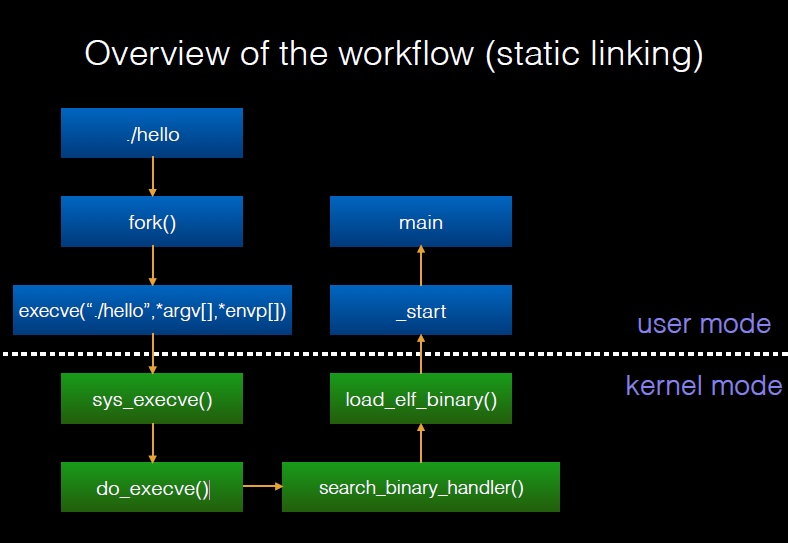
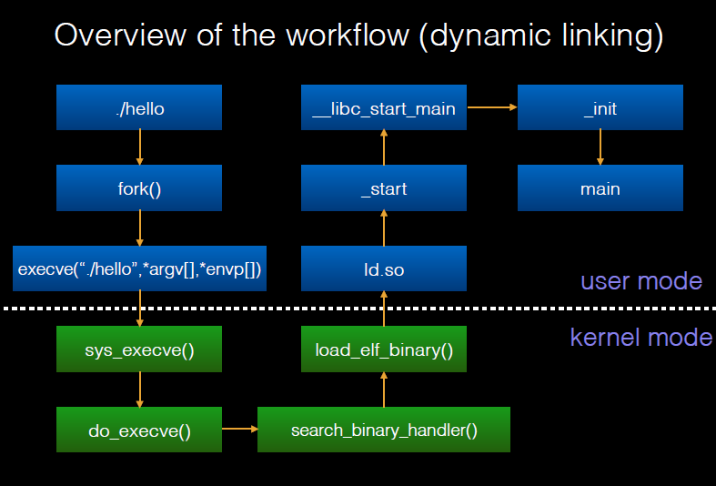
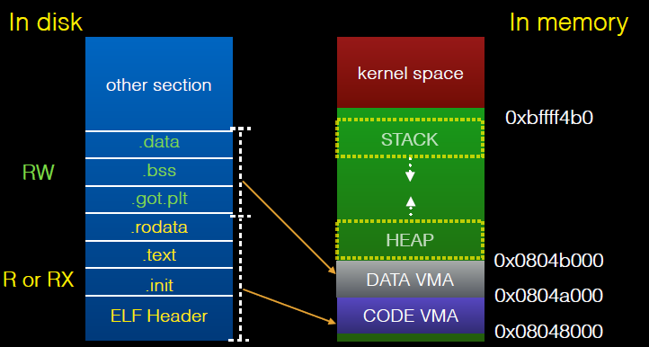

## Program execution process

**参考 Execution Angleboye@Bamboofox 。**

## Basic Overview

### Static execution

Here is the basic process of static execution of the program.

### Dynamic execution

Here is another more detailed picture.

### Basic operation instructions

#### sys_execve

This function is mainly used to execute a new program, that is, execute the program we want to execute, and check the corresponding parameters such as argv and envp.

#### do_execve

This function opens the target image file and reads the specified length (currently 128 bytes) from the beginning of the target file to get the basic information of the corresponding target file.

#### search_binary_handler

This function searches for a binary type queue that supports handling of the current type, so that the handlers of various executable programs can be processed accordingly.

#### load_elf_binary

The main processing flow of this function is as follows

- Check and get the header information of the elf file.

- If the target file is dynamically linked, use the .interp section to determine the path to the loader.

- Map the corresponding segments recorded in the program header to memory. The following important information in the program header

- the address to which each segment needs to be mapped
- The appropriate permissions for each segment.
- Record which sections belong to which sections.

The specific mapping is as follows

  

Case processing

- In the case of dynamic linking, change the return address of sys_execve to the entry point of loader (ld.so).
- In the case of static linking, change the return address of sys_execve to the entry point of the program.

#### ld.so

This file has the following features

- Mainly used to load shared libraries recorded in DT_NEED in ELF files.
- Initialization work
- Initialize the GOT table.
- Merge the symbol table into the global symbol table.

#### _start

The _start function will hand over the following to libc_start_main

- Environment variable start address
- .init

- Initialization before starting the main function
- ends
- Finishing work before the end of the program.