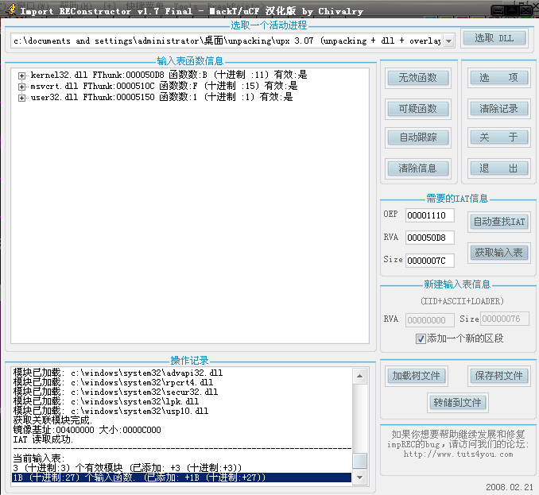

The sample program can be downloaded from this link: [manually_fix_iat.zip](https://github.com/ctf-wiki/ctf-challenges/blob/master/reverse/unpack/example/manually_fix_iat.zip)

Our commonly used `ImportREC` shelling is the `IAT auto search` that comes with the software, but if we want to manually find the address of `IAT` and `dump`, what should we do?

First use the ESP law, you can quickly jump to `OEP: 00401110`.

We right click and select `Find-&gt;call between all modules.

Shows the list of functions called, we double-click on one of the functions (note that the double-click here should be the function of the program instead of the system function)

We came to the function call

Right click on `follow` to enter the function

Then right click on the `data window to follow -&gt; memory address`

Here, because the display is a hexadecimal value, it is not convenient to view, we can right-click in the data window and select `long-&gt;address` to display the function name.

Note that we have to scroll up to the beginning of the IAT table. We can see that the initial function address is `kernel.AddAtomA` of `004050D8`. We find the last function down, which is the `user32.MessageBoxA` function. Look at the size of the entire IAT table. At the bottom of the OD there is a display of &#39;block size: 0x7C`, so our entire IAT block size is `0x7C`

Open `ImportREC`, select the program we are debugging, then enter `OEP:1110, RVA:50D8, SIZE:7C`, and then click `Get Input Table`.

Here in the input table window, right click and select &quot;Advanced Command -&gt; Select Code Block&quot;.

Then a pop-up window will appear, select the full dump, save as `dump.exe` file

After the dump is complete, select `Dump to file`, here choose to repair the dump.exe we just dumped, get a `dump\_.exe`. At this point, the whole shelling is completed.